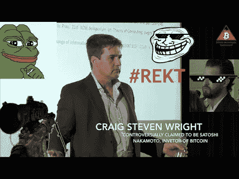
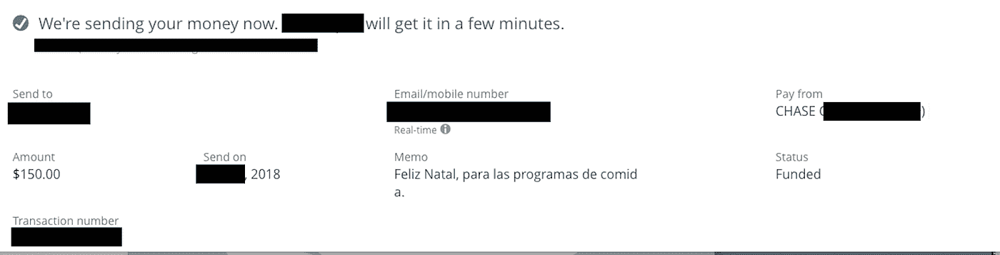
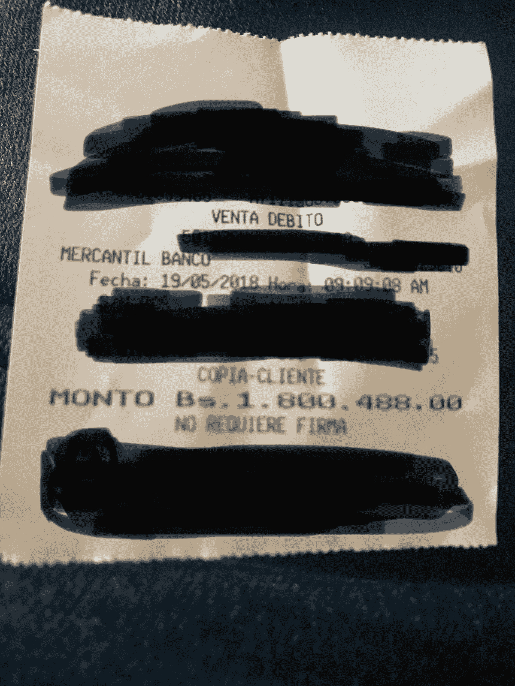
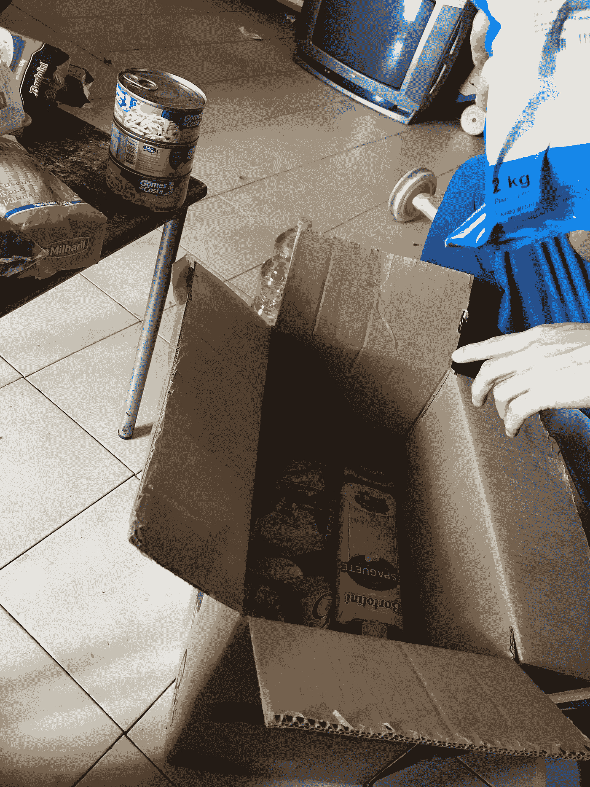
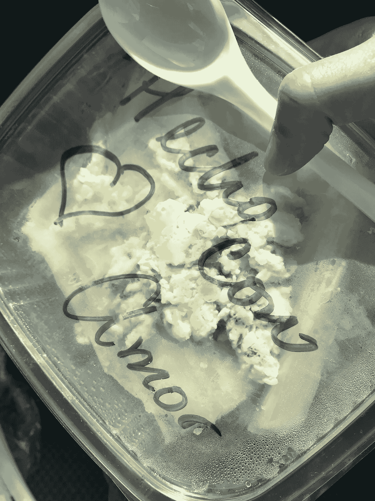
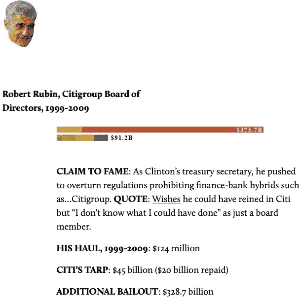
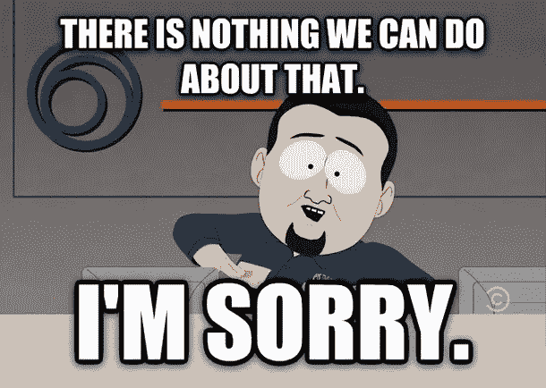
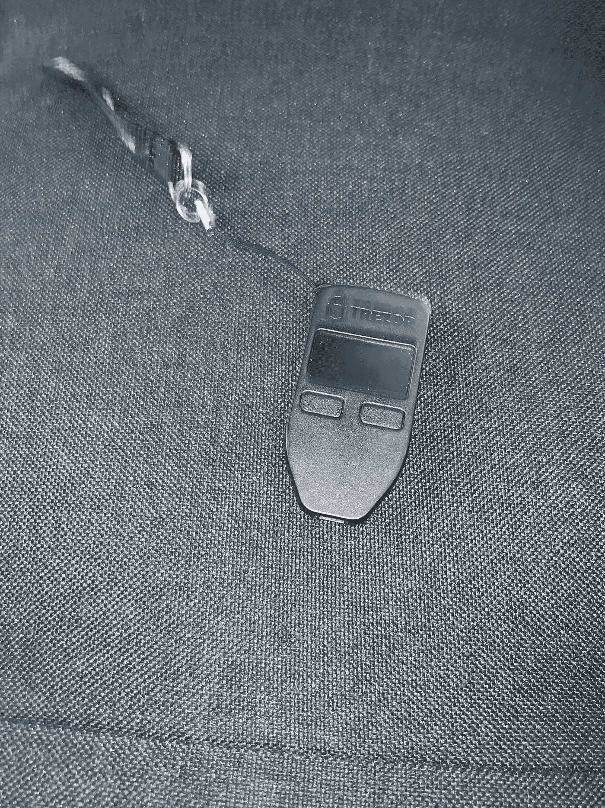

# 我是如何发现比特币的

> 原文：<https://medium.com/coinmonks/how-i-discovered-bitcoin-90408c3000bc?source=collection_archive---------1----------------------->

> “当你值得拥有比特币时，它才真正进入你的生活，而那时我还不配拥有它，也没有准备好。”——我自从了解比特币后，大半辈子都是这样。

我最初听说比特币是在 2012 年，当时我还是一名大学生，参加了一个以自由市场为主题的政治集会。另一位与会者是一名曾在海外服役的退伍军人，他提到了比特币，我对此极为不屑。在群聊的时候，在大约 20 个人面前，我公开地对他和他的团队说这是政府最有可能关闭的事情。如果我有一个开放的心态，听他的话，同时在我的存钱罐里寻找一些额外的美元，也许我会成为一个比特币百万富翁，而不是普通的霍德勒。*正如我喜欢说的，当你值得拥有比特币的时候，它就会真正进入你的生活，而那时我还不值得拥有它，也没有准备好接受它。*

# **从失败中学习**

时间快进到 2014 年，我离开了学校，前一年搬到了旧金山湾区。我又听说了比特币，这一次是在 Twitter/Youtube 上，来自 Balaji Srinivasan，一位知名的创始人、工程师和技术专家。他在[创业学校](https://www.youtube.com/watch?v=cOubCHLXT6A)的演讲将我的个人自由和以自由为中心的意识形态，以及它们在现在和未来技术中的实际应用联系起来。

虽然我仍然没有完全明白，但我足够聪明地意识到有很多聪明人在研究它，所以我决定投资，即使我几乎没有钱。在我职业生涯的早期，我住在高成本的海湾地区，每年挣不到 5 万美元，并且负债累累，但我设法每月将 10-20 美元投入比特币，这是我在月底剩下的所有钱。鉴于价格在几百美元左右，在这一点上，我几乎没有什么可投资的，这很有趣，但对我来说并没有改变生活，因为我专注于其他地方。

2015 年，我做了一个愚蠢的决定，在市场崩盘时抛售了我持有的少量股票。糟糕的决定！！！我是哑钱的典型，仍然配不上比特币。虽然我的兴趣还在继续，但我更专注于建立我所在的风投支持的科技初创公司，并从远处保持着兴趣。当我有能力的时候，随着我工作的薪水增加，我确实会时不时地投资少量的钱。在接下来的几年里，我也涉足了一些替代加密货币的投资，因为它们看起来闪闪发光，但我对它们的理解却更少。我又做了一个错误的决定。

随着 2017 年的大牛市，对比特币和加密货币的兴趣达到了白热化。在 2017 年和 2018 年，我更深入地规划了我的未来，并为我想要生活的世界和将为这个世界提供动力的技术撰写了论文。我决定，如果我想投资任何金额，无论多小，我都需要至少了解一些基础技术、生态系统和行业中正在发生的事情。在这一点上，我开始关注像詹姆森·洛普和 T2 这样的人的推特账户，这样我就可以了解一些基础知识。

然而，在这一时期，比特币出现了一个重大问题，围绕着罗杰·维尔(Roger Ver)这样的邪教领袖人物，他们被称为比特币耶稣(Bitcoin Jesus)，以及以改善比特币为名试图对比特币用户和所有者施加的中央集权。我在一个领导层与他们的追随者性交(字面上和比喻上)的宗教邪教中长大的经历，让我对许多人物非常怀疑，比如比特币耶稣，以及后来的克雷格·赖特。

尽管市场在 2017-2018 年达到顶峰，然后暴跌，但兴奋加上怀疑的结合让我从概念和实践上了解了我所能了解的。这包括真正地阅读，而不仅仅是敷衍了事，T4 的比特币白皮书，阅读主权个人的博客文章，以及更多的长篇博客文章和内容，比如尼克的博客和詹姆逊的博客。虽然经济、政治和技术概念的结合完美地交织在一起，但我想真正理解它的必要性，因为我大半辈子都住在美国。我确实从概念上理解了比特币如何被用来作为对独裁政权的潜在对冲，例如帮助犹太人和纳粹德国的受迫害群体，或者帮助个人对冲津巴布韦的通货膨胀，但我也想根据实际经验来确定，在当今的现代世界中，它真的需要吗？

# 委内瑞拉的经验

在与几个来自委内瑞拉的人建立了亲密的友谊后，我在 2018 年前往那里，看看生活在恶性通货膨胀和自上而下驱动的中央经济计划中到底是什么样子，人们使用当前可用的经济机器应对这种情况的方式是什么，并帮助他们的非营利组织向加拉加斯饥饿的人分发食物。我在那里的朋友是中产阶级，所以他们的大部分财富都被抹去了，对加密货币知之甚少，也不是技术专家。这让我有机会真正看到当前的替代方案是如何工作的，并将它们与比特币的潜在系统进行比较。

在委内瑞拉的生活经历，尤其是在选举期间，是我一生中最大开眼界的时光。这篇文章是关于金钱，而不是政治，但是当你像每个国家一样让政治触及金钱时，你会意识到最终腐败政治的力量会延伸到金钱和公民生活的方方面面。因为我们都依赖于金钱技术(数学、会计、交易)来连接我们的日常互动，从支付租金到旅行储蓄。当金钱腐败时，从委内瑞拉到美国华尔街的全球救助都变得如此，你生活的每一个方面都会受到负面影响，从无法购买食物到你的存款化为乌有。

在那里工作期间，我不得不与美国和委内瑞拉的银行系统打交道。为了在这个国家取钱，我会把钱从我的美国账户汇给一个朋友的朋友，这个朋友是委内瑞拉人，但持有美国账户，然后他会把玻利瓦尔从他的委内瑞拉银行账户转到我朋友的银行账户，我会用他朋友的借记卡付款。这就是每年成千上万“幸运”的委内瑞拉人所做的事情，他们可以获得这些服务。那些“不幸”的人尽快花光他们的钱，或者更糟，挨饿。

所有这些都必须做，因为如果你持有恶性通货膨胀的货币，它就会失去购买力。具体来说，在委内瑞拉，虽然其他国家也会发生这种情况，但当通货膨胀率飙升至 300，000%以上时，社会结构开始放松，因为货币这一工具开始不再发挥作用。由于物价上涨，货币价值和购买力直线下降。2009 年 4 月，政府规定的汇率大约是 1 美元兑换 2 委内瑞拉玻利瓦尔，今天是 1 美元兑换 10 委内瑞拉玻利瓦尔。这是一个强制性的汇率，由那里的政府固定。

2018 年 5 月，我购买了一份早餐，花了我 1800488.00 文莱元(180 万玻利瓦尔)。10 年前，以玻利瓦尔计算，它的价格只是这个数字的一小部分。但是，即使在去年，我或任何人都不可能为一杯咖啡支付 180，000 美元以上。我在一家不错的酒店里为一顿丰盛的早餐支付的实际费用是 3 美元。价格被扭曲了，因为当你像前面提到的那样通过经纪人兑换货币时，每个人都使用黑市汇率。

无论是委内瑞拉的汇率和恶性通货膨胀，还是美国的银行因为过度杠杆化而倒闭，这种过度杠杆化是由可怕的立法所允许的掠夺性贷款行为造成的，你会认为这些国家的政治家会想要改变系统。我在那里和美国发现，政客和裙带资本家实际上从这些事情中受益。在委内瑞拉，破碎的汇率让政府支持的裙带资本家能够利用官方和非官方汇率从经济中吸走巨额资金。在美国，这更多的是以大型金融服务机构纾困的形式出现。

虽然有[报道称](https://www.reuters.com/article/us-venezuela-politics-sanctions-idUSKCN1SR2KY)委内瑞拉的食品项目，即 CLAP，被用来洗钱，但如果你在当地与当地人交谈，新闻报道甚至没有触及表面。委内瑞拉政府每月通过军方向民众分发一箱食物。这种食物主要来自其他国家，如果不是全部的话。为了说明这个概念，我将使用简单的数学方法，包括 100，000 罐金枪鱼， [DolarToday 历史汇率](https://dolartoday.com/historico-dolar/)，这是人们从 2018 年 5 月 1 日(我在该国期间)开始实际使用的汇率，约为 600，000 玻利瓦尔(VEF):1 美元，以及委内瑞拉官方汇率 10 VEF:1 美元。

这一过程始于政府要求被称为“enfuchados”的腐败企业从巴西或其他国家购买 10 万罐金枪鱼分发给民众。enfuchado 获得国外价格，让我们假设每罐金枪鱼 1 美元，并告诉委内瑞拉政府，他们将以 10 万美元(按 10:1 的 VEF-美元汇率)向他们支付 100 万 VEF，以便他们可以在国际市场上购买金枪鱼。与裙带资本家同流合污的 enfuchados，然后在黑市上，可以将 10 万美元兑换成 60，000，000，000 VEF(按 60 万:1 VEF 对美元的汇率)。然后，他们可以按照官方汇率将这 60，000，000，000 VEF 重新汇回政府银行，将 100，000 美元兑换成 60，000，000 美元(按照 10:1 的 VEF 对美元汇率)。然后他们可以拿走金枪鱼所需的 10 万美元，净赚高达 59.999 亿美元。虽然在实践中，这些数字并没有那么圆，而且处理大量的资金限制了一些给定的流动性，但这是腐败的政府如何利用通货膨胀把钱放进自己口袋的一个非常真实和实际的例子。更糟糕的是，食物是由军队成员分发的，他们通常很腐败，他们不是把食物作为一种服务来提供，而是向人们收费，或者不给那些不同情政府的人食物。但是，如果没有劣币和货币政策导致的严重通货膨胀，所有这些都不可能实现。

通货膨胀不仅摧毁了委内瑞拉人民的储蓄，而且多年来一直被用来有系统地掠夺该国的财富。具有讽刺意味的是，尽管那里的情况变得如此糟糕，但对于该国政府和支持它维持权力的其他政治行为体来说，现政权没收了许多人的最后希望，即利用廉价电力开采比特币。该政权没收了公民矿工和自己开采比特币的设备，并考虑在资产负债表上使用比特币，以此来支撑这个濒临崩溃的国家。

虽然这里有很多来自金融、政治和经济的概念，但在一天结束时，最有影响力的经历是与一个朋友的食物分发计划合作，在那里我们向儿童和在加拉加斯的垃圾桶里捡垃圾的成年人分发食物。我在夏威夷的无家可归者收容所工作过，在巴西的社区(又名贫民窟)生活过，并多次访问过印度，我从未近距离亲眼见过比这更糟糕的环境，成群结队的孩子在垃圾堆里寻找他们能吃的东西。在与许多离开这个国家的委内瑞拉人交谈后，许多人要么他们的财富被彻底摧毁，要么几乎一无所有。尽管这个国家的政治犯数量不像我们在 20 世纪 40 年代的德国看到的那样多，也不像我们看到的那样根深蒂固，但我不禁想到，如果人们能够打包走人，把自己的财富储存在一种非主权货币中，可以跨境转移，不受一个失败国家货币影响力的控制，那将会是什么样子。

非主权货币不一定能解决移民危机或大规模人口流动，但它能让个人、家庭和风险最大的人(除了富人)阻止国家行为者通过扣押、审查和资本控制没收或摧毁他们的财富。在委内瑞拉，让我印象深刻的一件事是，我与之相处的人，以及我每天与之交谈的几乎所有人，都没有真正使用比特币，因为我和一群更普通的人在一起，尽管它肯定被用作 SoV 和国际转账机制。这是闪电之前的网络，即使在委内瑞拉，2018 年的加密货币市场仍主要是远远领先于全球采用曲线的人(如果你正在阅读本文，你也是如此)。对那里的许多人来说，挽救他们的财富已经太晚了，比特币可能救不了委内瑞拉，但很明显，它可以帮助遏制那里的一些问题，并且肯定有助于缓解再次发生的那种规模的事情。

# 最后一根稻草

至于不仅仅挑出委内瑞拉，当我在 2018 年晚些时候回到美国时，我开始真正深入研究我在学校学习的一些金融和经济学基础知识。在上一次全球经济衰退期间，我进入学校主修政治学，后来转到了金融领域，因为我对欧洲银行业的失败产生了浓厚的兴趣，当然还有导致全面经济衰退的美国房地产危机。令我震惊的一件事是，美国政府和美国的银行通过坎蒂伦效应从美国人口中榨取了类似的财富，尽管速度要慢得多。这对我们这些幸运地生活在发达国家的人不会产生巨大的直接影响，但它让更多的钱掌握在有政治关系和“关系密切”的银行家和大公司手中。

这重新点燃了我心中的火焰，许多人在美国救助主要银行后都有这种感觉……为什么政客和官僚帮助坏人致富，扶持大企业，允许他们不为自己的错误买单，所有这些都打着帮助人民的幌子。虽然我认为占领华尔街运动总体上是一场无力的运动，但现实是，当从他们到茶党(Tea Party)和自由主义者的边缘团体都同意某件事时，通常会有一个更大的趋势在发展。

我更深入地研究了比特币和货币背后的经济学，最终得到了一本 [Saifadean Ammous](https://twitter.com/saifedean) 的书《比特币标准》。有趣的是，我在 2019 年初的一次飞机航班上读到了这篇文章，那次旅行发生了一件事，导致最后压断骆驼背的那根稻草。

今年 2 月(2019 年)，在印度参加一个朋友的婚礼时，另一个在美国的朋友需要帮助支付新房子的保证金。我试图从我的大通银行账户上汇回 4000 美元，但被拒绝了。他们冒着失去房子的危险。我熬了一夜，当他们的客户服务在德里时间早上 6:00 开始时，我打电话给他们，他们告诉我，我需要亲自去美国的一个地方解锁账户。尽管银行知道我在哪里，我事先在旅行，我可以使用我的账户，而且当时不在美国，解冻这笔钱的唯一选择是带着 3 种身份证明和验证形式去美国的分行。

在这一点上，这位朋友不是比特币制造者，所以我不得不从其他账户上凑了一些钱给他们，我终于第一次意识到，我以为是我的钱实际上不是。此外，在旅途中与许多人、商人和街头小贩交谈后，很明显，政府由银行没收大额钞票伤害了许多人。回到美国后，我做的第一件事就是走进我开户的大通银行分行，当场关闭了账户。

虽然我已经让 REKT 做了一些事情，特别是没有 HODLing 或认为我比市场聪明，事情已经取得了进展。一旦你看到这项技术在你个人生活中的应用，以及它在全球范围内的使用，你很难没有理性乐观的信念和信念，一旦你花时间了解它如何工作以及如何正确使用它，你就会越来越少犯愚蠢的错误，比如购买 shitcoins 和交易。

今年晚些时候，我清理了所有剩余的 altcoin 资产，将所有 sat 移出交易所，包括在一次网络钓鱼尝试后关闭我的比特币基地账户，并确保使用分布式多签名技术在安全的硬件钱包上完成 HODLing。

今年，我还使用 [CasaHODL](http://keys.casa) 设置了一个完整节点，因为每个人都必须运行一个完整节点来验证交易(尤其是在发送大量交易的情况下)并执行协议的货币政策。

无论是帮助国外有需要的朋友，还是简单地让一个感兴趣的技术专家设置运行一个完整的节点，我实际上是在做正确的比特币事情。经过多年的失败，大量的研究，真实的生活经历，以及用创造出来的最难的钱帮助其他人的愿望，我终于当之无愧地成为一名比特币制造者。

注:2019 年，我发生了划船事故，正式不再持有比特币。如果你想帮助解决这种情况，请用[瓶工资](https://bottle.li)打我。请和谢谢！

> [在您的收件箱中直接获得最佳软件交易](https://coincodecap.com/?utm_source=coinmonks)

