# 我是如何将 Django 与区块链融合，构建去中心化应用(DAPP)的？

> 原文：<https://medium.com/coinmonks/how-i-integrated-django-with-blockchain-and-built-a-decentralized-application-dapp-f104ae551e12?source=collection_archive---------0----------------------->

## Python 开发者开始区块链开发之旅的有效指南。


不可否认的事实是，在使用 DAPP development 的时候，最大的挑战之一就是将智能合同与网站的前端连接起来。

最有效的方法无疑是使用 Web3(Python 或 Javascript)库来完成这项工作。虽然对于 Javascript 开发人员来说，完成这一部分可能容易得多(因为互联网上充斥着 [Web3.js 教程】](/coinmonks/simplest-way-to-connect-your-smart-contracts-to-the-front-end-react-with-web3-js-1e75702ea36a?source=your_stories_page---------------------------)，但是对于 Python 开发人员来说，完成同样的任务可能同样麻烦。

***应该选择* Web3.py 吗？**

> 尽管不用说，Web3.js 社区是迄今为止最大的一个，但另一方面，Web3.py 在 [Github 上有超过 1.5k 个明星，](https://github.com/ethereum/web3.py) 133 个贡献者，并且正在使用一些非常引人注目的以太坊 API，已经足够成熟，毫无疑问可以投入生产。

这仅仅意味着 Python 开发者是时候用 Web3.py 开始他们基于区块链的 DAPP 开发之旅了。

然而，初始阶段可能是最困难的部分，因为除了官方文档(字面上很有帮助)，例如[https://web3py.readthedocs.io/en/stable/](https://web3py.readthedocs.io/en/stable/)，没有足够的在线帮助让 Python 开发者使用 Web3.py 构建一个去中心化的应用程序。

因此，如果你也是一名 Python 开发者，并希望使用 Python 开发区块链上的分散应用程序，那么这将是你的必读文章。

话虽如此，我们还是开始吧。

# 所需工具

在开始之前，让我们了解一下我是如何将 Django 与区块链集成并构建一个去中心化应用程序(DAPP)的？我们将需要这个项目。

1.  ***Remix IDE:*** Remix 是一款开源工具，不仅可以让你编写自己的智能合约，还支持智能合约的测试、调试以及部署。阅读官方文件了解更多信息:【https://remix-ide.readthedocs.io/en/latest/[。**图片**](https://remix-ide.readthedocs.io/en/latest/)
2.  ***Infura:*** Infura 无疑是让我们的生活变得简单很多的工具。更简单地说，它由一套工具组成，允许任何人与以太坊区块链进行交互(否则这将是一项非常麻烦的任务。)

3. ***Django 3.0:*** 嗯，这就是我们将要着手的 Python 框架。

> 安装:$ python -m pip install Django

4. ***Web3.py:*** 这是允许我们与智能合约对话并调用其功能的工具。阅读官方文档了解更多信息:[https://web3py.readthedocs.io/en/stable/quickstart.html](https://web3py.readthedocs.io/en/stable/quickstart.html)

> 安装:$ pip3 安装 web3

# 让我们连线区块链

首先，将 Remix 上的环境更改为***Injected web 3****，如下图所示，并连接到 Metamask 上的 **Ropsten 网络。***

*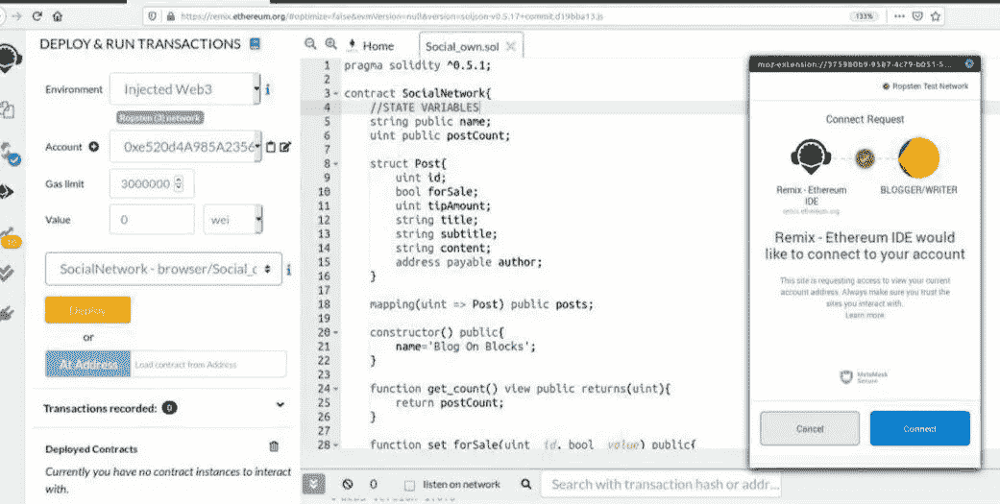*

*Remix IDE for contract deployment on ROPSTEN Network*

*在开始实际的 web3.py 交互之前，让我们先建立一个与区块链的安全可靠的连接。*

*如果没有 Infura，想这么做简直就是一场噩梦。然而，在目前的场景中是相当简单的，因为您所需要的只是一个 Infura API 密钥。*按照以下步骤获取 API 密钥-* [*获取 infura API 密钥*](https://ethereumico.io/knowledge-base/infura-api-key-guide/)*

*一旦你得到了 API 密匙和上面提到的所有要求，我们就为下一步做好了准备。*

> *注意:为了跟进这个项目，您可能需要为 ***ROPSTEN 网络获取一个 Infura 密钥。****

## *连接到 WEB3。PY 并开始互动*

*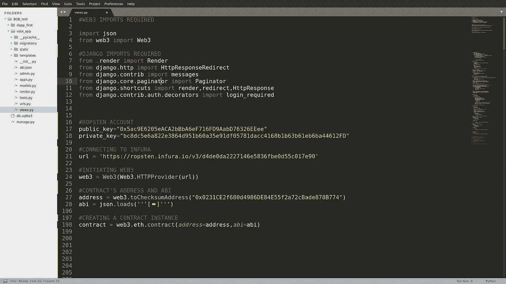*

*Basic Set Up for Proper Interaction with Web3*

*虽然这段代码已经很容易理解了，但是这里没有什么需要理解的。这只是一个基本的设置，其中我采用了一些必要的因素，*

**a .签名交易的私钥和公钥**

**b .为 web3 创建一个 http provider**

*存储合同的 ABI 和地址。*

**d .通过将 ABI 和地址作为参数传递来创建合同实例。**

*好吧！现在，我们有了一个可靠的智能合约设置。然而，在了解如何对智能合约进行调用之前，让我们首先了解我们可能在第一时间进行什么类型的调用。*

## *你想从智能合同中得到什么？*

*虽然人们可以做的功能范围很广，但您可能希望从[智能合同](https://blog.coincodecap.com/tag/smart-contact/)中获得的 5 件最重要的事情如下。*

## *a.从契约中调用 Getter 函数(长时间):*

*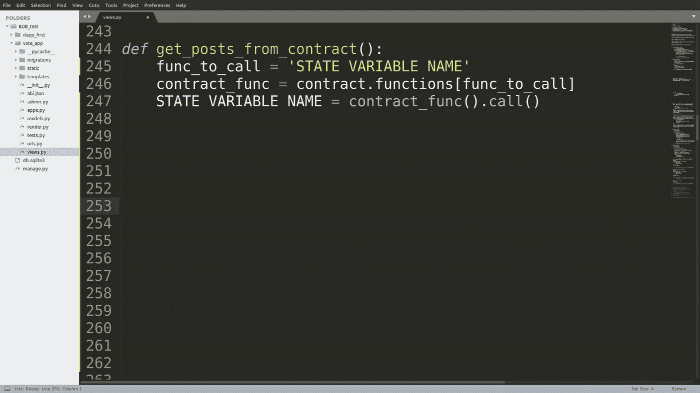*

*Calling a getter function from the contract*

*虽然这看起来有点复杂，但这就是我们从契约中调用任何 getter 函数的方式。*

*虽然这看起来是一个非常冗长的过程，但是您可以使用下面提到的调用 getter 函数的简单方法。*

*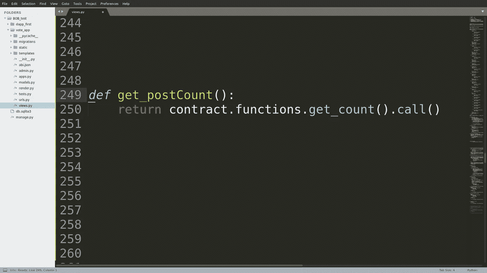*

*Function that returns total number of posts*

***b .调用一个简单的只读函数(简单的方法):***

*契约中的 read_only 函数可以看作是一个在被调用时只返回特定数据的函数。*

*例如，这个带有 ***视图*** 关键字的 get_count 函数，在被调用时只返回帖子的总数。*

> **坚固性代码:**
> 
> ***函数 get _ count()view public returns(uint){
> return post count；
> }***

*为了调用这样的函数，我们需要实现一行简单的代码。*

*这很简单，这就是我们需要做的。*

***c .使用功能进行交易***

*因为我们已经知道了只读函数，所以在你的契约中可能有其他函数会要求一些参数，然后执行一些函数。*

*用技术术语来说，调用这样的函数被视为进行交易，因为这些类型的函数调用包括天然气价格。*

*让我们考虑智能合约中的这个函数:*

> *坚固性代码:*
> 
> *函数 create post(string memory _ content)public*
> 
> *{
> 要求(字节(_ 内容)。长度>0)；
> post count++；
> posts[Post count]= Post(Post count，_content，0，msg . sender)；
> emit PostCreated(postCount，_content，0，msg . sender)；
> }*

*现在这段代码从用户那里获取参数*内容*，然后将其添加到帖子列表中。现在调用这样的事务需要一些时间，因为用户试图更新区块链上的特定数据。因此，我们最终达成了交易。*

****那么如何进行这笔交易呢？****

*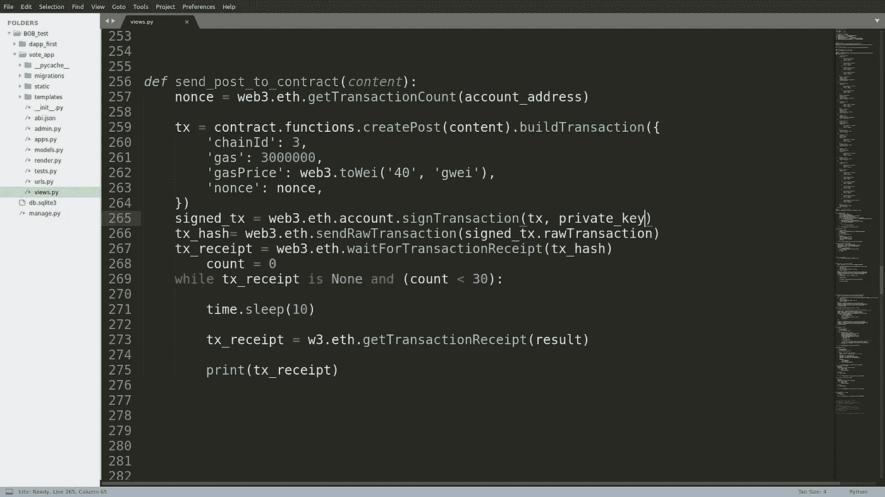*

*Function for writing post on Blockchain*

*这个问题很复杂。所以我们来分解一下。*

*如第 259 行所示，我们没有调用函数 *createPost* ，而是构建了一个事务。然而，正如您所见，***build transaction***函数将数据字典作为一个参数，这是非常需要理解的。*

****chainId*** *:* 简单表示我们连接的网络号，因为每个以太坊网络都有自己的链 Id。在这种情况下，3 代表 Ropsten 网络。*

****gas:*** 由于我们已经知道每个事务都需要 gas 来执行。这个参数简单地表示我们愿意为执行交易支付的最高汽油量。*

****气价:*** 气价表示每单位气所支付的气价，单位为魏*

****nonce:*** 这只是保存用户以前进行的交易的计数。*

*一旦我们按照我们的选择建立了这个交易并填充了所有参数，现在是时候用***sign transaction***函数本身签署这个交易了。*此函数将交易和私钥作为参数。**

*最后，当我们使用***waitForTransactionReceipt***函数收到交易收据时，我们知道交易已经完成。一旦我们收到收据，我们可以确保记录已被成功添加到区块链。*

***d .用乙醚付款***

*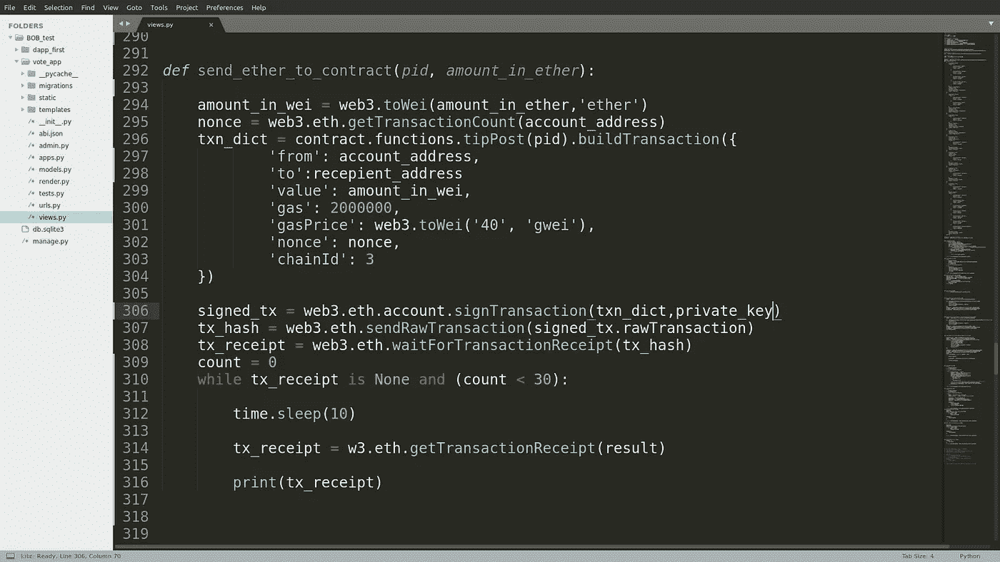*

*Function for sending ether*

*将以太网发送到合同或不同的帐户涉及类似的步骤，如前所述，如建立交易、用私钥签名以及获得确认收据。*

*然而，它确实涉及两个额外的领域，*

****至:*** *象征付款的接收方**

****值:*** *这是要转账的金额。**

*嗯，这就是把资金从一个账户转到另一个账户所需要做的一切。*

***e .调用事件***

*首先，什么是事件？*

**Solidity 中的事件可以被视为交易日志形式的实时记录，这些记录不仅存储在区块链，还可以在合同地址的帮助下随时访问。**

*虽然，我没有在我的代码中使用任何事件，但是 Web3.py 的[官方文档显示了调用事件的清晰过程。](https://web3py.readthedocs.io/en/stable/contracts.html#events)*

```
*myContract = web3.eth.contract(address=contract_address, abi=contract_abi)
tx_hash = myContract.functions.myFunction().transact()
receipt = web3.eth.getTransactionReceipt(tx_hash)
myContract.events.myEvent().processReceipt(receipt)*
```

*好吧。这些是您在与智能合约交互时可能想要使用的最必要的调用。*

****虽然我们已经非常清楚地理解了使用 web3.py 与契约交互并调用特定函数的推荐过程，但是还有最后一件事需要理解，即在契约响应回来之后我们该做什么？****

*因为我们正在使用 Django Web 框架，所以我们非常需要了解如何处理契约的响应，并根据我们的需要使用它。*

# *在 Django 处理合同回复*

*合同可能会以两种方式做出回应。*

> *首先，你可能进行了一次交易(在区块链上添加了一些东西或进行了支付)。在这种情况下，您将简单地取回一张交易收据。因为它只是确认您的交易已经执行，所以您不需要再做什么了。*
> 
> *第二，你可以调用一个函数来返回数据列表。这才是我们真正感兴趣的。*

*所以让我们借助我写的一些处理类似情况的代码来理解第二种情况。*

*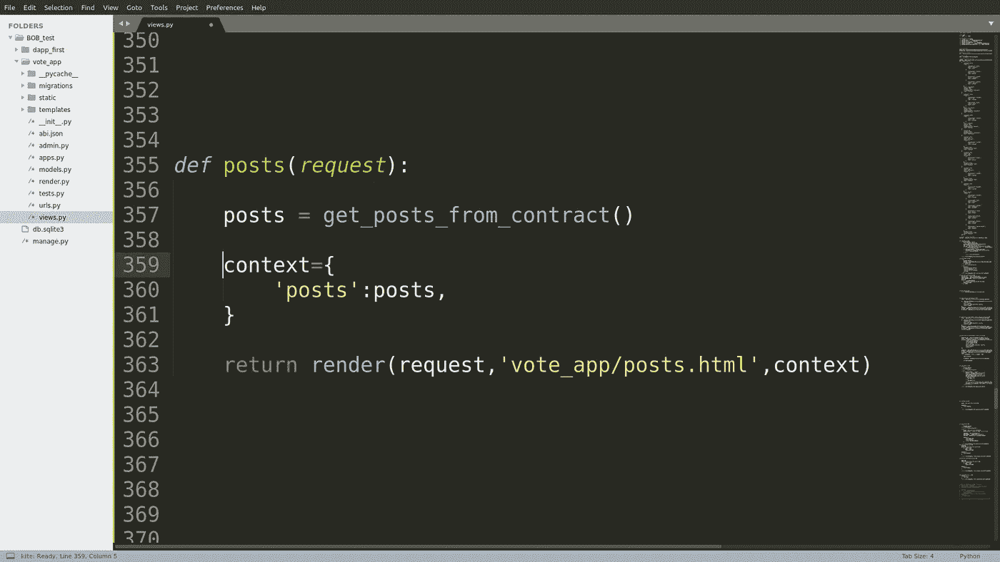*

*Function To pass posts_data to the template*

*这确实是一个简单的函数，不是吗？*

*在这里，我们实际做的只是调用 get_posts_from_contract()函数。这个函数做什么？虽然这是不言自明的，但是你自己看看吧。*

*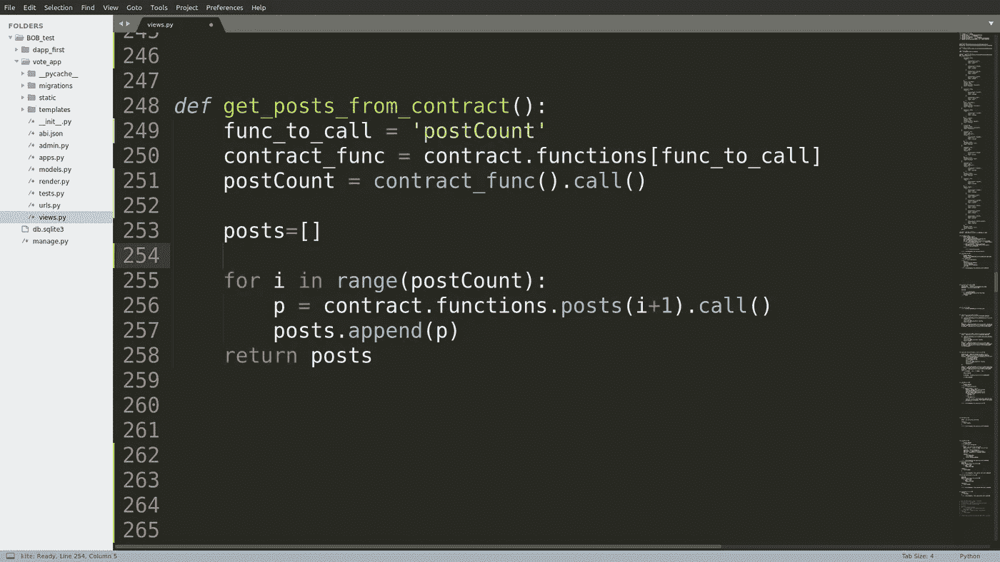*

*Function To Call **posts** array from contract*

*我们的智能合同有一组数据，包含用户的所有帖子、他们的小费金额以及作者的地址。在这个函数中，我们简单地调用数组并返回它。*

*因此，当 posts()函数调用 get_post_from_smart_contract()函数时，它基本上会获得一个类似于下面这样的嵌套数据列表。*

*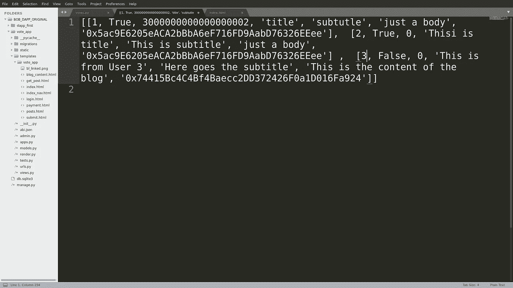*

*Nested List Returned By WEB3.py*

*很丑，对吧？*

*现在出现的最关键的问题是， ***我们如何在模板中处理这个列表？****

## *让我们转到 Django 中的模板部分*

*由于契约中的数据是一个嵌套列表，在 Django 模板中处理数据列表的效果是:*

```
*

...
<h1>{{ data.0 }}</h2><h1>{{ data.1 }}</h2>...

*
```

*这正是我在模板中处理它的方式。代码如下所示:*

*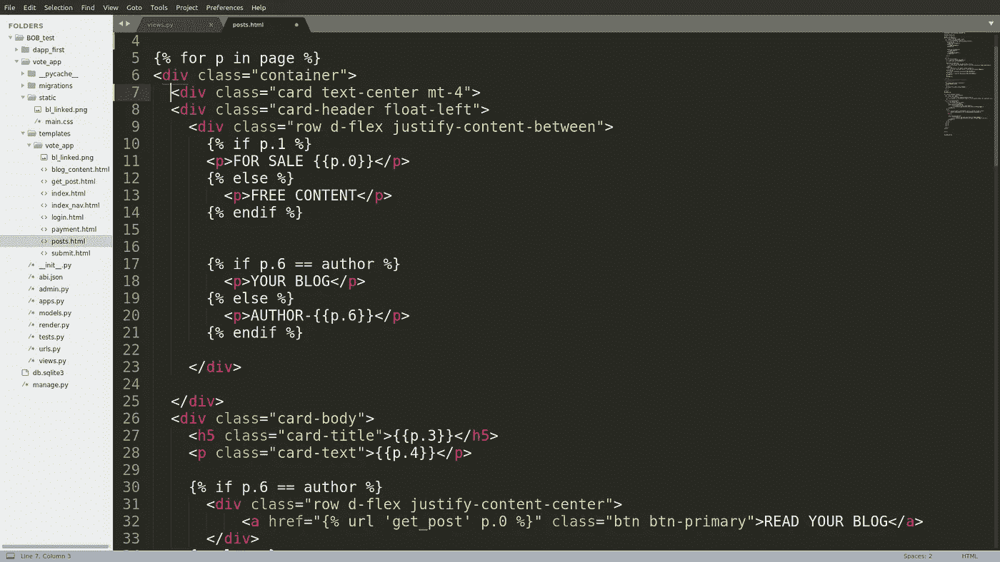*

*Template Handling all the posts from the list*

# *让我们结束吧*

*好了，您已经学习了整个过程，不仅与 Python 的智能契约进行交互，还以我们想要的方式处理它的响应。*

*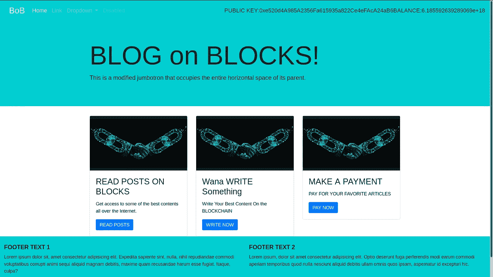*

*My Front-End Skill Sucks*

*一旦你运行开发服务器，上述模板将被渲染，你可以有一个完整的网站，不仅可以与区块链互动，而且还可以让你在上面写作以及支付。*

*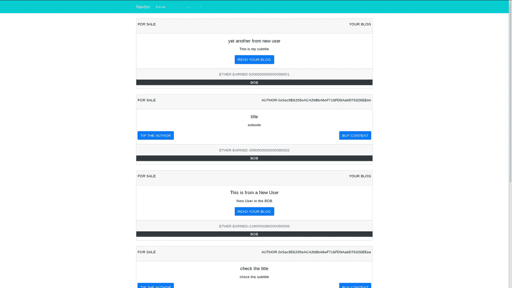*

*All the posts from Blockchain*

*太好了！所以现在我们完成了，你可以喝杯咖啡，自己重新尝试一下。*

# *关于我自己*

## *我是谁？🙋🏻‍♂️*

*𝙃𝙞, 𝙄 𝙖𝙢 𝙕𝙖𝙧𝙮𝙖𝙗 👋🏻
我是一名精通区块链和智能合同的工程师，我的愿景是用 Web3 去中心化和保护传统 Web。主要从事智能合约工作，在开发和智能合约安全方面都有丰富的经验。*

## *我做什么🧑🏼‍💻*

*   *我撰写安全和优化的智能合同*
*   *我对智能合同进行安全审计，并提高 EVM 连锁店智能合同的整体安全性*
*   *我撰写和谈论 Web3 和智能合约&为扩展 Web3 的边界贡献我的一份力量。*

## *打声招呼，保持联系🤝*

*[Linkedin](https://www.linkedin.com/in/zaryab-afser-97085b157/) 。| [推特](https://twitter.com/zaryab_eth)。| [Github](https://github.com/zaryab2000) 。| [邀请我参加 Web3 活动](https://zaryab2000.notion.site/Invite-me-to-your-Next-Web3-Event-78bcd204b866426687e1afbcdc61c5c7)*

> *加入 Coinmonks [电报频道](https://t.me/coincodecap)和 [Youtube 频道](https://www.youtube.com/c/coinmonks/videos)获取每日[加密新闻](http://coincodecap.com/)*

## *另外，阅读*

*   *[复制交易](/coinmonks/top-10-crypto-copy-trading-platforms-for-beginners-d0c37c7d698c) | [加密税务软件](/coinmonks/crypto-tax-software-ed4b4810e338)*
*   *[网格交易](https://coincodecap.com/grid-trading) | [加密硬件钱包](/coinmonks/the-best-cryptocurrency-hardware-wallets-of-2020-e28b1c124069)*
*   *[密码电报信号](http://Top 4 Telegram Channels for Crypto Traders) | [密码交易机器人](/coinmonks/crypto-trading-bot-c2ffce8acb2a)*
*   *[Pionex 双投](https://coincodecap.com/pionex-dual-investment) | [AdvCash 审核](https://coincodecap.com/advcash-review) | [支持审核](https://coincodecap.com/uphold-review)*
*   *[面向开发者的 8 个最佳加密货币 API](https://coincodecap.com/best-cryptocurrency-apis)*
*   *[维护卡审核](https://coincodecap.com/uphold-card-review) | [信任钱包 vs 元掩码](https://coincodecap.com/trust-wallet-vs-metamask)*
*   *[赢取注册奖金——10 大最佳加密平台](https://coincodecap.com/earn-sign-up-bonus)*
*   *[最佳加密交易所](/coinmonks/crypto-exchange-dd2f9d6f3769) | [最佳加密交易所](/coinmonks/bitcoin-exchange-in-india-7f1fe79715c9)*
*   *面向开发者的最佳加密 API*
*   *最佳[密码借贷平台](/coinmonks/top-5-crypto-lending-platforms-in-2020-that-you-need-to-know-a1b675cec3fa)*
*   *[杠杆代币的终极指南](/coinmonks/leveraged-token-3f5257808b22)*