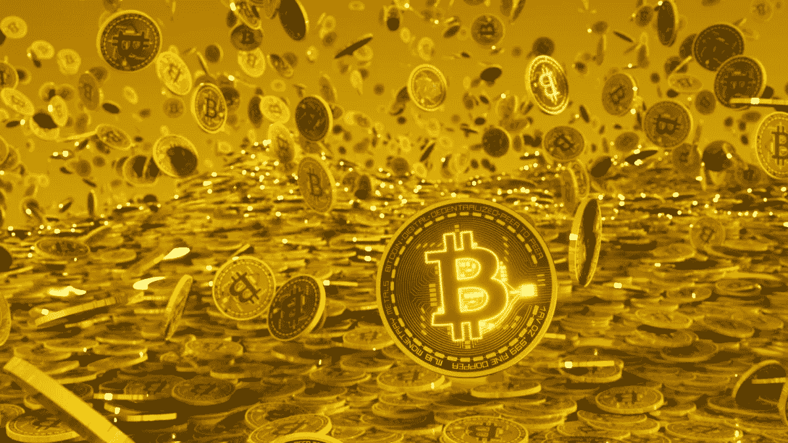
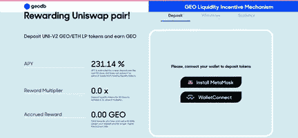
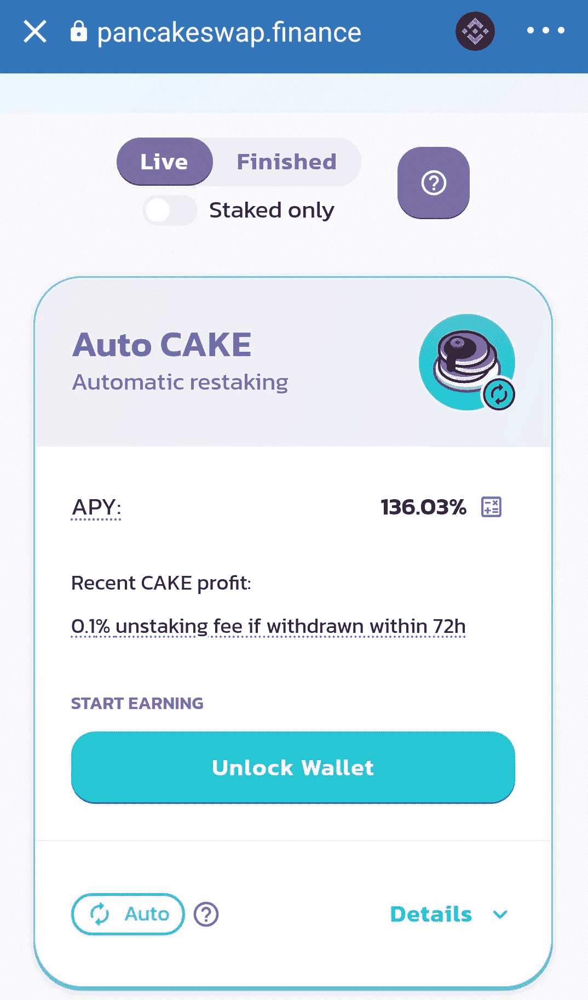

# 我是如何在短短 6 个月内盈利超过 1000%的！

> 原文：<https://medium.com/coinmonks/how-i-made-a-profit-of-over-1000-in-only-6-months-7f2bba9dcbb2?source=collection_archive---------6----------------------->

Increase your wealth

这是我在 medium 上的第一篇文章，但我还是不想浪费读者的时间谈论我的简历。

我只想说，和其他人不同，我使用加密货币的经验只有三年左右。此前，我一直孜孜不倦地投资各种金融产品，并试图用我的书帮助其他人实现财务自由。

因此，我几乎是这个世界的新来者，但我知道的足够多，可以肯定的是，即使在当前这样一个不确定性的时期，崩溃会吓到任何传统投资者，一般来说，加密世界，特别是 DeFi，提供了许多产品和替代品，可以让你赚一大笔钱。当然，它有它的风险，但风险/回报比是有利的。

加密货币的一个主要特征是波动性。乍一看，这种波动性似乎很可怕，但如果你想投机的话，这就是它的主要优势之一。

如果你有足够的时间坐在屏幕前跟踪加密价格，我建议你学习技术分析，相信我，只要有 3 到 4 个指标，你就能赚很多钱。

这不是这篇文章的目的，但我可以向你保证，通过学习如何正确设置止损，并应用基本指标，如平均线，布林线，KDJ 或斐波那契水平，你的年盈利能力将会突破屋顶。我不能保证你所有的交易都会成功，甚至大部分交易都会成功。我可以保证的是，成功的投资将会弥补失败的投资。

对于不想花时间在屏幕前监控自己交易的读者来说，这篇文章的目的更简单，也更容易实现。这是一篇针对那些希望看到自己的钱增长而无需付出太多努力的人的帖子，这些人承担了与二级或三级加密货币相关的资本化风险。

在本帖中，我将列举两个流动性池投资的例子，一个是过去，一个是现在。

# 地理以太网池

在我参与的最赚钱的流动性挖掘机制中，现在是由 [GeoDB](https://geyser.geodb.com/) 推出的那些。由于将来有可能参与新的 GEO 流动性池，我将使用一个示例。

首个 GEO 流动性激励计划于 2020 年 8 月至 10 月推出，最长参与期限为 90 天，提供高达 1，200%的 APY。分发令牌被授予所有那些在名为 TokenGeyser 的智能合约中投资基础令牌(uni WAP-GEO 对，称为 uni WAP-V2-GEO-eth 2)的索赔权的人。

TokenGeyser 根据投资额、投资时间和长期参与的激励奖金来分配奖励。该奖励是参与分配令牌间歇喷泉的乘数，从 1 开始，随着时间线性增加，直到 60 天，奖励达到乘数 3。

要参与这种 DeFi 产品，就像所有 Uniswap 产量农业一样，您必须从两对参与货币中各拿出相同数量的欧元(或美元)。因此，在这种情况下，500 美元将投资于 ETH 和相同的 GEO(0x 7 B1 be 7 F8 e 6431514 b 20029 cb7f 2242 ff 9081 B4 b 2)金额。

所以，只要去 Uniswap，搜索对，然后“添加流动性”。您将收到一堆 UNISWAP-V2-GEO-ETH2 令牌。

盈利能力取决于两个因素的组合，流动性和交易量，根据以下规则:

*   *高流动性和高交易量*:由于交易量高，可以赚取很多佣金，因此可以获得平均回报，但由于流动性高，掉期价格会很低。
*   *低流动性和低交易量*:由于交易量低、掉期价格高，佣金收入很少，因此可以获得中等回报。
*   *低流动性高交易量*:高收益，因为流动性不足，交易量大，互换价格高，佣金多。
*   高流动性和低交易量:这是最坏的情况。收益率会很低，因为低交易量带来的佣金很少，高流动性带来的价格也很低。

到目前为止，这将是 Uniswap 提供流动性的正常程序。

一旦你的钱包里有了代币，你应该去[https://geoliquidity.geodb.com/](https://geoliquidity.geodb.com/)获得额外的收益。

此外，在这种情况下，UNISWAP-V2-GEO-ETH2 对的令牌将存放在 GeoDB 间歇泉中，以获得额外的收益。

GEO Liquidity Incentive Mechanism

连接您的 MetaMask 钱包，存入您的 uni WAP-V2-GEO-eth 2 令牌并确认操作。从那一刻起，你将能够定期访问平台，看看你的利润是如何一天天增加的。

如果您希望随时提取资金，请转到“提取”选项卡，提取 uni WAP-V2-GEO-eth 2 代币以及 GEO 形式的奖励。Uniswap 令牌应在发行方提供的 Uniswap 网站上兑换您的原始 eth 和 geo。

我不得不说，除了得益于该机制获得的 APY，ETH 价格上涨了 3 倍，GEO 价格上涨了 2 倍。

好吧，但这是过去，肯定的是，更多的地理机制将到来，但我不知道他们是否会提供相同的 APY。

# 自动蛋糕

那么，我现在推荐什么呢？当然是多样化的钱包，但我现在的 start DeFi 产品是什么？答案是蛋糕。

自动重制蛋糕 DeFi 产品现在真的很有趣。他们提供 136.04%的 APY，产生的所有蛋糕都重新烘烤，所以你将获得复利的所有好处。

因此，只需进入 pancakeswap.finance 并选择选项卡 Pools。

Auto Cake DeFi Product

现在，随着 cripto places 接触地板，这是一个很好的时间来承包这类产品。如你所见，如果你在 72 小时前取出硬币，将收取 0.1%的拆箱费，但之后就免费了。只是考虑到有 2%的利润费。

即使你只打算投资几块钱，我也推荐这个产品。您将支付的 BSC 费用很低，因此不会造成太多痛苦。

到现在为止就这些了。我希望你喜欢这篇文章，并觉得它很有趣。

保持安全，增加财富。

安东尼奥·路易斯·拉拉

[*区块链&隐现:隐现的教训*](https://www.amazon.com/BLOCKCHAIN-CRYPTOCURRENCIES-Lessons-crypto-convert-ebook/dp/B08VZ4S1QN/ref=sr_1_1?dchild=1&keywords=antonio+luis+lara&qid=1621859793&sr=8-1) *作者*

> 加入 Coinmonks [电报频道](https://t.me/coincodecap)和 [Youtube 频道](https://www.youtube.com/c/coinmonks/videos)了解加密交易和投资

## 另外，阅读

*   [网格交易机器人](https://blog.coincodecap.com/grid-trading) | [Cryptohopper 审查](/coinmonks/cryptohopper-review-a388ff5bae88) | [Bexplus 审查](https://blog.coincodecap.com/bexplus-review)
*   [7 个最佳零费用加密交易平台](https://blog.coincodecap.com/zero-fee-crypto-exchanges)
*   [分散交易所](https://blog.coincodecap.com/what-are-decentralized-exchanges) | [比特 FIP](https://blog.coincodecap.com/bitbns-fip) | [Pionex 评论](https://blog.coincodecap.com/pionex-review-exchange-with-crypto-trading-bot)
*   [用信用卡购买密码的 10 个最佳地点](https://blog.coincodecap.com/buy-crypto-with-credit-card)
*   [加密复制交易平台](/coinmonks/top-10-crypto-copy-trading-platforms-for-beginners-d0c37c7d698c) | [如何在 WazirX 上购买比特币](/coinmonks/buy-bitcoin-on-wazirx-2d12b7989af1)
*   [CoinLoan 点评](https://blog.coincodecap.com/coinloan-review)|【Crypto.com】点评 | [火币保证金交易](/coinmonks/huobi-margin-trading-b3b06cdc1519)
*   [Bookmap 评论](https://blog.coincodecap.com/bookmap-review-2021-best-trading-software) | [美国 5 大最佳加密交易所](https://blog.coincodecap.com/crypto-exchange-usa)
*   最佳加密[硬件钱包](/coinmonks/hardware-wallets-dfa1211730c6) | [Bitbns 评论](/coinmonks/bitbns-review-38256a07e161)
*   [新加坡十大最佳加密交易所](https://blog.coincodecap.com/crypto-exchange-in-singapore) | [购买 AXS](https://blog.coincodecap.com/buy-axs-token)
*   [投资印度的最佳加密软件](https://blog.coincodecap.com/best-crypto-to-invest-in-india-in-2021) | [WazirX P2P](https://blog.coincodecap.com/wazirx-p2p)
*   [在印度利用加密套利赚取被动收入](https://blog.coincodecap.com/crypto-arbitrage-in-india)
*   [Godex.io 审核](/coinmonks/godex-io-review-7366086519fb) | [邀请审核](/coinmonks/invity-review-70f3030c0502) | [BitForex 审核](https://blog.coincodecap.com/bitforex-review)
*   [最佳比特币保证金交易](/coinmonks/bitcoin-margin-trading-exchange-bcbfcbf7b8e3) | [萝莉点评](/coinmonks/lolli-review-e6ddc7895ad8) | [比特币保证金交易](https://blog.coincodecap.com/bityard-margin-trading)
*   [创造并出售你的第一个 NFT](https://blog.coincodecap.com/create-nft) | [密码交易机器人](https://blog.coincodecap.com/best-crypto-trading-bots)
*   [折叠 App 回顾](https://blog.coincodecap.com/fold-app-review) | [本地比特币回顾](/coinmonks/localbitcoins-review-6cc001c6ed56) | [Bybit vs 币安](https://blog.coincodecap.com/bybit-binance-moonxbt)
*   [加密保证金交易交易所](/coinmonks/crypto-margin-trading-exchanges-428b1f7ad108) | [赚取比特币](/coinmonks/earn-bitcoin-6e8bd3c592d9) | [Mudrex 投资](https://blog.coincodecap.com/mudrex-invest-review-the-best-way-to-invest-in-crypto)
*   [WazirX vs CoinDCX vs bit bns](/coinmonks/wazirx-vs-coindcx-vs-bitbns-149f4f19a2f1)|[block fi vs coin loan vs Nexo](/coinmonks/blockfi-vs-coinloan-vs-nexo-cb624635230d)
*   [杠杆代币](/coinmonks/leveraged-token-3f5257808b22) | [最佳密码交易所](/coinmonks/crypto-exchange-dd2f9d6f3769) | [Paxful 点评](/coinmonks/paxful-review-4daf2354ab70)
*   [加密套利](/coinmonks/crypto-arbitrage-guide-how-to-make-money-as-a-beginner-62bfe5c868f6)指南| [如何做空比特币](/coinmonks/how-to-short-bitcoin-568a2d0b4ae5) | [1xBit 回顾](https://blog.coincodecap.com/1xbit-review)