# 我如何看待以太坊世界

> 原文：<https://medium.com/coinmonks/how-i-see-the-ethereum-world-d31b8a6fca3a?source=collection_archive---------5----------------------->

作为一名软件开发人员，我显然喜欢看到代码在运行轨道之外的任何地方运行(*)。*)。

> 你可以从 [github](https://github.com/sushreesoumya1/HospAppEthereum) 获得代码。

当我了解区块链及其功能时，都是在文章和视频中。接下来是最精彩的，以太坊大帝！

“宇宙”中的一些人发现它很酷，因为它有一种叫做智能合同的东西。但是，除非我写了合同，否则我不明白什么是明智的合同。

但是，接下来呢？我想看到一些事情发生。我想看看理论在实践中的运用。于是，我开始在以太坊上寻找搭建 App 的资源。在得到所有这些并在上面建立了一个概念模型后，我想在这里分享一下。

以下是我将要讲述的内容:

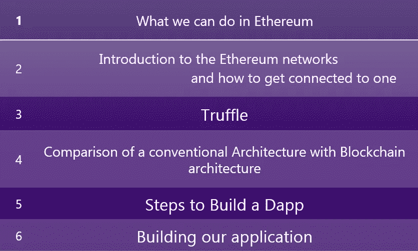

# **我们可以在以太坊做什么:**

(*嗯，这是我的观点。如果你能找到别的东西，请评论*

没有什么比**创建一个去中心化的应用** (DApp)更好的了。这里的重点是，我不会非常深入地研究区块链概念。相反，我会指导你创造一个 DApp。

在我们继续之前，有几件事你应该知道:

(1) **以太坊钱包** —便于持有加密资产以及撰写、部署和使用智能合同:

最流行的是 MyEtherWallet 和 Metamask

(2) **加密货币的创建。**是的！你没看错！你可以创造自己的加密货币(*如果交易成功，我会从你这里买一些*)。

(3) **创建分权自治组织**。嘿！不要混淆了 DApp 和刀。道是一个复杂的 DApp，由一个契约系统组成

# 让我们来谈谈以太坊网络:

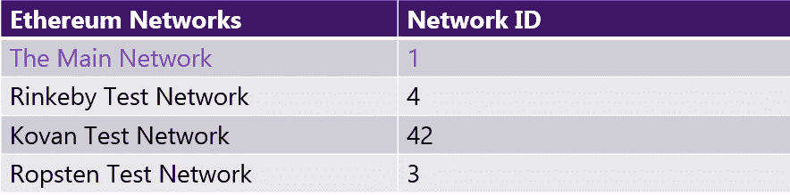

注意:这些 id 是在创建区块链网络时分配给这些网络的。如，**主以太坊网络**是第一个以太坊区块链网络，其 ID 为 1。

我们有 3 个测试网络。我用的是 Rinkeby 网(*哦！不要慌！这就像服务器-客户端应用程序开发，其中有开发环境、测试环境、生产前和生产*。

# 如何连接到这些网络？

目前有两种主要的方法可以做到这一点。

1.  通过使用 Geth 将您的系统变成一个本地节点
2.  另一种是使用类似 truffle-hdwallet 的服务提供商

# Geth

Geth 是运行以太坊节点的命令行界面。在使用 Geth 之前，主要工作是**分别为公网或私网获取或创建 genesis 块**。创世纪区块是区块链上创建的第一个区块。

如果您想将您的系统转换成一个**节点**(在 Rinkeby 网络中):

1-下载“Geth”

2-去 [https://www.rinkeby.io](https://www.rinkeby.io/)

3-下载 **rinkeby.json**

4-通过 Geth ( *我知道，我知道，*说起来容易做起来难。可能我会写另一篇关于这个的文章

# 松露的简短介绍

*不，不，不是松露糕点。*我们为以太坊使用的 Truffle 是一个以太坊开发框架，主要用于编译和部署智能合约，但我们不会用它来编译或部署我们的智能合约(*我的意思是，在本文中*)。

你可以在[http://truffleframework.com/](http://truffleframework.com/)中查看它的所有功能

我们将只使用它的一个功能来签署我们的交易，即**truffle-HD wallet-provider**(*我们将在以后真正需要使用这个*时讨论这个问题)

# **传统架构 Vs 区块链架构**

在传统架构中，一切都位于服务器上。因此，如果数据从那里丢失，那么它就永远消失了。但是在区块链中，所有的节点都是同步的。因此，如果一个节点的数据丢失或一个节点关闭，其余的节点会保护您的数据。

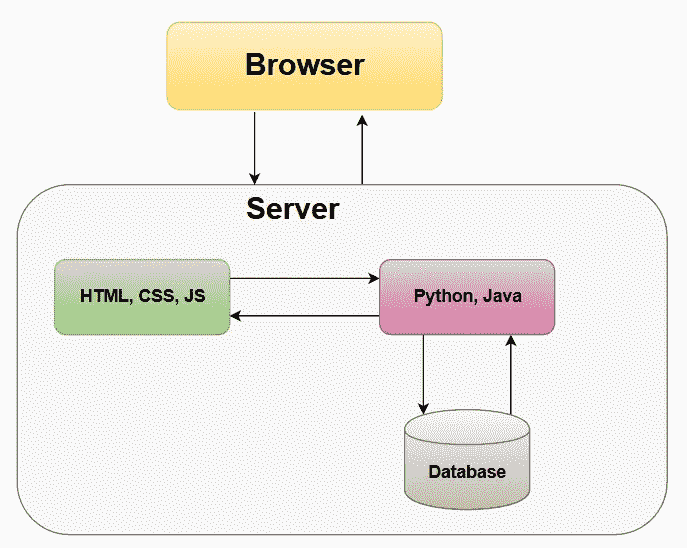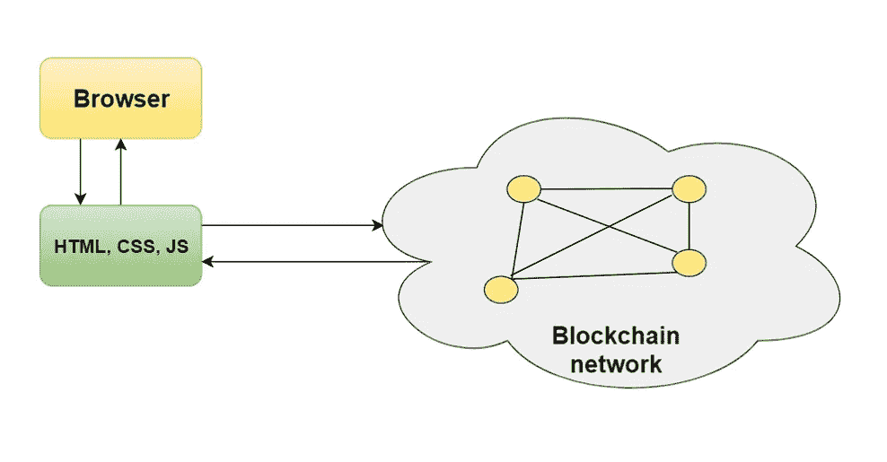

Conventional architecture Vs Blockchain

# **我们来煮一个去中心化的 App 吧！！**

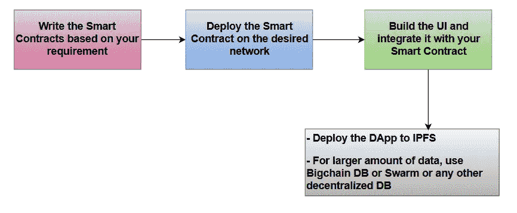

**Steps to build a DApp**

别担心，我会一步一步告诉你怎么做这道菜

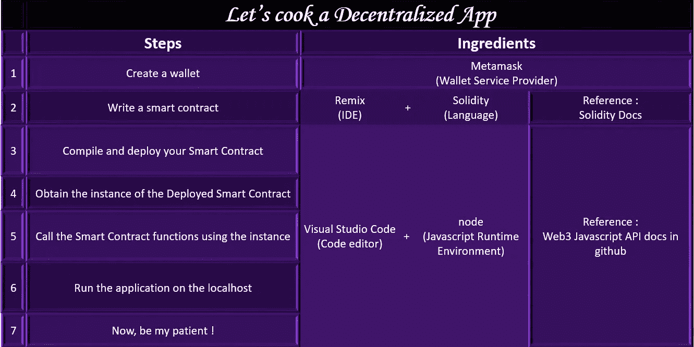

我会适当地解释每个步骤。

嗯，在我们讨论这个之前，只要理解一点，你用任何语言写的任何应用程序都有三样东西——UI、你的应用程序代码(*业务逻辑我们称之为*)和数据库。

> 我以下面的方式想象它:

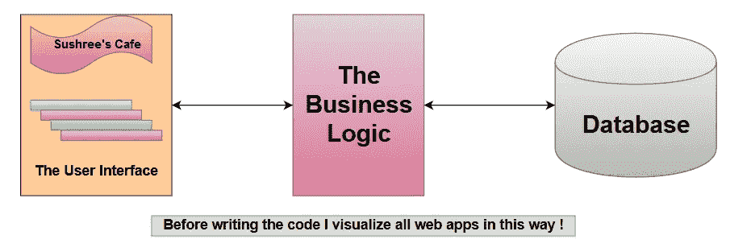

# 现在，以同样的方式来看区块链应用程序:

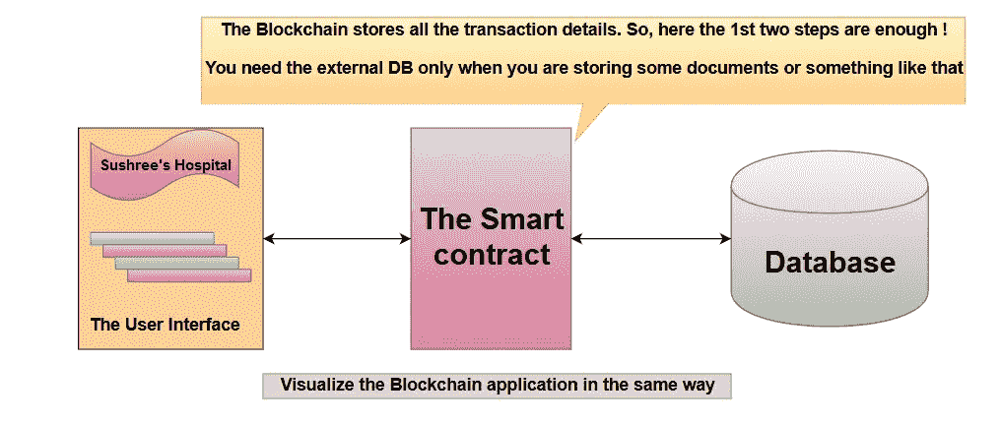

# 让我们创建一个钱包

图片胜于雄辩！！

只需打开谷歌浏览器(*没有其他浏览器请！*)并遵循以下步骤:

# 撰写智能合同

我们必须编写一个智能合同，在医院注册一个病人，向管理员显示所有的病人 ID，并通过点击 ID 获得有关病人的数据。

为了编写一个智能契约并测试它的功能，我使用 remix IDE，因为这是最简单的方法。

打开[http://remix.ethereum.org](http://remix.ethereum.org)。在左上角，你会看到一个“+”号。点击该按钮，打开一个新的合同页面。

代码是用 Solidity 语言写的。学起来没那么难。

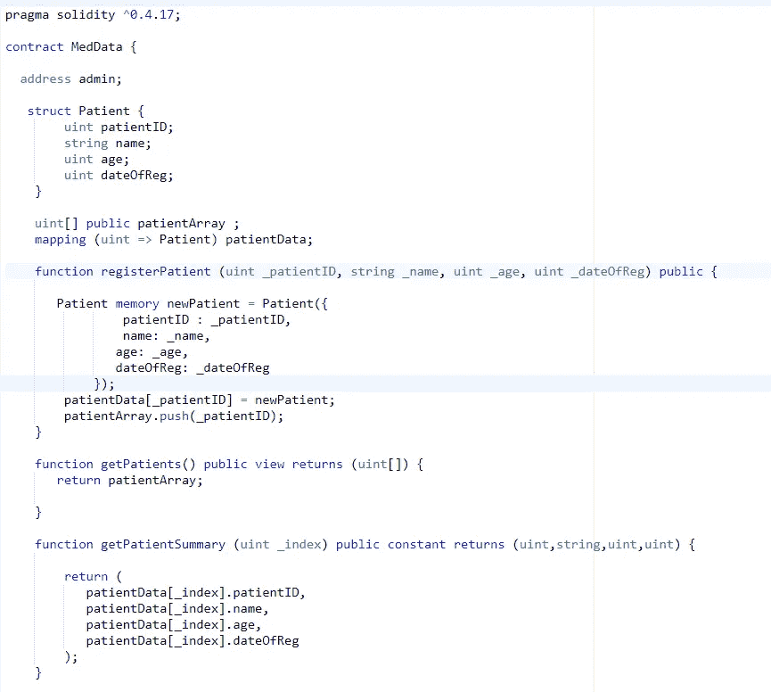

在这里，我创建了一个数组来存储所有的病人 id，这样我就可以很容易地在一个页面中列出它们。

我已经创建了一个映射，它将病人的数据映射到病人 ID。因此，单击特定的患者 ID，我们将能够检索该患者的所有数据。

这些函数不言自明。

现在，要运行并测试功能，请单击 run 选项卡。

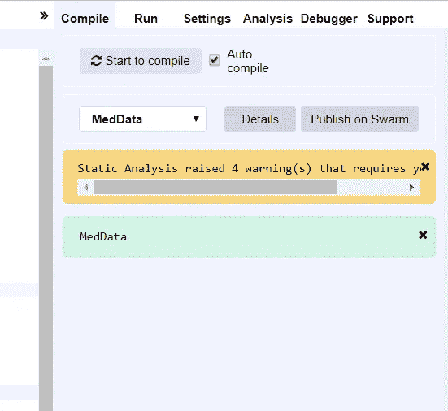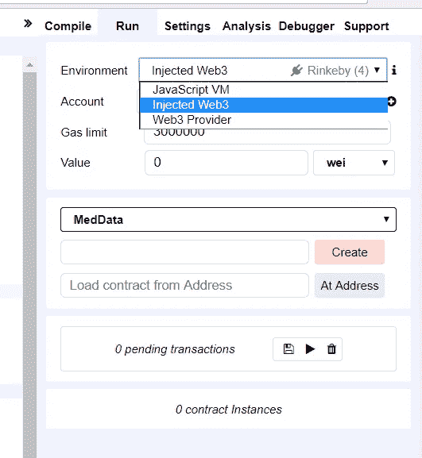

the left image shows the page where you are already there and the right image is the page where you have to go.

当你点击“运行”标签时，你会看到很多选项，第一个是“环境”。点击下拉菜单。选择 JavaScript VM 来测试合同。稍后，当代码运行良好时，将其更改为 Injected Web3。

当选择了注入 Web3 选项时，确保元掩码连接到 Rinkeby 网络。如果没有显示 Rinkeby，打开 Metamask，将网络改为 Rinkeby。*很简单！*

它还应该有一些醚(*嗯，不是真的，你可以在测试网络*中得到假的)。你可以去 rinkeby .水龙头为你的测试帐户申请乙醚。

立即测试:

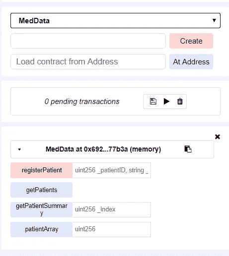

当您单击 create 按钮时，它会将智能合约部署到所需的网络，在我们的例子中是 Rinkeby。然后你可以看到这里所有的功能。继续在文本框中输入函数 registerPatient()的参数值，然后单击 registerPatient 按钮。

等待几秒钟，让挖掘完成。

然后单击其他函数来查看结果。

# 编译和部署您的智能契约(这一次，通过您的代码编辑器)

从 github 克隆 app 后，你会看到有一个名为“以太坊”的文件夹。所有的合同文件都在这里。或者我应该说，所有与契约和以太坊世界相关的东西都在这里(*这家伙不想要任何 UI 的东西在里面！*)

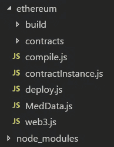

点记！！！

**(1)我们先编一个智能合约**。当我们这样做时，我们得到了字节码和应用程序二进制接口(ABI)。如果你想了解更多，那么去 https://web3j.readthedocs.io/en/latest/abi.html

**(2)** 要与任何智能合约交互，您只需要两件事情:合约地址和 ABI

好了，我们有了 ABI。但是**合同地址**在哪里？我什么也没看到。你有吗？

**(3)** 你必须**将智能合同**部署到任何一个网络来获取地址(在我们的例子中是 Rinkeby 测试网络)。

但是我如何在 Rinkeby 网络中部署我的合同呢？

*Infura 就是答案！！*

Infura 让你进入以太坊。为此，你必须去 https://infura.io/注册。*免费的！！只需输入您的姓名和电子邮件 ID，向他们证明您是人类，然后提交表单。*

您会收到一封类似这样的电子邮件:

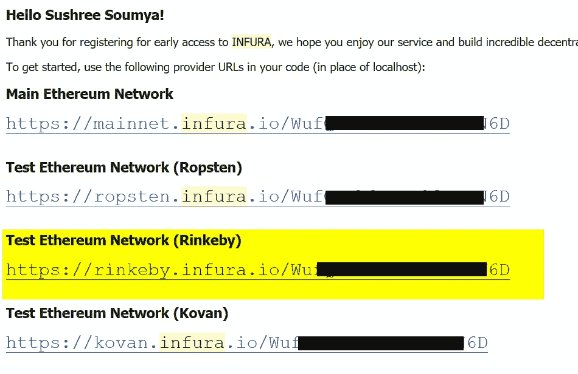

使用所需网络的 URL，您可以连接到该特定网络并在那里部署契约。我会告诉你如何…

你还记得**松露钱包供应商吗？**我们在前面的松露部分讨论过这个问题(*如果没有，你应该感到高兴。健忘是聪明的标志。*

嗯，我会推荐你从[这里](http://truffleframework.com/tutorials/using-infura-custom-provider)开始阅读整本书。

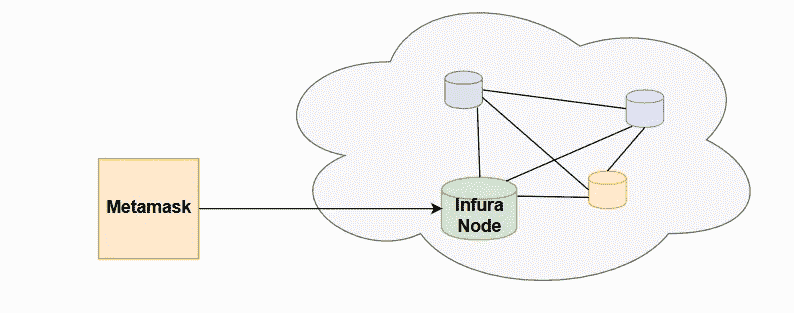

元掩码由 Infura 节点提供支持。那么，松露钱包提供商如何在这里工作呢？

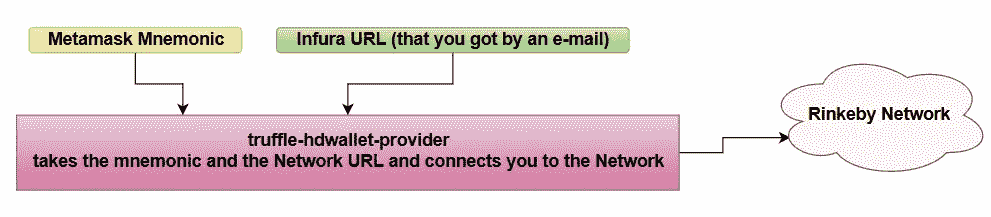

看看图再看看 deploy.js 写的代码，你会更好理解的！

如果打开 deploy.js 文件，您将看到助记符和 URL 是如何传递的。

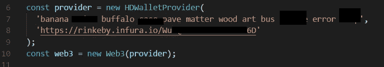

*   如果您的系统上运行的是 geth 客户端，那么您不需要使用 HDWalletProvider。你只需要使用你的本地主机网址。
*   如果您使用 Ganache 来完成，代码将如下所示:

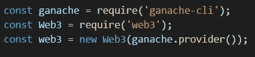

以上两点仅供你参考。如果你不明白，不要担心。我们没有在这里使用它们。

现在，你有了 ABI，合同地址。接下来呢？

嗯，使用这两个东西，我们将获得契约实例。

# 获取已部署的智能协定的实例

打开 ContractInstance.js。

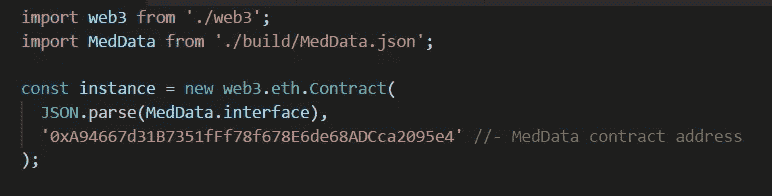

这里是编译后得到的 MedData.json。它既有 ABI 也有字节码。

您在这里看到的地址是我们将合同部署到 Rinkeby 网络后获得的合同地址。

# 使用实例调用智能合约函数

好了，现在一切都够了！让我们看看如何将 UI 与我们的智能合约相集成。这就是我们所期待的。不是吗？

在应用程序文件夹中，您会发现 index.js，我在其中调用了一个智能契约函数 getPatients()来列出我的医院病人的 id。

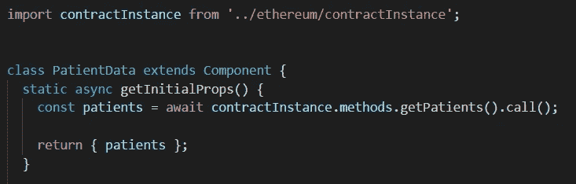

如果你不明白反应，不要担心。我们也可以使用普通的 Javascript 来完成所有这些工作。

如果你不懂 Javascript，请学习它！！

index.js 中的其余代码是 UI 部分。我们不会在本文中讨论这个问题。

当您打开本地主机时，数据会以如下方式列出:

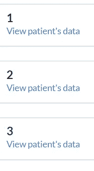

*相信我，页面比这张截图好看多了！！*

你会在左上角发现一个“+”号。用于添加患者(*请自行添加*)。

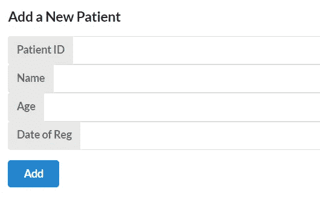

您能够将自己添加为患者吗？

*   如果是，您必须通过元掩码签署交易。*牛逼！正式来说，你现在是我的病人*。
*   如果没有，请检查您是否已经登录您的元掩码。

然后检查您是否已连接到 Rinkeby 网络。

然后检查你是否有醚。如果你没有，那么请去[这里](https://faucet.rinkeby.io/)买一些。

*哪天我们一起去我的医院喝杯咖啡吧！*