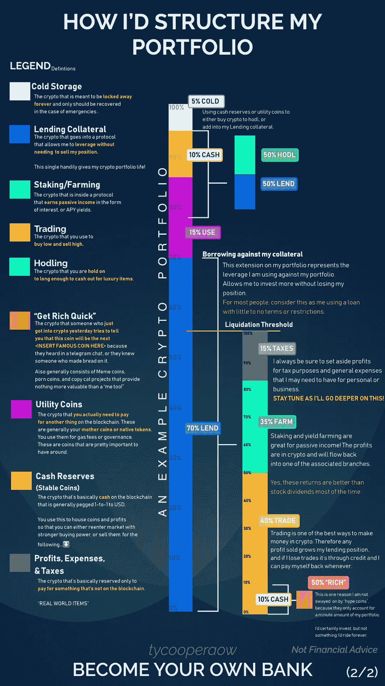

# 我如何构建我的加密组合

> 原文：<https://medium.com/coinmonks/how-i-structure-my-crypto-portfolio-d66c9d17c060?source=collection_archive---------1----------------------->

随着所有围绕加密市场的热潮开始消退，一些人仍然只将加密视为一个泵和转储生态系统或购买和持有策略。现在，这种观点在某些情况下可能是正确的，但是，随着加密中 DeFi 和 NFTs 部门的崛起，这只会扩大人们可以附加到其金融基础架构的工具。为了说明这些工具和策略，我花了一些时间…