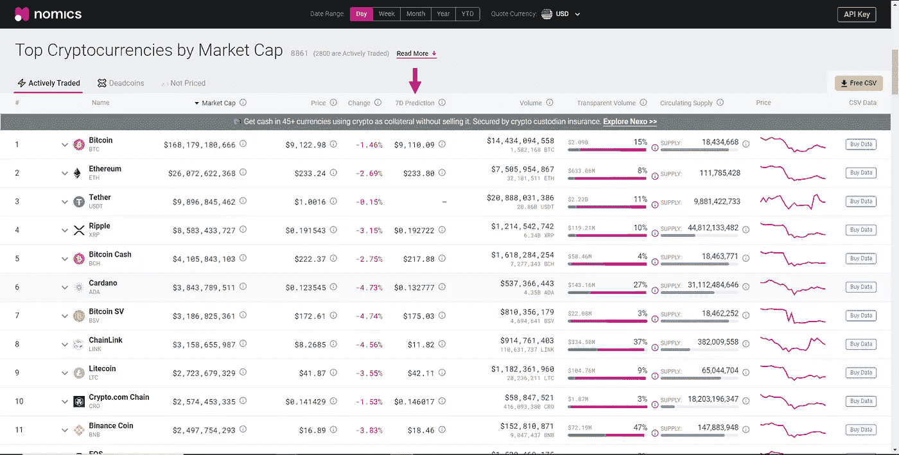
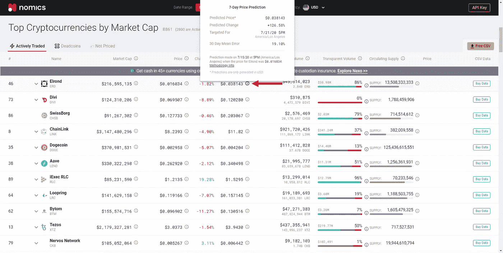
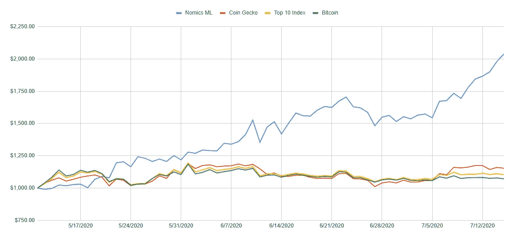

# 我如何使用机器学习来挑选我的加密组合

> 原文：<https://medium.com/coinmonks/how-i-use-machine-learning-to-pick-my-crypto-portfolio-bb7e18a15399?source=collection_archive---------1----------------------->

使用机器学习来预测股票市场的走势多年来一直是一个热门话题。新手和专业人士都试图创造可靠的模型，将他们的 T2 密码组合变成盈利机器。

是否有团队已经成功地长期实施了这样的 ML 策略，这是一个有争议的话题。当然，投资组合策略的某些方面可以用 ML 自动化，但是完全自动化的策略可能更难构思。

> Eurekahedge 的一项研究表明，AI 和 ML 基金的表现优于 quants 和其他传统对冲基金。

 [## 交易机器学习-主题概述-sigmoid

### 人工智能(AI)和机器学习(ML)正在悄然改变我们生活的几乎所有领域。做了…

sigmoidal.io](https://sigmoidal.io/machine-learning-for-trading/) 

虽然人工智能和人工智能策略在传统金融市场已经变得流行，但我仍然没有在密码领域看到关于这个主题的大量讨论。

也许波动和不可预测的市场走势已经把人们吓跑了。不管原因是什么，是时候激发一些讨论了。

在价格预测方面，[经济学](https://nomics.com/)在推出 7 天价格预测时占据了主导地位。这些价格预测使用了一种被称为“长短期记忆”(LSTM)的机器学习模型。通过用每日 OHLCV 烛台数据训练模型，模型预测 7 天后的价格。

我很高兴看到这个话题被探讨，并准备尝试一下预测。然而，我不知道如何测试它们。只有几个数据点，很难真正有把握地进行回溯测试。这意味着唯一的测试方法就是现场测试。

> 所以，我开始为一个案例研究写规则。

因为我认为每周只选择一两种资产买入并持有是有风险的，而且不能给出所有预测的最佳图景，所以我决定每周使用 10 种资产。

这意味着，在每周的开始，我会选择被经济学预测涨幅最大的前十种资产，并将它们放入一个投资组合。

> **注:仅考虑币安上可用的资产。我还有一个限制，即订单簿上需要有足够的流动性和最小的价差。**

在你的投资组合中使用机器学习很容易。如果你想进行同样的研究，你可以通过这三个简单的步骤来完成。

## 1.转到经济学

 [## 经济学:加密市值-价格，历史高点，图表

### 实时加密市值排名，历史价格，图表，历史高点，供应数据和更多的顶级…

nomics.com](https://nomics.com/) 

## 2.按 7D 预测排序

Sort the top 100 assets by “7D Prediction” by clicking on the text in the column.

这将按照从未来 7 天预测变化最高到最低的顺序排列资产。

将鼠标悬停在信息按钮上，可以找到对每项资产的预测。

Hover over the information icons to see the prediction for each asset.

## 3.将十大资产添加到投资组合中

有了这些信息，你就可以去交易所购买每一种被预测表现最好的资产。

> 就是这样。

整个过程只需要几分钟，由于预测是在 7 天内完成的，投资组合只需要每周更新一次。

如果你想自动复制这个策略而不需要自己做任何工作，你可以在 Shrimpy 上跟随这个领导者。

 [## Shrimpy | MLCaseStudy —机器学习案例研究

### 加入 Shrimpy 的研究，让您的投资组合策略实现自动化！

shrimpy.io](https://shrimpy.io/leader/mlcasestudy) 

# 结果

如果策略不奏效，了解这些细节是没有用的。那么，这种投资组合策略到目前为止效果如何呢？

> 像一个传奇。

没错。在撰写本文时，每周使用 ML 预测的投资组合在 9 周内价值增长了 104%。与此同时，比特币的价值同期仅增长了+7%。

Nomics has been rising like a phoenix.

到目前为止只有 9 周，但该研究表明，机器学习值得研究。

这并不能说明未来的表现，但是如果我不认为这些数据是令人着迷的，那我就错过了。

> 我希望你也会觉得这很有趣！

这些数据可以有无数种方式用于选择资产、做出交易决策，甚至只是纳入一个更大的战略。

机器学习在加密货币市场才刚刚起步。我目前看到的数据让我大吃一惊。希望这只是一个不断发展的研究领域的开始。

我每周都会发布关于这项研究的更新，所以我会鼓励你继续跟进。原始案例研究文章可在此处找到:

 [## 案例研究:使用机器学习进行项目组合管理

### 在最近的一篇博客文章中，Nomics 宣布发布其 7 天加密价格预测。他们的预测使用了…

blog.shrimpy.io](https://blog.shrimpy.io/blog/case-study-using-machine-learning-for-portfolio-management) 

上周的更新可以在这里找到:

 [## 加密投资组合管理的机器学习案例研究:第 10 周

### 自本研究的第二周以来，Nomics ML 策略一直保持着相对于其他策略的稳定领先优势。我们…

blog.shrimpy.io](https://blog.shrimpy.io/blog/machine-learning-for-crypto-portfolio-management-case-study-week-10) 

# 我们的社交交易平台

[**Shrimpy**](http://shrimpy.io/) 是一个加密货币的社交交易平台。它是为专业和新手交易者设计的，以了解不断增长的密码行业。在 Shrimpy 上，用户可以复制其他交易者的投资组合和交易策略。

> [*在您的收件箱中直接获得最佳软件交易*](https://coincodecap.com/?utm_source=coinmonks)

在 [Twitter](https://twitter.com/ShrimpyApp) 和[脸书](https://www.facebook.com/ShrimpyApp)上关注我们的更新，并在[Telegram](https://t.me/ShrimpyGroup)&[Discord](https://discord.gg/gXyy95y)上向我们令人惊叹的活跃社区提问。

谢谢你的来访！