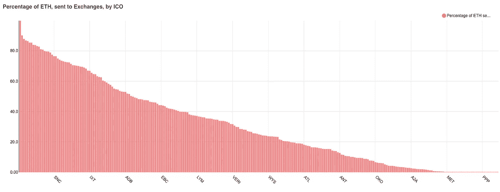

# 我如何花钱？

> 原文：<https://medium.com/coinmonks/how-ico-spend-money-b6c2f83d928?source=collection_archive---------1----------------------->

## 基于以太坊连锁数据的分析以统计的方式回答了这个问题

以太坊网络中的代币和硬币大众销售从参与者那里收集以太，以换取他们发放的代币。在这篇文章中，我们将试图分析他们下一步如何处理收集到的以太。

根据众包销售的机制，收集的以太将在众包销售智能合同或专用于存储项目资金的特殊钱包上增长。这是常见的，为大量使用多签名的钱包。你可以看到，在[的顶级多签名钱包列表](https://bloxy.info/list_multisig_wallets)中，有许多项目钱包的丰厚余额。

我们分析了数百个代币，这些代币是在大拍卖中出售。我们根据收集超过 **1000** 以太的标准选择代币，并有超过 **800** 代币出售交易。这些代币的交易在区块链中是显而易见的，因此我们可以精确地知道收取了多少。从代币销售交易中，我们得出了收集乙醚的地点。

图形资金流动分析被用于查找乙醚后来被转移到哪些地址。该图分析了 10 个“跳”的最大深度。对于大多数象征性的销售“钱包”来说，这就足够了，而且大多数没有太多的深度分布。

我们在本次调查中提出的主要问题是:

**他们向交易所转移了多少乙醚？**’，以及

**他们这么做要多久？**'

我们认为这些问题很重要，因为在某种程度上，它们表明 ICO“相信”加密货币是其经济的基础。

在一个极端的例子中，ICO 将所有收集到的乙醚转化为美元。然后，它有很好的资源支付法定货币的工资，买东西，等等。然而，这在某种程度上揭示了他们无法在一个真正的加密世界中操作，在这个世界中，所有的资产都在区块链中表示。

另一方面，ICO 将所有收集的以太网留在智能合约或钱包上，并将其用作出售令牌或进一步开发的储备。

我们如何发现一个项目将以太转换成法定货币或其他加密货币的事实？我们使用的方法是查看资金分布图，从大众销售交易开始。如果我们看到图表中有人将来自大众销售的钱转移到交易所，我们认为这些钱被“转换”了。由于以下原因，此分析可能不准确:

1.  货币分布图分析基于对目的地货币来源的“最佳猜测”。尤其是在从源地址收到钱之前，地址已经有初始余额的情况下。在所有这些情况下，我们猜测，地址总是先花最近收到的钱，后进先出模型，费罗。
2.  我们通过 [bloxy.info](https://bloxy.info) 数据源上的地址注释信息检测到了向 exchange 的资金转移。这些注释来自公共资源、Bloxy 用户社区，以及对[分散交换协议](https://bloxy.info/list_dexes)的自动检测。
3.  我们无法检测项目是自己决定进行交换，还是把钱转给第三方，第三方进行了交换。

# 收钱，然后花钱

几个项目的资金分配分析的例子揭示了一些共同的模式。


Blue bars show the amount, collected by month. Red bars show the amounts of Ether sent to exchange. source: [Bloxy.info](https://stat.bloxy.info/superset/dashboard/icoeth/?standalone=true)

常见的值得注意的是:

1.  钱实际上是以一定的数量被送到交易所的，这个数量相当于在大拍卖中收集到的数量
2.  有些项目是在众筹过程中交换集资款，有些则等到项目完成
3.  在大多数情况下，换钱发生在几个月内的多次交易中。

# 通过统计揭示共有物

由于我们已经掌握了所有的交易数据，现在我们可以对所有选定的项目(超过 200 个)进行汇总，以查看共同的趋势和差异。

首先，让我们将项目数据规范化。我们可以通过计算发送到交易所的金额相对于大众销售中收集的总金额的百分比来实现。**平均给我们 27.8 %。**


Exchanged by ICO after crowd sale in average

然而，这里的多样性是相当大的——不同项目的差异从 0 到几乎 100%不等:



% of collected money exchanged, by projects. Source: [bloxy.info](https://stat.bloxy.info/superset/dashboard/icoeth/?standalone=true)

有些人交换了所有收集到的东西，有些人什么也没交换。


These guys exchanged most

# 货币兑换有多快

现在，让我们试着将时间尺度正常化，从第一笔交易开始算起。然后我们看到项目决定兑换货币的平均速度:


Relative ratio of exchanged amount, by weeks from the start of crowd sale. Source: [bloxy.info](https://stat.bloxy.info/superset/dashboard/icoeth/?standalone=true)

最大值出现在大规模销售开始后的 4-9 周，尾巴相当长。项目往往会向交易所进行多次资金转账，这可能会在时间上进行分配。

我们还可以分配从批量销售合同到实际地址的“跳数”。它被计算为货币“图形”的深度，显示在以下分布图中:


Source: [bloxy.info](https://stat.bloxy.info/superset/dashboard/icoeth/?standalone=true)

有趣的是，出售钱包或合同的人群几乎从不进行直接交易。两跳(0 和 1)的要求可以仅通过技术限制来解释。然而，该分布表明，几乎所有的传输都发生在从 4 开始的跳上，这在图中离初始钱包相当远。

在从大众销售到交易所的过程中，资金会经过许多(3 到 10 个)中介地址。

# 它是如何在时间中运作的？

在过去的几个月里，ICO 兑换货币的百分比没有增加。下图在横轴上显示了大众销售的起点。你甚至会注意到一些下降。然而，它似乎相当稳定，因为你应该考虑到，最新的项目还没有时间来交换金钱。根据我们上面的统计，他们平均需要大约 2 个月的时间来完成。


Source: [bloxy.info](https://stat.bloxy.info/superset/dashboard/icoeth/?standalone=true)

# 结论

1.  这是很常见的，群众销售交换收集的钱，可能是法定货币。几乎三分之一的收款金额(27.8 %)被交换
2.  交换过程不会立即发生，在大多数情况下，货币交换发生在几个月的多次交易中。从大众销售到交易所平均需要 2 个月和 3 到 10 个中介地址
3.  不同的项目在做这件事的方式上有很大的不同，在资金交换的百分比上也有很大的不同
4.  在过去的两年里，这一进程没有明显的变化。

```
*This article was composed from the data and by analytical tools from* [*Bloxy.info*](https://bloxy.info) *analytical engine.* [*Bloxy.info*](https://bloxy.info) *web site provides a set of tools for analytics, traders, companies and crypto enthusiasts.

The tools include APIs, dashboards and search engine, all available on-site, providing accurate data, indexed directly from the blockchain live node.

Bloxy mission is to make blockchain more transparent and accessible to people and businesses.

Please, make a reference to the source of data when referencing this article.*
```

> [在您的收件箱中直接获得最佳软件交易](https://coincodecap.com/?utm_source=coinmonks)

[](https://coincodecap.com/?utm_source=coinmonks)