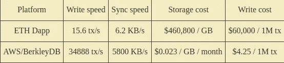

# dapps 效率有多低？

> 原文：<https://medium.com/coinmonks/how-inefficient-are-dapps-c18062c80a71?source=collection_archive---------1----------------------->

## ETH vs AWS/BerkleyDB

The spirit animal of the cloud, the hare, races against the spirit animal of the blockchain, the tortoise. Unlike in the eponymous fable, the lesson here is that fast and steady is always better than slow and steady.

## 介绍

Dapps 提供了相同的数据存储和计算，可以使用带有集中式数据库的 web 服务来执行。在这里，我比较了两者之间的性能指标和服务成本。具体来说，我比较了写入速度、写入成本、数据存储成本和同步速度。我使用 Amazon web services (AWS)作为高效 web 服务的基准，使用 BerkleyDB 作为当今任何人都可以访问的数据库。我使用以太坊，因为它是最流行的 dapp 平台。

## **写入速度:**

向系统写入数据以便其他人可以读取需要多长时间？对于以太坊来说，这意味着交易确认需要多长时间。以太坊有史以来最高的交易量是在 2018 年 1 月 4 日，确认交易 135 万笔。也就是每秒 15.6 次交易。为了进行比较，我使用了 BerkelyDB 数据库的一些[性能指标。对于事务性磁盘写入，最慢的系统每秒允许 34，888 次写入。web 服务通常会使用像 BerkleyDB 这样的集中式数据库。通过以太坊的事务性写入延迟至少比使用集中式数据库的写入速度慢 2200 倍**。**](http://staff.rcost.unisannio.it/visaggio/berkleyDB.pdf)

## 写入成本:

以太坊链条上的每一次更新都需要交易费和油费。2018 年 9 月 1 日，交易费中位数的价格为 0.06 美元，平均值为 0.21 美元。触发费用的动作将是发送消息、进行购买、上传数据、编辑数据。[亚马逊 API gateway 提供 100 万次 API 调用，每月 4.25 美元](https://aws.amazon.com/api-gateway/pricing/)。在网站服务器上更改内部数据的实际成本没有直接成本。以太坊至少有**14000 倍昂贵的写成本**。

## **仓储费用:**

在[黄皮书](https://ethereum.github.io/yellowpaper/paper.pdf)中，存储一个 256 位字的价格是 20k 气。2018 年 9 月 1 日气价约 2.5 Gwei。所以 1 KB 的存储是 0.0016 ETH(有 32 * 256 位= 1 KB)。1gb 的存储量为 1600 ETH。在同一天，ETH 的价格是 288 美元。所以存储 1 GB 的价格是 46.08 万美元。对于亚马逊的 S3 定价，他们最贵的选择是每 GB 0.023 美元。以太坊的数据存储至少比当代网络服务贵 2000 万倍。

## 同步速度:

截至 2018 年 9 月 1 日，平均数据块约为 22 KB。在 Geth，我在一个仅仅几个月没有同步的客户端上 7 分钟内下载了 119 个块。因此，124 秒内大约有 2.618 MB 的数据，即每秒 6.2 KB。根据我的经验，这并不是一个太慢的同步速度。事实上，有了大约 100MB 的链数据，这将表明我可以在不到 4 小时内与 Ethreum 的整个历史同步，这是非常快的。相比之下，2015 年[全球互联网连接速度约为 5.6 MB /秒。所以在以太坊上同步区块链数据保守估计比当代网络架构慢 903 倍带宽。](https://www.akamai.com/es/es/multimedia/documents/content/state-of-the-internet/q4-2015-state-of-the-internet-connectivity-report-us.pdf)

## **结论:**

ETH dapps vs AWS/BerkleyDB

要清楚的是，这是对 dapps 低效率的保守估计。我对 AWS/BerkleyDB 用过悲观的数字，对以太坊用过乐观的数字。这一点的意义在于以太坊从来就不是一个真正有竞争力的通用计算平台，这一点从一开始就应该很明显。任何未来的技术进步都将适用于网络服务，就像它们将适用于区块链一样。

> [直接在您的收件箱中获得最佳软件交易](https://coincodecap.com/?utm_source=coinmonks)

