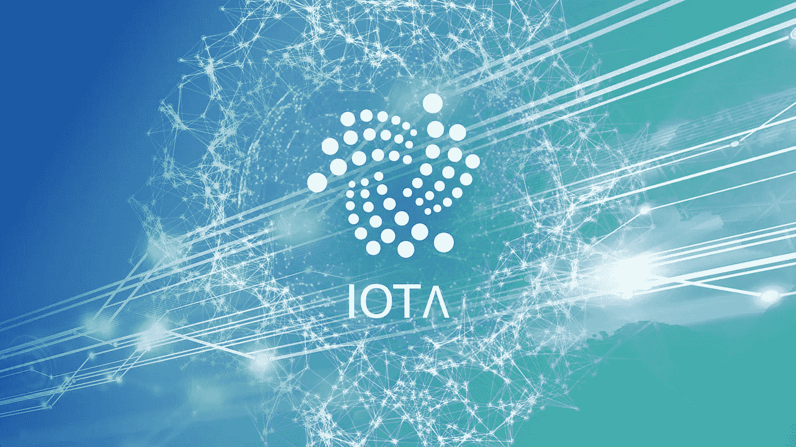

# IOTA 如何成为智能合同和跨链平台

> 原文：<https://medium.com/coinmonks/how-iota-is-becoming-an-intelligent-contract-cross-chain-platform-fb418c2b5ec4?source=collection_archive---------3----------------------->

对一些人来说，这一点点消息不仅仅是一个惊喜。原因是在广泛的加密社区中，它已经变得安静了。

# 智能合约正成为 IOTA 的难题

IOTA 基金会昨天(10 月 15 日)宣布发布智能合同的测试版