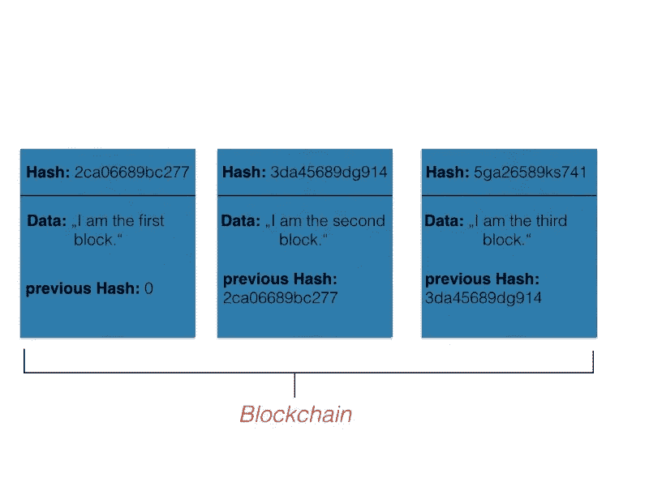
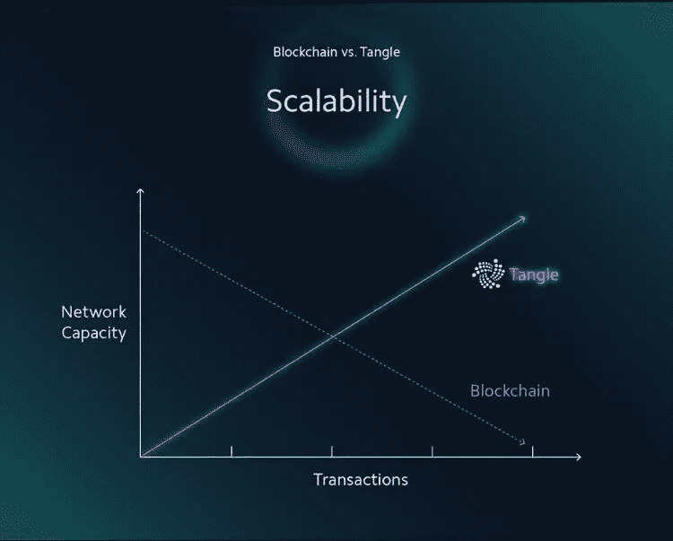

# IOTA 如何解决区块链可扩展性问题

> 原文：<https://medium.com/coinmonks/how-iota-solves-blockchains-scalability-problem-1ed4f573801b?source=collection_archive---------4----------------------->

## 本文简要介绍了区块链的可伸缩性问题以及 Tangle 是如何解决这个问题的。

[https://www.google.de/search?q=tangle+iota&source=lnms&tbm=isch&sa=X&ved=0ahUKEwi_l7-wi-_dAhUMuaQKHU1DDw0Q_AUIDigB&biw=1363&bih=539#imgrc=hEDjkFFOylj9xM](https://www.google.de/search?q=tangle+iota&source=lnms&tbm=isch&sa=X&ved=0ahUKEwi_l7-wi-_dAhUMuaQKHU1DDw0Q_AUIDigB&biw=1363&bih=539#imgrc=hEDjkFFOylj9xM):

## 可伸缩性问题简介

区块链作为一种去中心化和密码安全的数据库，是一种新技术，肯定会对数字世界的未来产生巨大影响。但是随着影响的增加，用户数量也在增加——这就出现了一个大问题。大多数目前已知的区块链网络都不是为很多用户设计的——我指的是很多用户。让我们来看看最著名的区块链系统比特币。决定能够存储的数据量的块的大小被限制为 1MB。正如我在我以前的一篇文章中描述的那样，[加密货币如何实际工作](https://hackernoon.com/how-cryptocurrencies-actually-work-d802106ed341)，存储在加密货币区块链中的数据是交易数据。必须生成一个块，然后由网络验证，这需要时间。因此，在一定的时间内只能完成有限的交易量。但是由于整个技术的参与者越来越多，处理这种交易的时间也增加了。这就是所谓的可扩展性问题。必须找到解决办法，IOTA 也找到了。

## IOTA 和纠结

IOTA 基金会提出了一个非常好的想法——所谓的纠结系统。因此，他们使用了数学中一个叫做*图论*的题目的知识。别担心，我会解释的。首先，看看下图中区块链的简化结构:

Visualization of a simplified structure of a blockchain.

我们有信息块，每个块包含特定的数据，并通过加密计算的哈希值连接到前一个块。现在来看看这个纠结是什么样子的:

Source: [https://www.google.de/search?q=tangle+iota&source=lnms&tbm=isch&sa=X&ved=0ahUKEwjuz_PXgu_dAhUGUlAKHYBLBcsQ_AUIDigB&biw=1363&bih=601#imgrc=cUOYORd9LALTBM](https://www.google.de/search?q=tangle+iota&source=lnms&tbm=isch&sa=X&ved=0ahUKEwjuz_PXgu_dAhUGUlAKHYBLBcsQ_AUIDigB&biw=1363&bih=601#imgrc=cUOYORd9LALTBM):

你在上图中看到的，是一个在数学上叫做*有向无环图*的东西。为了理解的目的，知道一个图只是一组顶点和边就足够了。有向意味着连接两个顶点的边从一个顶点指向另一个顶点。在 tangle 系统中，每个事务由一个顶点表示。这意味着，如果有人正在转移一些 IOTA 资金，他或她会生成一个交易，然后该交易会成为上面纠结图中的一个顶点。现在的线索是，每笔交易至少要获得另外两笔交易的批准。用数学术语来说，这意味着每个顶点都必须通过将边指向至少另外两个顶点来连接。看看上面的图，选择任意一个顶点——你会看到，至少有两个箭头指向另外两个顶点。如果这两个交易之间至少有一个交易存在联系，则称一个交易被另一个交易*间接批准*。

因此，不是将事务存储在有限大小的块中，而是每个事务独立存在，并且必须批准其他事务。使用这种方法，在一定时间内可以处理的事务数量会随着事务数量的增加而增加！看看下面 IOTA 基金会的经典可伸缩性数据。

Source: [https://www.google.de/search?q=tangle+scalability&source=lnms&tbm=isch&sa=X&ved=0ahUKEwizqObThO_dAhWGblAKHZP6De0Q_AUIDigB&biw=1363&bih=601#imgrc=w0i0nV0APSwW-M](https://www.google.de/search?q=tangle+scalability&source=lnms&tbm=isch&sa=X&ved=0ahUKEwizqObThO_dAhWGblAKHZP6De0Q_AUIDigB&biw=1363&bih=601#imgrc=w0i0nV0APSwW-M):

既然我们知道 IOTA 如何解决可伸缩性问题，那么了解参与者的网络是如何建立起来的将会非常有趣。

## IOTA 网络中的节点

当作为节点加入 IOTA 网络时，有不同的选项可供选择。IOTA 中有四种不同类型的节点:完整节点、Perma 节点、轻型节点和协调节点。完整节点是分发事务的 IOTA 网络中的标准参与者。因为每一个网络参与者，谁发布一个交易，必须批准至少两个其他交易，他们必须从某处发送给他。这是完整节点的任务。完整节点本身并不存储该纠结的完整事务历史，而只存储该纠结的当前状态。当涉及到存储整个事务历史时，Perma 节点就是完成这项任务的节点。基本上，这是这两个节点之间的唯一区别。Light 节点不存储或传播事务，它只是从 Full 或 Perma 节点获取所需的信息。最后要提到的节点是所谓的协调器。该节点由 IOTA 基金会运行以保护网络，因为根据他们的说法，它还不能维持自身。协调器生成所谓的*里程碑*，这只是普通的事务。如果已经存储在 tangle 图中的事务被最新的里程碑间接批准，则称之为已确认。

总之，IOTA 使用 tangle 系统处理大量交易数据的方法确实是一个非常好的想法。然而，还有其他解决可伸缩性问题的方法，例如，Nano。Nano 使用所谓的*块晶格结构*，这是经典区块链技术和有向无环图的结合。我将在下一篇文章中谈到这一点。在那之前——感谢阅读，敬请关注！

> [在您的收件箱中直接获得最佳软件交易](https://coincodecap.com/?utm_source=coinmonks)

