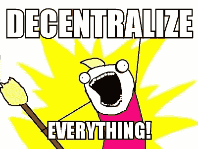
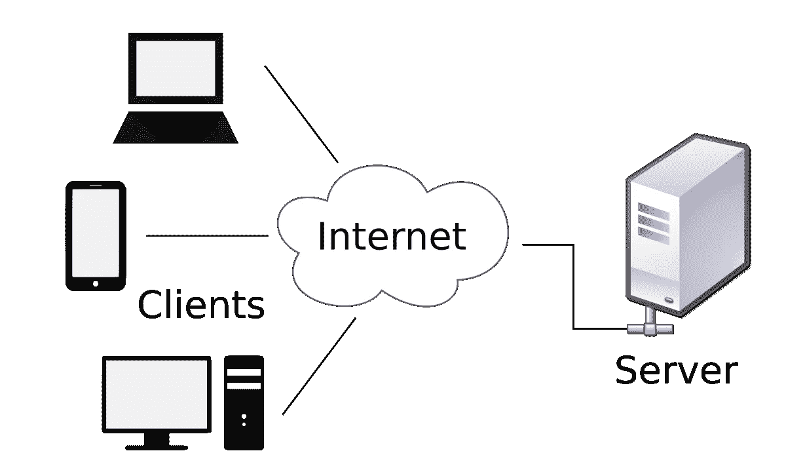
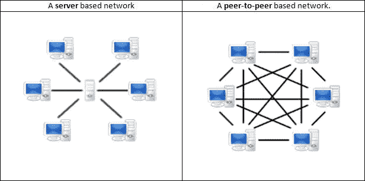

# 加密是如何分散的？(面向非技术人员)

> 原文：<https://medium.com/coinmonks/how-is-crypto-decentralized-for-non-techies-c51b0333ac3e?source=collection_archive---------7----------------------->

## “加密”往往因为只是一种不稳定的投机性投资而名声不佳。从本质上讲，这是一种完全不同的数字交流方式。

Source: Steemit

"让我们把所有东西都搬到区块链酒店去吧. "

“一切都将去中心化”

“分散式应用程序(Dapps)将统治世界”

当你接触到混乱的密码世界时，你会经常听到“去中心化”这个词。要理解术语“去中心化”在应用于加密时的含义，必须理解:

1.  **什么**加密正在去中心化
2.  **crypto 如何试图去集中化已经集中化的东西**

# **1。什么是加密去中心化？**

互联网。

今天每个人使用的互联网是一个客户端-服务器系统。“客户机-服务器系统”听起来像是一个令人生畏的科技术语，但是听我说，这是一个非常简单的想法。

你现在使用的设备是一个客户端。如果你想在互联网上做任何事情，你必须使用特定的应用程序，并且通常有多个应用程序用于你想做的任何事情。需要查找一个随机的人？使用维基百科。想听音乐？你用 Spotify，Apple music，Soundcloud(等等)。想要查看其他人的言论和行为的个性化提要吗？使用脸书、Instagram、Twitter 等。要访问 Spotify 上的音乐，或者查看人们的 Instagram 页面，你必须访问 Spotify 或 Instagram 数据库。你是客户。Spotify 和 Instagram 是服务器。

客户端请求信息，服务器提供信息。

Source: Wikipedia.

你在使用互联网时寻找的任何和所有信息都存储在大型、强大、集中的服务器中，这些服务器包含私人数据。

谷歌*拥有*它的搜索引擎、Gmail、谷歌照片、谷歌文档(等等，你懂的)。这意味着你在谷歌应用上的所有数据/信息都在谷歌的服务器上，而不是别人的。那又怎么样，”你可以这么说，这是理所当然的。谷歌拥有自己的数据似乎并没有造成太大的伤害。

苹果*拥有*应用商店。谁能谁不能把一个应用放到 App Store 上，完全取决于苹果。再说一遍，那又怎么样？嗯，上传应用程序需要征得许可是一个值得关注的道德问题。应用程序创建者上传应用程序是否需要征得许可？谁知道呢，但是只要你上传到位于苹果服务器上的苹果应用商店，是的，你必须得到许可。

中国政府行使权力审查他们不想让公民使用的应用程序。以下是在中国被屏蔽的[网站](https://startuplivingchina.com/list-websites-apps-blocked-china/)列表(截至 2018 年 8 月更新)。中国数百万使用互联网连接设备的人是客户端，中国政府通过政府法规控制哪些服务器可以向这些客户端发送信息，哪些服务器不可以。政府应该能够审查民众的网站吗？谁知道呢，但是只要你在中国使用互联网，这个问题的答案是肯定的。

# **2。crypto 是如何试图去中心化互联网的？**

客户机-服务器并不是组织和促进互联网活动的唯一方式。虽然你和我只是通过我们必须首先通过的服务器连接，但还有另一种网络叫做 [**对等网络。**](https://www.computerworld.com/article/2588287/networking/networking-peer-to-peer-network.html)

对等网络允许网络上的用户直接相互连接。为了让您了解这种情况，下面的图表描述了这两种类型的网络上的信息流:

Source: [https://www.gigatribe.com/en/help-p2p-intro](https://www.gigatribe.com/en/help-p2p-intro)

术语“加密”是一个非常通用的术语，它包含了所有现有的“分散的”、“对等的”区块链项目。重要的是要知道 crypto 这个术语的由来，因为它现在已经存在，一个有用的例子就是比特币。我知道投资比特币风险很大。由于比特币的波动性和投机性，其背后的概念和意识形态很容易被掩盖。，但现在让我们考虑一下比特币的概念对支付意味着什么，以及这是如何通过点对点网络模型实现的。

以上面的图表为例。把所有蓝屏的电脑想象成在他们电脑上的人，他们想通过他们的电脑向其他人付款。在客户端-服务器模型中，从 y 人向 x 人发送的任何资金都必须首先通过服务器才能到达 x 人。这种系统在现实世界中的一些例子包括银行转账、国外汇款和移动支付应用程序。所有这些都是有边界的，只为世界上合适的地方的人提供服务，或者是昂贵的，为转移你自己的钱收取费用。

在点对点模型中，钱可以直接从人 y 发给人 x，这种理论上的点对点交易就是比特币交易理想的样子；不存在为了去它必须去的地方而通过第三方的比特币。资金直接从 y 人到 x 人。

以下是自 2008 年问世以来，[比特币协议](https://bitcoin.org/bitcoin.pdf)中固有的一些激进野心:

*   无边界货币价值，能够发送到世界任何地方或从世界任何地方发送
*   点对点、快速、低费用的交易
*   让人们能够完全拥有自己的钱，而不必为了储存资金而将钱借给银行

比特币绝不是完美的。事实上，它远非完美，但比特币的雄心绝不应该被重新提起，被裁定为不重要，仅被视为一种投机性投资。比特币是否继续作为排名最高的加密货币对我来说并不重要；这一概念和为实现这一概念所做的工作仍然是最重要的。

说了这么多，下面是更让我兴奋的事情:

**比特币只是一种去中心化的应用。**

就在我们说话的时候，分散式网络正在建立。仅举几个例子，像[以太坊](https://www.coinmama.com/blog/ethereum-for-dummies)、 [EOS](https://blockgeeks.com/guides/eos-blockchain/) 和 [Dfinity](/dfinity/dfinity-in-a-nutshell-a-non-technical-introduction-ec45ec5967c1) 这样的项目，正在为一种全新的、真正创新的互联性构建基础层技术，这种互联性具有我们甚至还没有考虑到的可能性。

> [直接在您的收件箱中获得最佳软件交易](https://coincodecap.com/?utm_source=coinmonks)

