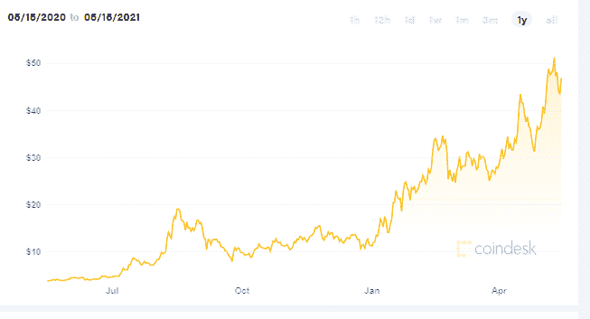

# 作为一种投资选择，林吉特怎么样

> 原文：<https://medium.com/coinmonks/how-is-link-as-an-investment-option-c2b849e49aa9?source=collection_archive---------4----------------------->

要投资 Chainlink，你可能会得到很多建议。如果你还不知道它是关于什么的，Chainlink 是一个去中心化的网络，它从链外来源向智能合约提供真实世界的数据。在我们开始分析 Chainlink 之前，简要检查一下 Chainlink 在加密货币生态系统中的位置会有所帮助。加入 Chainlink 网络所需的只是一个数据馈送或一个 API，并将这些数据提供给智能合约。

在 Chainlink 出现之前，分散式应用程序面临着一个令人头疼的问题——它们无法与区块链空间之外的数据进行交互。Chainlink 推出了区块链甲骨文，也称为节点，可以将链外数据传输到区块链，促进了一系列用例的使用，否则是不可能的。该协议的核心是链接加密货币，用于支付网络服务。

## **链接作为投资选项**

如果你想买链条，这里有一些你想知道的东西。林克在 2020 年稳步上升，今年也在继续前进。2020 年 5 月中旬，LINK 报时不到 4 美元；仅仅一年后，价格徘徊在 50 美元左右！通俗地说，就是 12 倍的增长，也就是说，如果有人在去年 5 月投资 1000 美元，现在就会变成 12000 美元。

这是一张来自 Coindesk 的图表，显示了加密货币的指数增长。

【https://www.coindesk.com/price/chainlink】【来源:

*作为增长最快的数字货币之一，LINK 自 2014 年成立以来取得了巨大的飞跃。毫不奇怪，有很多叫嚣贸易链在印度。*

## ***链环增长背后的因素***

*[Chainlink](https://chain.link/) 建立在坚实的基础上，填补了加密生态系统中的一个关键缺口。*

*诞生五年后，当谷歌(新闻-警报)云向世界展示他们的技术力量时，Chainlink 引起了人们的注意。2020 年，Chainlink 与物联网合同平台 Hdac Technology 合作。*

*2020 年年中，世界经济论坛授予 Chainlink 技术先锋。同年，当 Chainlink 从康奈尔大学收购 DECO 时，它再次增加了周围的积极影响，这种影响一直持续到 2021 年。目前，Chainlink 正在与全球几家大型组织合作。*

## ***2020 年链接***

*2020 年，第五名的争夺将在比特币现金(BCH)、比特币 SV (BSV)、莱特币(LTC)、卡尔达诺(ADA)和 LINK 之间展开，尽管后者在年初远远落后于其他数字硬币。然而，在强大基础的支持下，联系汇率全年持续上升，击败了上述货币和许多其他货币。*

*2020 年是去中心化财政年。任何 DeFi 应用程序都不能孤立工作。相反，所有这些应用程序都需要可靠、安全的分散式数据馈送才能正常运行。在 Chainlink 获得动力之前，这种供给的缺乏导致了如此多的失败。DeFi 空间的增长是 Chainlink 急剧增长背后的一个主要因素。*

## ***2021 年上半年链环收益***

*到 2020 年底，LINK 的价格略高于 10 美元。截至 3 月底，它几乎触及 30 美元的事实表明，加密货币几乎是垂直攀升的。它确实在这里或那里有一些修正，但总体而言，它稳步继续上升，在 5 月 2 日创下 51.17 美元的新高。*

## ***链环前的比赛***

*Chainlink 不是唯一的甲骨文公司，但它已经成功地领先于竞争对手。有 Band Protocol、Bridge、JustLink 等竞争对手，但 Chainlink 与这些项目差距巨大。每次出现一个项目，都会有人谈论 Chainlink 面临的新挑战，但最终，这个挑战不了了之。*

*由于 Chainlink token (LINK)是一种著名的 DeFi 加密货币，其估值已经超过比特币 SV，因此该加密货币在许多加密货币交易所上市，可以使用其他加密货币(如 BTC、瑞士法郎和 USDT)购买，在某些罕见的情况下，也可以使用法定货币(如美元)购买。印度有许多本地加密货币交易所在其平台上列出 Chainlink token，并可以使用其他加密货币进行收购。 [**BuyUcoin**](http://www.buyucoin.com) 是最好的加密货币交易平台之一，为用户提供多种加密货币可供选择，并提供最低的交易费用，以鼓励用户从加密货币市场中受益。*

*在[**chain link trading**](https://www.buyucoin.com/buy-chainlink-india)中一致的暴涨模式可以归功于它在其他 oracles 之间高耸的存在，而且它还将继续下去。*

## ***未来会发生什么***

*任何加密货币的价格在很大程度上取决于市场情绪。这是林克有大量支持的地方。链接爱好者正在全力支持它，他们准备在未来几天推动硬币前进。Chainlink 2.0 更新也发生在 2021 年 4 月，产生了大量积极的情绪，并可能在未来几个月保持不变。*

## ***总结***

*作为投资者，在正确的时机购买资产对于确保利润最大化至关重要。考虑到世界各地对 LINK 的强烈情绪，投资硬币肯定会给你带来丰厚的回报。当谈到 Chainlink 的[交易时，最好回忆一下它是一种基本面强劲的数字货币，将在未来几天创下新高。](https://www.buyucoin.com/buy-chainlink-india)*

***还有，读***

*   *[如何使用 VRF 在以太坊上生成随机数](https://blog.coincodecap.com/how-to-generate-random-numbers-on-ethereum-using-vrf)*
*   *[1xBit 评论 2021](https://blog.coincodecap.com/1xbit-review) | [MXC 交易所评论](https://blog.coincodecap.com/mxc-exchange-review)*