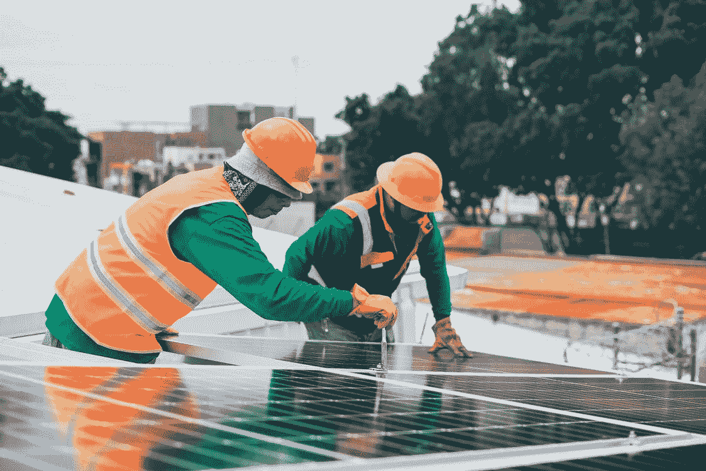

# 利用太阳能开采比特币的倡议如何？

> 原文：<https://medium.com/coinmonks/how-is-the-initiative-to-mine-bitcoin-with-solar-energy-7c75f42abac5?source=collection_archive---------16----------------------->

加拿大公司 Blockstream 与 Twitter 首席执行官杰克·多西的公司 Square 合作，创建了一个可再生能源开采中心

pexels.com

今年 5 月，电动和半自动驾驶汽车公司特斯拉的首席执行官埃隆·马斯克(Elon Musk)宣布，由于对环境的担忧，它将不再接受加密货币比特币(BTC)作为支付形式。

“特斯拉已经暂停向 BTC 购买汽车。我们对比特币开采和交易中化石燃料的使用迅速增加感到担忧，特别是碳排放，这是所有燃料中排放最严重的，”马斯克通过推特在一条消息中表示。

因此，在区块链保持这种加密货币在线需要很多能源。这种活动叫做采矿。

根据剑桥大学研究人员编制的剑桥比特币电力消耗剑桥电力消耗指数(CBECI)，今年 BTC 开采过程(或加密货币开采)消耗的总能量可能达到 128 TWh(太瓦时)。这相当于全球发电量的 0.6%，或者说超过了荷兰的总消费量。

在这方面，不同的公司正在寻找方法继续开采 BTC，同时消除或减少碳足迹。这就是由亚当·贝克领导的专注于区块链技术的加拿大公司 Blockstream 的例子。

该公司表示，他们将开发和管理零排放的 BTC 采矿设施，以最大限度地减少 BTC 采矿造成的环境破坏。

但他们不会单独行动。Blockstream 今年宣布与杰克·多西金融服务巨头 Square 合作。他们一起计划在加拿大在美国的一个采矿点建立一个太阳能开源 BTC 采矿设施。

事实上，他们计划通过分享该项目的经济细节和从建设一个由可再生能源供电的 BTC 煤矿中获得的知识来提供公共透明度。该项目旨在提高人们的意识，并展示开采这种加密货币和可再生能源如何有助于推动向清洁能源的过渡。

“世界各地的许多采矿作业，包括我们的采矿作业，已经依赖于可再生能源，因为这是最具成本效益的可用能源。与 Square 一起，我们希望该项目的开放和透明性质将成为其他公司可以借鉴的模式，”Blockstream 首席信息官兼首席矿业官克里斯·库克(Chris Cook)表示。

他继续说，“我们希望证明现实世界的可再生采矿设施不仅是可能的，而且从经验上证明比特币加速了世界走向可持续的未来。”

太阳能采矿项目还设计为可扩展，允许 Blockstream 增加额外的容量，并帮助更多公司在未来大幅扩展可再生采矿业务。

除了提供有关该项目的经济性的定期报告，Blockstream 还在构建一个可免费访问的仪表板，显示项目绩效的实时指标，包括能源生产和 BTC 开采。

*   [投资印度的最佳密码](https://blog.coincodecap.com/best-crypto-to-invest-in-india-in-2021) | [HitBTC 评论](/coinmonks/hitbtc-review-c5143c5d53c2)
*   [加拿大最好的加密交易机器人](https://blog.coincodecap.com/5-best-crypto-trading-bots-in-canada) | [赌注加密](https://blog.coincodecap.com/staking-crypto)
*   [如何在印度购买比特币？](/coinmonks/buy-bitcoin-in-india-feb50ddfef94) | [WazirX 评论](/coinmonks/wazirx-review-5c811b074f5b)
*   [如何在 WazirX 上购买柴犬(SHIB)币？](https://blog.coincodecap.com/buy-shiba-wazirx)
*   [比特币主根](https://blog.coincodecap.com/bitcoin-taproot) | [Bitso 点评](https://blog.coincodecap.com/bitso-review) | [排名前 6 的比特币信用卡](/coinmonks/bitcoin-credit-card-bc8ab6f377c6)
*   [最佳免费加密信号](https://blog.coincodecap.com/free-crypto-signals) | [YoBit 评论](/coinmonks/yobit-review-175464162c62) | [Bitbns 评论](/coinmonks/bitbns-review-38256a07e161)
*   [huo bi 的加密交易信号](https://blog.coincodecap.com/huobi-crypto-trading-signals) | [BitMEX 评论](https://blog.coincodecap.com/bitmex-review)