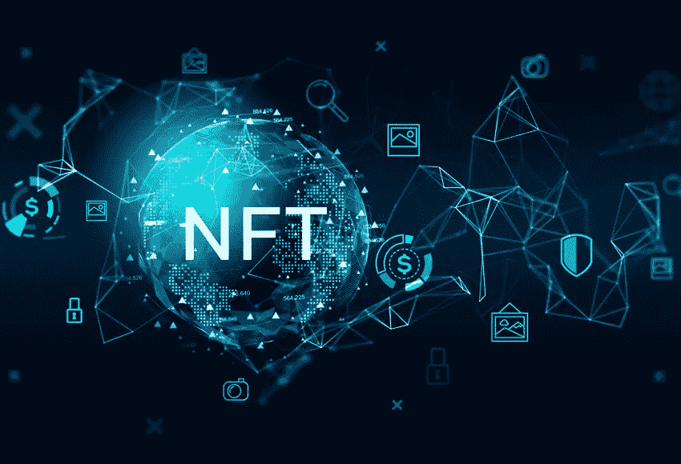

# 如何简化 NFT 元数据的验证？

> 原文：<https://medium.com/coinmonks/how-is-the-verification-of-nft-metadata-made-easy-cf43353c31e7?source=collection_archive---------2----------------------->

# Adobe 支持 NFT 元数据验证

跨国软件巨头 Adobe 与领先的不可替代令牌(NFT)市场合作。这个想法是给收藏家一种方法来验证数字艺术作品的真实性。该公司于 10 月 26 日宣布与 Rarible、OpenSea、SuperRare 和…