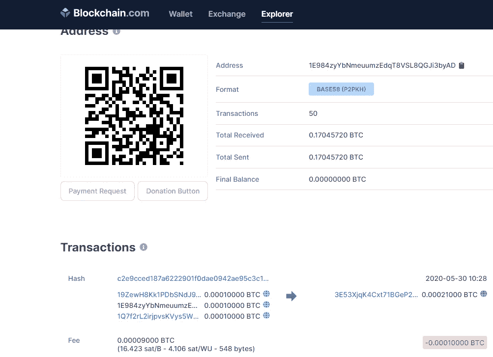

# 有人能猜出你的比特币私钥的可能性有多大？

> 原文：<https://medium.com/coinmonks/how-likely-is-it-that-someone-could-guess-your-bitcoin-private-key-6c0edd56fa1f?source=collection_archive---------0----------------------->

## 总之，可能性极小。

⁶⁰有两个可能的比特币地址。是的，这是很多。准确地说是 1461501637330902918203684832716283019655932542976…

因此，如果你想得到保证，你不需要恐慌出售你珍贵的 HODL 版比特币，那么我可以告诉你“Hakuna Matata”。没必要担心。

我发现[比特币维基](https://en.bitcoin.it/wiki/Technical_background_of_version_1_Bitcoin_addresses)上关于哈希碰撞(不)可能性的答案不太令人满意…

> 因为可能的地址空间是如此之大，很有可能地球会在接下来的 5 秒内毁灭，而不是在接下来的一千年内发生碰撞。

大数字令人着迷，但肯定有更好的方法来量化有人会随机猜测你的比特币私钥的风险。毕竟，计算能力呈指数级增长，所以假设这在可预见的未来不会发生真的正确吗？

**“比特币地址比宇宙中的原子还多。”**

在可观测的宇宙中，估计有 100 个 10⁸原子.这包括 465 亿光年半径内的所有星系和黑洞。尽管比特币地址比宇宙中的原子还多听起来似乎有道理，毕竟 2 ⁶⁰听起来比 10⁸大，但这种说法实际上是非常错误的。这只是说明了人类大脑在想象大量数字方面有多糟糕。

当写出 10⁸时，它变得更加明显

10,000,000,000,000,000,000,000,000,000,000,000,000,000,000,000,000,000,000,000,000,000,000,000,000,000,000,000

比特币地址比宇宙中的原子少~ 6.8 *10。但是很难想象会少多少。写完整了，可能会变得更清楚一点:6842277657836020854119773355907794。但是面对现实吧，大数字很难想象。

为了避免在比较大的数字时被欺骗，在同一个基础上表达它们是有帮助的:2 ⁶⁰ =10^(log2)*160 ~10⁴⁸.将比特币地址的数量与宇宙的大小进行比较，并不能真正有助于理解二号⁶⁰到底有多大。

**让我们想象一堆沙子……准确地说是两个⁶⁰颗粒**

出于论证的目的，另一个流行的说法“比特币地址比地球上的沙粒还要多”确实是对的。据估计，地球上有大约 9.2*10 ⁸的 2⁶沙粒，所以每一粒沙子就有大约 1.5*10 ⁹的 2⁹⁷比特币地址。这并没有让想象变得更容易，不是吗？让我们换一种方式试试。

想象你走在美丽的海滩上，看着那些沙粒。现在想象整个海岸线上所有的沙粒，甚至是你能看到的水下的沙粒。这跟我们要去的地方差远了。想象你从你所站的地方缩小，想象这个国家、这个大陆乃至整个地球上所有海滩的沙子。

现在把所有这些沙粒排成一条无尽的线，想象每一粒沙粒都是一个拥有相同数量沙粒的全新的地球。由于地球的半径为 6371 千米，这一行将有 3.1*10 光年长。可观测宇宙的直径为 930 亿光年，因此这一排地球将延伸到可观测宇宙整个直径的 335 亿倍。

我们接近了吗？不完全是…我们现在已经到了 2⁶ * 2⁶ = 2 ⁶.这些沙子仍然只是现存比特币地址数量的 0.000000058%。剩余部分为 2 个⁴的因数(2 个⁶*2 ⁴ = 2 个⁶⁰).这相当于两个⁷地球(131，072)长的正方形的面积。这大约是地球和太阳之间距离的 11 倍。

所以我们有它。可能的比特币地址数量相当于 131，072 x 131，072 个相邻地球的正方形中的沙粒数量。这个正方形的一条边相当于地球到太阳距离的 11 倍。然后将这个正方形的地球一个接一个地堆叠起来，达到整个可观测宇宙长度的 335 亿倍。这是我能想到的最接近于如何想象大量可能的比特币地址的方式。

我不知道你怎么想，但是我真的很喜欢想象⁶⁰到底有多大。也许是因为我喜欢在沙滩上度过时光…


**你的比特币地址有多安全？**

有人发现装有比特币的钱包的私钥的风险主要取决于两件事:有多少装有比特币的钱包，以及在合理的时间内可以产生多少钱包。

据报道，2020 年 2 月，有 615，463，205 个余额不为零的比特币地址。由于总共只有 2100 万个比特币，每个都由 10⁸聪组成，因此可以同时包含任何比特币的地址的绝对最大值是 2.1*10 ⁵.这比目前使用的地址多 2900 万倍。

为了便于讨论，让我们假设这种最坏的情况。每个包含 1 个 satoshi 的比特币地址的最大可能数量是 2.1*10 ⁵.这比地球上沙子的数量少 4392 倍。

由于地球的表面积是 5.1 亿平方公里，1/4392 就是 116，120 平方公里。这大约相当于希腊的表面积(131，057 平方公里)

因此，在完美分布的情况下，找到一个有 1 个 satoshi 的比特币地址的概率，将相当于在地球的巨大光束中的其中一个地球上的希腊沙子的数量，该光束延伸了 335 亿倍的可观测宇宙。

现在，由于你可能只有 1 或 2 个数量可观的比特币地址，有人随机猜测你地址的私钥的可能性，就相当于找到 1 粒特定的沙子。

极不可能。

但是等等，还有摩尔！

好吧，烂笑话。但我真的想知道，随着我们现在拥有的计算能力呈指数级增长，我们真的有多安全，不会被某个人偶然绊倒在你独特的沙粒上？

整个 BTC 网络的总哈希速率现在为 144 EH/s = 144*10⁶ TH/s = 144*10 ⁸ H/s。让我们假设这是生成和检查比特币地址是否有余额的速率。实际上这要慢得多，因为比特币使用双重哈希，检查余额也需要一些时间。但无论如何，让我们看看这会把我们带到哪里。

计算包含比特币的地址中任何搜索生成的关键字的概率的方法是，假设我们有一大桶带有白色和黑色颗粒的沙子。每个白色颗粒代表一个平衡的地址(最大 2.1*10 ⁵)，每个黑色颗粒代表一个可能的地址(2 ⁶⁰).

让我们计算一下，要找到至少一粒白色的沙子，需要多少次尝试才会有 10%的变化(用天平称)。这可以表示为:

找到至少一个白色颗粒的概率
= 1-(找到一个黑色 grain)^(number 尝试的概率)

找到一个黑粒的概率
= 1-#个非零余额的地址/ #个最大地址数
= 1- (2.1*10 个⁵ / 2 个⁶⁰)
= 0.999999999999999999999999999999986

10%的发现白色颗粒的概率意味着(发现黑色 grain)^(number 尝试的概率)= 0.9

尝试次数= log(0.9)/log(0.99999999999999999999999999999999999999986)= 7.52575 e+31

假设世界上所有的比特币矿工都开始以 144 * 10⁸/秒的哈希速率生成地址，那么用 1 个 satoshi 找到 1 个地址的概率为 10%,大约需要 **16572 年**。

使用同样的原理，找到一个特定地址的密钥需要更长的时间。有 10%的机会找到一把特定的钥匙需要 48820 亿亿亿年的时间。


摩尔定律表明计算能力每 18 个月翻一番。最快的矿工目前的哈希速率约为 100TH/s。让我们假设哈希速率在未来 10 年内再增加 100 倍，达到 10000 TH/s。现在让我们假设人口增长到 100 亿，我们给每个人 1000 个这样的矿工。这将使全局哈希表达到大约 10 ⁹小时/秒

用 1 个 satoshi 找到 1 个地址需要多长时间？

10%的可能性找到至少一个地址需要大约 12 分钟
90%的可能性找到至少一个地址需要大约 4.5 小时

好了，我们做到了。但是这最后一种情况不会很快发生。目前所有比特币矿工的电力计算机加起来相当于 7 座核电站的电力。假设 hashrate 的能源效率提高了 1000 倍，上述场景仍然需要大约 480 万个核电厂，每个发电 1 GW。

此外，如果这成为现实，使用不同的哈希函数将比特币绑定到增强的协议会容易得多，例如将比特币绑定到 2 ⁵⁶ …

**随机有多随机？**

我需要提到的一个主要考虑是随机的随机性。如果用于导出比特币地址的私钥不是完全随机的，而是仅覆盖了 2 个⁶⁰可能组合的一个子集，那么冲突的概率将显著增加。显然，像 sha-256(比特币)这样简单的密码很容易找到。

为了说明这一点，你可以试试。

```
from hashlib import sha256
passphrase = 'bitcoin'
sha256(passphrase.encode('utf-8')).hexdigest()>>>6b88c087247aa2f07ee1c5956b8e1a9f4c7f892a70e324f1bb3d161e05ca107b
```

如果你[从这个私钥生成](https://www.bitaddress.org/)一个比特币地址，你会得到地址 1e 984 zyybnmeumzedqt 8 vs l8 qgji 3 byad…是的，这个地址是空的，但它在过去被使用过，我们都可以访问它。



screenshot from blockcahin.com showing the address 1E984zyYbNmeuumzEdqT8VSL8QGJi3byAD has indeed a balance

## **结论**

比特币的加密技术非常强大。你可以放心，如果你的比特币存储在一个安全的硬件钱包里，通过随机猜测你的私钥被盗的可能性接近于零。

接近…但不是绝对零度。

问题还在于随机有多随机，所以也许不是所有 2 ⁶⁰地址空间中的地址都可以由当前的软件生成。

如果你有大量的比特币，我会考虑把它分散到多个有独立私钥的钱包里。

你永远不知道…

HODL 快乐。

注意——如果你发现任何错误，请在评论中分享，我很乐意纠正它们。如果你想自己尝试计算，我用了这个在线计算器。

[](https://en.bitcoin.it/wiki/Technical_background_of_version_1_Bitcoin_addresses) [## 版本 1 比特币地址的技术背景

### 这篇文章对一些用户来说可能太专业了。关于比特币地址的更基础的文章可能更合适…

en .比特币. it](https://en.bitcoin.it/wiki/Technical_background_of_version_1_Bitcoin_addresses) 

> 加入 Coinmonks [电报频道](https://t.me/coincodecap)和 [Youtube 频道](https://www.youtube.com/c/coinmonks/videos)获取每日[加密新闻](http://coincodecap.com/)

## 另外，阅读

*   [复制交易](/coinmonks/top-10-crypto-copy-trading-platforms-for-beginners-d0c37c7d698c) | [加密税务软件](/coinmonks/crypto-tax-software-ed4b4810e338)
*   [网格交易](https://coincodecap.com/grid-trading) | [加密硬件钱包](/coinmonks/the-best-cryptocurrency-hardware-wallets-of-2020-e28b1c124069)
*   [密码电报信号](http://Top 4 Telegram Channels for Crypto Traders) | [密码交易机器人](/coinmonks/crypto-trading-bot-c2ffce8acb2a)
*   [币安交易机器人](/coinmonks/binance-trading-bots-d0d57bb62c4c) | [OKEx 评论](/coinmonks/okex-review-6b369304110f) | [Atani 评论](https://coincodecap.com/atani-review)
*   [最佳加密交易信号电报](/coinmonks/best-crypto-signals-telegram-5785cdbc4b2b) | [MoonXBT 评论](/coinmonks/moonxbt-review-6e4ab26d037)
*   [如何在 Bitbns 上购买柴犬(SHIB)币？](https://coincodecap.com/buy-shiba-bitbns) | [买弗洛基](https://coincodecap.com/buy-floki-inu-token)
*   [CoinFLEX 评论](https://coincodecap.com/coinflex-review) | [AEX 交易所评论](https://coincodecap.com/aex-exchange-review) | [UPbit 评论](https://coincodecap.com/upbit-review)
*   [十大最佳加密货币博客](https://coincodecap.com/best-cryptocurrency-blogs) | [YouHodler 评论](https://coincodecap.com/youhodler-review)
*   [最佳加密交易所](/coinmonks/crypto-exchange-dd2f9d6f3769) | [印度最佳加密交易所](/coinmonks/bitcoin-exchange-in-india-7f1fe79715c9)
*   [开发人员的最佳加密 API](/coinmonks/best-crypto-apis-for-developers-5efe3a597a9f)
*   最佳[密码借贷平台](/coinmonks/top-5-crypto-lending-platforms-in-2020-that-you-need-to-know-a1b675cec3fa)
*   [免费加密信号](/coinmonks/free-crypto-signals-48b25e61a8da) | [加密交易机器人](/coinmonks/crypto-trading-bot-c2ffce8acb2a)
*   杠杆代币的终极指南