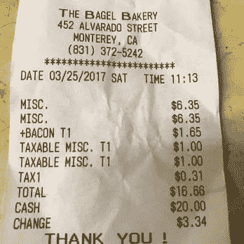
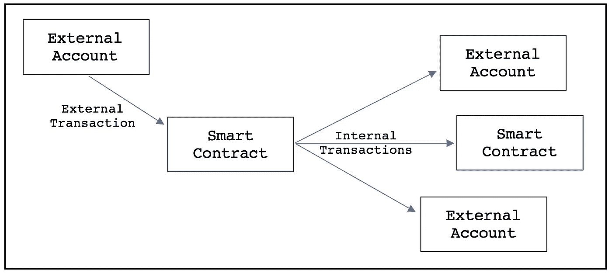

# 你有多少 ERC20 代币？

> 原文：<https://medium.com/coinmonks/how-many-tokens-do-you-have-eae7233676f1?source=collection_archive---------2----------------------->

我最近参加了一个关于为什么从以太坊区块链获得 ERC20 代币余额(和其他数据)如此困难的讨论。我想我应该试着回答这个问题。

我认为可以归结为四个词:“引入”、“内部”、“交易”……和“去中心化”我将分别关注每个单词。

## 交易

我先从最简单的词说起:“交易。”

A Receipt for Bagels

走进一家百吉饼店。买一打百吉饼，要一张收据。关于您的交易，您需要知道的一切都在收据上。`Date`、`amount`、`sender` ( `from`)、`recipient` ( `to`)。这是你会在每一笔以太坊交易中发现的相同信息。

从你(花钱的人)的角度来看，支出代表支出的钱。从百吉饼店的角度来看，交易是收入，这导致了我们清单上的下一个词…

## 新任的

如果你是事务的`sender`，你知道你发送了它。你打开钱包，把钱拿出来，交给店主。记录花费很容易。你要做的就是记住你做了什么。但是如何记录收入呢？

我听到你说，“那容易吗？”百吉饼店简单地使用收银机。听起来很简单。但是现在我们碰到了下一个词…

## 内部的

每笔以太坊交易都是由外部账户发起的。外部帐户位于区块链之外*。事务或者由人发起，或者由人运行的软件发起。如果你用过区块链，你会对这些很熟悉。*

从来没有过(以后还会有吗？)从区块链内部发起的交易*。这非常有意义——交易需要带有私钥的签名。区块链里没有私人钥匙。如果有，因为区块链是开放的，我会看到它，并在一秒钟内偷走你所有的钱。*

所以，要区分“外部”和“内部”交易。“内部”交易是“外部”交易的后续交易。换句话说，只有智能合约可以启动“内部”交易。

以太坊区块链上的大多数交易包括一个外部账户向另一个外部账户汇款(或发送消息)。

许多其他交易(也包括外部交易)从外部帐户发送到智能合约。当您想到被散列到一个块中的事务时，您想到的是外部事务。

内部交易是一种价值转移(或消息调用),它是智能合约调用或向其他帐户汇款的结果。

正如我们前面看到的，跟踪内部事务的“发送”端很简单。智能协定本身在生成调用时，可以简单地发出一个事件。这将提醒发送方和接收方发生了一些事情(例如，发生了令牌转移或令牌铸造)。几乎所有 ERC20 令牌合同都是这样工作的。当有人购买代币或转移代币时，除了在智能合约的余额映射中记录该事实之外，智能合约还会发出一个事件。我说“大多数”令牌合约都是这样工作的，因为在铸造令牌时，ERC20 标准中没有硬性要求。

这是说明书中的一段引文:

> 创建新令牌的令牌协定应在创建令牌时触发 from 地址设置为 0x0 的传输事件。

在 EIP 语中，“应该”的意思是合同不必遵守。在这里，您应该能够看到为什么很难准确计算任意 ERC20 令牌的原因之一。

有时，当 ERC 20 代币合约铸造新代币时，它**不会**产生事件。在早期的 ERC20 代币合约中，这种情况更有可能发生，但今天仍然如此。

即使智能合约确实生成了铸造事件，也没有这样做的标准方法。一些智能合约生成一个`Transfer`事件，其中`from`参数被设置为`0x0`，这是它们应该的。其他人都有自己的`Mint`事件。还有一些在造币厂根本不产生任何事件。

事实上，没有针对 mint 事件的硬性标准，这使得以编程方式考虑每个接收到的令牌变得不可能。这在空投的情况下变得尤其严重，许多空投会产生数千(数百万？)的令牌。通常，它们不会为每个生成的令牌生成单独的事件。这就好像钱神奇地出现在你的钱包或百吉饼店的现金抽屉里。

从技术上讲，ERC20 令牌造币厂不是“内部传入交易”——没有实际发送或调用到接收者——但内部传入交易可以具有相同的效果。如果事件不是由调用约定生成的，并且在许多情况下，即使交换了值也不会生成事件，则接收帐户可以被授予对某个值的所有权，而不会被告知。

如果智能合约不为价值转移生成事件，接收地址就无法在不查看每笔交易的情况下了解这些事件。观察每一笔交易，寻找感兴趣的交易，是相当困难的。(参见我的文章，[《痕迹数据问题](/@tjayrush/the-trace-data-problem-d16b2e84fe40)》了解一些来龙去脉。)

如果一个人希望保持真正的分析能力(出于某种原因，我希望如此，但我不知道为什么)，他必须重放每个跟踪(跟踪几乎与内部事务相同)。为了知道一个未知的智能合约授予你的帐户对某些东西的所有权，你必须时刻保持警惕。

有点可笑。我知道！

在这篇文章长篇大论之前，我先说最后一个词…

## 分散

从以太坊获取完整准确的特定账户交易列表(以及代币余额)非常困难。也很慢。事实上，它太慢了，几乎无法使用。人们不能简单地在每次希望考虑不同的地址时重放整个链。有一些解决方案，但没有一个是好的。

两个最显而易见的解决方案是:(1)制作包括所有踪迹的区块链数据的副本，并构建一个巨大的数据库索引，或者(2)将数据保存在节点上，不要复制它，并找出一些方法使扫描链变得容易接受。(这就是 QuickBlocks 的作用。它没有数据库索引快，但比整个链的原始扫描快，并且比复制数据和创建索引小得多。)

如果你选择第一条路，你几乎肯定会被迫使用某种巨大的云计算机。仅索引一项就有数十亿字节。而且随着时间的推移只会越来越大(你能说是分片吗？).更糟糕的是，您必须存储重复的数据，此外，您存储的 99%的数据永远不会被使用。你负责具体的账户，而不是整个链条。最有可能的是，您的客户只对他们账户中的数据感兴趣。

如果这还不够糟糕的话，一旦分片发生,“区块链的复制副本”解决方案就要倒霉了。如果数据大小在分片前是`X`，那么在分片后将是`100 * X`。如果选择第一条路，唯一可行的解决方案是将数据集中起来，并尝试出售(直接通过 API 或通过广告)。

Web 2.0 已死。Web 2.0 万岁。我只需要出示以太扫描作为我的第一个证据来支持这种说法。

相反，如果选择第二条路，并试图更快地访问节点存储的数据，从而使您的解决方案保持分散，您会很快意识到代码*实际上希望*是开源的。如果你想让你的代码保持封闭源码，为什么不完全集中呢？这条路要简单得多，而且数据传输速度也快得多。

## 我没有词了

我很饿，而且我几乎没有什么可说的了，所以我将以最后一个想法来结束。开发人员面临一个难题:要么去中心化，被迫开源你的代码，要么去中心化，这样就消除了我们所有人参与其中的原因。我认为，这就是为什么目前没有可行的解决方案。没有吸引人的前进道路。

我现在已经正式无话可说了。如果你已经走了这么远，我想你会很高兴的。我再说三个字…

## 支持我的工作

我们对你的想法很感兴趣。请为我们鼓掌，并在下面发表您的评论。考虑支持我们的工作。给我们发个小(或大)投稿到 0xb 97073 b 754660 bb 356 dfe 12 f 78 AE 366d 77 DBC 80 f。

**Thomas Jay Rush** 拥有软件公司 QuickBlocks，其主要项目也被称为 QuickBlocks，这是一个软件库和应用程序的集合，能够对以太坊区块链进行实时、逐块的智能合同监控和分析。通过[网站](http://www.quickblocks.io)联系他。