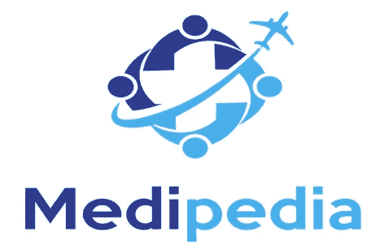
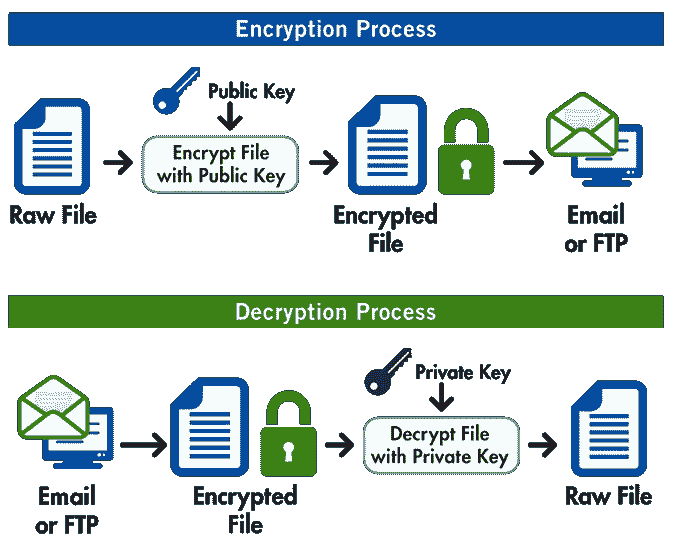

# Medipedia 如何用 IPFS 和 Openpgp 在区块链中安全存储数据？

> 原文：<https://medium.com/coinmonks/how-medipedia-securely-stores-data-in-blockchain-with-ipfs-and-openpgp-864dad0d377b?source=collection_archive---------8----------------------->



Medipedia 是一个基于以太坊区块链的分散平台，患者可以在这里搜索关于各种医疗服务提供商的完整而准确的信息。这个平台还可以帮助医疗机构和医院与患者建立联系。Medipedia 平台在协议实验室创建的[**【IPFS】**](https://ipfs.io/)(**星际文件系统**)中存储医疗和健康相关信息。

在 Medipedia 平台上搜索合适的医疗服务提供商需要创建一个消息请求，平台会将该请求发送给所有匹配的服务提供商。服务提供商可以稍后回复消息请求。每个消息请求及其回复都存储在 IPFS，IPFS 生成一个散列，最后在区块链以太坊更新。

但是，这种方法有一个安全和隐私漏洞，很容易被攻破。如果信息在没有加密的情况下存储到 IPFS，并且生成的哈希值直接更新到区块链，那么具有相同 IPFS 哈希值的人可以很容易地从 IFPS 检索所有信息。因此，我们需要 Medipedia 提供分散的端到端加密消息平台，以便只有授权和指定的人才能访问信息。

# 如何在存储到 IPFS 之前保护邮件？

最重要的是通过让恶意用户无法阅读来维护消息的隐私。因此，我们将使用非对称加密在客户端用消息接收者的公钥加密消息。当加密的信息通过网络传递到 IPFS 存储时，入侵者将无法截获它是什么类型的数据。

我们将有一个足够简单的实现来理解信息在发送到 IPFS 之前如何加密。实现还将提到如何只有被授权的人才能解密信息。我们将使用一个开源库 [OpenPGP.js](https://openpgpjs.org/) 来实现。

确保通过运行以下命令将 OpenPGP 和 nano-ipfs-store 库安装到您的项目中。

```
npm install — save openpgp
npm install - save nano-ipfs-store
```

## PGP 加密和解密是如何工作的？



How PGP Encryption/Decryption works?

## 生成公钥和私钥

将分别为患者和医疗提供者生成私钥和公钥。这些密钥将用于加密和解密患者和医疗提供者之间传递的消息。

下面的代码片段为这两种类型的用户创建了选项数据，其中我们需要添加 **userIds** 详细信息，如用户名和电子邮件 id、 [**curve** as "ed25519"](http://ed25519.cr.yp.to/) ，它根据有限域上椭圆曲线的代数结构来配置公钥加密强度的方法。以及用户指定的**密码**来锁定私钥。

```
let optionsPatient = {**userIds**: [{ username:'patient0001', email:'johndoe@medipedia.com' }],**curve**: "ed25519",**passphrase: 'super long and hard to guess secret'**};let optionsProvider = {**userIds**: [{ username:'medicalProvider', email:'medicalprovider@medipedia.com' }],**curve**: "ed25519",**passphrase: 'super long and hard to guess secret of provider'**};
```

下一步是生成公钥和私钥。

```
let patient = { privateKey: '', publicKey: ''};let medicalProvider = { privateKey: '', publicKey: ''};let patientKeys = openpgp.generateKey(optionsPatient).then(function(key) { patient.privateKey = key.privateKeyArmored;patient.publicKey = key.publicKeyArmored; });let medicalProviderKeys = openpgp.generateKey(optionsProvider).then(function(key) { medicalProvider.privateKey = key.privateKeyArmored;medicalProvider.publicKey = key.publicKeyArmored; });
```

下面是需要加密并传递给医疗服务提供商的 JSON 格式的消息。

```
let msgRequest = { "patient_id":"0005", "gender":"female", "age_group":"25-30", "subject":"Enquiry on Lasek treatment", "arrival_from_date":"01-June-2018", "arrival_to_date":"10-June-2018", "estimated_budget":"100000", "currency":"KWR", "sentDate":"31-05-2018", "message_body":"I would like to visit for a treatment on Lasek."};
```

## 加密邮件

一旦生成了公钥和私钥，就用医疗提供者的公钥加密消息，如下面的代码片段中所述。

```
const optionsPatient = { data: JSON.stringify(msgRequest),    publicKeys: openpgp.key.readArmored(medicalProviderPublicKey).keys,  privateKeys: [privKeyObj] }openpgp.encrypt(optionsPatient).then(ciphertext => { encrypted = ciphertext.data    return encrypted})
```

## 加密消息的输出

```
**-----BEGIN PGP MESSAGE-----**Version: OpenPGP.js v3.0.11Comment: https://openpgpjs.orgwV4DbtWUcN6/VG0SAQdAlbkhxk6SWTObXMaLXBozrR7dfbz67otsFepd22x3vW0wcmukCqPlkYuzPVnQlXGvEmHQOXI7sYxZQamPVw1mwdEkBWt48jOiV4tcF3j2GiNF0sEUAdQ+uYy/971E2MPEFrmhAQWq3XeQi/vPky8xozncps2lmknVhTgMty5Rb9v2wT7Z+SX2+YB5WiXSZHCUa4f5SRac6gqG/HVrKKN47lFy61zPNN246QoKxIg+cxj7jW5oxuolUfVTEZ5J2GNF2MWStzOICjS9qqaneBrlgIw5mQtumG4vR0M32NvPs9gWIJSSN1N8hPnttSjv/WJgy1SGy8qhQJxks6QmfyElh0rKOcGPiXFqbNaWzXwDwfe/OKFX+duO/psPSOGSPN/TxpQCBzR5X50ko5m+xOb0AnVYK/YT7c1Z8IW82goqCdotXSBOQXC3uVai00JOMUpZztxOg0lq22Fb+liMaSjYtvYZJLb14HbBxdfWwSeuHS5u4LfJUzXtESvPCZ7l/3VfTYuf4UlOzO3ezGwmlUaMwRJk4Hpd/D5JYHuXQJ/aslKoOL/woo7UgadE5N3L1vpfduGU1xsWTBtDDNuTp5vGsG75on1Gy/WT9YuxucE4gYAwOuGgNHrdHrFl9+uNqWkfR4psFARuXNhmcU23AX+s7zawia8rVHJIFsMUEKyem/p06Mjh++ONmvCURjffk7wJnTOBNH2ZEdkxxcwfSBe3HHoC3z/+mto4=EoJe**-----END PGP MESSAGE-----**
```

## 解密消息

最后，医疗提供者可以使用他的私钥解密消息，如下面的代码片段中所述。在医疗提供者可以解密消息之前，他需要使用他的密码解锁私钥。

```
**// Unlock the private key using passphrase**
const providerPrivKeyObj = openpgp.key.readArmored(medicalProviderPrivateKey).keys[0]await providerPrivKeyObj.decrypt(**providerPassphrase**)**// encrypted : It is the encrypted message**
const optionsProvider = { message: openpgp.message.readArmored(encrypted), publicKeys: openpgp.key.readArmored(medicalProviderPublicKey).keys, privateKeys: [**providerPrivKeyObj**] }openpgp.decrypt(optionsProvider).then(decryptedMessage => { console.log(JSON.parse(decryptedMessage.data)) return decryptedMessage.data})
```

## 解密后的消息输出

如果医疗提供者成功解密了该消息，它将显示如下。

```
{  
   **"patient_id"**:"0005",
   **"gender"**:"female",
   **"age_group"**:"25-30",
   **"subject"**:"Enquiry on Lasek treatment",
   **"arrival_from_date"**:"01-June-2018",
   **"arrival_to_date"**:"10-June-2018",
   **"estimated_budget"**:"100000",
   **"currency"**:"KWR",
   **"sentDate"**:"31-05-2018",
   **"message_body"**:"I would like to visit for a treatment on Lasek."
}
```

## 完整代码示例

下面是完整的代码示例。

## 结论

在将任何信息存储在 IPFS 之前，用接收方的公钥对其进行加密在保护信息方面起着重要作用。一旦信息被加密并存储在 IPFS，就会生成散列。该散列将进一步用于检索加密的消息。并且接收者可以使用它的私钥来解密加密的消息。因此，只有那些实际被指定查看消息的人才能看到消息内容。

有许多方法和库可以用来加密和解密信息。上面的例子中提到了其中一种方法。

在保存用户的公钥和私钥时必须小心。

**注:**非常欢迎编辑和建议。

## 参考

 [## 介绍

### Ed25519 签名是椭圆曲线签名，在设计和实现的几个级别上精心设计…

ed25519.cr.yp.to](http://ed25519.cr.yp.to/) [](/@medipedia01/why-invest-in-medipedia-io-f31de8bc4d08) [## 为什么要投资 Medipedia.io？

### Medipedia.io 是一个利用区块链技术开发数字医疗保健的加密货币项目…

medium.com](/@medipedia01/why-invest-in-medipedia-io-f31de8bc4d08) [](https://www.goanywhere.com/managed-file-transfer/encryption/open-pgp) [## OpenPGP

### GoAnywhere MFT 包括符合 OpenPGP 的加密，以解决数据的隐私性和完整性问题。OpenPGP 是一个…

www.goanywhere.com](https://www.goanywhere.com/managed-file-transfer/encryption/open-pgp) [](https://openpgpjs.org/) [## OpenPGP.js | OpenPGP JavaScript 实现

### OpenPGP.js 项目旨在用 JavaScript 提供一个开源的 OpenPGP 库。

openpgpjs.org](https://openpgpjs.org/)