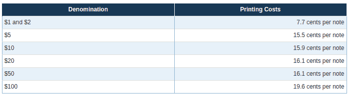
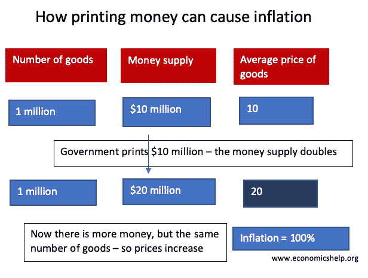
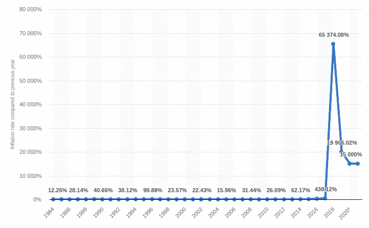
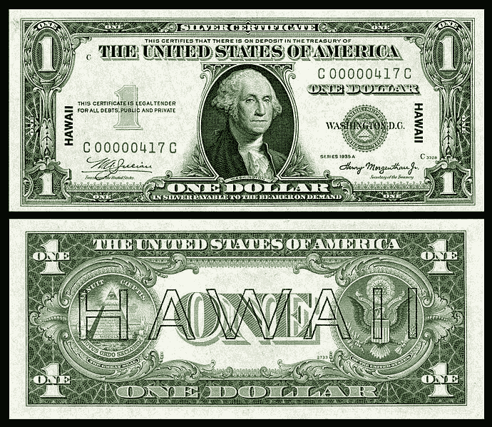
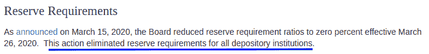
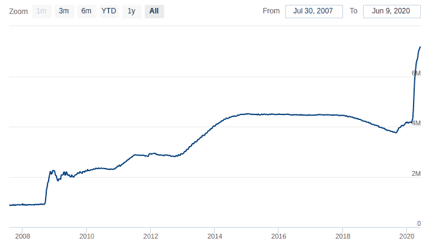
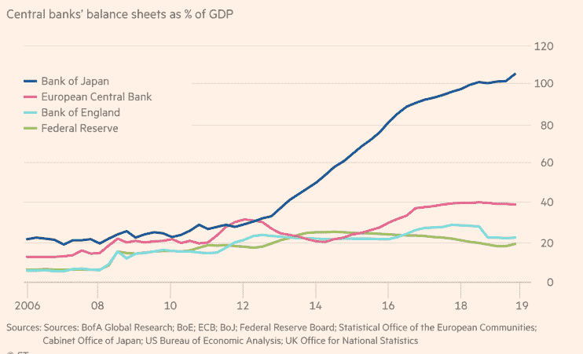
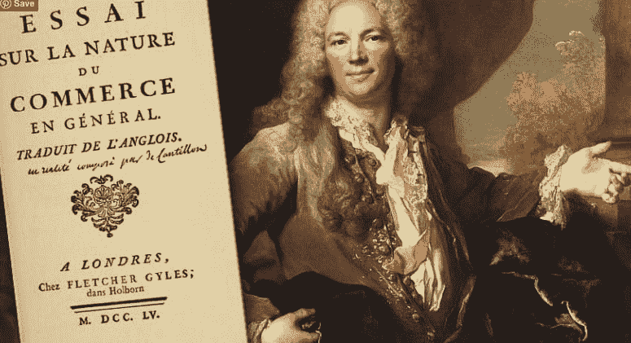

# 货币是如何创造的？

> 原文：<https://medium.com/coinmonks/how-money-is-created-3bb6319dc08a?source=collection_archive---------1----------------------->

## 理解金钱及其运作方式

> 如果我们没有钱，那要多少啤酒🍻成本？

2020 年第二季度，[美联储银行](https://www.federalreserve.gov/)向经济注入了超过 3 万亿美元。

那么这些钱从哪里来，又是谁创造的呢？在这篇文章中，解释货币是如何创造的，谁创造了它，以及它的影响。

我们将只关注美元，因为它是世界储备货币，影响着所有人，无论国籍如何。

## 货币是如何创造的？

货币主要通过三种方式创造。

*   实物货币(纸币和硬币)
*   私人银行资金(债务)
*   央行货币(量化宽松)

# 第 1 章—实物货币

根据不同的估计，3-8%的实物货币存在于世界上。在美国，目前大约有 1.5 万亿美元的实物货币[在流通](https://www.businessinsider.com/heres-how-much-us-currency-there-is-in-circulation-2018-4?IR=T)。

是的，世界上 90%以上的货币都是以数字形式存在的。

**注**——认为比特币只存在于互联网上，背后什么都没有的人，应该考虑到 90%以上的货币已经只以数字形式存在了。

## 谁印刷实物货币？

政府应美联储的要求印刷实物货币(硬币或纸币)。美联储预计需求，每年都会订购新的实物货币。

印刷钞票的成本通常低于其面值。例如，2020 年印刷一张 100 美元的钞票只需要 [19.6 美分。货币印刷成本与其面值的差额称为铸币税。](https://www.federalreserve.gov/faqs/currency_12771.htm)

铸币税是政府收入。

[Source](https://www.federalreserve.gov/faqs/currency_12771.htm)

## 那么，为什么政府总是不能印更多的钱呢？

如果允许政客印钞，这将是一场巨大的利益冲突。他们会做出难以想象的竞选承诺，并通过增加货币供应量来实现这些承诺。

膨胀的货币供应也会导致恶性通货膨胀和货币贬值。

[Inflation explained — source](https://www.economicshelp.org/blog/634/economics/the-problem-with-printing-money/)

例如，在 2017 年，委内瑞拉的国家货币[玻利瓦尔在短短五个月内贬值了 90%](https://en.wikipedia.org/wiki/Hyperinflation_in_Venezuela),年通胀率为 14，200%。

[Inflation % in Venezuela over the years](https://www.statista.com/statistics/371895/inflation-rate-in-venezuela/)

## 钱是什么？

金钱是衡量“价值”或“财富”的尺度。它为我们执行 3 个主要任务。

*   价值储存——保存价值创造或财富创造(不包括你的工资)
*   交易媒介——买东西
*   记账单位——使用单一单位衡量不同商品的价值。(例如，亚马逊上的一切都是以美元计价的)

历史上，人类以货币的形式使用珠子、贝壳和许多其他东西。

然而，在近代历史上，金银币被用作[商品货币](https://en.wikipedia.org/wiki/Commodity_money#:~:text=Commodity%20money%20is%20money%20whose,their%20value%20in%20buying%20goods.)。下图是 1878 年首批发行的[银证之一。如果你仔细看，它说](https://en.wikipedia.org/wiki/Silver_certificate_%28United_States%29)

> “兹证明在美国财政部没有存款”
> 
> “一美元的银元凭票支付给持票人”

1 Dollar Silver certificate

美国政府有义务向持有这张纸币的人提供价值 1 美元的白银。美元纸币完全由白银或黄金支持。

同样，为了更高的价值，美国政府也在 1863 年至 1933 年间发行了[金圆券](https://en.wikipedia.org/wiki/Gold_certificate#cite_note-5)。

注:这些证书只是政府保存的实际金银储备的一种表示。

## 金本位

1933 年 6 月 5 日，国会颁布了一项联合决议，取消了债权人要求用黄金支付的权利，美国脱离了金本位制。

> 金本位是一种货币体系，其中货币部分或全部由黄金支持。

在金本位制下，政府无法在不增加黄金储备的情况下增加货币供应量。理论上，这可以抑制政府过度支出和通货膨胀，因为黄金供应量每年只增长 1-2%。

自 1879 年以来，美国一直实行金本位制。

之后，美国政府将黄金价格从 20.67 美元/盎司提高到 35 美元/盎司。美国政府持有 35 美元/盎司直到 1971 年 8 月 15 日。

1971 年，理查德·尼克松总统宣布美国不再以固定价值将美元兑换成黄金，从而彻底放弃金本位制，使美元成为法定货币，从而改变了一切。

菲亚特是一个拉丁词，意思是“让它去做”在 17 世纪 30 年代，英语译者[将](https://www.dictionary.com/e/fiat/#:~:text=The%20origin%20of%20the%20word,light%E2%80%9D%20%28fiat%20lux%29.)翻译为“权威法令”。

> "今天没有任何东西支持美元."

## 概括一下

*   世界上只有 3-8%的钱是实物。
*   政府应美联储的要求印刷实物货币。
*   政府印制货币的好处叫做铸币税
*   美元最初是由黄金支撑的，这就是所谓的金本位制。这意味着纸币是黄金的象征。
*   但是尼克松在 1971 年放弃了，使美元成为法定货币。现在美元没有任何支撑。

# 第 2 章—私人银行资金

如今，私人银行创造了约 97%的货币。是的，不是中央银行，而是私人银行。为了理解私人银行如何创造货币，我们需要了解部分准备金银行(FRB)。

但是我们先来了解一下纸币。

## 钞票(纸币)

第一家开始永久发行纸币的银行是英格兰银行。

1687 年，威廉国王与法国进行了为期九年的战争，这也被称为[威廉国王战争](https://en.wikipedia.org/wiki/King_William%27s_War#:~:text=King%20William%27s%20War%20%281688%E2%80%931697,of%20the%20League%20of%20Augsburg.)或九年战争。然而，战争是昂贵的。因此，1694 年，英国政府以百分之八的利率借了 120 万英镑来建设海军。威廉国王通过提高税收来偿还贷款。

作为回报，贷款人被允许成立一家新公司，英国银行**。皇家特许状于 7 月 27 日通过了 1694 年吨位法案。银行有权吸收公众的黄金存款，并印制“银行券”作为存款收据。**

**这些新的存款然后被借给国王。纸币由存款担保，人们认为它们和黄金一样好，因此这些纸币迅速成为一种普遍接受的新货币。**

**1707 年，新成立的英格兰银行被赋予管理这种货币的责任。然而，银行想流通自己的钞票，因为有更多的利润。这些新钞是以 ***零头*** 货币的形式出现的，它规定了*收取*利息，而不是支付利息。(债务货币的一种物理形式，我们将在本文后面讨论)**

**因此，政府纸币逐渐停止使用，取而代之的是纸币，到 18 世纪中叶，纸币成为英国唯一的纸币。**

## **部分准备金银行制度**

**美国的第一批银行是由各州特许的，不需要保留储备金。到 1820 年，一些纽约和新英格兰银行达成了赎回协议，条件是在各自的金库中保持足够的黄金储备，以保证他们的纸币。1861 年美国内战开始时，大多数州仍然没有准备金要求。**

**1863 年,[国家银行法案](https://en.wikipedia.org/wiki/National_Bank_Act)建立了准备金要求，以确保流动性，即满足客户现金需求的能力，尤其是在金融恐慌时期。19 世纪末和 20 世纪初的几次 T2 银行挤兑事件表明，准备金要求在提供流动性方面作用甚微。私人银行说服政府允许他们合法地创造货币，因此政府外包了货币创造。**

**为了实现这一点，1913 年创立的[美联储系统](https://en.wikipedia.org/wiki/Federal_Reserve)成为了能够满足现金需求的最后贷款人。满足流动性需求的准备金要求消失了。相反，部分准备金要求演变成了美联储体系的货币政策工具。**

> **在部分准备金制度下，银行被允许吸收客户存款，并向借款人发放贷款，同时只持有原始存款的一小部分作为准备金。**

**世界上每个中央银行都制定了自己的准备金要求，决定了商业/私人银行的准备金要求。**

> **消费者存入银行的钱在法律上归银行所有。**

## **债务作为货币**

**那么民营银行是如何创造货币的呢？答案是贷款。我们用一个例子来理解这个。**

**假设你去 A 银行存了 1000 美元。**

**假设目前央行设定的存款准备金率为 10%。在这种情况下，A 银行可以贷出你原始存款价值的 90%，即 900 美元。**

**现在借款人去银行 B 存了 900 美元，然后银行 B 也允许借出 900 美元的 90%，也就是 810 美元，以此类推。**

> **对消费者来说，债务是负债，对银行来说，债务是资产。**

**系统中的每个人都会看到他们账户中的全部金额。例如，你会看到你的账户里有 1000 美元，并被允许提取。这整个系统之所以有效，是因为银行知道，不是所有人都会同时取款。然而，如果出现银行挤兑，美联储总是可以拯救它们。**

> **请记住，在部分准备金银行体系下，只有很小一部分存款被保留下来，以分散给储户。剩下的钱都借出去了。不仅这些银行发放的许多贷款变成了坏账，而且欧元区国家的存款准备金率也只有 1%。如果每 100 欧元中只有 1 欧元被从银行取出，银行储备将会完全耗尽，整个系统将会崩溃。那么，欧盟担心出现大规模银行挤兑，并向塞浦路斯输送了数十亿欧元，这有什么好奇怪的呢？— [罗恩·保罗](https://www.lewrockwell.com/2013/04/ron-paul/the-great-cyprus-bank-robbery/)**

**2020 年 3 月 15 日，美联储取消了存款准备金要求。**

****

**[Source](https://www.federalreserve.gov/monetarypolicy/reservereq.htm)**

**一旦借款人连本带利偿还了原始金额，债务资金就会自动销毁。这个利息就是银行的利润，也是他们的商业模式。**

**但是如果有足够多的人拖欠银行贷款怎么办？2008 年就是这样。**

> **当银行创造一笔贷款时，它不是别人的钱，它是凭空创造出来的，只是通过在电脑上打字。**

## **债务如何帮助经济增长？**

**当银行扩大信贷(制造债务)时，经济中就会有更多的货币，从而提高货币流通速度，推动经济增长。我们用一个例子来理解。**

**比方说，我在银行存了 100 万美元，银行把它借给一个借款人去买新房。这种情况下。**

*   **银行(创造债务货币)**
*   **借款人(带着债务购买新房)**
*   **家庭卖家(现在可以购买经济中的其他东西)**
*   **因此经济增长**

## **银行贪婪并投资于风险更高的资产**

**银行的商业模式是以最低利率获取存款，以最高利率贷出，中间赚取利润。**

> **更多的贷款=更多的利润**

**不动产和财产是传统的贷款抵押品。世界各地的银行都将它们视为创造债务的最安全也是最有利可图的方式，因此在违约的情况下，它们可以接管你的房屋银行。**

## **2008 年房地产泡沫**

**但在 21 世纪初，银行专注于这个单一市场，提供风险更高的贷款，导致了房地产泡沫。这个泡沫是由[抵押贷款支持证券](https://en.wikipedia.org/wiki/Mortgage-backed_security)和[债务抵押债券](https://en.wikipedia.org/wiki/Collateralized_debt_obligation)(CDO)融资的。**

**简单来说，银行是在拿人民的钱赌博，以获得更高的回报。**

**小技术？所以，让玛格特·罗比和赛琳娜·戈麦斯用更简单的形式向你解释一下。**

**玛格特·罗比解释金融**

**赛琳娜·戈麦斯解释金融**

## **概括一下**

*   **私人银行通过部分准备金银行凭空创造货币(债务)**
*   **他们从这些贷款中赚取利息，这是银行的商业模式。**
*   **更多的贷款=更多的利润**
*   **2008 年，他们变得贪婪，赌光了人们的钱。**

**当市场发现这一点并开始做空这些证券时，银行面临流动性紧缩，因此，为了防止银行挤兑，美联储介入并向银行系统注入了 7000 亿美元。**

**是的，美联储刚刚在他们的电脑上打印了 7000 亿美元，并分发给私人银行。这让我们进入下一章，央行货币。**

# **第 3 章-中央银行货币**

**我们的中央银行美联储是在 1913 年通过联邦储备法案成立的。这是一个独立于 sudo 的机构。**

**美联储也可以通过量化宽松来增加货币供应量。我们先来了解一下什么是量化宽松，各国央行是如何增加货币供应量的。**

## **量化宽松政策**

**日本人在上世纪 90 年代末发明了 QE，美联储在 2008 年用它来拯救银行。**

**Q.E .是一种货币政策工具，在这种工具中，央行创造货币，以便通过债券市场向私人银行、大公司甚至公众放贷。**

****货币供应量**是一个国家内部流通的货币总量。货币供应包括现金和信贷。**

**简单来说，美联储只是凭空印钱，由纳税人和子孙后代买单。**

**听听美联储主席[杰罗姆·鲍威尔](https://en.wikipedia.org/wiki/Jerome_Powell)。**

## **债券和债券市场**

**债券是一种获取贷款的固定收益金融工具。政府和大公司发行这些债券是为了筹集资金。**

> **政府债券是政府最终会连本带利偿还的承诺。**

**债券市场比股票市场更大，流动性更强。美联储通过债券市场向系统注入资金。**

> **没有储蓄的央行可以创造货币来购买这些债券。**

**当美联储印钞票时，它增加了资产负债表。美联储资产负债表的扩张可能导致通胀和系统性风险。**

**从 2008 年危机开始，美联储已经印了超过 6 万亿美元，其中仅 2020 年(3 个月内)就印了 3 万亿美元。**

**此外，这一次美联储还创建了一个购买公司债券的计划，这是一个[直接违反联邦储备法 1913](https://wallstreetonparade.com/2020/04/gundlach-feds-corporate-bond-buying-program-is-illegal-fed-says-program-isnt-operational/) 的行为。**

****

**美联储资产负债表(万亿美元)**

****

**四大央行的 GDP 与中央资产负债表比率- [来源](https://www.ft.com/content/ec10b41a-84af-4e44-ad3f-5bb86b6e1eaa)**

**政府有两个主要的收入来源，税收和贸易。利用这些收入来源，政府向美联储偿还债务。因此，**

> **不是政府支持人民，而是人民支持政府。**

**因此，当政府救助银行时，是政府需要通过向公众征税来偿还债务。现在，你明白救市的代价了吧？**

**那么，央行会破产吗？**

**理想情况下，他们可以，这发生在发展中国家，但这是一个[不太可能发生在较大经济体的场景](https://www.simontaylorsblog.com/2015/06/22/can-a-central-bank-go-bust/)。像美国这样的国家作为世界储备货币不会破产，但是通过恶性通货膨胀逐渐使美元变得一文不值是可能的。**

**现在，最重要的问题是:谁从央行的印钞机中受益？是你，银行，机构，还是股市？**

## **坎蒂隆效应**

**一位名叫理查德·坎蒂隆的 18 世纪法国银行家观察到了这一现象，并在他的书[《经济理论随笔》中提到了这一现象他写道，钱是通过国家建立的直觉来分配的，因此它不会为每个人创造平等的购买力。](https://cdn.mises.org/An%20Essay%20on%20Economic%20Theory_2.pdf)**

> **在一个国家，货币数量增加一倍，产品和商品的价格并不总是增加一倍。河水在河床上蜿蜒流淌，当水量加倍时，流速不会加倍。—坎蒂隆**

**钱不是中性的。就像一条河，它有一个源头，它向一个特定的方向流动。因此，当美联储印刷新货币时，它首先流向银行和其他金融机构，如股票市场、对冲基金、私募股权等。**

****

**[Source](https://mattstoller.substack.com/p/the-cantillon-effect-why-wall-street)**

## **概括一下**

*   **创造货币有三种方式。**
*   **实物货币、私人银行货币和中央银行货币**
*   **世界上只有 3-8%的实物货币。**
*   **印钞的利润是政府的收入，这叫做铸币税。**
*   **只有在美联储要求时，政府才能印刷实物货币。**
*   **90%以上的钱都是民营银行/商业银行创造的。**
*   **私人银行通过部分准备金银行创造货币**
*   **在 FRB，他们通过制造债务来创造新的货币。**
*   **当债务被偿还时，这些钱就被销毁了，由此产生的利息就是银行的利润。**
*   **2008 年，银行变得贪婪，借钱给风险更高的资产。**
*   **这导致了房地产泡沫，美联储不得不通过量化宽松创造新的货币来拯救他们。**
*   **中央银行使用量化宽松作为货币政策工具来印刷新的货币。**
*   **央行没有任何储蓄，像私人银行一样；他们凭空创造了它。**
*   **这些钱是通过债券市场注入系统的。**
*   **债券承诺偿还债务。**
*   **政府和大公司发行这些债券来筹集资金。**
*   **大的金融机构和银行先拿到美联储的钱，增加购买力。让富人更富，穷人更穷。**

## **结论**

**货币创造的效应如此深远，以至于每一代人都为忽视它付出了高昂的代价。过去四十年的印钞扭曲了当前的经济体系。这就是为什么，当美国有 4000 多万人失业时，股市却在飙升。**

**[亨利·福特](https://en.wikipedia.org/wiki/Henry_Ford)在他 1922 年的著作《T2》[*我的生活和工作*](https://www.goodreads.com/book/show/1122054.My_Life_And_Work) *。***

> **人们天生保守。他们比金融家更保守。那些认为人民如此容易被领导，以至于他们会允许印钞机像买牛奶票一样印钱的人并不了解他们。尽管金融家们玩着各种奇妙的把戏，并且用高技术术语掩盖这些把戏，但正是人们天生的保守精神使我们的钱保持了价值。人民站在健全的货币一边。他们如此坚定地站在健全的货币一边，以至于如果他们曾经知道自己可以用它做什么，他们会如何看待他们所生活的这个体系，这是一个严重的问题。**

**而不是从事研究、教育等创造财富的活动；银行将美国经济借给华尔街进行金融赌博。**

> **“美利坚共和国将一直存在，直到有一天国会发现它可以用公众的钱贿赂公众。”亚历克西斯·德·托克维尔(1835 年)**
> 
> **[直接在您的收件箱中获得最佳软件交易](https://coincodecap.com/?utm_source=coinmonks)**

****