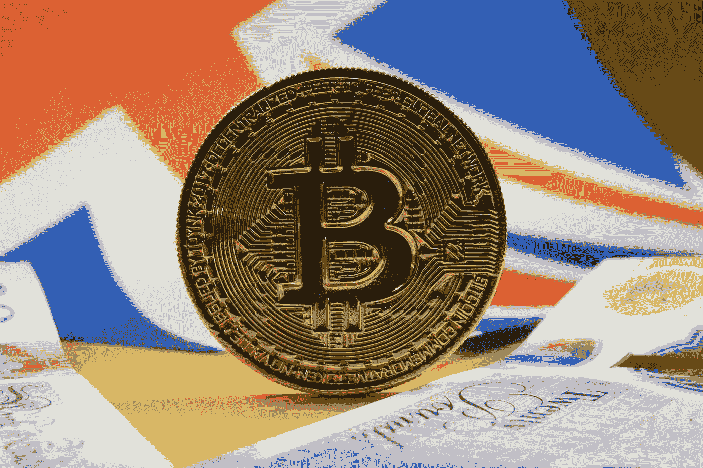

# ETH 和 BTC 还能上升多远？

> 原文：<https://medium.com/coinmonks/how-much-further-can-eth-and-btc-rise-7712d28aec45?source=collection_archive---------3----------------------->

因为我们目前正在观察一个快速而强劲的势头，问题是，这种势头到底能持续多久？—是炒作已经结束了，还是比特币、以太坊等只是在降温，然后爬得更高？

Photo by [Ewan Kennedy](https://unsplash.com/@ewankennedy19?utm_source=medium&utm_medium=referral) on [Unsplash](https://unsplash.com?utm_source=medium&utm_medium=referral)

我想给你一些关于这些问题的想法。为此，我将着眼于以下几个方面:比特币的统治地位，与 BTC 公司相比的 Defi 表现，以及…