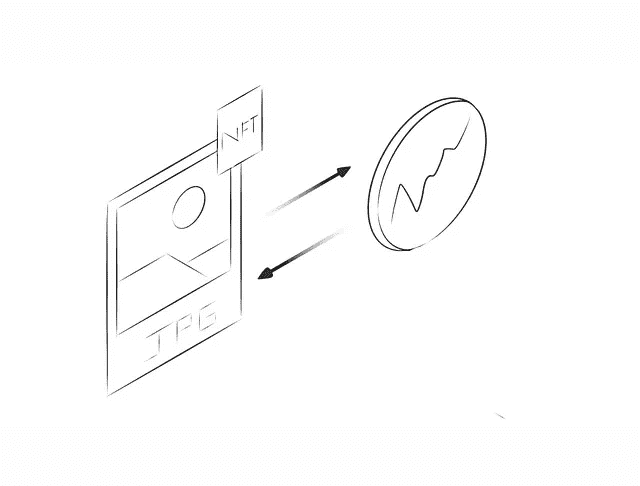

# NFT 元数据的工作原理

> 原文：<https://medium.com/coinmonks/how-nft-metadata-works-a65ba7631842?source=collection_archive---------2----------------------->

## NFT 是代表物理世界或元宇宙的对象的数字证书的容器。但是元数据实际上是如何工作的呢？它存放在哪里？

不可替代的令牌是目前区块链和加密货币领域讨论最多的话题之一。由此产生的功能和使用案例…