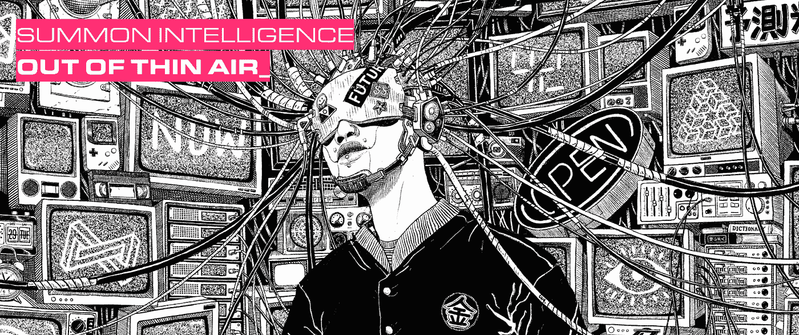
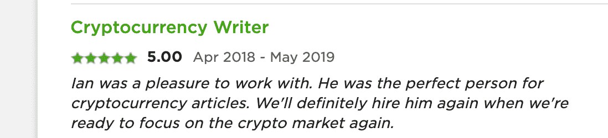
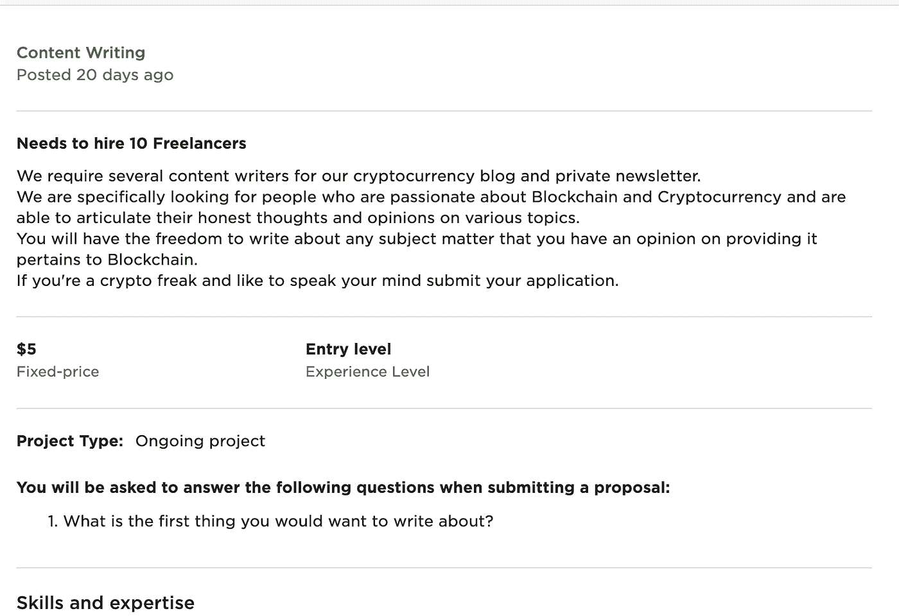
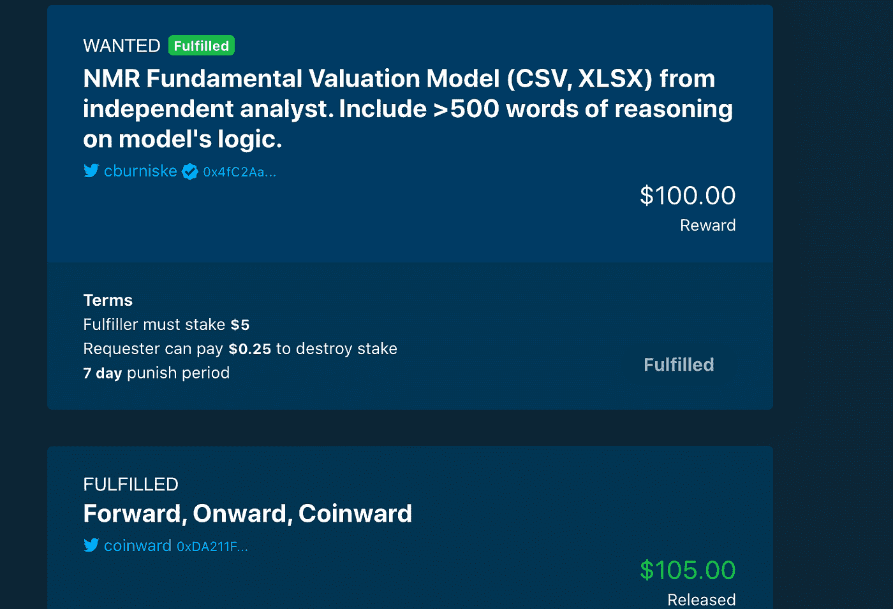

# 数字擦除如何改善自由职业

> 原文：<https://medium.com/coinmonks/how-numerais-erasure-improves-freelancing-db3129c67f39?source=collection_archive---------1----------------------->

## 有了擦除协议，任何人都可以在游戏中启动内置皮肤的网络应用或服务。

Image Credit to the [Numerai Team](https://erasure.world)

我们确实生活在零工经济中。根据最近的一项统计，截至去年，自由职业者约占美国劳动力的 35%。根据美国自由职业者调查( [2017](https://www.slideshare.net/upwork/freelancing-in-america-2017/1) )，这一数字在未来十年将攀升至 50%以上。

随着基于零工的工作的兴起，所谓的“自由职业平台”也在兴起。

想想优步根据背景和声誉为自由职业者和感兴趣的客户牵线搭桥。

像优步、Airbnb 和其他平台一样，这些网站已经成为他们所尊重的领域的领导者，大多数自由职业者都涌向其中一些精选的网站，希望获得可靠的工作。

## 自由职业者市场的优势是什么(使用 Upwork)？

也许这方面最好的例子是 Upwork，它拥有大约 1700 万用户，在各种部门和行业都有稳定的工作流。像上面提到的平台一样，它被设计成易于使用。

看看它的声誉系统和工作申请流程，就很容易明白是怎么回事了。

> [**也读:区块链面试问题**](https://blog.coincodecap.com/blockchain-developers)

## **Upwork 上的信誉是如何确定的？**

与亚马逊类似，自由职业者和客户的声誉都是基于五星级标准和推荐，如下图所示。

[Image Credit to Ian LeViness via Upwork](https://www.upwork.com/freelancers/~0193b24a4a30f4625a)

自由职业者的总体声誉是以 100%的比例来衡量的，包括评价、平均星级和“工作成功”或者你是否完成了客户满意的工作。另一方面，衡量客户的标准只有客户评价和获得的总体星级，尽管还有一个额外的机制来跟踪他们是否使用 Upwork 的托管系统来支付自由职业者。

## **自由职业者如何应聘 Upwork 的工作？**

自由职业者使用被称为“连接”的数字令牌来申请工作，如果客户感兴趣，他们就会伸出手来，同意签订合同。在大多数情况下，这些合同只不过是一份工作描述，一份薪水，一个期望的经验水平，以及一份工作需要的估计时间。

随着 Upwork 的增长，它也开始使用直接合同，这使得自由职业者的付款可以通过其系统以 3.4%的利率获得，这些付款仍然通过其托管系统进行并受到保护。

在这两种情况下，支付都受到 Upwork 争议系统的保护，该系统声称可以保证应得报酬的自由职业者获得报酬。

总而言之，工作机会也很多，特别是如果一个自由职业者有跨多个行业的经验，比如一个文案，他既在技术领域工作，也在其他领域工作。

## Upwork 的不足之处在哪里？

随着 Upwork 越来越受欢迎，它的裂缝已经开始显现。

首先，Paypal 收取两倍以上的费用来促进支付(客户支付的前 500 美元收取 20%，10，000 美元后收取 10%)。此外，现在申请工作只需花费很少的名义金额，除非你购买了几乎相当于网飞月费的会员资格，否则竞争职位的情况不会出现。

如果你在欧盟，那么你除了支付其他费用之外还要支付增值税。

对于欧盟自由职业者来说，这个费用水平最初可以达到 25%,这使得 Upwork 成为一个寻租的噩梦。

如果你不熟悉“寻租”这个术语，试想一下:当一家公司试图在不提供太多或任何价值的情况下获取尽可能多的利润。

> **也读:** [**区块链开发者——你需要知道的一切**](https://blog.coincodecap.com/blockchain-developers)

## **工作申请流程有利于客户**

最重要的是，客户已经想出了如何将申请过程转化为他们的优势，并为毫无意义的工作提供报酬。

例如，长期的内容写作工作可以说是 5 美元，客户可以向感兴趣的自由职业者隐瞒他们的真实预算，往往在面试中占据上风。

[Image Credit to Upwork](http://upwork.com)

在上面的截图中，你可以看到客户希望入门级的作家，但提案的语言听起来像是说作家需要有经验。

此外，最终，并不真正清楚付款期限，甚至付款本身。

也许会是 5 美元，但更有可能的是，客户隐藏他们的预算，以查看自由职业者在面试过程中对项目的出价。

在平台上，这远非孤例，更多的是理所当然。

一些客户甚至提供 20-40 美元一小时的工资(长期工作)来吸引自由职业者，一旦面试开始，他们的报价就会低很多。一般来说，这种做法很普遍，在整个平台上似乎是理所当然的事情。

最终，由于高昂的费用和客户的不诚实，通过 Upwork 支付是一个严重的问题。

## **信誉系统可以游戏**

虽然几乎每个网站都使用像 Upwork 这样的声誉系统(五星评级+推荐)，但这种系统在设计上是有缺陷的。

首先也是最重要的，一般来说，用户无论是体验[很好还是很差](https://hbr.org/2019/07/the-problems-with-5-star-rating-systems-and-how-to-fix-them)都最有可能留下反馈。这也延伸到了 Upwork，这使得它成为一个主要由“顶级”自由职业者和那些由于任何评级导致他们低于 100%成功率而很难找到任何工作的人组成的平台。

由于这一点，以及客户和自由职业者过去的所有评级通常都可以被任何用户看到，实际上在任何不被认为是非常负面的情况下，双方都有给予五星评级的动机。这可能会导致奇怪的评价，很少甚至没有文字，甚至负面评论与正面评论混杂在一起。

顶级自由职业者可以删除负面反馈，尽管这必须得到 Upwork 代表的批准，如果负面反馈是违反服务条款的结果，则[不能发生](https://support.upwork.com/hc/en-us/articles/219801228-Feedback-Removal)。

简而言之，考虑到所有这些，几乎任何人都可以成为“顶级”，只要他们不会给客户留下令人难忘的负面印象。这种系统被颠覆的时机已经成熟，尤其是随着皮肤在区块链游戏中的崛起，我们将在下面进一步讨论。

## **客户和自由职业者之间的纠纷怎么办？**

最重要的是 Upwork 的争议程序有多么有缺陷。

简单来说，任何自由职业者和客户无法自己解决的分歧都会被送到 Upwork 的团队进行审查，该团队根据平台的服务条款决定其命运。这鼓励保护平台，而不是以真正公平的方式，仅基于事实来解决问题。

## **游戏中的皮肤是什么，为什么很重要？**

综上所述，很明显像 Upwork 这样的平台在很多方面都存在缺陷。

那么，这怎么能改变呢？

客户和自由职业者的关系如何才能平等化？

事实上，这一切都始于一个叫做“游戏中的皮肤”的流行理论的应用

游戏中的皮肤已经遍布加密货币行业，可以解决上述所有问题。目前，游戏中最受欢迎的皮肤应用是“staking”，即在加密货币钱包中持有一定数量的密码，以获得在其相关区块链上验证区块的权利。

随着基于股份或“股份证明”的网络随着时间的推移而发展，它们中的许多已经采用了像令牌燃烧这样的措施，这给了块验证者真正的利益，如果他们对网络采取行动，就销毁他们的股份。这方面最受欢迎的例子之一是 Tezos 网络，该网络将赌注被烧毁的条件写入其协议。

尽管如此，在这种情况下，令牌烧录通常不会扩展到协议级别之外的其他用例。

像 Upwork 这样的自由职业者市场可以使用类似的功能来鼓励所有用户交互中的诚实和质量。然而，直到最近，这样的事情才真正成为可能。

Numerai 通过其擦除协议在这方面处于领先地位。

## **什么是擦除协议，它是如何工作的？**

像所有区块链协议一样，擦除可以通过将其分解成最小的可能部分或“原语”来最容易地理解

一般来说，原语是执行特定任务的几行计算机代码，比如将资金从一个地方转移到另一个地方。总的来说，擦除基于三个基本要素，它们被称为:支付、追索和跟踪记录，并且执行协议被构建来完成的所有基本动作。

## **支付原语**

在普遍意义上，支付原语是使所有支付发生的代码(严格基于加密)。

这样做，它可以支持任何基于以太坊的加密货币，尽管戴和计价单位是目前唯一两个与擦除协议集成的加密货币。

## **追索原始人**

就将游戏中的皮肤应用于传统应用和服务而言，追索权是最重要的原始要素，此外还有跟踪记录。有了它的代码，就方便了赌注和令牌烧，叫做“[烧](/numerai/the-erasure-protocol-awakens-48a34cc4b5d0)”清算是指交易中被认定违反协议条款的个人或一方烧掉股份的行为。Numerai 的团队将这些协议称为“擦除协议”,因为要签订这些协议，双方都必须满足所有三个擦除原语的条件。换句话说，付款、追索权和跟踪记录，所有这些都必须解决，协议(合同)才能被认为是有效的。

## **轨迹记录原语**

跟踪记录是擦除协议的最后一块拼图，它转化为对用户声誉的衡量。

如果您已经知道区块链允许数据与时间戳一起永久存储，那么您就知道这个特定原语的要点。即便如此，它也是必不可少的，因为没有它，就不会有基于擦除的事务的记录。

## **什么是 Erasure Bay，它如何改善自由职业？**

Erasure Bay 是一个分散的信息市场。

这意味着任何人都可以在任何时候登录它并请求或完成对任何信息的请求。“履行者”和“请求者”之间的这些交互通过所谓的擦除协议发生，您可以在下图中看到这种协议。

Image Credit to [Erasure Bay](https://erasurebay.org/request/0x89f7ad09a4d147ee6762309e4b40797df9f2b645) and [Chris Burniske](https://twitter.com/cburniske?ref_src=twsrc%5Egoogle%7Ctwcamp%5Eserp%7Ctwgr%5Eauthor)

首先，有一个信息请求，就像上面的“NMR 估价模型”，其格式是指定的(仅 CSV 或 XLSX 文件)。

然后，需要有一个成功交付它的奖励，目前是通过下注一个戴稳定币的数量(在上面的请求中为 100 戴)来完成的。一般来说，这个奖励是什么完全取决于请求者，尽管一般来说，更高的奖励会导致请求更快地实现。

在设置奖励的同时，还需要设置“完成赌注”和燃烧率。将这两者一起视为游戏中的皮肤，完成者需要考虑尝试请求。

如果我们回到上面关于擦除的讨论，那么你会记得，如果他们提供低质量的工作，燃烧率是一个完成者的股份可以被摧毁的百分比。这种机制的关键思想是，人们将受到激励，变得更加诚实，因为如果反其道而行之，他们会损失真金白银。

惩罚比例和惩罚周期附在完成者的股份上，在上图中用 10%和 5 天表示。总的来说，所有这些机制结合起来说明了追索原语在实践中是如何工作的，这是擦除协议的定义特征。这是因为在一起，他们也有助于保持请求者的诚实，因为烧一个 fulfiller 的股份需要花费他们的钱，而且他们只有有限的时间这样做。

一旦所有这些措施都设置好了，请求就会通过 Erasure Bay twitter 句柄发布出去，成为一份有效的“擦除协议”，你可以把它想象成区块链上的一份自由职业合同。

## **那么，擦除协议是否消除了升级工作的需要？**

是的。

从理论上讲，擦除协议可以涉及任何金额的任何类型的请求，这使得擦除湾系统适用于所有类型的用例，包括自由职业者市场。

让我们回到 Upwork 的缺点。

如上所述，它的费用太高，类似垃圾邮件的工作激增，可玩的申请过程，有缺陷的声誉系统，以及集中的争议过程。

*使用擦除间隔或擦除协议可以解决这个问题。*

## **擦除湾成为更好的自由职业者市场**

在 Erasure Bay 上，客户和自由职业者之间的每一次互动都是由擦除协议直接管理的。

所有客户端的争议都可以通过 Erasure 的抱怨机制来解决，这种机制通常会给他们 5 到 30 天的时间来审查自由职业者的工作，然后再支付报酬。这个期限必须由客户在协议生效之前设定。

对于自由职业者来说，支付是即时的，由智能合同管理，而不是传统的财务系统。此外，声誉是由成功的互动决定的，其中没有利益受损，所以自由职业者的工作质量越高，他们得到的工作就越多。

在发生争议的情况下，客户有权决定是否向自由职业者发放全额报酬(奖励),但事实是，在这种情况下，悲伤会让他们付出金钱，这激励了诚实的审查过程。

任何时候，像 Upwork 这样的组织都不需要坐在这些交互的中心，并收取“监控它们”的费用。更简单地说，有了擦除，除了自由职业者和客户，没有人需要参与自由职业过程。

## **擦除在擦除区间之外是否有效？**

是的，绝对的。它将成为以区块链为中心的新互联网的主干。

因为擦除原语是完全可组合的，任何人都可以构建任何类型的平台，使用它们来促进任何类型的各方之间的交互。

想想专注于擦除的 Tinder、优步、Airbnb，甚至亚马逊。

没有平台是禁区。

从表面上看，擦除应用程序与典型的自由职业者市场没有什么不同。在客户和自由职业者建立工作关系之前，利益衡量系统只是另一个需要填写和检查的盒子。

此外，声誉系统可以基于自由职业者的股份是否被烧毁，就像 Erasure Bay 对 fulfillers 所做的那样。这种跟踪记录将随时可用，并通过散列到以太坊区块链上而得到保护。因为它不是基于明星或推荐，所以它不可能是游戏，而是一个自由职业者在平台上的历史的真实记录。

尽管有所有这些技术特征，普通人所能看到的只是一个类似于 Upwork 或任何其他类似的流行市场的网站。在 Erasure Bay 的案例中，它看起来更像是信息的加密货币交换。

这意味着所有“区块链的东西”都将在幕后，推动平台上每个人之间更好、更高质量的互动，总的来说，没有必要让寻租公司坐在中间。

最终，这个讨论只是我们探索擦除协议潜力的开始。在以后的文章中，我的目标是在各种背景下分析它。下次，如果你喜欢这个讨论，请在下面的评论中告诉我，并联系 Twitter [@Expatcrypto3](https://twitter.com/expatcrypto3) 。

最后，我的大部分空闲时间都花在了我的时事通讯上，这是完全免费的，关注的是元宇宙的崛起如何改善每个人的生活。[子此处](https://www.getrevue.co/profile/blockdemiclab)。

*免责声明:这些都不是财务建议。自 2016 年以来，我一直在研究和工作 crypto，我的目标只是教育人们各种项目的利弊。此外，我是一名学生，就像我们所有人一样。因此，随着我对项目了解的越来越多，我对项目的想法也会随着时间自然发展。*

特别感谢:[娜塔莎-杰德](https://medium.com/u/2912477ae810?source=post_page-----db3129c67f39--------------------------------)和[安东尼-曼代利](https://medium.com/u/d96d5a5ecde6?source=post_page-----db3129c67f39--------------------------------)以及[号](https://medium.com/u/de81f6b78f86?source=post_page-----db3129c67f39--------------------------------)团队。

> [*在您的收件箱中直接获得最佳软件交易*](https://coincodecap.com/?utm_source=coinmonks)

