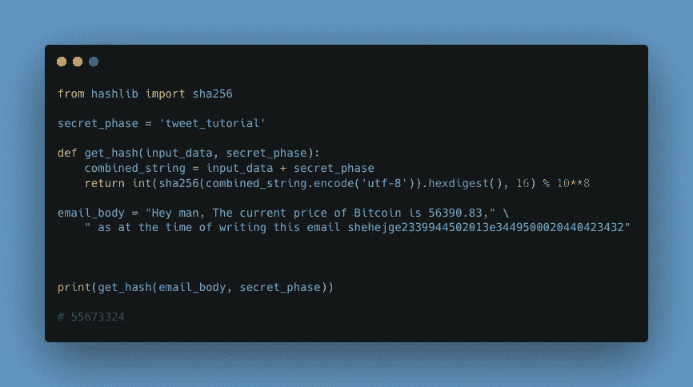

# 防止垃圾邮件如何带来工作证明

> 原文：<https://medium.com/coinmonks/how-preventing-spam-emails-led-to-proof-of-work-46a294b2435?source=collection_archive---------4----------------------->


Photo by [Pierre Borthiry](https://unsplash.com/@peiobty?utm_source=unsplash&utm_medium=referral&utm_content=creditCopyText) on [Unsplash](https://unsplash.com/s/photos/proof-of-work?utm_source=unsplash&utm_medium=referral&utm_content=creditCopyText)

你可能想知道什么是工作证明？让我解释一下，所以你知道比特币(BTC)。BTC 使用工作证明生成区块；它使用 Hashcash 工作证明系统。工作证明的正确定义是一个很难产生但很容易被其他人验证的数据，它必须满足特定的要求。这里的“难”字是指成本高，耗时长。在生成有效的工作证明之前，需要进行大量的试错过程。

我说比特币用的是工作证明；怎么会？要使数据块有效，它必须散列到小于给定目标的值，散列是分配给数据的随机值。这是一种证明在特定程序块上已经完成工作的方法，因此有了“工作证明”这个词。因此，对于矿工来说，生成新的区块并保护区块链不被篡改变得很有挑战性。更改块需要重新生成所有以前的块，然后执行它们包含的工作。

为了澄清，让我用几行 Python 代码解释一下它在垃圾邮件防御中的一个应用。在这里，我们将尝试通过对发送的电子邮件做一些工作来防止垃圾邮件，已知的接收者可以很容易地验证这一点(工作证明)。这个想法是让电子邮件在计算上变得昂贵。最广泛使用的工作证明算法是 SHA-256，这也是我们在这个简短教程中要用到的。如果你想了解更多关于哈希的信息，你可以在这里阅读。

**代码**



Python Code Example

**解释代码。**

导入哈希函数— SHA-256

```
from hashlib import sha256
```

创建一个秘密短语——这个街头用语只有合法接收者知道。

```
secret_phase = 'tweet_tutorial'
```

创建一个散列函数，将电子邮件正文和街头用语作为输入数据。该函数返回一个特殊的 8 位字符，该字符满足接收方已知的某些特定要求。

```
def get_hash(input_data, secret_phase):     
  combined_string = input_data + secret_phase     
  return int(sha256(combined_string.encode('utf-8')).hexdigest(),   16) % 10**8
```

电子邮件正文

```
email_body = "Hey man, The current price of Bitcoin is 56390.83," \     " as at the time of writing this email shehejge2339944502013e3449500020440423432"
```

这是电子邮件正文，你可以看到我在电子邮件的末尾添加了一些随机字符串，这是我通过大量试验和错误得到的，只是为了让电子邮件正文与机密短语相结合，满足收件人已知的一些特定要求。接收者可以通过调用邮件正文和机密短语上的 *get_hash* 函数来轻松验证这一点。

```
print(get_hash(email_body, secret_phase)) # 55673324
```

我对所做的是提出一个特定的约束，我只能通过在电子邮件正文中插入任意数据来满足这个约束。当接收者检查 email_body 和机密短语时，将返回相同的输出，从而证明我所做的工作。如果我添加的任意数据只改变了一个字符串，结果— 55673324 也会改变，收件人可以确定电子邮件已经被篡改。下面我把邮件末尾的随机数据的最后一位数改成了 5，新的邮件正文是

```
email_body = "Hey man, The current price of Bitcoin is 56390.83," \     " as at the time of writing this email shehejge2339944502013e3449500020440423435"
```

我的新成果是

```
28554609
```

上面的输出与接收者所期望的不同，因此我们知道邮件已经被篡改了。

总之，合法的电子邮件将能够轻松地生成证明，但大量垃圾邮件发送者将难以生成所需的证明，这将需要大量的计算资源。并且这被用作在比特币挖掘中使用的共识算法。

推特—[https://twitter.com/bleso_a](https://twitter.com/bleso_a)

电子邮件—blessingadesiji96@gmail.com

> 加入 Coinmonks [电报频道](https://t.me/coincodecap)和 [Youtube 频道](https://www.youtube.com/c/coinmonks/videos)了解加密交易和投资

## 也阅读

[](https://blog.coincodecap.com/crypto-exchange) [## 最佳加密交易所| 2021 年十大加密货币交易所

### 编辑描述

blog.coincodecap.com](https://blog.coincodecap.com/crypto-exchange) [](https://blog.coincodecap.com/crypto-lending) [## 2021 年 10 大最佳加密贷款平台| CoinCodeCap

### 编辑描述

blog.coincodecap.com](https://blog.coincodecap.com/crypto-lending) [](/coinmonks/crypto-trading-bot-c2ffce8acb2a) [## 2021 年最佳免费加密交易机器人

### 2021 年币安、比特币基地、库币和其他密码交易所的最佳密码交易机器人。四进制，位间隙…

medium.com](/coinmonks/crypto-trading-bot-c2ffce8acb2a) [](/coinmonks/best-crypto-signals-telegram-5785cdbc4b2b) [## 最佳 4 个加密交易信号电报通道

### 这是乏味的找到正确的加密交易信号提供商。因此，在本文中，我们将讨论最好的…

medium.com](/coinmonks/best-crypto-signals-telegram-5785cdbc4b2b)  [## 5 个最佳社交交易平台[2021] | CoinCodeCap

### 编辑描述

blog.coincodecap.com](https://blog.coincodecap.com/best-social-trading-platforms)