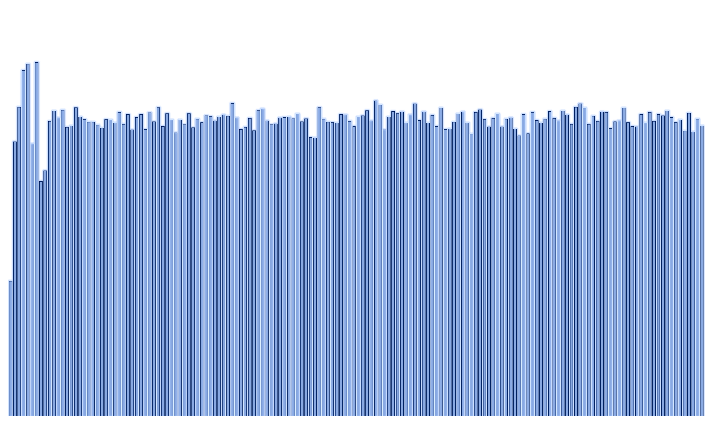

# 比特币地址有多随机……具体是多少？

> 原文：<https://medium.com/coinmonks/how-random-bitcoin-addresses-are-exactly-aafb98292305?source=collection_archive---------2----------------------->

这是对区块链上目前使用的公钥/地址的随机性程度的一个简单的经验分析，目的是确保理论上的随机性在实践中也是随机的。

BIP39、BIP32 和 BIP44 在私钥和公钥生成的标准化方面取得了重大进展，同时不会因为在该过程中引入大量熵而损害其安全性。

然而，不管这些发展如何，比特币的安全性完全依赖于从 ECDSA 中的 **secp256k1** 参数导出的强大加密技术。目前使用的大多数区块链和伪区块链技术也是如此。除此之外，关于从私有到公共密钥的加密，由 **sha256** 与 **ripe160** 联合进行的加密的进一步混淆和压缩也是一个因素。对这些加密产品和大量地址“群组”的一点一点的经验分析表明，随机性看起来确实是随机的:

**Bitcoin addresses… bit by bit frequency**

## 讨论

可以说唯一突出的部分在前 9 位内。合理的假设是，这个特征在某种程度上反映了其输入中最少的随机部分。根据 secp256k1 的 y 导出输出的均匀度，其第**个字节** /8 位为 **00000010** 或 **00000011** ，如果整个 **secp256k1** 输出用于进一步加密，则为 **00000400** 。

从门外汉的角度来看，令人惊讶的是，sha256 & ripe160 的产品/摘要的这一微小特点正好出现在地址的开头，而这些函数的目的是进一步随机化、混淆和浓缩核心 secp256k1 派生的加密。

毫不奇怪，对于一个精通这些算法及其在比特币中的实现的密码学家来说，这个小小的奇怪之处是“旧闻”，已经被证明意义不大。

## 结论

随机性看起来确实是真正的随机，只有极少数的例外情况是随机的。

> [直接在您的收件箱中获得最佳软件交易](https://coincodecap.com/?utm_source=coinmonks)

