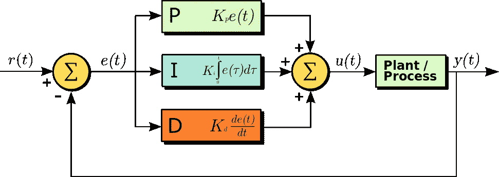
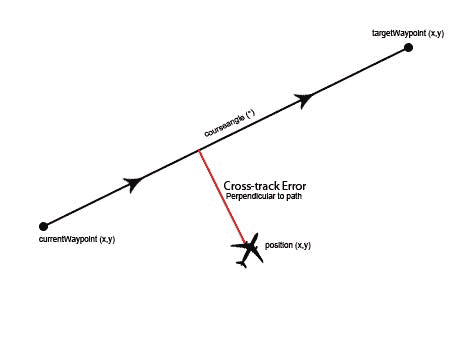
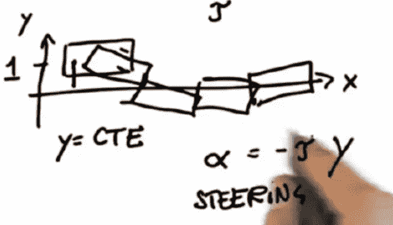
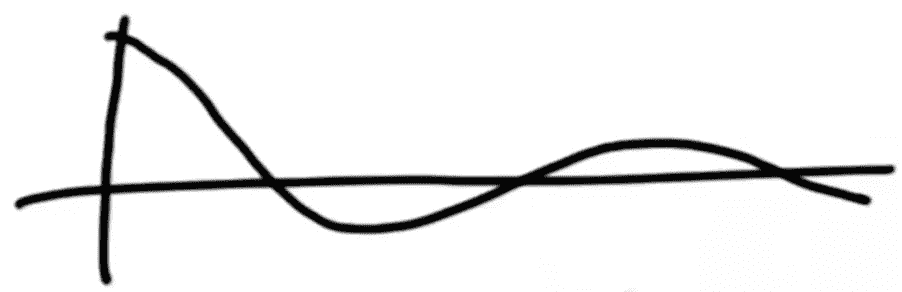
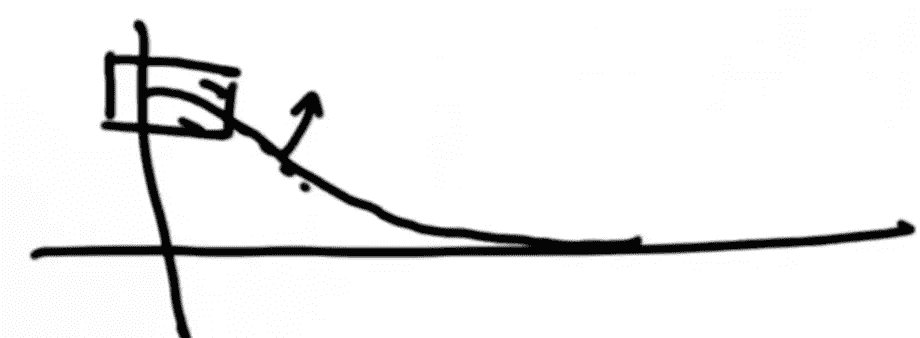
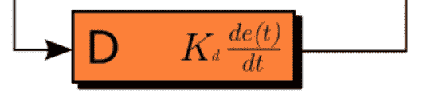
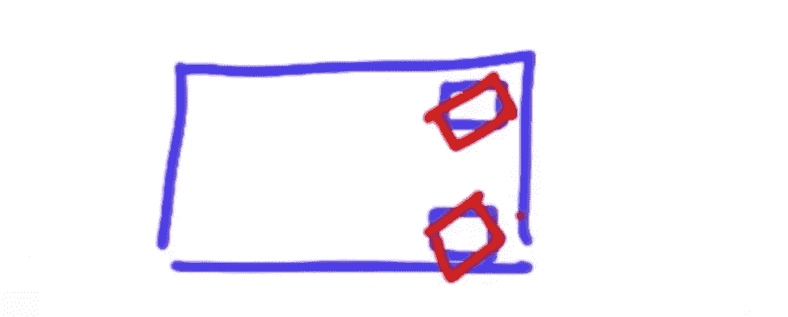
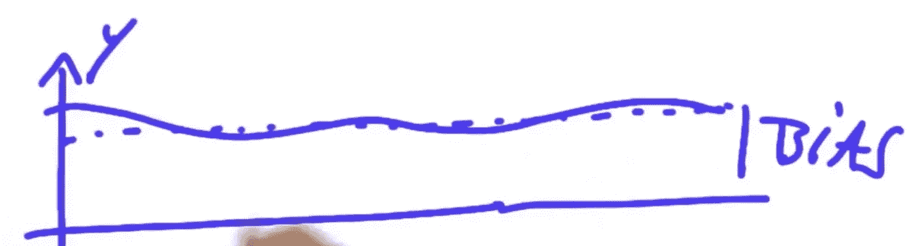
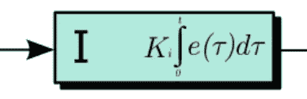

# 机器人是如何遵循路线的？— — PID 控制

> 原文：<https://medium.com/coinmonks/how-robots-follow-routes-pid-control-2a74226c5c99?source=collection_archive---------3----------------------->

PID 控制器代表**比例-积分-微分**控制器，看起来很可怜，但如果你深入了解，实际上很容易理解。三个字母的 PID 实际上是三个独立的技术，而不是一个复杂的想法。



Graph of PID controller from Wikipedia

想象一下，我们有一辆自动驾驶汽车在路上行驶，我们肯定不希望我们的汽车在预定义的路径上漂移。这就是 PID 控制器的由来，用于自动转向。

## 交叉跟踪误差

第一个问题是我们如何测量当前位置和我们预先定义的路线之间的差异。跨轨道误差(CTE 或 XTE)是一个简单的误差函数做这个把戏。它只是测量从一个位置到路径的距离。



Cross track error from [PICpilot](https://github.com/UWARG/PICpilot/wiki/Path-Management).

然后，我们将通过使用 PID 控制来尽量减小误差。

## p 比例的

比例控制是一种简单的技术，根据 CTE 按比例操纵机器人。如果我们远离基线，我们的车辆会转向那里。与此同时，如果我们离我们的底线不远，情况会发生微妙的变化。有道理，对吧？



Image from Udacity [Robotics](https://classroom.udacity.com/courses/cs373/).

这是可行的，但是如果我们仔细考虑这个问题，我们的赛车基本上是在我们的基线附近摆动。看起来我们的司机喝醉了。这绝对是一种危险的行为。还有，在那辆车上你可能会有点晕船:)



Image from Udacity [Robotics](https://classroom.udacity.com/courses/cs373/).


Equation for P. Kp is a parameter that decides how much degree of the proportion we gonna take. e(t) is the CTE.

## d-导数

因此，我们希望减少振荡的影响。这就是为什么我们引入第二个控制器，导数控制。在这里，我们将考虑我们是如何转向的，来缓和这个斜坡。



Image from Udacity [Robotics](https://classroom.udacity.com/courses/cs373/).



Equation for D. Kd is the parameter to decide how much derivative will be taken. That derivative is the CTE change along time. Say we measure it every 1s, we can take the derivative as (CTEt — CTEt-1)/1

等等，看起来 PD 控制足够转向了。但是，是吗？让我们看看下面的场景。我们的自动驾驶汽车有一些机械问题，当它启动时，前轮有点像下面这样漂移。



Image from Udacity [Robotics](https://classroom.udacity.com/courses/cs373/).

因此，当它运行时，我们的软件不知道这个问题，因为在这个时候，我们应该更多地转向以纠正车轮。因此，我们将看到以下结果。



Image from Udacity [Robotics](https://classroom.udacity.com/courses/cs373/).

## I 积分

为了解决这个问题，我们将加入积分，让机器人思考整个过程。



Ki is the parameter to decide the how much integral will be taken.

如果 CTE 误差不降低，机器人将考虑整个情况，因为积分将变大以进行更多的转向。

# 最佳化

如果你注意到了，所有这些 PID 方程都有自己的参数 K，它决定了要取多少比例。PID 优化有很多算法。接下来，让我们看看如何使用名为“旋转”的优化算法来更新参数。它有一个简单的逻辑。

在做任何事情之前，我们应该知道要优化什么。这显然是关于 CTE 的。此外，CTE 可以是正的也可以是负的。因此，我们可以使用平方误差函数:

```
def err(p):
    # to calculate all the CTEs accordingly
    cte, diff_cte, int_cte = calculate_cte(CURRENT_STATUS)
    steer = -params[0]*cte - params[1]*diff_cte - params[2]*int_cte
```

首先，我们将做一些初始化。

```
# Choose an initialization parameter vector
p = [0, 0, 0]
# Define potential changes
dp = [1, 1, 1]
# We can give a very large error in the begining
best_err = 9999999999
# To stop optimizing
threshold = 0.001
```

那么主要的算法是:

```
while sum(dp) > threshold:
    for i in range(len(p)):
        p[i] += dp[i]
        err = error(p)

        if err < best_err:   # There was some improvement
            best_err = err
            dp[i] *= 1.1
        else:                # There was no improvement
            p[i] -= 2*dp[i]  # Go into the other direction
            err = error(p)
            # To see the outcome on this direction.
            if err < best_err:  # There was an improvement
                best_err = err
                dp[i] *= 1.05
            else:               # There was no improvement
                p[i] += dp[i]
                # As there was no improvement, the step size in either
                # direction, the step size might simply be too big.
                dp[i] *= 0.95
```

实际上，这个算法做简单的行为。去搜索正确的部分，不起作用？它会尝试另一边，最后工作？然后我们会有一个新的基准点，它会在新的基准点周围搜索。

到目前为止，这是关于 PID 控制器和旋转优化器的一切。