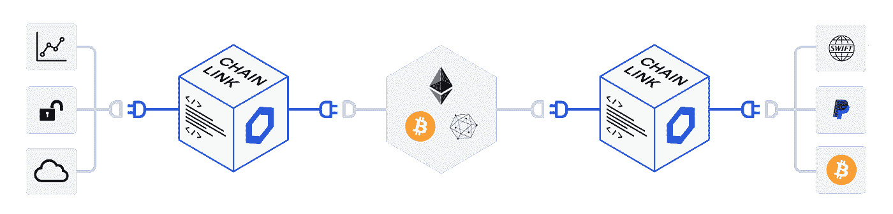
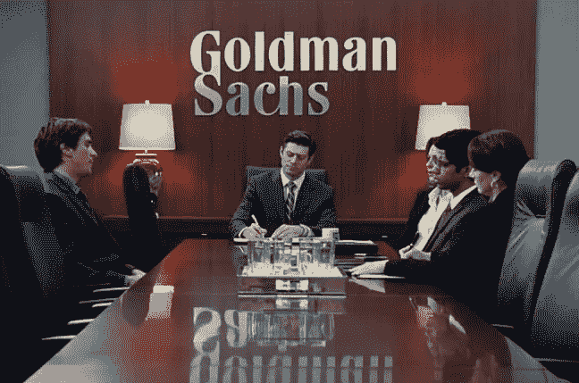

# 智能合同将如何彻底改变世界

> 原文：<https://medium.com/coinmonks/how-smart-contracts-will-revolutionize-the-world-c48d137602ad?source=collection_archive---------1----------------------->

Credit: CoinDesk

智能合约很棒。它们允许我们从一个概率世界转变为一个确定性世界。在现状中，合同以概率的方式运作，因为合同有可能不被履行。举例来说，这可能是由于一个实体没有履行其合同。智能合约支持与常规合约相同类型的合约，但采用数字格式，并允许它以确定的方式运行。这意味着，一旦合同收到执行确认，它将自动和自主地执行。这从根本上改变了收缩的方式，并最终改变了世界经济的长期运行。

能够与另一个实体签订合同并保证合同将得到履行，改变了我们与他人互动的方式。世界上有数百万人生活在私有产权管理不善的国家，例如，智能合同可以帮助他们获得对其财产的所有权。签订合同的实体不是被利用，而是确切地知道他们将进入什么样的环境，他们知道无论如何合同都会得到履行。这使得现有的信任度较低的市场(如衍生品市场)能够以更有效的方式运作，也为全新市场的出现打开了大门。

> [“据估计，智能合同可降低个人贷款成本 480-960 美元，在美国和欧洲合计可节省 30-110 亿美元。如果我们早在 2008 年就有智能合约，增加信息访问可能会缓解债务危机。”](https://blog.chain.link/the-power-of-smart-contracts-what-they-are-and-how-they-can-revolutionize-the-future)

然而，有一个问题阻碍了智能合约的采用。这种新创新被采用的主要问题是缺乏可靠的输入和输出。本质上，区块链是一个美化的公共数据库。它提供的唯一价值是不可变的，这使得它成为在两方或多方之间创建绑定契约的良好选择，该契约不能被更改，并且可以基于某些外部事件的发生而自动执行。这些外部事件通过 oracle 输入到合同中，Oracle 目前是集中式的，是一个单点故障，使整个事情变得毫无意义。这个问题通常被称为“Oracle 问题”。像 [Chainlink](https://chain.link/) 这样的项目目前正在致力于解决这个问题，其形式是一个分散的 oracle 网络，为任何区块链上的复杂智能合同提供可靠的防篡改输入和输出。要更深入地分析这个项目及其影响，请参考我的另一篇文章“ [Chainlink:基本分析](https://link.medium.com/tdilTMoEH0)”。

智能合同对我们生活的影响也将比点对点支付系统或数字储值方式大得多。这是因为智能合约消除了信任。信任是合同中的一个因素，它允许执行合同以将资金交给适当的实体。如果由于信任而未能执行合同，那么合同任何一部分的资金有什么意义呢？

尽管智能合同可以带来很多好处，但总是会出现的问题是，如果这些合同可以自动执行，难道不会导致某些行业的失业吗？这是正确的，但总的来说，就业市场将因创造的新工作岗位而获得净收益。就像印刷机淘汰了所有手工写书的人一样，它也为全新的工作铺平了道路，比如编辑和设计师。智能合约也会出现同样的情况。

## **现在这项技术意味着什么？**

理解这在短期内如何以及对谁有帮助的一个简单方法是，想想如果有人购买了信用违约互换，它现在是如何运作的:现在他们的选择是购买互换，因为他们知道卖方会尽一切合法的手段在支付时延迟付款，以便首先获得头寸。

Credit: The Big Short(IMDB)

这一点可以在电影《大空头》(The Big Short)中看到，例如，在 2008 年金融危机期间，[许多场外交易商推迟向做空房地产市场的客户付款，以便建立类似的头寸来弥补这些负债。延迟结算可以减少由于商定结算日期和实际结算日期之间基础价值的变化而导致的支出。](https://blog.chain.link/solving-deep-seeded-trust-problems-in-derivatives-using-chainlink-enabled-smart-contracts/)

从购买者的角度来看，即使损失一两个月的付款也可能导致他们的企业破产。目前，唯一的选择是购买掉期产品，抓住机会或者干脆放弃，因为无论你雇佣多少律师，都没有可以信任的实体。

智能合约的第一批用户将是在低信任度环境中进行大额交易的实体。第一批使用电话的人是那些能负担得起每分钟 20 美元的人，因为他们从这种通信优势中赚的钱比花费的钱多。智能合约就像任何其他技术一样:它把一些昂贵的东西变得便宜很多。其他所有技术都遵循这条道路:人们已经为那个东西付出了巨大的代价，买下了所有的早期用途，然后事情慢慢发展。

这里的要点是:

*   **信任是一种耗费资源的交易资产。**
*   正如其他技术降低了食品、电力和娱乐的成本一样，智能合同将降低信任的成本。
*   **仍然需要不同的信任级别，以及这些信任级别的不同成本等级。**

总体而言，人们可以看到智能合约在现实世界中的各种影响。智能合同提供了一种与合同中的其他人进行交易的更好的方式，并且将比大多数人预期的更快地被广泛采用。

> ***在 Twitter 上关注我:***[*@ kwsantiago*](https://twitter.com/kwsantiago)
> 
> **随时提示我:**0xc 408105508 ba 51 bacc 5 bb 3 ea 1d 13 da 3206618858
> 
> 这篇文章仅供参考。本文中所述的任何内容都不应被理解为财务建议。