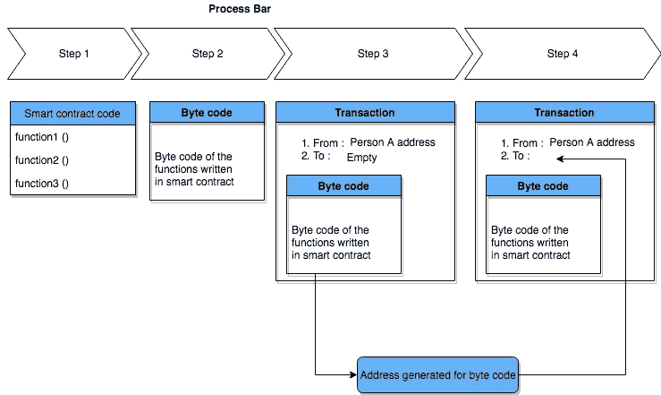

# 智能合约如何在区块链上工作

> 原文：<https://medium.com/coinmonks/how-smart-contracts-work-on-blockchain-6542f8a6380f?source=collection_archive---------5----------------------->

我在区块链工作已经有一段时间了，直到明天，我都不太确定一份聪明的合同如何在区块链运作。所以我想我应该写一篇关于它的小文章，并帮助那些很难理解同样事情的人。

Fig 1.1

L ets 以以太坊智能合约为例，所以当我们编写智能合约时，它会被转换为它的字节码，该字节码可以通过交易发送到区块链。那笔交易将和区块链上的其他交易一样。交易的数据字段将具有从智能合同生成的字节码，现在交易包含“目的地址”和“起始地址”。因此，这里的“发件人地址”将等于部署此智能合同的人的地址，“收件人地址”将留空。但是，当交易被挖掘并被推送到区块链时，一个新的地址被生成，并且“收件人地址”将被设置为等于这个新生成的地址，并且当交易在网络中被接受时，任何人都可以使用所生成的地址与该智能合同进行交互。