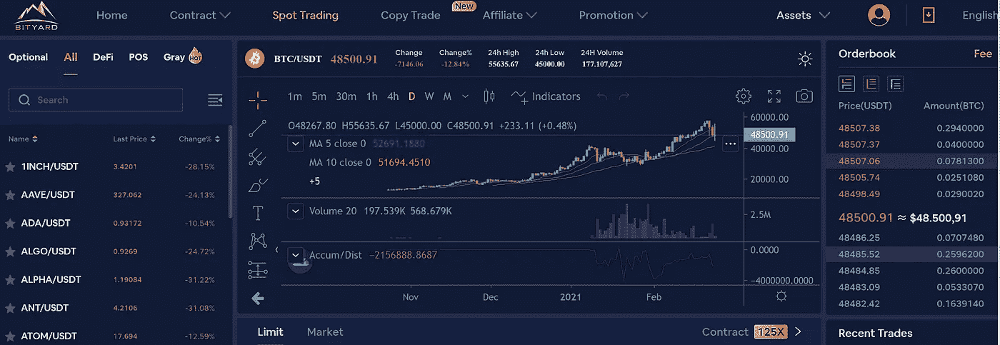

# 2021 年 Stablecoin 项目会是什么样子

> 原文：<https://medium.com/coinmonks/how-stablecoin-projects-looks-like-in-2021-40a883c02956?source=collection_archive---------3----------------------->

到目前为止，加密货币一直被投资者认为是有利可图的，特别是由于对价格收益的投机。然而，以数字形式代表真实货币的稳定货币越来越受到重视。尽管发展仍处于非常早期的阶段，但与现金的实物形式相比，它们有几个优势。到目前为止，还没有精确的规定，这意味着许多项目…