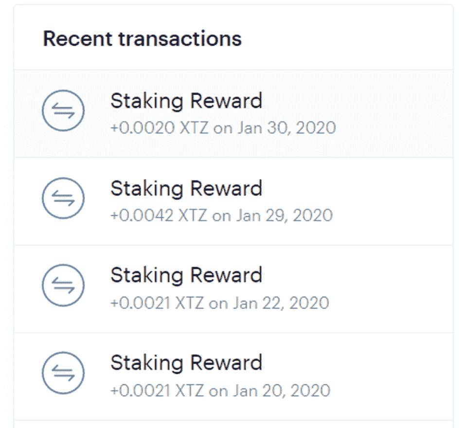

# 下注 Tezos 如何产生“租赁”收入

> 原文：<https://medium.com/coinmonks/how-staking-tezos-may-generate-rental-income-e387017123ba?source=collection_archive---------2----------------------->

加密货币领域正在不断发展。[利益证明(PoS)](https://blockgeeks.com/guides/proof-of-work-vs-proof-of-stake/) 是一个相对较新的概念，作为最受欢迎的[加密货币](https://blog.coincodecap.com/cryptocurrency-advantage-disadvantage-risk/)、[比特币](https://blog.coincodecap.com/a-candid-explanation-of-bitcoin/)运行的[工作证明(PoW)](https://blockgeeks.com/guides/proof-of-work-vs-proof-of-stake/) 系统的更好替代方案，它在加密社区中日益流行。这篇文章的目的是向你展示一个有趣的税务困境，当你在比特币基地或其他平台上下注像 Tezos 这样的硬币时。

Photo by [André François McKenzie](https://unsplash.com/@silverhousehd?utm_source=medium&utm_medium=referral) on [Unsplash](https://unsplash.com?utm_source=medium&utm_medium=referral)

# 什么是赌注？

Staking Rewards

在我们深入探讨赌注奖励的税务含义之前，让我们先讨论一下什么是赌注。赌注非常类似于有一个计息银行储蓄账户。Dash、Neo、OKcash、Tezos (XTZ)是一些你可以下注的加密货币。它的工作方式很简单。您可以将这些硬币放在您的钱包和/或支持下注的交易所中，并根据您下注的资金数量定期领取奖金。上面的片段显示了赌注奖励如何出现在美国一家主要加密交易所的仪表板上。

显然，赌注奖励是要征税的。然而，赌注奖励的确切税收待遇并不像人们想象的那样清晰。原因如下。

# 利息收入？

对普通大众来说(如果我不戴注册会计师的帽子)，赌注回报类似于利息收入。这是因为该过程与将资金存入银行账户并根据年利率收取利息非常相似。你的存款越高，你赚取的利息收入就越高。如果你应用这个理论，赌注回报可能看起来类似于利息收入。利息收入通常在 [IRS 表 B 第一部分](https://www.irs.gov/pub/irs-pdf/f1040sb.pdf)中报告

然而，有必要弄清楚美国国内税收法规(IRC)是如何定义“利息收入”的，以了解赌注奖励是否实际上是用于税收目的的利息收入。根据[Reg 1.61–7](https://www.law.cornell.edu/cfr/text/26/1.61-7)，“利息收入包括储蓄或其他银行存款的利息；息票债券的利息；未结账户、本票、抵押贷款或公司债券或信用债券的利息；谴责赔偿金的利息部分；高利贷利息(除非根据州法律，它自动转换为本金的支付)；遗产利息；根据支付利息的协议持有的人寿保险收益的利息；以及联邦税收退款的利息”。显然，这种“利息收入”的定义与来自加密货币赌注的收入毫无相似之处。

此外，根据[众议员诉杜邦案，载于《美国最高法院判例汇编》第 308 卷，第 488 页(1940 年)](https://supreme.justia.com/cases/federal/us/308/488/#497)，“通常意义上的利息是指一个人为了使用借来的**的钱而签约支付的金额**。在商业世界中，债务利息意味着对使用或克制使用**金钱**的补偿。现在，这里的关键是利息来源于拥有**钱**作为本金。为了税收的目的，你下注的硬币被当作“钱”吗？不完全是。根据[通知 2014–21](https://www.irs.gov/pub/irs-drop/n-14-21.pdf)，加密货币被视为财产。因此，尽管在现实世界中，赌注奖励可能具有利息收入的许多特征，但就税收目的而言，赌注奖励不属于利息收入。

如果赌注奖励不是利息收入，在纳税时应如何处理？

# 租金收入？

根据[Reg 1.61–8](https://www.law.cornell.edu/cfr/text/26/1.61-8)，“总收入包括因占用不动产或**使用个人财产而收到或产生的租金”。**个人财产是指任何不属于不动产的财产，如土地和建筑物。我们明确知道的是，根据[通知 2014–21](https://www.irs.gov/pub/irs-drop/n-14-21.pdf)，虚拟货币被视为财产，所有适用于财产的一般规则都适用于虚拟货币。如果我们将你押下的加密货币视为“财产”，你可以很容易地辩称，你是在出租财产并获得租金收入。出租资产或财产获得的收入显然不是利息收入。在这种情况下，赌注奖励可能构成租金收入，也可能属于被动/非被动收入类别，具体取决于您在赌注生态系统中的参与程度。租金收入通常在 1040 表格的[附表 E](https://www.irs.gov/pub/irs-pdf/f1040se.pdf) 中报告。

# 始终报告赌注收入并保持一致

需要记住的一点是，IRS 发布的所有与加密货币税收相关的通信都是“一般指导”([通知 2014–21](https://www.irs.gov/pub/irs-drop/n-14-21.pdf)、 [45 个常见问题](https://www.irs.gov/individuals/international-taxpayers/frequently-asked-questions-on-virtual-currency-transactions)&[rev . rul . 2019–24](https://www.irs.gov/pub/irs-drop/rr-19-24.pdf))。这些不应被视为税法。该指南描述了美国国税局认为现有税法如何适用于加密交易。它们旨在帮助纳税人进行纳税申报并提高合规性。由于这些指导不是法律，在法庭上，你可以反对国税局的某些立场。

在没有明确法律的情况下，在发布明确的指导方针之前，每个纳税年度都一致地对待赌注收入**是非常重要的。很明显，**赌博收入是要纳税的**，不管利息收入还是租金收入，你都应该在你的纳税申报单上申报。当你在纳税申报单上有争议时，使用 8275 表格[也是一个很好的做法。最后但并非最不重要的一点是，如果您获得赌注奖励，请确保您对附表 1 上的](https://www.irs.gov/pub/irs-access/f8275_accessible.pdf)[加密问题选择“是”。](/@shehan1212/cryptocurrency-question-on-irs-schedule-1-background-part-1️⃣of-6-99e3d46a5956?sk=b3faebfd70d5e9138ca22ede05603cb3)**

免责声明:这篇文章仅供参考，并不意味着税务建议。如需税务建议，请咨询税务专家。

👉最初发表于[福布斯](https://www.forbes.com/sites/shehanchandrasekera/2020/02/03/how-staking-tezos-may-generate-rental-income/#2717a57f4034) & [CoinTracker 博客](https://www.cointracker.io/blog/how-staking-tezos-may-generate-rental-income)

👋Shehan 是一名专业从事加密货币和区块链税务的注册会计师。他是 [CoinTracker.io](http://www.cointracker.io/) 、[福布斯](https://www.forbes.com/sites/shehanchandrasekera/#168d52db465e)撰稿人的税务策略主管，也是许多颠覆性创业公司的顾问。他最近获得了 2019 年注册会计师执业顾问 40 under 40 奖和年度青年注册会计师奖。[更多关于佘寒。](http://www.shehanspeaks.com/)

✅ [@TheCryptoCPA](https://twitter.com/TheCryptoCPA)

> [直接在您的收件箱中获得最佳软件交易](https://coincodecap.com/?utm_source=coinmonks)

