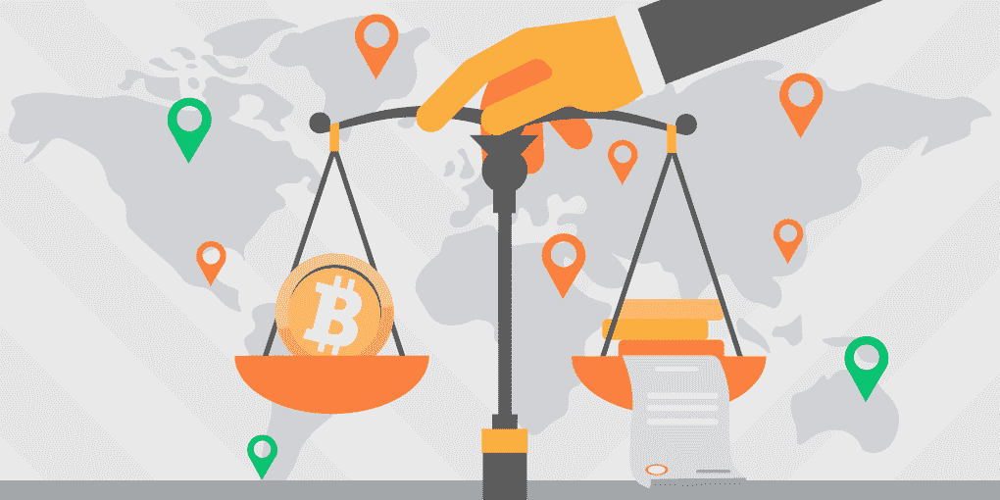

# 2021 年全球密码法律有多严格？

> 原文：<https://medium.com/coinmonks/how-strict-are-the-crypto-laws-globally-in-2021-dd79b2d890a0?source=collection_archive---------10----------------------->

密码产业现在已经有 12 年的历史了，世界上大多数政府都已经制定了相应的法规。有些国家禁止比特币；在其他合法的地方，你可以或不可以对数字资产做很多事情。

一些国家制定了自己的法规，而另一些国家则依赖现有的框架，如 FATF(金融行动特别工作组)。反洗钱和 CFT 等国际法在全球范围内监管数字资产的交易，试图让加密货币生态系统更加安全。

我们来看看世界各地都有哪些比特币法规。

# 欧洲的密码法

欧盟对加密有利。在这里，它是完全合法的，你可以自由买卖和存储比特币。各州的税收政策各不相同。在法国等国家，比特币甚至被列为法定货币。通过在 2020 年实施第五个反洗钱指令，欧盟将市场置于严格的反洗钱监管之下。

一些欧盟国家尤其欢迎数字资产。即**马尔他**官方**将加密货币描述为“一种交易媒介，一种记账单位，或者一种价值储存手段”。这里对加密货币业务不征收特别税，加密交易也不用交增值税。这使得马耳他对许多世界级的加密公司很有吸引力。**

另一个对加密更友好的国家是爱沙尼亚:它承认加密硬币是“以数字形式表示的价值”。然而，任何想在这个国家开展的项目都必须遵守严格的 KYC/反洗钱法规。

一些靠近欧盟的国家对加密也相当友好。**英国**允许使用数字货币，有详细的税法，并在金融行为管理局注册了加密交易所。英国海外领地**直布罗陀**于 2018 年采用了渐进式数字账本技术监管框架。瑞士也有类似的法律，在那里，加密货币被视为资产并被相应征税。

# 美洲的加密法规

虽然有人可能认为美国是一个对加密很友好的国家，但事实并非如此。美国的加密立法非常复杂:SEC 和 CFTC 这两个机构负责这个问题，很难满足他们的要求。2020 年，两个巨大的超级雄心勃勃的项目 Libra 和 TON 在 SEC 的指控和质疑下崩溃了。在美国，比特币被视为财产。如果你想提取你的比特币利润，你必须支付资本利得税，但如果你只是持有它，就不必支付任何费用。

在加拿大，加密法规非常缺乏。尽管交易所是合法的，并且符合反洗钱政策，但仍有很大的操作空间。在**墨西哥**，加密被中央银行归类为“虚拟资产”，也必须遵守反洗钱法律。

在南美，各州对加密货币的感觉非常不同。在**波利维亚**，它们被完全禁止，而在**厄瓜多**，它们被严格限制。在大多数其他国家，加密货币被视为资产；然而，法律是稀缺的，没有为数字硬币的发展和采用建立一个坚实的基础。在一些国家，没有任何密码法律。

# 亚洲和澳大利亚

在中国，加密法非常严格:你可以买卖比特币，但通过加密进行价值转移是非常不受欢迎的，加密交易所和 ico 是被禁止的。然而，有两件事很重要:在中国采矿是允许的(占比特币总哈希值的一半以上)，政府鼓励使用区块链技术(尽管只是为了“实体经济”的目的)。然而，最近中国对采矿业的打击可能表明，政府正在寻求加强对加密的控制。

然而，在依赖中国的香港，情况并没有那么糟糕。他们有一个非常坚实的数字硬币法律框架，加密交易所可以正式注册。同样的事情也与新加坡有关:加密在这里是合法的，被视为一种商品，并且要缴纳当地的增值税。

**日本**从早期的加密技术开始，就已经有了众多的加密项目，所以这个国家对于数字资产有着良好的法律和经济环境。比特币在日本被视为财产，并意味着 15%至 55%的税收，而加密交易所必须遵守严格的反洗钱/CFT 规则，并证明其网络安全水平。

2019 年，一名居住在东京的年轻女子决定尝试一项[“BCH 生存挑战”](https://changenow.io/blog/cryptocurrency-in-japan-from-mt-gox-to-bch-survival-challenge)——她准备在三天内只用比特币现金购物和逛餐馆。挑战成功了，证明了东京是世界上对密码最友好的城市之一。如果没有日本有利的密码立法，这是不可能的。

在**南韩**和**澳洲**，加密货币出现的时间没有日本长，但是他们的法律背景也很强大。在韩国，直到最近加密还是免税的。2021 年 5 月，宣布将征收高达 20%的税，扣除采矿费用。

印度的情况不太乐观。2020 年 3 月，该国广泛庆祝该国最高法院解除对加密的禁令。然而，这一决定已经被推翻，加密货币至今仍处于悬而未决的状态。最新消息表明，印度政府目前正在考虑加密立法。

# 非洲的密码法

在非洲，很少有国家至少采用了某种加密法规。在大多数国家，根本没有法律来协调该地区的密码交换——这可能会使那些操作密码的人处于危险之中。例如，在**南非**，加密货币不受监管，但卖家有义务不接受数字硬币支付。

加密货币在**阿尔及利亚**、**埃及**(此处视为圣地)**利比亚**、**摩洛哥**、**纳米比亚**、**赞比亚**、**津巴布韦**被正式禁止。尼日利亚也在 2021 年 2 月加入了这个俱乐部。官员们表示，加密货币由于其波动性可能会损害经济，并且不能被视为合法，因为它们是由未经授权的实体发行的。

这样的决定引发了一个很大的担忧:首先，许多当地人已经在使用数字资产，因为该国缺乏金融服务(PayPal 在尼日利亚不工作)。第二，该国的密码产业正在崛起，许多高科技企业面临风险。至于这些类型的企业，他们实际上在当前的环境下做得很好:总部设在非洲的加密企业正试图适应一些国际法律加密框架，以提高他们的可信度。我们希望这些努力将提高地方当局对加密货币的认识，数字资产将在充满希望的非洲地区获得更多法律支持。

> 加入 coin monks 电报频道，了解加密交易和投资

## 另外，阅读

*   [网格交易机器人](https://blog.coincodecap.com/grid-trading) | [加密交易机器人](/coinmonks/cryptohopper-review-a388ff5bae88) | [加密交易机器人](https://blog.coincodecap.com/best-crypto-trading-bots)
*   [加密复制交易平台](/coinmonks/top-10-crypto-copy-trading-platforms-for-beginners-d0c37c7d698c) | [如何在 WazirX 上购买比特币](/coinmonks/buy-bitcoin-on-wazirx-2d12b7989af1)
*   [CoinLoan 点评](/coinmonks/coinloan-review-18128b9badc4)|【Crypto.com】点评 | [火币保证金交易](/coinmonks/huobi-margin-trading-b3b06cdc1519)
*   [尤霍德勒 vs 科恩洛 vs 霍德诺特](/coinmonks/youhodler-vs-coinloan-vs-hodlnaut-b1050acde55a) | [Cryptohopper vs 哈斯博特](https://blog.coincodecap.com/cryptohopper-vs-haasbot)
*   [顶级付费加密货币和区块链课程](https://blog.coincodecap.com/blockchain-courses) | [币安评论](/coinmonks/binance-review-ee10d3bf3b6e)
*   [MXC 交易所评论](/coinmonks/mxc-exchange-review-3af0ec1cba8c) | [Pionex vs 币安](https://blog.coincodecap.com/pionex-vs-binance) | [Pionex 套利机器人](https://blog.coincodecap.com/pionex-arbitrage-bot)
*   [如何在印度购买比特币？](/coinmonks/buy-bitcoin-in-india-feb50ddfef94) | [WazirX 评论](/coinmonks/wazirx-review-5c811b074f5b) | [BitMEX 评论](https://blog.coincodecap.com/bitmex-review)
*   [印度比特币交易所](/coinmonks/bitcoin-exchange-in-india-7f1fe79715c9) | [比特币储蓄账户](/coinmonks/bitcoin-savings-account-e65b13f92451) | [HitBTC 审核](/coinmonks/hitbtc-review-c5143c5d53c2)
*   [币安收费](/coinmonks/binance-fees-8588ec17965) | [Botcrypto 审查](/coinmonks/botcrypto-review-2021-build-your-own-trading-bot-coincodecap-6b8332d736c7) | [Hotbit 审查](/coinmonks/hotbit-review-cd5bec41dafb) | [KuCoin 审查](https://blog.coincodecap.com/kucoin-review)
*   [我的加密副本交易经历](/coinmonks/my-experience-with-crypto-copy-trading-d6feb2ce3ac5) | [AAX 交易所评论](/coinmonks/aax-exchange-review-2021-67c5ea09330c)
*   [Bybit 融资融券交易](/coinmonks/bybit-margin-trading-e5071676244e) | [币安融资融券交易](/coinmonks/binance-margin-trading-c9eb5e9d2116) | [Overbit 审核](/coinmonks/overbit-review-9446ed4f2188)
*   [加密货币储蓄账户](/coinmonks/cryptocurrency-savings-accounts-be3bc0feffbf) | [YoBit 审核](/coinmonks/yobit-review-175464162c62) | [Bitbns 审核](/coinmonks/bitbns-review-38256a07e161)
*   [Botsfolio vs nap bots vs Mudrex](/coinmonks/botsfolio-vs-napbots-vs-mudrex-c81344970c02)|[gate . io 交流回顾](/coinmonks/gate-io-exchange-review-61bf87b7078f)
*   [Godex.io 审核](/coinmonks/godex-io-review-7366086519fb) | [邀请审核](/coinmonks/invity-review-70f3030c0502) | [BitForex 审核](/coinmonks/bitforex-review-c4bb28d9e271) | [北海巨妖审核](/coinmonks/kraken-review-6165fc1056ac)
*   [最佳比特币保证金交易](/coinmonks/bitcoin-margin-trading-exchange-bcbfcbf7b8e3) | [萝莉点评](/coinmonks/lolli-review-e6ddc7895ad8) | [比特币保证金交易](https://blog.coincodecap.com/bityard-margin-trading)
*   [创造并出售你的第一个 NFT](https://blog.coincodecap.com/create-nft) | [本地比特币评论](/coinmonks/localbitcoins-review-6cc001c6ed56) | [Prokey 评论](/coinmonks/prokey-review-26611173c13c)
*   [加密保证金交易交易所](/coinmonks/crypto-margin-trading-exchanges-428b1f7ad108) | [赚取比特币](/coinmonks/earn-bitcoin-6e8bd3c592d9) | [Mudrex 投资](https://blog.coincodecap.com/mudrex-invest-review-the-best-way-to-invest-in-crypto)
*   [WazirX vs CoinDCX vs bit bns](/coinmonks/wazirx-vs-coindcx-vs-bitbns-149f4f19a2f1)|[block fi vs coin loan vs Nexo](/coinmonks/blockfi-vs-coinloan-vs-nexo-cb624635230d)
*   [杠杆代币](/coinmonks/leveraged-token-3f5257808b22) | [最佳密码交易所](/coinmonks/crypto-exchange-dd2f9d6f3769) | [Paxful 点评](/coinmonks/paxful-review-4daf2354ab70)
*   [加密套利](/coinmonks/crypto-arbitrage-guide-how-to-make-money-as-a-beginner-62bfe5c868f6)指南| [如何做空比特币](/coinmonks/how-to-short-bitcoin-568a2d0b4ae5) | [1xBit 回顾](https://blog.coincodecap.com/1xbit-review)
*   [如何在印度购买以太坊？](https://blog.coincodecap.com/buy-ethereum-in-india) | [如何在币安购买比特币](https://blog.coincodecap.com/buy-bitcoin-binance)
*   [在美国如何使用 BitMEX？](https://blog.coincodecap.com/use-bitmex-in-usa) | [BitMEX 评论](https://blog.coincodecap.com/bitmex-review) | [期货交易机器人](/coinmonks/futures-trading-bots-5a282ccee3f5)
*   [最佳加密交易信号电报](/coinmonks/best-crypto-signals-telegram-5785cdbc4b2b) | [MoonXBT 评论](/coinmonks/moonxbt-review-6e4ab26d037) | [OKEx 评论](/coinmonks/okex-review-6b369304110f)