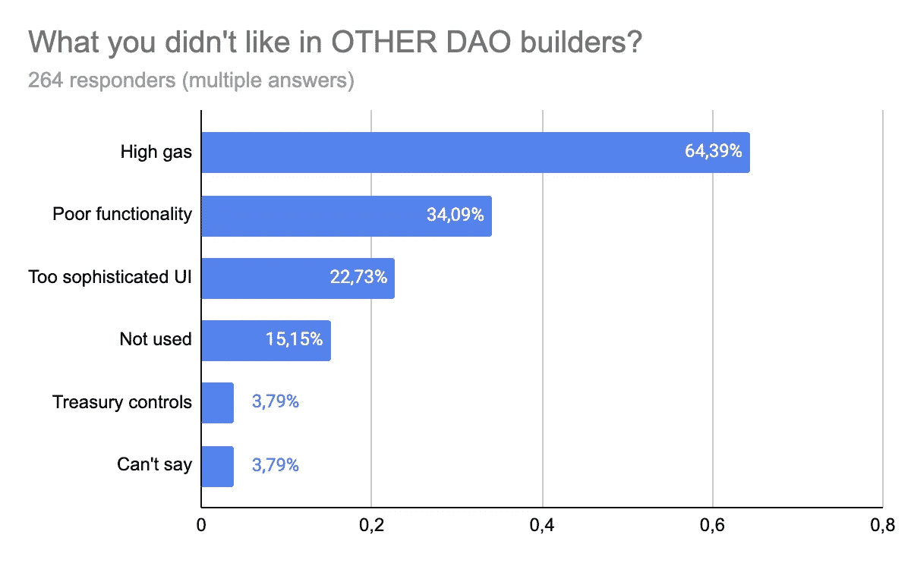
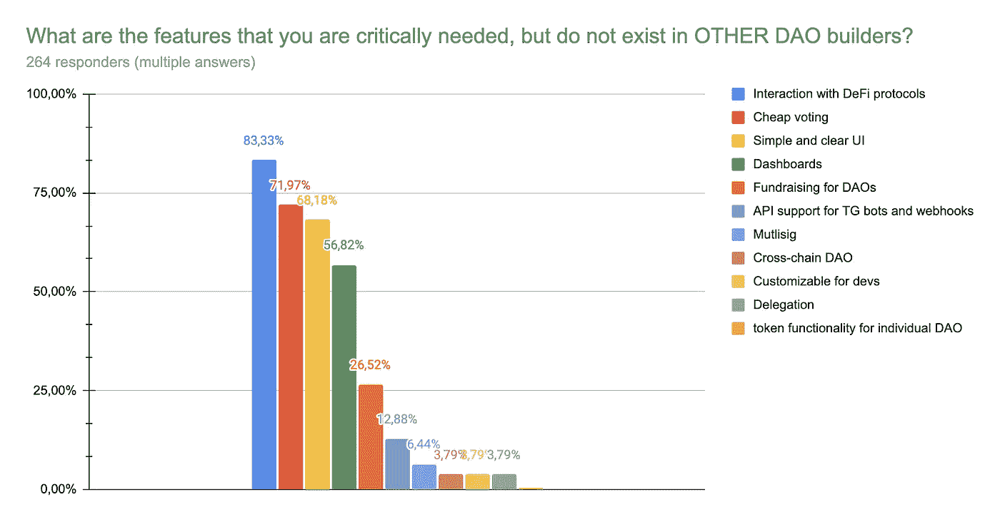

# 调查如何帮助开发全新的 DeFi 产品

> 原文：<https://medium.com/coinmonks/how-survey-can-help-to-develop-absolutely-new-defi-product-73cdc5915224?source=collection_archive---------3----------------------->

9 月，我们开始对 XDAO 用户进行问卷调查，以更好地了解他们的需求、目标、问题和兴趣。进行我们自己的独立研究对我们来说很重要，特别是因为一个问题“为什么要创建一个[去中心化的自治组织](/general_knowledge/what-is-the-foundation-of-a-decentralized-organization-7fd6bf4b0fbc)(后来—道)”被如此频繁地提出。一个 DAO 可以有很多不同的用途，第一眼看上去可能并不明显。

问卷调查是通过位于我们 XDAO 应用程序主页上的简单 Google 表单链接进行的。我们所有的用户都能参与其中。**从 2021 年 9 月到 11 月，我们有 700 人使用我们的平台，其中 264 人参加了问卷调查。**

在问卷调查结束时，我们收到了诚实、多样、有时出乎意料但非常有用的结果。

T **何第一个问题** **问的是关于使用其他刀的匠人。我们的目标是找出用户以前使用 DAO 构造函数的经验，以及他们喜欢或不喜欢这些构造函数的地方。**

在所有的回答中，我们毫不惊讶地看到[阿拉贡](https://aragon.org/)在我们以前用过的刀建造者的图表的顶部。这是完美的，因为我们的调查问卷主要是针对那些之前已经使用过 DAO 的用户。近 1/3 的受访者有过使用 [DAOHaus](https://daohaus.club/) 和 [DAOStack](https://daostack.io/) 的经历。然而，令人惊讶的是，组合保险箱/快照只占少数。

1st question about prior experience

第二个问题是关于先前与其他道建造者的负面经验。在这里，我们从已经有经验的用户那里寻找反馈，找出我们竞争对手的缺陷，为我们的用户创造一个完美的解决方案。

大多数受访者——64%的人抱怨高昂的汽油费。考虑到大多数 DAO 构建器都部署在以太坊上，这是完全有意义的。大约 1/3 的参与者对其他 DAO 构造器的糟糕功能不满意，另外 1/3 的参与者对他们过于复杂的界面不满意。事实上，现在在造刀市场上还没有一个强有力的领导者能够同时满足所有的需求，使用简单，价格低廉。

2nd questions about experience with other DAO builders

W **你认为人们创造刀的主要原因是什么？根据调查问卷，资本管理**成为创建 DAO 的主要原因。接下来的两位领导者是:**与 DeFi** 的互动，以及**对治理和发展问题的投票** —所有受访者中有 68%的人将 DAO 用于这些目的。

接下来— **完成企业管理**。听起来很鼓舞人心，不是吗？想象一下，在区块链上以完全分散的方式经营一家大公司。目前，没有一个现有的 DAO 构建者能够支持如此规模的 DAO。但是我们看到对它的需求越来越大，许多开发人员开始朝这个方向努力。最后是质量项目支持(1.5%)。我们特意将此分成一个单独的部分，以便了解 Dao 在加密社区中的目标有多么不同。

3rd question about main DAO goals

N 现在，我们来回顾一下 DAO 用户最想要的**特性** **。**

近 84%的参与者回应说，他们正在寻找一种与 DeFi 轻松互动的方式。这是目前所有现有的 DAO 构建器都缺少的特性。72%的人希望有更低的交易费用，这是可以预见的，因为大多数现有的 DAO 构造函数都在链上运行，而 gas，尤其是以太坊上的 gas，非常昂贵。

68%的 DAO 用户还发现现有的解决方案对用户不友好。首先，刀市场变化很快。第二，由于现有平台过于复杂的用户界面，能够真正适应它们并充分发挥其潜力的用户数量仅限于那些具有高水平编程技能的用户。如果 DAO 平台有更多用户友好的界面，我们会看到人们对形成 DAO 有更大的兴趣。

另一个目前缺少的有用特性是仪表板和统计数据。我们发现超过一半的问卷调查参与者希望拥有这一功能。

此外，一些响应者提出了一个非常好的想法，这将使许多区块链项目受益:**为 DAOs** 筹款。换句话说，许多 DAO 用户希望吸引支持相同想法的其他人的投资。我们发现这一点也很重要，因为人们现在意识到，一个道也可以作为一个基金来运作，这意味着它需要吸引投资者。在这一点上，这个想法只是越来越受欢迎，我们想感谢那些让我们注意到它的人。好消息是 XDAO 已经预测到了这一点，并将其作为 XDAO 版本 2 的核心功能之一。

对 TG 机器人和 webhooks 的 API 支持——这是一个非常有创意的想法，我们在开发 V2 时立即考虑到了这一点。委托——另一个值得关注的有用特性。有些情况下，关键道成员在一段时间内无法投票，但他们的声音非常重要。因此，治理令牌委托可能非常方便。

4th question about desirable features of a DAO builder

下一个问题是用 1-5 分给 V1 打分。5 分中有 4 分是近 61%的人给出的。

5th question about XDAO

W 在第一个版本中，我们实现了两件主要的事情:一个用于创建 DAO 的简单方便的项目界面和一个独特的想法。受访者还提到了低成本的天然气交易费。有趣的事实:最初我们考虑为 XDAO 创建我们自己的区块链。但现在这似乎是一个有趣的想法。

6th question about XDAO pros

我们还想知道有多少人和项目想要用自定义治理令牌投票。结果表明，它在绝大多数情况下都需要有自定义令牌才能投票。

7th question about custom GT

我们从这项调查中学到了什么？我们发现，需要一种成本不高、易于安装且财务管理足够简单的 DAO。通过创建这样一个系统，我们可以帮助人们安全地管理他们的资本，同时完全消除任何人参与欺诈的风险。

只有一个问题需要解决:以太坊仍然是 DAO 运营的主要网络，但同时人们希望降低其 DAO 运营过程中的成本。如何达成共识，提出一个 DAO 可以接受的价格来运营，并且仍然在 Mainnet 上发布产品？

> 我们的新 XDAO V2 诞生于我们早期采用者的想法和建议！

考虑到以上所有信息，让我们总结一下我们的成就:

*   我们找到了一种方法，与阿拉贡相比，可以将创建 DAO 的成本降低 50%;
*   我们制作了一个多功能的道生成器，既可以作为小型基金，也可以作为大型基金；
*   我们发布了一个基于模块的新版本，它将帮助 DAO 自动完成任务。模块将能够在电报中设置通知，自动任务，委托投票等..；
*   我们开发了一款独特的 DAO 钱包，可与 DeFi 配合使用。最频繁的请求现在以最好的方式得到满足；
*   我们还被要求使构造函数方便具有可靠性知识的程序员。最初，这不符合我们的无代码解决方案的概念。但是由于我们发布了 XDAO 模块，ant developer 将能够为特定的 DAO 创建一个自定义模块；
*   我们为道提供了一个完美的招商工具。在我们的平台上，任何用户都可以直接购买任何刀的代币，这样，任何人都可以成为刀的投资者。

让我们观察和比较 XDAO 接口:

Old XDAO UI

调查结束后，我们来到了这个界面:

New XDAO UI

没有我们的用户，我们不可能做到这一点！因此，对于那些知道我们项目的人来说，有一个很好的机会来看看这个新版本是否符合他们的期望。对于 DeFi 企业家，我们想说:“进行民意测验和调查，这是你了解你的客户的最好方法。”

点击链接测试 XDAO [这里](https://xdao.app)。

关注 XDAO:

[**推特**](https://twitter.com/xdaoapp) **|** [**电报**](https://t.me/xdao_eng)**|**[**YouTube**](https://youtube.com/channel/UCC58I-ghebVRepbwVsyJnCQ)**|**[**不和**](https://discord.gg/XAa64ABVd7)**|**[**insta gram**](https://www.instagram.com/xdaoapp/)

> 加入 Coinmonks [电报频道](https://t.me/coincodecap)和 [Youtube 频道](https://www.youtube.com/c/coinmonks/videos)了解加密交易和投资

## 另外，阅读

*   什么是融资融券交易
*   [MoonXBT vs Bybit vs 币安](https://blog.coincodecap.com/bybit-binance-moonxbt) | [硬件钱包](/coinmonks/hardware-wallets-dfa1211730c6)
*   [火币交易机器人](https://blog.coincodecap.com/huobi-trading-bot) | [如何购买 ADA](https://blog.coincodecap.com/buy-ada-cardano) | [Geco？一次审查](https://blog.coincodecap.com/geco-one-review)
*   [币安 vs 比特邮票](https://blog.coincodecap.com/binance-vs-bitstamp) | [比特熊猫 vs 比特币基地 vs Coinsbit](https://blog.coincodecap.com/bitpanda-coinbase-coinsbit)
*   [如何购买 Ripple (XRP)](https://blog.coincodecap.com/buy-ripple-india) | [非洲最好的加密交易所](https://blog.coincodecap.com/crypto-exchange-africa)
*   [非洲最佳密码交易所](https://blog.coincodecap.com/crypto-exchange-africa) | [胡交易所评论](https://blog.coincodecap.com/hoo-exchange-review)
*   [eToro vs robin hood](https://blog.coincodecap.com/etoro-robinhood)|[MoonXBT vs Bybit vs Bityard](https://blog.coincodecap.com/bybit-bityard-moonxbt)
*   [有哪些交易信号？](https://blog.coincodecap.com/trading-signal) | [比特斯坦普 vs 比特币基地](https://blog.coincodecap.com/bitstamp-coinbase)
*   [ProfitFarmers 点评](https://blog.coincodecap.com/profitfarmers-review) | [如何使用 Cornix Trading Bot](https://blog.coincodecap.com/cornix-trading-bot)
*   [如何在势不可挡的域名上购买域名？](https://blog.coincodecap.com/buy-domain-on-unstoppable-domains)
*   [印度的秘密税](https://blog.coincodecap.com/crypto-tax-india) | [altFINS 审查](https://blog.coincodecap.com/altfins-review) | [Prokey 审查](/coinmonks/prokey-review-26611173c13c)
*   [Blockfi vs 比特币基地](https://blog.coincodecap.com/blockfi-vs-coinbase) | [BitKan 点评](https://blog.coincodecap.com/bitkan-review) | [Bexplus 点评](https://blog.coincodecap.com/bexplus-review)
*   [南非的加密交易所](https://blog.coincodecap.com/crypto-exchanges-in-south-africa) | [BitMEX 加密信号](https://blog.coincodecap.com/bitmex-crypto-signals)