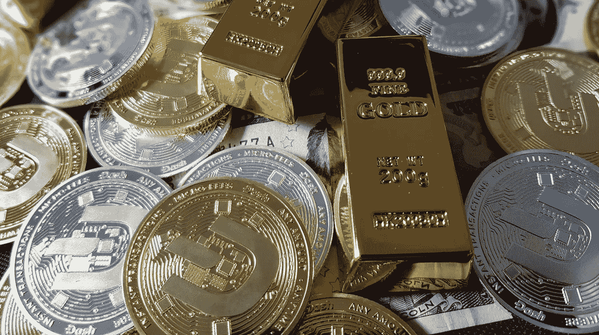

# Terra Luna(“露娜”)是如何在秘密世界中到达月球的

> 原文：<https://medium.com/coinmonks/how-terra-luna-luna-is-reaching-for-the-moon-in-the-crypto-world-7bae78f639cb?source=collection_archive---------4----------------------->

使用宇宙区块链技术建造的 terra Luna(Luna)结合了两个世界的优点——一个具有两个相互交织的令牌的网络，这两个令牌具有不同的效用。月神硬币在它的原生区块链，而泰拉美元(密码:TUSD)硬币在区块链以太坊。泰拉美元与美元挂钩，像所有其他稳定货币一样，它寻求…