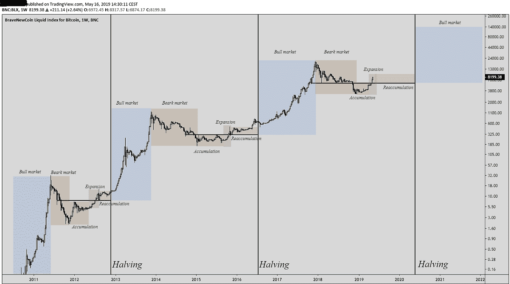

# 比特币减半如何影响比特币的价格

> 原文：<https://medium.com/coinmonks/how-the-bitcoin-halving-impacts-bitcoins-price-ac7ba87706f1?source=collection_archive---------0----------------------->

Bull Market Coming After Halving?

## 比特币减半是什么？

大约每四年，或者更具体地说，每 210，100 个区块，比特币网络的发行率就会减半。这被称为比特币减半。

自比特币诞生以来，价格已经减半了两次。第一次是 2012 年，第二次是 2016 年。这些事件也导致了显著的上升…