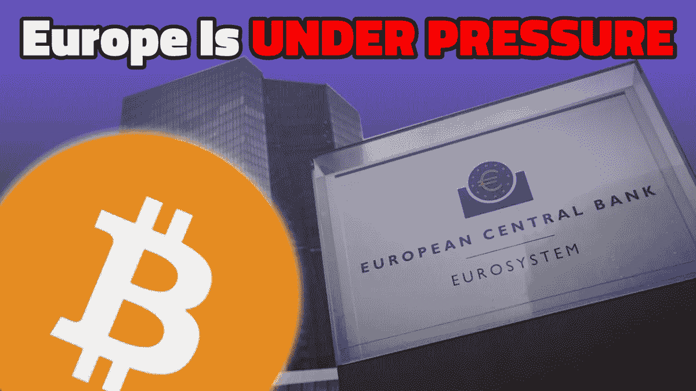
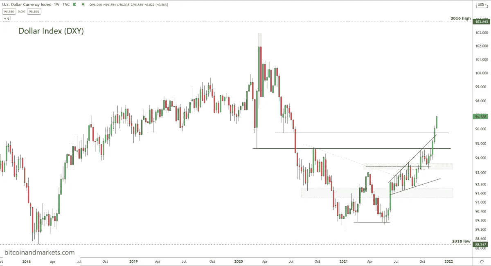
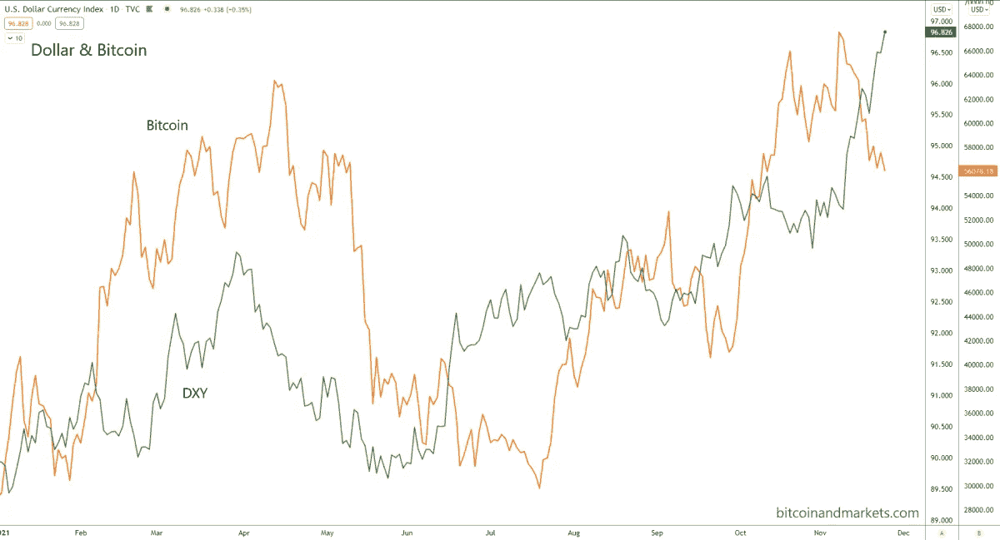

# 最新的宏观经济新闻如何影响比特币

> 原文：<https://medium.com/coinmonks/how-the-latest-macroeconomic-news-is-impacting-bitcoin-72ab26078dd7?source=collection_archive---------16----------------------->

从比特币的角度讨论杰罗姆·鲍威尔复职、欧洲债务危机、美元升值等等。

[**在 YouTube 上看这一集**](https://youtu.be/0jv6QWtwzHQ)

**听这一集:**

*   苹果
*   [Spotify](https://open.spotify.com/episode/2NNRGvrW4y0vWaZx7HRYZJ?si=-_ow5LssQBG0STREmg91XQ)
*   [谷歌](https://podcasts.google.com/feed/aHR0cHM6Ly9mZWR3YXRjaC5saWJzeW4uY29tL3Jzcw==/episode/M2QwZTVmYjYtNmIwYS00NWYyLTg1MTYtYTRhZDMxNGQxZWQ1)
*   [Libsyn](http://fedwatch.btc.libsynpro.com/fed-breaks-ranks-with-ecb-european-debt-crisis-2-fed-71)
*   [阴天](https://overcast.fm/+m2adu9h3w)

在因病休假一周后，我们带着比特币杂志的“美联储观察”播客的新一集回来了。在这一次，我和克里斯蒂安·克罗勒(Christian Keroles)坐下来讨论了央行神秘的竞争世界。话题包括美联储主席杰罗姆·鲍威尔的连任，有趣的是，这对欧洲中央银行(ECB)意味着什么。随着美联储牢记自己作为美国央行的角色，并远离对欧洲的责任，忠诚度正在发生巨大的转变。

我们以第一位琐事冠军开始了这一集。我希望人们回答这个问题:如果央行的资产负债表很重要，为什么欧洲央行和日本央行的通胀率比美国低，而资产负债表相对于 GDP 的比例比美国高？米奇( [@wittyusername30](https://twitter.com/wittyusername30) )得到了最佳答案。恭喜你。套用一句话:央行不印钞，它们用惰性储备换取有用的抵押品。这对经济产生了通货紧缩的压力。

# 鲍威尔再次被提名为主席

鲍威尔被拜登总统提名为美联储主席，击败了他的主要竞争对手莱尔·布雷纳德。列举了几个原因，例如鲍威尔通过参议院确认的道路要容易得多，而莱尔可能会在 50/50 的参议院中遇到党派分歧。此外，官员们表示，鲍威尔因成功带领经济度过 2020 年新冠肺炎衰退而获得了另一个任期的“奖励”。

我认为这个任命有更深的含义:

首先，我们已经在这个节目中详细讨论了 Powell 拒绝附和央行数字货币(CBDC)的炒作。其他央行正在努力推动 CBDCs，而鲍威尔不断地给这个想法泼冷水。这象征着与全球主义者的利益决裂，转而支持美国银行业的利益。

第二，鲍威尔面临着来自国会的越来越强烈的反对。像参议员伊丽莎白·沃伦这样的疯子攻击他，因为他不够鸽派，不相信美联储在气候政策中的作用。他的连任是对进步人士及其有害的 ESG 计划的一种批判。

第三，雷尔是更有利于全球主义者的选择。鲍威尔象征着与全球主义者决裂，转向以美国为中心的政策。

# 欧洲央行监管和恐慌

接下来，我们直接进入欧洲央行新闻。本周，它发布了新的电子支付监管框架:

> “欧元系统将使用新的框架来监督公司启用或支持支付卡、信用转账、直接借记、电子货币转账和数字支付令牌(包括电子钱包)的使用。PISA 框架还将涵盖与加密资产相关的服务，如商户在卡支付计划中接受加密资产，以及通过电子钱包发送、接收或支付加密资产的选项。”

这与美国形成鲜明对比，在美国，白宫和财政部试图在最近的基础设施法案中开辟一个比特币例外，具有讽刺意味的是，该法案遭到了希望保护名义上分散的骗局(DINO)的 altcoiners 的阻挠。

欧洲央行担心欧元将在未来几年失去市场份额，削弱其“货币主权”。它希望阻止来自美元稳定货币和比特币的竞争，同时为市场提供一个数字欧元——顺便提一下，市场还没有看到适合自己提供的数字欧元。

我们深入探讨了欧洲目前面临的诸多不利因素。当然，它有通货膨胀，但它也面临着美联储的背弃；供应链中断，贸易量萎缩；尽管独裁者在胁迫下强行注射，许多国家实行新的封锁和限制，新冠肺炎的病例数仍在上升；一场不断升级的能源危机将欧洲置于俄罗斯的掌控之中，而此时俄罗斯正在乌克兰边境集结军队。这是一场完美的风暴，导致资本逃离欧洲，转向美元，希望转向比特币。

# 比特币和强势美元

本周，美元果断突破新高，标志着全球金融体系的压力越来越大。看起来我们在过去 6 到 12 个月谈论的抵押品短缺正迅速转变为美元短缺。

*The collateral shortage is coming.*

比特币是一种中性资产，它已经准备好并愿意欢迎逃离欧洲和中国的资本。它还为资本提供了一个逃往的地方，不会使经济中的其他地方的债务失衡。

投资者知道，美元升值会损害全球经济。大多数债务以美元计价，随着美元升值，偿还这些债务变得更加困难。当美元走软时，世界会变得更好，但当美元走强时，世界会陷入衰退。比特币为这一价值提供了另一种逃避方式，或许能够缩短与美元的来回距离。

为了证明这个论点是正确的，我们应该看到美元和比特币一起上涨，这正是我们今年所看到的；非常紧密的关联。这不是因果关系，他们都受益于相同的市场条件。

如下图所示，美元在 2021 年 6 月首先上涨，一个月后比特币紧随其后。然后又是 2021 年 9 月，一个月后是比特币。最近，美元在 11 月初开始飙升，如果比特币也是如此，它应该会在 12 月初再次开始反弹。

*The dollar’s recent strength indicates an upcoming price rally for bitcoin.*

# 欧债危机 2.0？

第一次[欧债危机](https://www.investopedia.com/terms/e/european-sovereign-debt-crisis.asp) (EDC1)紧随金融大危机之后，在 2010 年至 2012 年达到顶峰。目前的形势更有可能以欧洲债务危机 2.0 告终。

正是在 EDC1 的巅峰时期，比特币首次确立了自己的地位，并在 2011 年的比特币泡沫中反弹至 30 美元。这次我们会看到 30 倍的反弹吗？可能没有那么多，但未来一年可能会出现大规模的反弹。

*原载于 2021 年 11 月 24 日 https://bitcoinmagazine.com***。**

> *加入 Coinmonks [电报频道](https://t.me/coincodecap)和 [Youtube 频道](https://www.youtube.com/c/coinmonks/videos)了解加密交易和投资*

# *另外，阅读*

*   *[huo bi 的加密交易信号](https://coincodecap.com/huobi-crypto-trading-signals) | [BitMEX 评论](https://coincodecap.com/bitmex-review)*
*   *[7 大最佳零费用加密交易平台](https://coincodecap.com/zero-fee-crypto-exchanges) | [购买流量令牌](https://coincodecap.com/buy-flow-token)*
*   *[分散交易所](https://coincodecap.com/what-are-decentralized-exchanges) | [比特 FIP](https://coincodecap.com/bitbns-fip) | [Pionex 评论](https://coincodecap.com/pionex-review-exchange-with-crypto-trading-bot)*
*   *[用信用卡购买密码的 10 个最佳地点](https://coincodecap.com/buy-crypto-with-credit-card)*
*   *[OKEx 回顾](/coinmonks/okex-review-6b369304110f) | [Kucoin 交易机器人](/coinmonks/kucoin-trading-bot-automate-your-trades-8cf0ca2138e0) | [期货交易机器人](/coinmonks/futures-trading-bots-5a282ccee3f5)*
*   *[AscendEx Staking](https://coincodecap.com/ascendex-staking)|[Bot Ocean Review](https://coincodecap.com/bot-ocean-review)|[最佳比特币钱包](https://coincodecap.com/bitcoin-wallets-india)*
*   *[霍比评论](https://coincodecap.com/huobi-review) | [OKEx 保证金交易](https://coincodecap.com/okex-margin-trading) | [期货交易](https://coincodecap.com/futures-trading)*
*   *[Cloudbet 赌场评论](https://coincodecap.com/cloudbet-casino-review) | [点火赌场评论](https://coincodecap.com/ignition-casino-review)*
*   *[Godex.io 审核](/coinmonks/godex-io-review-7366086519fb) | [邀请审核](/coinmonks/invity-review-70f3030c0502) | [BitForex 审核](https://coincodecap.com/bitforex-review)*