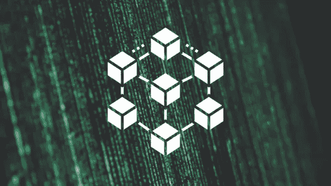
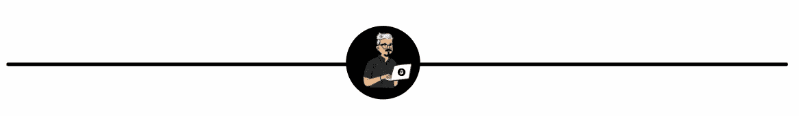
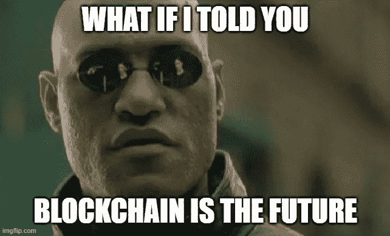
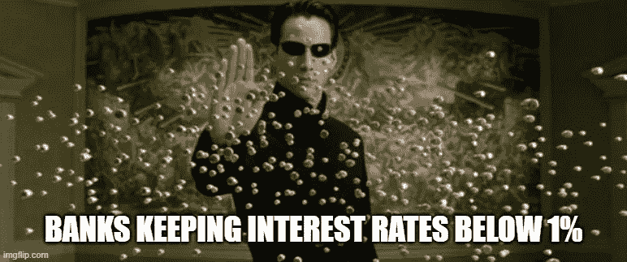

# 矩阵如何为区块链和去中心化铺平道路

> 原文：<https://medium.com/coinmonks/how-the-matrix-paved-the-way-for-blockchain-and-decentralisation-e22ade176564?source=collection_archive---------8----------------------->

## 红色药丸运动来了…

## 密码，去伪存真，NFT 和绿色运行代码

我刚刚看了第四部《黑客帝国》电影的预告片，片名恰如其分，叫做《复活》(如果你还没看过，停下你正在做的事情，现在就看这个吧！)。

再次看到那部著名的《绿色密码》让我想起了我看第一部电影的时候。无论是当时还是现在，这都是一套关于技术和人类进化的非常具有革命性的观点。

从第一部《黑客帝国》问世至今，人类和机器之间的互操作性以及最终由机器控制的故事实际上已经过去了将近 22 年。只是不像电影中描述的那样。

而不是在浴缸里与消耗我们能量的机器相连。我们盯着屏幕，这些屏幕正在消耗我们的注意力和精神能量，向我们展示一个在很多情况下并不真实的世界。

尽管我们生活在现实世界中(或者至少我认为我们是——埃隆可能不同意！).

我们大部分时间(如果不是全部的话)都生活在一个二级数字世界中，在这个世界中，我们接触到大量的二级数字世界和体验。我们的后脑勺没有插孔，只是一个粘在我们手上诱惑我们眼球的装置。

原《黑客帝国》探索的许多主题，包括独立、自由和从一个系统中去中心化的形式，与区块链世界中存在的东西是一样的。

《黑客帝国》中的角色想要从他们的虚拟监狱中挣脱出来，拥有选择的自由。区块链技术的世界遵循类似的路线。 **Crypto** 作为一种替代货币形式存在，是对被许多人视为可疑人物控制的中央系统的反叛。

电子金融的存在是为了让人们能够选择使用金融产品，让他们的财富增长超过中央机构设定的限制利率，而 NFT 的存在是为了提供一种不受传统机构管理和控制的新的所有权形式。

因此，区块链的世界及其所有创造与《黑客帝国》的叙事有很多共同点。好吧，反正在我看来。

红色药丸，蓝色药丸问题基本上就像问，你想从你的传统银行账户赚取 0.01%的利润，还是深入那个兔子洞，看看那些密码储蓄产品能把你带到哪里？

这完全是选择——自由意志。

这不仅仅是一件受赛博朋克影响的酷酷的艺术作品，它也像一个奇怪的诺查丹玛斯类型的预言家，在未来发生之前告诉我们未来。

技术成瘾、去中心化、人机一体化都是我们今天生活的内容。比特币中最初的加密货币诞生于《黑客帝国》上映大约 10 年后，它是这部电影所宣传的一切。

选择、自由和自愿。

随着区块链技术的不断发展，像 NFT 和去伪存真这样的创新将继续兴起，让位于更多重塑我们世界的数字工具。

> *我们几乎可以肯定已经跳进了兔子洞，但我们还能走多远？*

# 更多来自我

[全球加密采用率在 12 个月内上升了 888%:](/coinmonks/worldwide-crypto-adoption-rises-by-888-in-12-months-what-this-means-for-the-future-of-finance-276569cf1531)这对金融业的未来意味着什么。

[百万美元比特币:幻想还是现实？](https://medium.datadriveninvestor.com/million-dollar-bitcoin-fantasy-or-a-certain-reality-68feb9abd4c3)

# 想要更多这样的吗？

[订阅我的免费双周刊简讯](https://www.getrevue.co/profile/One_More_Thing)专注于分享提高你财商的最佳内容。没有垃圾邮件，随时退订。

# 重要的🚨

我不是财务顾问、心理学家或任何被认可的专业人士。因此，这不是财务建议，我没有资格或许可提供任何类似的东西。这些内容是一群来自人类同胞的想法，仅用于教育目的——仅此而已。

> 加入 Coinmonks [电报频道](https://t.me/coincodecap)和 [Youtube 频道](https://www.youtube.com/channel/UCbyDhTbOiKh2iUMKBi4-4Zg)了解加密交易和投资

## 另外，阅读

*   [尤霍德勒 vs 科恩洛 vs 霍德诺特](/coinmonks/youhodler-vs-coinloan-vs-hodlnaut-b1050acde55a) | [Cryptohopper vs 哈斯博特](https://blog.coincodecap.com/cryptohopper-vs-haasbot)
*   [币安 vs 北海巨妖](https://blog.coincodecap.com/binance-vs-kraken) | [美元成本平均交易机器人](https://blog.coincodecap.com/pionex-dca-bot)
*   [如何在印度购买比特币？](/coinmonks/buy-bitcoin-in-india-feb50ddfef94) | [WazirX 评论](/coinmonks/wazirx-review-5c811b074f5b) | [BitMEX 评论](https://blog.coincodecap.com/bitmex-review)
*   [比特币主根](https://blog.coincodecap.com/bitcoin-taproot) | [Bitso 回顾](https://blog.coincodecap.com/bitso-review) | [排名前 6 的比特币信用卡](/coinmonks/bitcoin-credit-card-bc8ab6f377c6)
*   [双子座 vs 比特币基地](https://blog.coincodecap.com/gemini-vs-coinbase) | [比特币基地 vs 北海巨妖](https://blog.coincodecap.com/kraken-vs-coinbase) | [CoinJar vs CoinSpot](https://blog.coincodecap.com/coinspot-vs-coinjar)
*   [印度加密交易所](/coinmonks/bitcoin-exchange-in-india-7f1fe79715c9) | [比特币储蓄账户](/coinmonks/bitcoin-savings-account-e65b13f92451) | [Paxful 审核](/coinmonks/paxful-review-4daf2354ab70)
*   [杠杆令牌](/coinmonks/leveraged-token-3f5257808b22) | [最佳加密交易所](/coinmonks/crypto-exchange-dd2f9d6f3769) | [AscendEX 评论](/coinmonks/ascendex-review-53e829cf75fa)
*   [Godex.io 审核](/coinmonks/godex-io-review-7366086519fb) | [邀请审核](/coinmonks/invity-review-70f3030c0502) | [BitForex 审核](https://blog.coincodecap.com/bitforex-review) | [HitBTC 审核](/coinmonks/hitbtc-review-c5143c5d53c2)
*   [Crypto.com 费用](/coinmonks/binance-fees-8588ec17965) | [僵尸加密审查](/coinmonks/botcrypto-review-2021-build-your-own-trading-bot-coincodecap-6b8332d736c7) | [替代品](https://blog.coincodecap.com/crypto-com-alternatives)
*   [有哪些交易信号？](https://blog.coincodecap.com/trading-signal) | [Bitstamp vs 比特币基地](https://blog.coincodecap.com/bitstamp-coinbase) | [买索拉纳](https://blog.coincodecap.com/buy-solana)
*   [ProfitFarmers 点评](https://blog.coincodecap.com/profitfarmers-review) | [如何使用 Cornix Trading Bot](https://blog.coincodecap.com/cornix-trading-bot)
*   [MXC 交易所评论](/coinmonks/mxc-exchange-review-3af0ec1cba8c) | [Pionex vs 币安](https://blog.coincodecap.com/pionex-vs-binance) | [Pionex 套利机器人](https://blog.coincodecap.com/pionex-arbitrage-bot)
*   [我的密码交易经验](/coinmonks/my-experience-with-crypto-copy-trading-d6feb2ce3ac5) | [比特币基地评论](/coinmonks/coinbase-review-6ef4e0f56064)
*   [CoinFLEX 评论](https://blog.coincodecap.com/coinflex-review) | [AEX 交易所评论](https://blog.coincodecap.com/aex-exchange-review) | [UPbit 评论](https://blog.coincodecap.com/upbit-review)
*   [AscendEx 保证金交易](https://blog.coincodecap.com/ascendex-margin-trading) | [Bitfinex 赌注](https://blog.coincodecap.com/bitfinex-staking) | [bitFlyer 点评](https://blog.coincodecap.com/bitflyer-review)
*   [麻雀交换评论](https://blog.coincodecap.com/sparrow-exchange-review) | [纳什交换评论](https://blog.coincodecap.com/nash-exchange-review)
*   [加密货币储蓄账户](/coinmonks/cryptocurrency-savings-accounts-be3bc0feffbf) | [赌注加密](https://blog.coincodecap.com/staking-crypto) | [加密交易机器人](https://blog.coincodecap.com/best-crypto-trading-bots)