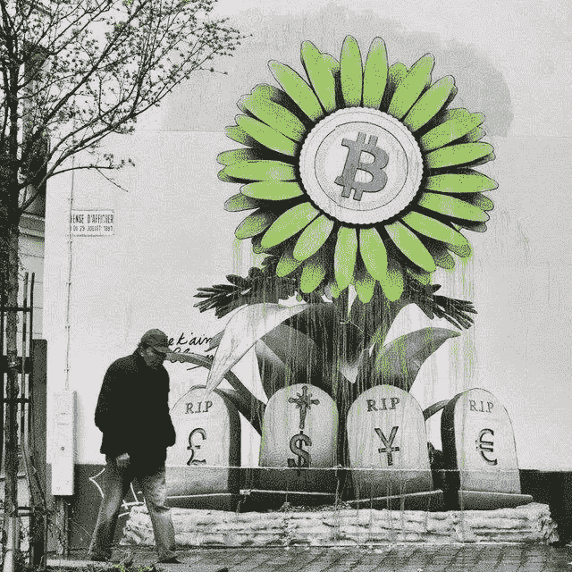
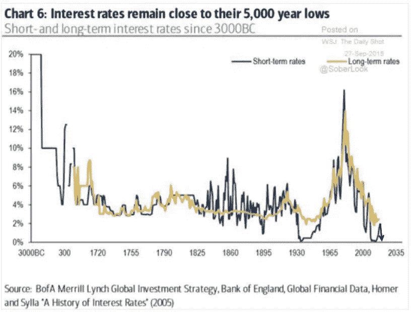
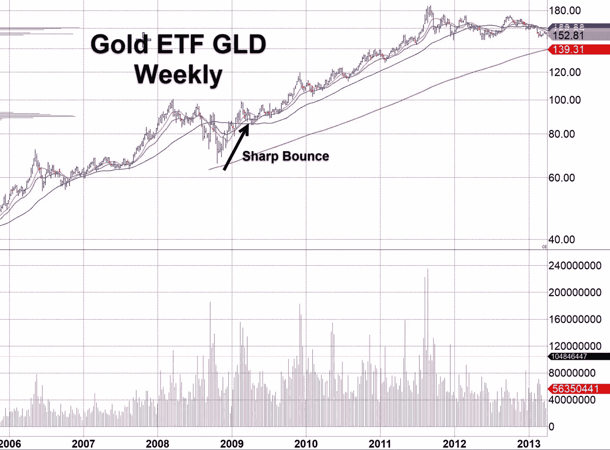
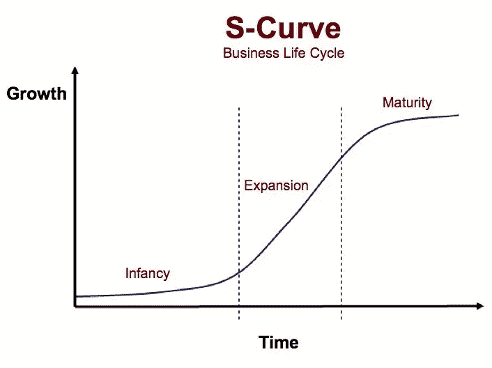

# 主权债务泡沫如何继续看涨比特币和硬资产

> 原文：<https://medium.com/coinmonks/how-the-sovereign-debt-bubble-remains-bullish-for-bitcoin-and-hard-assets-618e69241f68?source=collection_archive---------2----------------------->

克利斯·凯驰博士

**crypto technologies…Cryptonite for Governments**

Image courtesy of [https://news.bitcoin.com](https://news.bitcoin.com)

**英国退出欧盟、贸易战和经济衰退**

虽然英国退出欧盟和贸易战的短暂发展将美国市场推回到旧高点，但整体环境仍然受到新闻的巨大推动。QE 推动市场连续走高，而主要股票继续滞后，贸易战问题以及英国退出欧盟仍处于动荡之中。与此同时，全球经济仍在衰退中徘徊。所有这些都解释了自 8 月份以来主要指数的无所事事的草率行动。

数据显示，9 月份中国生产者价格同比下降 1.2%，为 2016 年以来的最大降幅，进一步表明工厂受到中美贸易争端的影响。北京已指示央行保持对企业的信贷流动，以应对经济放缓。9 月份，社会融资总额(中国衡量信贷的最广泛指标)的增速远超预期，而人民币贷款同比增长 12.5%。

在欧洲，英国退出欧盟的担忧最终影响到了英国的劳动力市场。截至 8 月份的三个月中，就业人数减少了 5.6 万人。德国 ZEW 指数创下 2010 年以来的最低水平，该指数是本月欧洲以外的首个大型情绪指标。

**菲亚特未悬挂**

1971 年，黄金支持的菲亚特终结，开启了大债务时代，信贷可以无休止地扩张，但当然不会没有可怕的后果。这种由中央银行控制的信贷扩张被称为量化宽松，或 QE。2008 年的金融崩溃将 QE 推向了 5000 年来债务创纪录、利率最低的境地(如下图所示)。2008 年的利率可能会降低，这给了央行更多时间来进一步摆脱债务负担。

**你会*付给*某人*贷款*他们的钱吗？**

通过回溯和连接所有的点，QE 把加密市场变成了风险投资市场，风险投资市场变成了股票市场，股票市场变成了债券市场，债券市场变成了你的储蓄账户，而你的储蓄账户变成了你的支票账户，最后三种工具在某些情况下会向你收取存款费用。你会付钱给某人借钱给他们吗？随着负收益率债券的价值接近 18 万亿美元，这正是全球正在发生的事情。

由于利率目前处于历史最低水平，当下一次衰退来袭时，央行将几乎没有刺激经济的弹药。巨大的主权债务泡沫不可能在没有严重通胀的情况下收缩，这意味着更高水平的 QE，从而更高水平的包括法定货币在内的所有货币贬值。

到目前为止，由于 QE，房地产、黄金、股票和比特币的价格已经大幅上涨。正如我在以前的文章中所写的，只要 QE 保持流动，所有人都应该继续受益。如果像 2008 年或之前的衰退那样发生信贷紧缩，即衰退，股票和房地产都将遭受价格下跌。然而，请记住，尽管 2008 年崩盘后所有资产的价格都大幅下跌，但随着恐慌的资本涌入这种被称为“恐惧”交易的贵金属，黄金是第一种大幅反弹并创下新高的资产。

**比特币赶超黄金成为 SoV？**

当然，黄金是当时世界公认的唯一价值储存手段。比特币当时还不存在，只是最近才通过在芝加哥商业交易所和洲际交易所的 Bakkt 等主要平台上市，最终获得了足够的机构牵引力。洲际交易所还拥有纽约证券交易所。请记住，比特币和区块链仍处于 S 曲线略微倾斜部分的婴儿期，因为使用率仍然只有 0.5%至 1.0%，这取决于使用的指标。也就是说，由于两者都是呈指数增长的技术，使用量每年都会翻倍。

**当下一次经济衰退来袭…**

因此，当下一次经济衰退来袭时，比特币可能会和黄金一样成为受益者，因为寻求避风港的资本会涌入这两种工具。也就是说，比特币有固定的供应量，因此不会被吹走，并且优于黄金，因为它是私有的，安全的，并且不受审查。此外，比特币处于反通胀供应状态，而全球黄金供应量在过去一个世纪每年增长 1——2%。因此，比特币相对于黄金的价格可能会大幅上涨，更不用说帮助比特币实现投机史上[最大价格上涨](https://www.newsbtc.com/2019/10/13/fun-fact-bitcoin-price-is-up-838000000-in-ten-years-time/)的持续顺风了。

**央行行长们觉醒了**

就连英国央行(Bank of England)的马克·卡尼等央行行长也开始意识到比特币等加密货币被用于点对点价值转移，他最近质疑了美元的储备货币地位。传统上，当一个国家向另一个国家出售产品时，那个国家通常使用美元。但越来越多的国家可能开始使用比特币等加密货币进行此类交易。一旦交易完成，通过立即将加密货币转换为法定货币，可以消除加密货币的价格波动风险。

**指数增长**

如果以史为鉴，大多数大资金和散户投资者都忽略了指数级增长技术背后的潜力。这就是 S 曲线技术的本质，也解释了为什么前几年大多数人没有购买比特币或以太坊。随着世界陷入更深的债务，这些技术背后的破坏性潜力就越大，因为它们满足了日益增长的迫切需求。奇怪的是，随着比特币和以太坊的发展，它们背后的规模潜力肯定会将它们推向新的高度。几年前，几十个项目正在建设中，但所有项目上线的机会都很有限。今天，有各种各样的关键技术应用于比特币的第 0 层和第 2 层，它们不会牺牲隐私，很有可能在未来几年内上线，这将使比特币和以太坊的可扩展性增加几个数量级。

**我们信任比特币吗？**

关于主题,“我们相信上帝”这句话印在美钞上。科学或工程中没有任何运载工具或平台有这种题字。粒子加速器、电泳凝胶、SIM 芯片需要这样的题字吗？设计得当的货币不会基于信仰，而是基于科学。到目前为止，比特币就是如此。

**比特币与互联网使用**

1995 年，全世界使用互联网的人口比例为 0.4%。今天，大多数人使用互联网。甚至第三世界国家也开始通过廉价手机进行价值交易。比特币促进了价值的无国界转移，就像互联网促进了信息的无国界流动一样。今天使用比特币的人的百分比接近于 1995 年使用互联网的百分比。因此，如果你认为比特币的价格太高，请三思。也就是说，像往常一样，要知道比特币的波动性非常大，因此很容易重新测试之前的中间低点。保持你的头寸规模与你的风险承受水平一致。

**(͡:B ͜ʖ ͡:B)**

**由克利斯·凯驰博士主持的** [**汉瑟数字接入**](https://hansedigitalaccess.com) **、KJA 数字资产投资** [**美德自私投资**](http://www.selfishinvesting.com/)

> [直接在您的收件箱中获得最佳软件交易](https://coincodecap.com/?utm_source=coinmonks)

