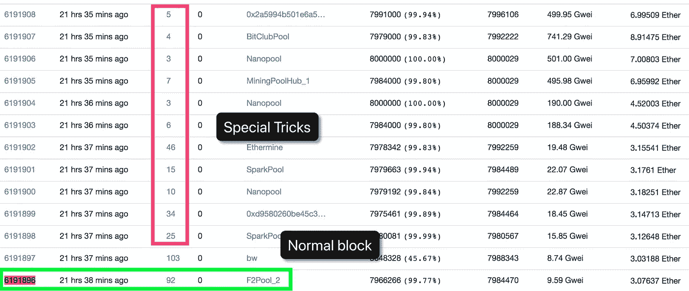
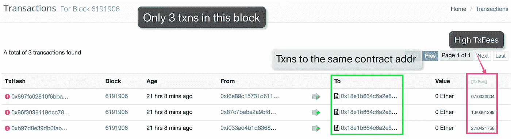
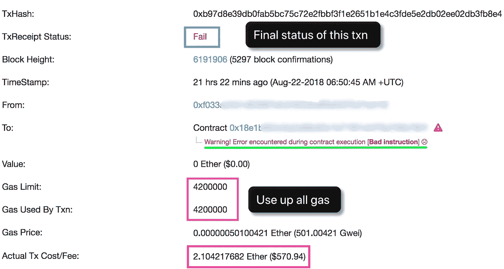
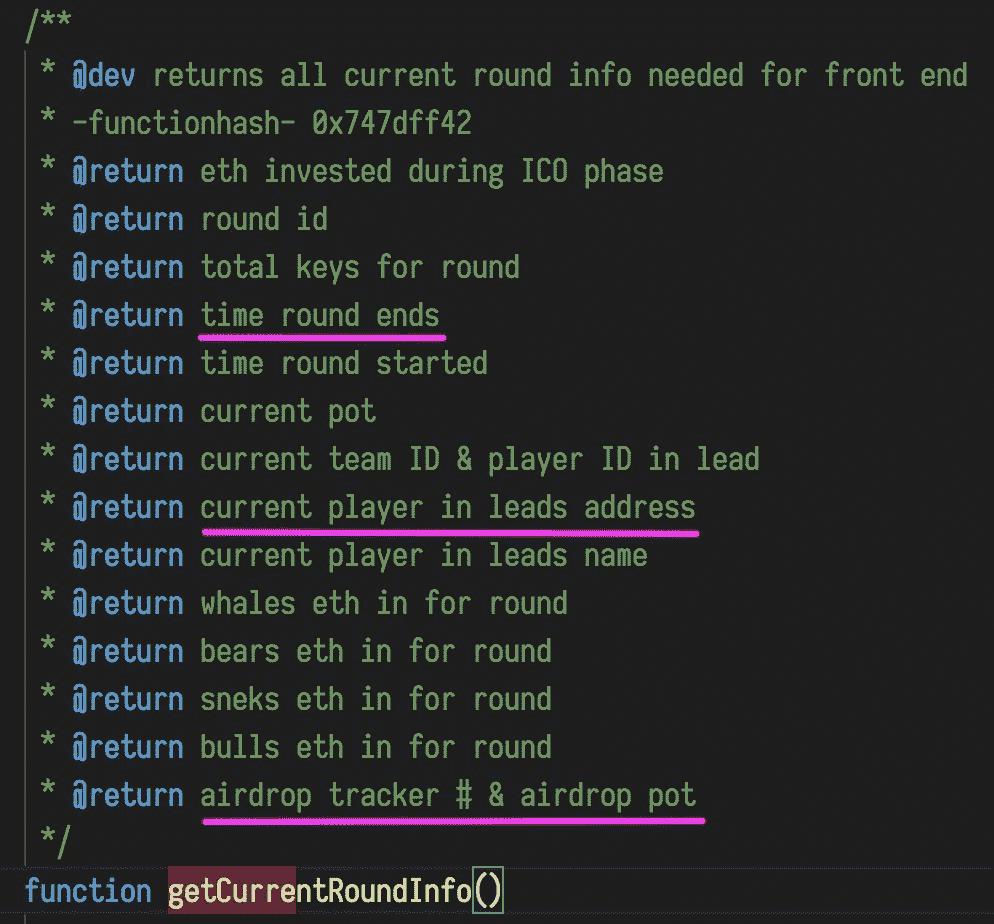

# 获奖者如何获得 Fomo3D 大奖——详细解释

> 原文：<https://medium.com/coinmonks/how-the-winner-got-fomo3d-prize-a-detailed-explanation-b30a69b7813f?source=collection_archive---------0----------------------->

Photo by [Tom Roberts](https://unsplash.com/photos/zDiBoBByRXw?utm_source=unsplash&utm_medium=referral&utm_content=creditCopyText) on [Unsplash](https://unsplash.com/@tomrdesigns?utm_source=unsplash&utm_medium=referral&utm_content=creditCopyText)

Fomo3D 第一轮已经结束，获胜者地址为 0xa169，奖金为 10469.66 乙醚。

你可能觉得中奖的只是一个普通的参与者。

**SECBIT Labs** 首先发现 Fomo3D 赢家玩了一个特殊的攻击招数，在比赛临近结束时大幅减少矿工打包的交易数量(涉及多个区块)，加速了比赛结束的临近，增加了获胜概率。SECBIT 实验室还观察到了与上一轮 Last Winner 有关的几个类似的异常块和交易。

# 一系列异常块和事务

A series of blocks (Source: Etherscan)

图为高度为 6191896 的区块打包了 Fomo3D 赢家最后一笔关键购买交易，包含 92 笔交易正常。

但是后面 11 个块(6191898~6191908)的交易数急剧下降，最小块(6191906)只有 3 笔交易，这是不正常的。

看看这些“特殊”的积木。

A special block with only 3 txns to the same addr

这里可以看到高度为 6191906 的区块只有 3 笔交易发送到同一个合约(调用同一个神秘合约)，交易费用之和大于 4 个以太。

这个神秘契约的创造者(0x18e1)正是赢家(0xa169)！

F2POOL 的负责人告诉我们，一个 TxFee 高的事务会先进入并被打包成块。

这解释了上面提到的 11 个块拥有过多的 TxFee，而它们只打包很少的事务。这些区块由采矿池处理，如 SparkPool、Nanopool、Ethermine、BitClubPool、MiningPoolHub。显然，选择交易费用高的交易符合矿池的利益，这在整个行业被广泛应用[【1】](#9056)。

# “神秘契约”到底做了什么？

SECBIT Labs 发现，这些在相关区块发送到攻击契约的异常交易，最后都失败了。

Attacking txn

从上图中我们可以看到，最终状态是“失败”,以太网扫描有一个警告`Bad instruction`,气体限制(4200000)耗尽，这是正常气体限制的一半，向打包交易的采矿池发送高 TxFee。

> *以太坊中的 Gas limit 代表单个区块中批准的最大 Gas，以确定该区块中打包的交易数量。通常情况下，区块瓦斯限值是在矿工之间用一定的策略设定的，常用值为 8000000*[*【2】*](#b2c3)*。*
> 
> *eth reum 中的每笔交易也有交易发送方设置的气体限制，即交易消耗的最大气体量。实际用气量由实际交易执行过程决定。所有交易气体的总和不能超过阻塞气体限制*[*【3】*](#4392)*。*

我们知道以太坊智能合约中的 assert()是用来断言的。当断言的结果不满足条件时，气体将被耗尽。在这种情况下，Etherscan 会通知`Bad instruction`，这实际上是因为 EVM 遇到了一个未定义的运算符`0xfe`[【4】](#1ffc)。

胜利者(攻击者)利用了这一特性，并以很少的交易占用了区块气限。

# 更多优秀的黑客

此外，SECBIT 实验室发现，神秘的合同将调用 Fomo3D 中的`getCurrentRoundInfo()`来获得当前回合的信息，如剩余时间和最后一个买家。

Fomo3D Code

“神秘契约”没有公布它的源代码。结合逆向工程的结果，SECBIT 实验室推断，获胜者将调用神秘合同中的方法来查询信息，特别是时间回合结束和当前玩家的线索地址。当剩余时间达到一个阈值，最后一个买家是攻击者时，调用`assert()`使交易失败，用完所有气体；当剩余时间离门槛很远或者最后一个买家是别人的时候，什么都不做，这很耗气。

赢家(攻击者)利用这种方法，发起了许多类似的易变神秘交易:当攻击者有较高的获胜变化时，使用这些神秘交易，这些交易将首先被挖矿池打包，并占用后续区块，导致其他关键购买无法及时打包的情况，加速了游戏结束的临近，大大增加了攻击者的获胜概率。

# 其他技术和细节

*   SECBIT Labs 观察到，Fomo3D winner(攻击者)通过不同地址的交易，创建了多个类似的神秘合约(攻击合约)，以分散注意力，降低暴露几率。每个合同都有很多交易，使攻击者成为赢家的合同(0x18e1)有超过 5000 笔交易，这是一个巨大的努力。
*   在调用神秘契约(攻击契约)时，胜利者(攻击者)会尝试从 170000 到 480000 的不同气体限制，这也是一种技术。
*   包含 Fomo3D 赢家(攻击者)0xa169 购买密钥的交易的区块(6191896)之后的 10 多块没有与 Fomo3D 密钥购买相关的交易，最终结束游戏。
*   下一个块(6191897)也包含许多异常交易。
*   在游戏结束之前，我们许多人都认为攻击者会与大型矿池合作，拒绝对手的交易以获得奖金，或者攻击者会发起大量无用的交易来拥塞以太坊网络以获得奖金，因为对手的交易无法打包。
*   胜利者(攻击者)利用了共同的打包优先权，而不是与矿池合作。
*   神秘契约(攻击契约)简直就是把智能契约变成武器的经典模式，精准无比，对象明确。这种攻击比在游戏接近尾声时通过调整油价来启动交易高明得多。广播到每个矿池的攻击事务就像内存池中的导弹一样，在等待合适的行动时机。
*   SECBIT Labs 在 Last Winner 结束时也观察到多个类似的异常交易和阻塞。
*   赢家(攻击者)创造的神秘契约，正在与其他类似 Fomo3D 的游戏(如超级卡)频繁交易，意图以同样的手法获得奖品。
*   根本没有‘黑天鹅’，只有聪明勤奋的攻击者。请参考‘幂律分布’和‘博弈谬误’[【5】](#efbb)。

# 幸运的 F2POOL 采矿池

还有一点值得一提的是，获胜的交易和之前的两个游戏(Fomo3D，Last Winner)的交易都是被 F2Pool 打包的。

经过详细的讨论，SECBIT 实验室和 F2POOL 都初步确认这仅仅是一个巧合。F2POOL 有幸看到了两个流行的智能合约游戏的获胜回合。

# 智能合约游戏的未来

SECBIT Labs 报告了在 Last Winner 和其他 Fomo3d 类游戏中的攻击，攻击者利用原始 Fomo3D 游戏中的 airdrop bug 来获得更多奖励，以及 Fomo3D Quick 中的漏洞。

我们在感叹特殊的获胜技巧的同时，也在担心智能合约游戏的未来。

作为 2018 年最受欢迎的智能合约游戏，Fomo3D 在技能和法则上做了很多创新，这是智能合约游戏史上的一大飞跃。不可否认的是，Fomo3D 开发团队拥有超强的编程能力和强烈的去中心化情怀。

Fomo3D 发布的时候，很多人都说这是一个真正公平的去中心化游戏。然而，攻击者仍然能够利用缺陷，并获得巨大的回报。

技能的局限，人性的贪婪，信息的不对称，都阻碍了真正安全、公平、透明的去中心化游戏的诞生。在 Fomo3D 之后，出现了许多没有在技术和创意上改进的模仿者。社会越来越浮躁。

作为区块链和智能合约的粉丝，SECBIT Labs 渴望在未来拥抱一个安全、公平、优秀、有趣的智能合约游戏。

# 参考

*   [1][https://ether eum . stack exchange . com/questions/15896/do-mining-pool-or-miners-decision-the-transaction-to-be-include-the-next](https://ethereum.stackexchange.com/questions/15896/do-mining-pool-or-miners-decide-on-which-transaction-to-be-included-in-the-next)，2017/05/06
*   [2]以太坊中的账户、交易、燃气、区块气限制，[https://hudsonjameson . com/2017-06-27-账户-交易-燃气-以太坊/](https://hudsonjameson.com/2017-06-27-accounts-transactions-gas-ethereum/) ，2017/06/27
*   [3] Intro |以太坊中的账户、交易、气体和区块气体限制，【https://ethfans.org/posts/479 ，2017/07/03
*   [4] Revert()、Assert()和 Require() in Solidity，[https://medium . com/block channel/the-use-of-Revert-Assert-and-Require-in-Solidity-and-the-new-Revert-opcode-in-the-EVM-1a3a 7990 e06e](/blockchannel/the-use-of-revert-assert-and-require-in-solidity-and-the-new-revert-opcode-in-the-evm-1a3a7990e06e)，2017/09/28
*   [5]黑天鹅，[https://book.douban.com/subject/3025921/](https://book.douban.com/subject/3025921/)，2008/05

[***sec bit***](https://secbit.io)*由一群加密货币爱好者创立。我们正在研究智能合同安全、智能合同形式验证、加密协议、编译、合同分析、博弈论和加密经济学。*

> 加入 Coinmonks [电报频道](https://t.me/coincodecap)和 [Youtube 频道](https://www.youtube.com/c/coinmonks/videos)获取每日[加密新闻](http://coincodecap.com/)

## 另外，阅读

*   [复制交易](/coinmonks/top-10-crypto-copy-trading-platforms-for-beginners-d0c37c7d698c) | [加密税务软件](/coinmonks/crypto-tax-software-ed4b4810e338)
*   [网格交易](https://coincodecap.com/grid-trading) | [加密硬件钱包](/coinmonks/the-best-cryptocurrency-hardware-wallets-of-2020-e28b1c124069)
*   [密码电报信号](http://Top 4 Telegram Channels for Crypto Traders) | [密码交易机器人](/coinmonks/crypto-trading-bot-c2ffce8acb2a)
*   [最佳加密交易所](/coinmonks/crypto-exchange-dd2f9d6f3769) | [印度最佳加密交易所](/coinmonks/bitcoin-exchange-in-india-7f1fe79715c9)
*   [开发者最佳加密 API](/coinmonks/best-crypto-apis-for-developers-5efe3a597a9f)
*   最佳[密码借贷平台](/coinmonks/top-5-crypto-lending-platforms-in-2020-that-you-need-to-know-a1b675cec3fa)
*   [杠杆代币](/coinmonks/leveraged-token-3f5257808b22)终极指南