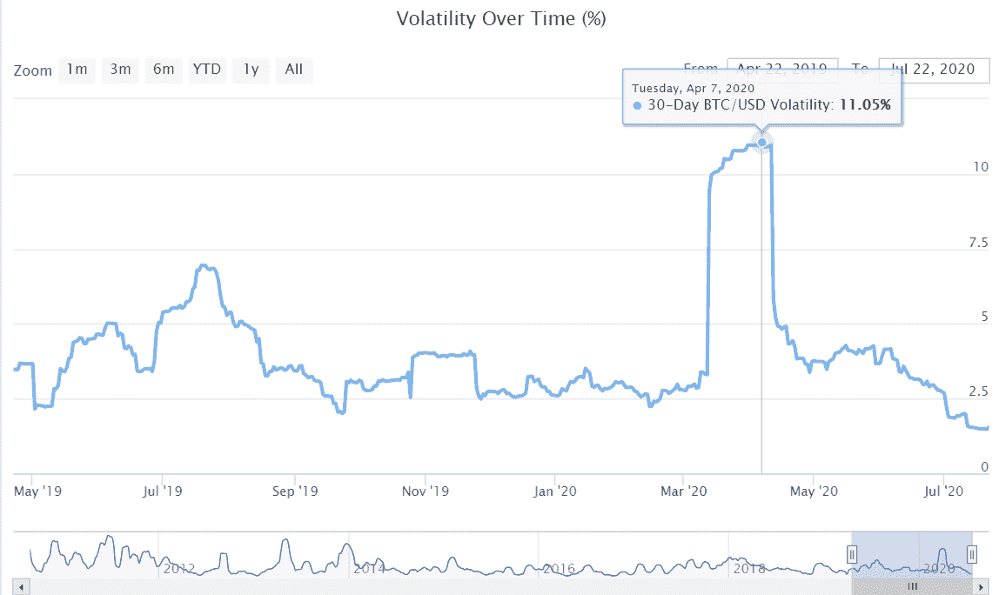

# 如何接受比特币支付，不再担心

> 原文：<https://medium.com/coinmonks/how-to-accept-bitcoin-payments-and-stop-worrying-coincodecap-blog-42de3440f40a?source=collection_archive---------2----------------------->

诞生于近十年前上一次金融危机之后的比特币标志着一个新金融时代的开始。

在大约十年的时间里，比特币已经作为一种资产类别出现在全球经济中，并催生了一个全新的[去中心化金融](https://blog.coincodecap.com/the-ultimate-guide-to-defi-decentralized-finance)空间。

准备解决目前削弱法定货币比特币的许多基本问题，比特币拥有一些有助于“好”货币的关键特征。最大的一个是它不能被任何权威所控制或操纵。

因此，现在出现的问题是，如果比特币如此伟大，为什么我们还没有看到大规模采用？主流采用比特币和其他加密货币的最大障碍是其**价格波动**。

截至 2020 年 7 月 29 日，比特币的 [30 天 BTC/美元价格波动为 2.26%](https://www.bitpremier.com/volatility-index) ，对比特币来说有趣的是，这并不算高。2020 年 3 月至 4 月间，BTC 波动率高达 11%。

*30 day BTC/USD Volatility Index [Source:* [*https://www.bitpremier.com/volatility-index*](https://www.bitpremier.com/volatility-index)*]*

当我们将这一数字与传统价格标准如黄金和菲亚特(美元)进行比较时，我们看到菲亚特的[波动率平均在 0.5% -1%之间，而黄金的波动率约为 1.2%](https://www.buybitcoinworldwide.com/volatility-index/) 。

那么是什么让比特币如此不稳定呢？

## 比特币是一项新技术

比特币只有十年的历史，仍处于萌芽阶段。把它想象成 90 年代的互联网。比特币作为一种技术仍在被人们理解，每天都有新的发展。

比特币的可扩展性问题等技术挑战经常导致高交易价格和偶尔的网络拥塞，导致比特币价格呈下降趋势。

虽然比特币技术的进步，如[闪电网络](https://blog.coincodecap.com/an-overview-of-bitcoin-lightning-network)导致价格呈上升趋势，但比特币目前的市值为 1720 亿美元，这是任何[加密货币的最高值](https://blog.coincodecap.com/tag/crypto/)与市值约为 10.9 万亿美元的[黄金相比仍然微不足道](https://www.visualcapitalist.com/all-of-the-worlds-money-and-markets-in-one-visualization-2020/)。

比如说，5 亿美元的波动在黄金市场上甚至不会被注意到，而在比特币市场上，这样的波动可以导致其价格发生重大变化。

> **又读:** [**比特币 Vs 黄金——更好的保值手段**](https://blog.coincodecap.com/bitcoin-vs-gold-a-better-store-of-value)

## 法规和媒体

比特币在全球范围内大多不受监管，每个国家都有关于比特币和加密货币的法律。

随着加密货币法规的每一项新发展，比特币用户的使用行为都会发生变化，以适应新的环境。

此外，媒体对比特币价格有着重大影响。由 [ScienceDirect 发表的研究分析了比特币价格和媒体关注度的关系](https://www.sciencedirect.com/science/article/abs/pii/S1544612319300558?via%3Dihub)。他们引用:

*“实证结果表明，比特币价格部分受到社交网络中媒体关注势头的推动，证明了对信息需求的感性偏好。”*

## 投机

比特币是一个高度投机的市场，这在很大程度上导致了它的波动性。投资者/交易员推测比特币价格会上涨或下跌，并据此进行买卖。

除此之外，人们可以轻松地开始交易加密货币，唯一的要求是互联网连接。

据估计，目前全球大约有 5300 万比特币交易者。

这导致许多业余交易者进入交易市场，使市场极易受到炒作、FOMO(害怕错过)、FUD(害怕、不确定、怀疑)的影响，造成恐慌性买入/卖出。

## 比特币和电子商务商家

毫无疑问，这种波动性对商家采用比特币构成了重大障碍。那么，如果比特币如此不稳定，为什么商家一开始还要费心接受它呢？

## 比特币市场是巨大的…

过去几年，使用比特币的人数急剧上升。据估计，全球约有 [1 亿比特币用户](https://www.buybitcoinworldwide.com/how-many-bitcoin-users/)，每天进行约 [377，323 笔交易](https://www.blockchain.com/charts)。

接受比特币的线下场所数量截至 2020 年 7 月已经达到[19505 家。](https://coinmap.org/view/#/world/15.62303683/-4.57031250/2)

2019 年进行的一项名为比特币的[调查，这是一个人口统计大趋势](/blockchain-capital-blog/bitcoin-is-a-demographic-mega-trend-data-analysis-160d2f7731e5)。18-34 岁的人群中有 18%已经拥有比特币。他们提到:

***“年轻人口*** *在比特币认知度、熟悉度、认知度、信念、购买倾向和拥有率方面领先。”*

比特币越来越受欢迎，人们开始接受不受审查、控制和操纵的替代融资方式。

对于商家来说，接受比特币可能极其有利可图，因为它将为一批全新的用户打开大门。

谢天谢地，商家有办法保护他们免受价格波动的影响，同时仍然接受比特币。

## 稳定币

[Stablecoin](https://blog.coincodecap.com/stablecoins-a-simple-overview) 和比特币一样，是一种加密货币，有一个鲜明的特点；其*价格稳定。*

Stablecoin 的主要价值主张是防止波动，因此它们是法定货币和加密货币之间的门户。

目前市场上有几种稳定的硬币。

**1。USDT(系绳):**这是目前市场上最受欢迎的稳定币，市值 100 亿美元。

系绳是以 1:1 的比例抵押的。因此，每枚 USDT 硬币都有 1 美元支持。

**2。USDCoin (USDC):** 这是由主要加密货币交易平台比特币基地创造的又一种受欢迎的稳定硬币。

与 Tether 类似，USDC 是以 1:1 的比率对美元进行法定抵押的。其市值目前为 11 亿美元。

其他一些受欢迎的稳定硬币包括**、*、【派克斯】、【戴】、*、**

## 命令

保护你的支付不受波动影响的另一个选择是将你的支付转换成你选择的法定货币。

最流行的法定货币转换包括美元，欧元，加拿大元，澳元。这种转换可以实时发生，这意味着你 100%不受任何价格波动的影响。

## 如何转换成菲亚特或 StableCoin？

几个[加密支付处理器](https://coincodecap.com/category/payment)提供自动将加密支付转换成你想要的硬币的功能。

1. [**CoinPayments:**](https://www.coinpayments.net/) 一款流行的加密支付处理器支持大量硬币和包[比特币转换功能](https://blog.coinpayments.net/tutorials/integrating-coinpayments-step-3-additional-features)例如:

*   每晚将你的全部余额转换成你想要的硬币。ShapeShift、Changelly 或 Kyber 支持转换。
*   自动转换:在*实时将付款转换成您想要的硬币。*
*   法定转换:在*实时*中将收到的硬币转换成您选择的法定货币。CoinPayments 通过 CoinMotion 和 Wyre 集成支持菲亚特转换。

2. [**区块经济学:**](https://www.blockonomics.co/merchants?ref=4Ac9WFLXFMSJHfr6F8LatTsoQnMi5zCDntPx) 一个去中心化的比特币支付处理器允许[法币和稳定币的转换](https://blockonomics.freshdesk.com/support/solutions/articles/33000245978-blockonomics-fiat-conversion-guide)。

转换功能可通过与支持集成来实现。

3.[**mycryptocheck out:**](https://mycryptocheckout.com/)这个加密支付处理器作为一个 WordPress 插件提供，并且是完全去中心化的。

该插件的特点是[自动设置元素](https://mycryptocheckout.com/doc/autosettlements/)，它将你的账户连接到加密交易所(币安或 Bittrex)，在那里你可以自动将你的比特币转换成你选择的法币或稳定币。

4. [**OpenNode**](https://www.opennode.com/?utm_source=coincodecap) :一款流行的比特币支付处理器，支持链上&闪电网络支付，具有许多使接受比特币支付变得简单的功能:

*   从 BTC 到菲亚特的自动转换，以及菲亚特到 BTC 的自动转换
*   与 Shopify、WooCommerce 和许多其他电子商务整合

> **也读作:** [**最佳比特币支付处理器**](https://blog.coincodecap.com/best-bitcoin-payment-processors)

## 结论

比特币经常被比作 90 年代的互联网革命，它将重塑当前的金融体系，使之变得更好。

但是，尽管有尖端的技术，它确实拥有阻碍其主流采用的挑战。

由于比特币的价格波动性，商家很容易回避比特币，只接受菲亚特，但这样做，他们也放弃了最大的增长市场之一。

谢天谢地，商家有办法接受比特币，并保护自己免受价格波动的影响。

通过将他们的[支付处理器](https://coincodecap.com/category/payment)与 *Stablecoin* 和 *Fiat conversion* 整合在一起，商家可以获得加密市场的好处并保护他们的收益。

## **归属**

Stablecoin 允许他们以稳定的价格持有加密货币资产。与此同时， **fiat** 提供了大多数商家已经使用的货币的传统价格稳定优势。

> *本文由来自*[***block onomics***](https://www.blockonomics.co/merchants?ref=4Ac9WFLXFMSJHfr6F8LatTsoQnMi5zCDntPx)*团队的 Arpit 供稿。*

*原载于 2020 年 8 月 6 日*[*https://blog.coincodecap.com*](https://blog.coincodecap.com/how-to-accept-bitcoin-payments)*。*