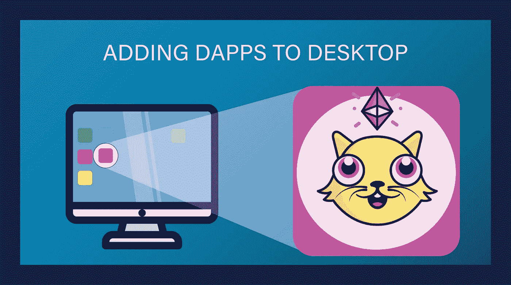

# 如何添加可从您的桌面直接访问的分散式应用程序|“桌面 Dapps”

> 原文：<https://medium.com/coinmonks/how-to-add-decentralized-applications-accessible-directly-from-your-desktop-desktop-dapps-fb8578674284?source=collection_archive---------3----------------------->

那些喜欢使用应用程序的人可能会发现总是在我们令人敬畏的浏览器上搜索它们很乏味。由于大多数 dapps 主要只能通过 chrome 浏览器或 Metamask 浏览器(仅限移动用户)访问，它们无法直接通过桌面上的独立应用程序访问。或者他们可以吗？这是…