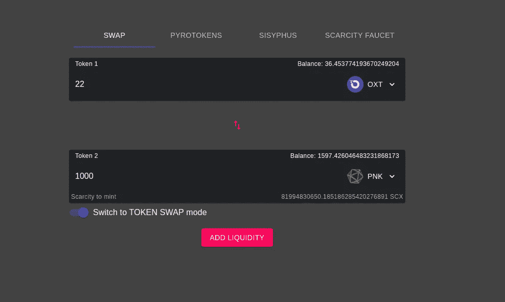

# 如何增加贝霍德勒指数的流动性

> 原文：<https://medium.com/coinmonks/how-to-add-liquidity-to-the-behodler-dex-47e2b5964fb1?source=collection_archive---------2----------------------->

*如果您错过了* [*公告*](/weidaithriftcoin/introducing-weidais-first-burn-dapp-the-behodler-token-swapper-c76f38e5d94c) *，请前往* [*戴维 dapp*](https://weidaidapp.com/) *，连接您的 Metamask 帐户并选择 Swap。在这里你可以找到贝霍德勒代币交换者。*

在这篇文章中，我们将探索增加流动性的方法，并在这个过程中创造流动性的象征，稀缺性(SCX)。

如果你不熟悉什么是流动性，或者它在 DeFi 应用中意味着什么，请参见这篇[解释性文章](/weidaithriftcoin/token-bonding-curves-the-movie-2ff612fc9263)。

第一种方法是简单地用任何代币交换稀缺性。在交换选项卡上，将输入令牌设置为您想要添加流动性的令牌，将输出令牌设置为稀缺性。

Here, we’re adding Dai liquidity. Note the SWAP button is replaced with an Add Liquidity button when Scarcity is the output.

相反，如果你想以代币的形式兑现你的流动性稀缺，你可以点击那些粉红色的小箭头来交换输入和输出。现在，当稀缺成为输入时，行动按钮显示“收回流动性”。

最后，您可能希望添加一定比例的流动性，以维持真实世界的价格比率。毕竟，如果你一次添加一个代币，价格会暂时失衡，有人可能会在你添加第一个代币的流动性和添加第二个代币的流动性之间进行有利的交易。在这种情况下，您可能希望通过点击输出文本框下方的开关进入流动性模式:

当您这样做时，您将看到一种以所需比例添加两个令牌的方法:

Note that Scarcity isn’t an option anymore since you can’t add liquidity for the liquidity token.

这样做结合了将两个令牌添加到一个事务中的行为，并以期望的比率进行。如你所见，你会得到稀缺的回报。

请记住，当您将非稀缺代币、戴或添加到 Behodler 中时，您将获得火焰代币，因此请记得在火焰代币标签上领取它们。如果你想知道为什么你没有为戴和赢得火符，那是因为是戴的火符。所以，当你把戴加到贝霍德勒身上时，你会拿一部分作为酬金，按照当时的赎回价格包在里烧掉。当你交换戴维时，没有包装步骤，但一部分也被烧焦了。燃烧烟火和戴维可以增加他们的赎回率。如果你想从这些燃烧中受益，我建议你先买一些戴维和 HODL。至于被交易的稀缺性，它被烧掉了，但不是作为奖励。相反，燃烧它是为了[随着时间的推移](/weidaithriftcoin/token-bonding-curves-the-movie-2ff612fc9263)增加普通代币的流动性。

## 红利:流动性游戏

当你增加了流动性，你不必只是坐在你的新的稀缺平衡。点击 [Sisyphus](/weidaithriftcoin/introducing-sisyphus-a-king-of-the-hill-ethereum-game-to-bootstrap-behodlers-liquidity-7f3a065c7eb9) 标签，玩以太坊游戏，你可以将你的稀缺资源翻两番。目前下一个玩家有一笔赞助金，这意味着胜算对你非常有利。

## 第二个好处:稀缺水龙头

如果你想得到一些免费的稀缺性来提取代币，如、戴、、Eth，请到稀缺性水龙头，将一些免费的稀缺性滴入你的帐户。

> [直接在您的收件箱中获得最佳软件交易](https://coincodecap.com/?utm_source=coinmonks)

如果您有任何问题或意见，请发送电子邮件至 admin@weidaidapp.com， [tweet](https://twitter.com/WeiDaiDapp) us 或加入我们的 [discord](https://discord.com/invite/s6bKYjj) 服务器。或者，在这里留下评论。

