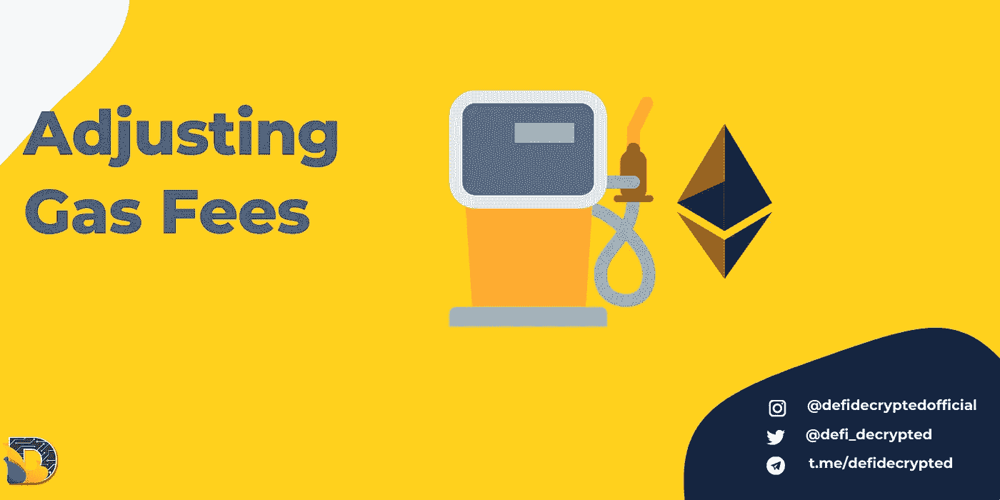
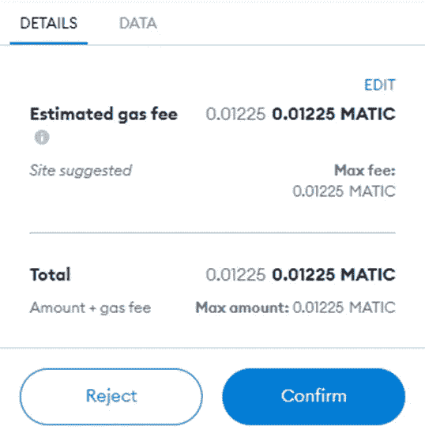
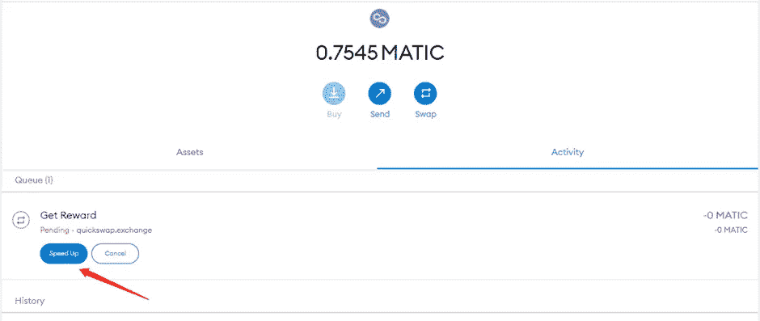
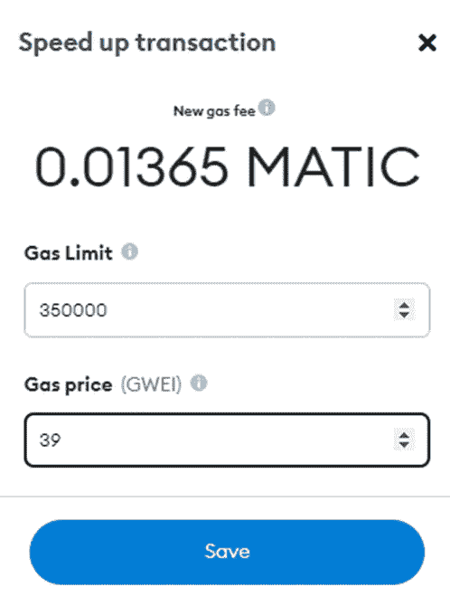
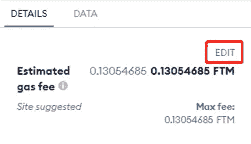
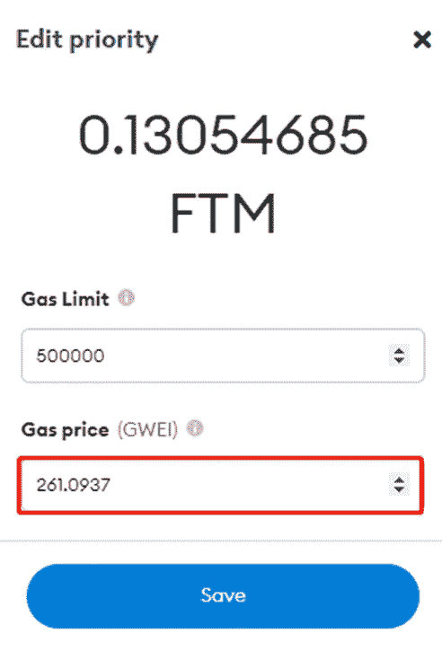

# 如何调整 MetaMask 上的燃气费

> 原文：<https://medium.com/coinmonks/how-to-adjust-gas-fees-on-metamask-1dc24420e72?source=collection_archive---------0----------------------->

汽油费是 DeFi 中不太令人愉快的部分之一，尽管它在整个系统中起着重要的作用，而且确实无法避免。根据你使用的网络，汽油费可能是象征性的，也可能是高昂的，但不管怎样，你还是要付。

像 MetaMask 这样的钱包通常会给你一个建议的油费，大多数情况下这就足够了，但有许多原因可能会让你想要手动调整油费，这就是本文所要讲述的内容。

> 加入 Coinmonks [电报频道](https://t.me/coincodecap)和 [Youtube 频道](https://www.youtube.com/c/coinmonks/videos)了解加密交易和投资

# **什么是汽油费，它们是如何确定的？**

Typical example from MetaMask

术语“汽油费”基本上是交易费的委婉说法，起源于以太坊网络。尽管在许多其他网络中，术语“gas”并未正式使用，但人们仍在口语中谈论煤气费或仅仅是“gas”。

汽油费是你支付给矿工或验证者来处理你的交易的奖励。矿商总是会先处理利润更高的交易，因此你需要进行竞争性投标。这有点像在一场演出或大型体育赛事后试图使用应用程序拦出租车。如果你出高价，所有的司机都会想载你，如果你出低价，你就要在那里站一晚上了。

同样，如果你提出一个非常高的天然气报价，你的交易将被立即处理，如果报价远低于市场价格，它将在很长一段时间内处于待定状态。

MetaMask 建议的燃气费基于站点推荐和网络需求，通常会导致适度的即时交易。然而，这个建议并不完美(尤其是在较小的网络上)，而且网络条件可能变化很快。

# **加速耗时过长的交易**

DeFi 初学者可能会在他们的交易被卡在“待定”时感到惊慌，但通常有一个非常简单的解决方案。

只需打开 MetaMask 并进入活动。你应该在顶部看到你的交易，有一个加速框。

点击加速，会打开一个名为“加速交易”的窗口。我们想要调整的是天然气价格，它以 gwei(ETH 的一部分)的形式给出。MetaMask 接口是为以太坊设计的，这个术语在其他网络的上下文中实际上是不正确的，但重要的是一旦 gwei 值被调整，新的费用将出现在顶部。

如果你使用了建议的油费，通常只需要少量增加就可以处理你的交易，除非你在以太坊，否则你可能不会介意多付几分钱。如果你在以太坊(完全不建议初学者使用)，那么你可能想参考类似 [ETH Gas.watch](https://ethgas.watch/) 这样的资源，并仔细选择数量。还值得考虑一天中的时间，网上的各种图表可以告诉你什么时候价格可能是最低的。

价格调整后，单击 Save，很快就会出现“交易完成”的通知。

# **节省汽油费用**

在上面的截图中，我们使用的是多边形网络，按照目前的市场价格，0.01 Matic 大约是 0.02 美元。考虑到费用如此之低，调整到更低的水平真的没什么好处。如果有的话，你可能想在交易前提高价格，以确保它更快地通过。

正如我们已经讨论过的，以太坊的汽油费非常高，但不可忽略的汽油费不仅限于以太坊。即使在像 Avalanche 这样“便宜”的网络上，汽油费有时也要几美元。

如果你不着急，为什么不减少一点费用，接受多等一会儿呢？

如果你真的需要使用以太坊，你可以省下 10 美元以上的油钱。

要下调价格，在第一次进行交易时，单击 MetaMask 中的编辑按钮。

将出现一个名为“编辑优先级”的窗口。只要把价格调整到你想要的，然后点击保存。通常只需点击几下就不值得调整，因为低价可能会持续很长时间。

如果你发现你把它调整得太低，你可以简单地按照上面的步骤在交易未决时提高报价。

MetaMask 界面不是最用户友好的，但是一旦你熟悉了调整汽油费，你将毫不费力地节省时间或金钱，这取决于什么对你更有价值！

> 加入 Coinmonks [电报频道](https://t.me/coincodecap)和 [Youtube 频道](https://www.youtube.com/c/coinmonks/videos)获取每日[加密新闻](http://coincodecap.com/)

## 另外，阅读

*   [复制交易](/coinmonks/top-10-crypto-copy-trading-platforms-for-beginners-d0c37c7d698c) | [加密税务软件](/coinmonks/crypto-tax-software-ed4b4810e338)
*   [电网交易](https://coincodecap.com/grid-trading) | [加密硬件钱包](/coinmonks/the-best-cryptocurrency-hardware-wallets-of-2020-e28b1c124069)
*   [密码电报信号](http://Top 4 Telegram Channels for Crypto Traders) | [密码交易机器人](/coinmonks/crypto-trading-bot-c2ffce8acb2a)
*   [最佳加密交易所](/coinmonks/crypto-exchange-dd2f9d6f3769) | [印度最佳加密交易所](/coinmonks/bitcoin-exchange-in-india-7f1fe79715c9)
*   [面向开发人员的最佳加密 API](/coinmonks/best-crypto-apis-for-developers-5efe3a597a9f)
*   最佳[密码借贷平台](/coinmonks/top-5-crypto-lending-platforms-in-2020-that-you-need-to-know-a1b675cec3fa)
*   杠杆代币的终极指南