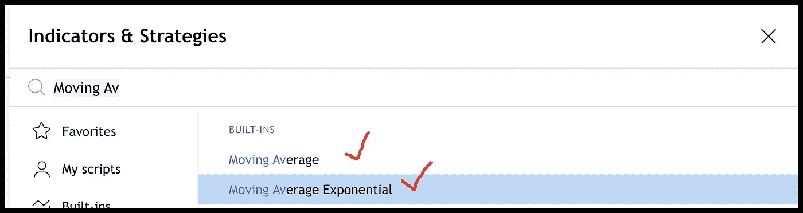
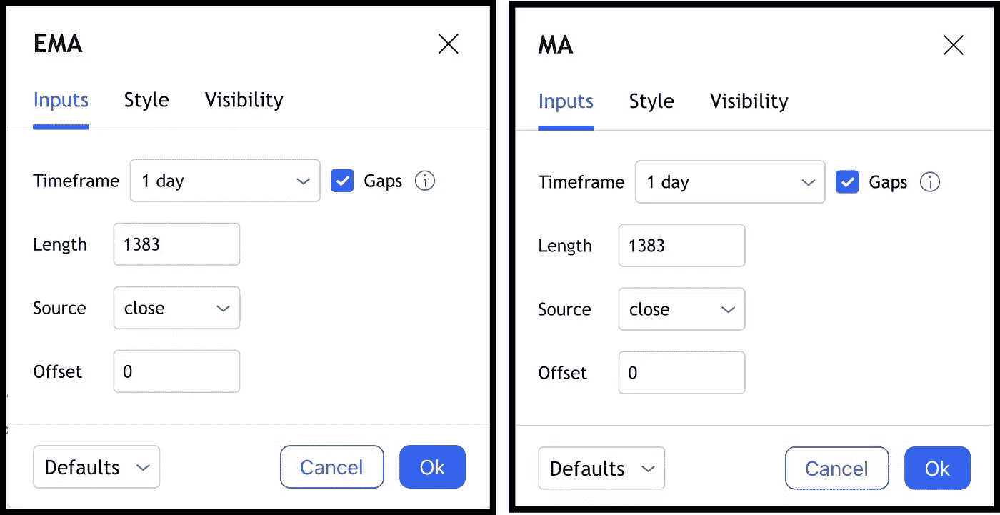
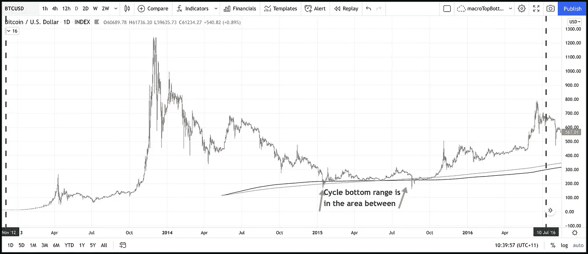
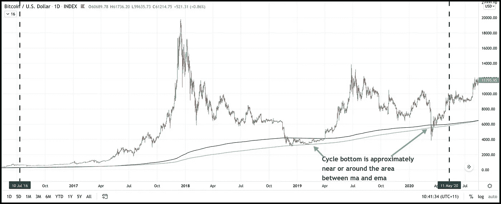

# 如何大概猜测每个周期之间的周期底部范围？

> 原文：<https://medium.com/coinmonks/how-to-approximately-guesstimate-the-cycle-bottom-range-between-each-cycle-d3b1f219a029?source=collection_archive---------7----------------------->

在[之前的文章](https://joy-bangla.medium.com/how-to-guesstimate-the-cycle-top-and-bottom-of-bitcoin-80ee2661b602)中，我谈到了一个人如何能够出于非金融原因大致猜测周期的顶部和底部。在这篇文章中，让我展示一个进一步的步骤，寻找非金融原因的周期底部的范围。

> 第一步:计算减半之间的平均天数
> 
> 步骤 2:在交易视图中打开指数:BTCUSD
> 
> 第三步:添加移动平均线和指数移动平均线
> 
> 步骤 4:使用步骤 1 中计算的平均天数作为均线和均线的值
> 
> 第五步:非财务原因的大致猜测范围

# 第一步:

**创建日期:【2009 年 1 月 3 日**

**第一次减半:【2012 年 11 月 28 日**

**从开始到第一次减半之间的天数:** 1426 天

**第二次减半**:2016 年 7 月 9 日

**第一次和第二次减半之间的天数:** 1320 天

**第三次减半:**2020 年 5 月 11 日

**第二次和第三次减半之间的天数:** 1403 天

**第四次减半:**2024 年左右

平均天数:(1426+1320+1403) / 3 = 1383 天

# **第二步:**

打开交易视图。如果你没有交易视图，请随意使用我的免费链接[https://www.tradingview.com/gopro/?分享你的爱=欢迎我](https://www.tradingview.com/gopro/?share_your_love=Welcome_Me)

# 第三步:

我在交易视图中添加了移动平均线和指数移动平均线。

# 第四步:

我已经更新了两者的时间框架为 1 天，长度为 1383

# 第五步:

图片胜过千言万语。你自己看看。那是巧合还是特色？

高分辨率图像:[https://www.tradingview.com/x/5wejHkMT/](https://www.tradingview.com/x/5wejHkMT/)

高分辨率图像:[https://www.tradingview.com/x/lEIapESQ/](https://www.tradingview.com/x/lEIapESQ/)

如有任何疑问，我可以通过推特 [*联系 https://twitter.com/Joy_Bangla_1979*](https://twitter.com/Joy_Bangla_1979)*。*

**免责声明:**请记住，过去的表现并不代表未来的结果。不同类型的投资包含不同程度的风险。我们不能保证本新闻稿(文章)中直接或间接提及的娱乐信息将是有利可图的，等同于任何相应的历史表现水平，或者以任何形式或形式适合您。由于各种因素，包括不断变化的市场条件，内容可能不再反映当前的观点或立场。此外，如果您不认为本简讯(文章)中包含的任何讨论或信息是对您的财务顾问的个性化投资建议的接收或替代，那将是最好的。我不是财务顾问。我没有资格做财务顾问。这只是为了娱乐。不要以任何其他方式误用它。如果读者对上述任何具体问题的适用性有任何疑问，鼓励他/她向自己选择的专业顾问咨询。我和我的指标都不对任何实际交易中滥用信息承担任何责任。我在现实生活中确实有秘密职位。

> 加入 Coinmonks [电报频道](https://t.me/coincodecap)和 [Youtube 频道](https://www.youtube.com/c/coinmonks/videos)了解加密交易和投资

## 也阅读

 [## 最佳加密交易所| 2021 年十大加密货币交易所

### 编辑描述

blog.coincodecap.com](https://blog.coincodecap.com/crypto-exchange)  [## 2021 年 10 大最佳加密贷款平台| CoinCodeCap

### 编辑描述

blog.coincodecap.com](https://blog.coincodecap.com/crypto-lending)  [## 2021 年最佳免费加密交易机器人

### 2021 年币安、比特币基地、库币和其他密码交易所的最佳密码交易机器人。四进制，位间隙…

medium.com](/coinmonks/crypto-trading-bot-c2ffce8acb2a)  [## 最佳 4 个加密交易信号电报通道

### 这是乏味的找到正确的加密交易信号提供商。因此，在本文中，我们将讨论最好的…

medium.com](/coinmonks/best-crypto-signals-telegram-5785cdbc4b2b)  [## BlockFi 评论 2021:利弊和利率| CoinCodeCap

### 编辑描述

blog.coincodecap.com](https://blog.coincodecap.com/blockfi-review)  [## 如何在印度购买比特币？2021 年购买比特币的 7 款最佳应用[手机版]

### 如何使用移动应用程序购买比特币印度

medium.com](/coinmonks/buy-bitcoin-in-india-feb50ddfef94)  [## 加密税务软件——五大最佳比特币税务计算器[2021]

### 不管你是刚接触加密还是已经在这个领域呆了一段时间，你都需要交税。

medium.com](/coinmonks/best-crypto-tax-tool-for-my-money-72d4b430816b)  [## 存储比特币的最佳加密硬件钱包[2021] | CoinCodeCap

### 编辑描述

blog.coincodecap.com](https://blog.coincodecap.com/best-hardware-wallet-bitcoin)  [## Pionex 评论 2021 |免费加密交易机器人和交换

### Pionex 是为交易自动化提供工具的后起之秀。Pionex 上提供了 9 个加密交易机器人…

medium.com](/coinmonks/pionex-review-exchange-with-crypto-trading-bot-1e459d0191ea)