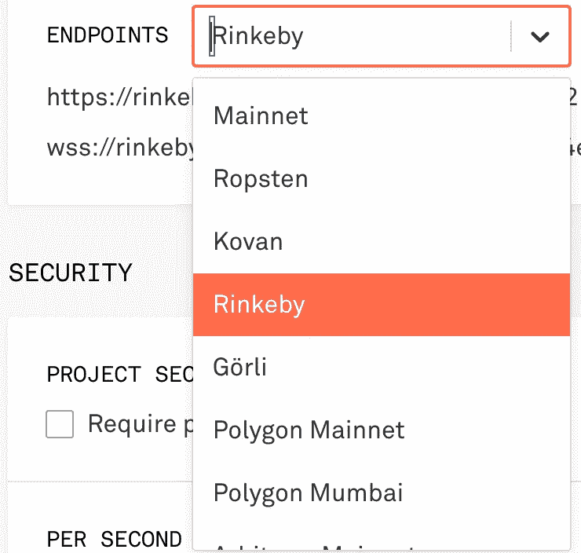
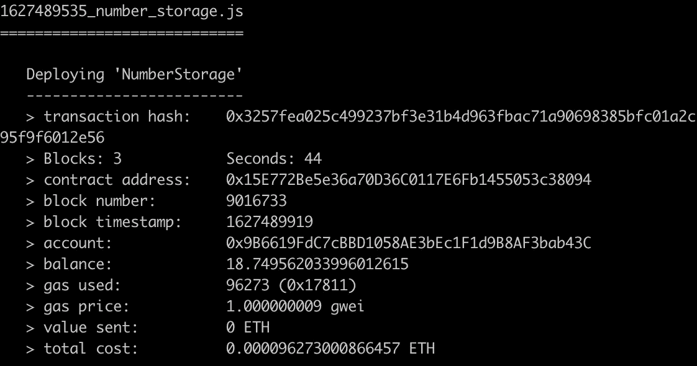
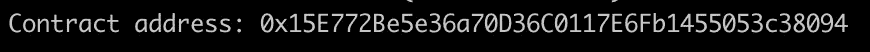

# 如何用 Truffle 自动验证 Etherscan & Bscscan 上的智能合约

> 原文：<https://medium.com/coinmonks/how-to-auto-verify-smart-contracts-on-etherscan-bscscan-with-truffle-1d061e6f31ed?source=collection_archive---------3----------------------->

智能合同验证对于分散的项目非常重要。您可以通过自动合同验证在 etherscan.io 上发布您的项目代码。此外，当您验证合同时，etherscan.io 上将提供读写功能交互。

虽然 etherscan.io 上可以进行手动验证，但是直接用 Truffle 进行自动验证是最佳实践。

# 创建一个松露项目

用 t *ruffle init* 开始你的项目

```
mkdir truffle-project
cd truffle-project
truffle init
```

在这个命令之后，您就有了一个样板松露项目。

让我们编写一个简单的智能契约。

```
touch contracts/NumberStorage.sol
```

将以下行添加到 NumberStorage.sol:

将以下行添加到 truffle-config.js

```
compilers: {
  solc: {
    version: "0.8.6", // Fetch exact version from solc-bin (default: truffle's version)
    docker: false, // Use "0.5.1" you've installed locally with docker (default: false)
    settings: {
      // See the solidity docs for advice about optimization and evmVersion
      optimizer: {
        enabled: true,
        runs: 200,
      },
      evmVersion: "byzantium",
    },
  },
},
```

编译合同时，您应该会看到一条成功消息:

```
truffle compile
```

输出:

```
> Compiled successfully using:
   - solc: 0.8.6+commit.11564f7e.Emscripten.clang
```

# 向项目中添加 truffle 验证插件

```
yarn add -D truffle-plugin-verify
```

然后将插件数组中的 truffle-plugin-verify 添加到 truffle-config.js 中

```
plugins: [
  'truffle-plugin-verify'
]
```

我们将安装 2 个软件包。一个给。env 文件，另一个用于私钥。您可以使用私钥提供程序或助记键提供程序。两个都行。

```
yarn add -D dotenv truffle-privatekey-provider
```

将这些行添加到 truffle-config.js 的顶部

```
require('dotenv').config()
const PrivateKeyProvider = require("truffle-privatekey-provider");
```

# 在 Etherscan.io 上创建一个 api 密钥

我们需要生成一个 etherscan.io API 密钥。在这里注册并生成你的 API 密匙:【https://etherscan.io/myapikey 

然后向 truffle-config.js 添加 api-keys

```
api_keys: {
  etherscan: process.env.ETHERSCAN_API_KEY
}
```

# 在 Infura 上创建 api 密钥



infura.io dashboard

在 infura.io 上创建一个账号，创建一个以太坊项目(【https://infura.io/dashboard/ethereum】T4)。单击您最近创建的项目的设置。

选择 **Rinkeby** testnet 并复制你的 URL。网址应该是这样的:[https://rinkeby.infura.io/v3/Y](https://rinkeby.infura.io/v3/167ee585da3c42e4a2a9c42476f9000f)我们的 _ 项目 _ID

# 为部署添加 Rinkeby 网络

我们即将部署我们的智能合同。我们需要将 Rinkeby 网络配置添加到 truffle-config.js 中

```
networks: {
  rinkeby: {
    provider: () => new PrivateKeyProvider(process.env.PRIVATE_KEY, process.env.RINKEBY_INFURA_URL),
    network_id: 4,       // Ropsten's id
    gas: 5500000,        // Ropsten has a lower block limit than mainnet
    confirmations: 2,    // # of confs to wait between deployments. (default: 0)
    timeoutBlocks: 200,  // # of blocks before a deployment times out  (minimum/default: 50)
    skipDryRun: true     // Skip dry run before migrations? (default: false for public nets )
  },
},
```

# 创造。env 文件并添加环境变量

```
touch .env
```

。env 文件应该包含:

```
RINKEBY_INFURA_URL=https://rinkeby.infura.io/v3/YOUR_INFURA_PROJECT_URL
PRIVATE_KEY=YOUR_PRIVATE_KEY
ETHERSCAN_API_KEY=YOUR_ETHERSCAN_API_KEY
```

# 为合同部署创建迁移

```
truffle create migration NumberStorage
```

您将在 migrations 文件夹中看到一个新文件。我们将把这些行添加到 number_storage.js 中

```
module.exports = async function(deployer) {
  const NumberStorage = artifacts.require("NumberStorage");

  await deployer.deploy(NumberStorage);
  const contract = await NumberStorage.deployed();

  console.log("Contract address:", contract.address)
};
```

# 部署合同

```
truffle migrate --network rinkeby
```

部署合同需要几分钟时间。



部署完成后，您将看到以下消息:



合同还没核实，我们来核实一下。

# 核实合同

```
truffle run verify NumberStorage --network rinkeby
```

需要一段时间来验证。

合同已验证:[https://rinke by . ethers can . io/address/0x 15 e 772 be 5 e 36 a 70d 36 c 0117 E6 FB 1455053 c 38094 #合同](https://rinkeby.etherscan.io/address/0x15E772Be5e36a70D36C0117E6Fb1455053c38094#contracts)

项目所在地:[https://github.com/mhkafadar/truffle-auto-verify-contracts](https://github.com/mhkafadar/truffle-auto-verify-contracts)

## 另外，阅读

[](https://blog.coincodecap.com/metamask-for-binance-smart-chain) [## 为币安智能链设置元掩码

### 在本文中，我们将向您展示如何为币安智能链设置元掩码？在进行设置步骤之前…

blog.coincodecap.com](https://blog.coincodecap.com/metamask-for-binance-smart-chain)