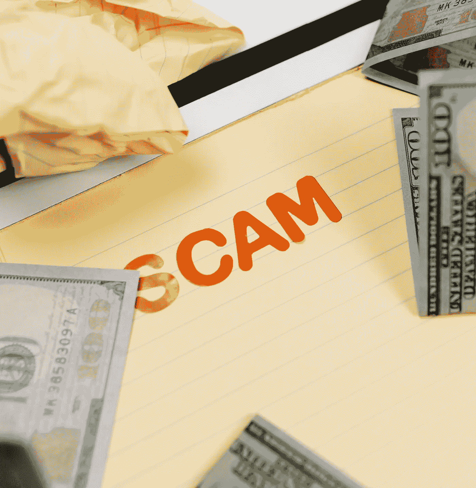

# 如何避免当前的加密骗局

> 原文：<https://medium.com/coinmonks/how-to-avoid-current-crypto-scams-d68af9752f3a?source=collection_archive---------7----------------------->

## 我被骗了，所以我可以帮你保住你的钱

Photo by [Tara Winstead](https://www.pexels.com/@tara-winstead?utm_content=attributionCopyText&utm_medium=referral&utm_source=pexels) from [Pexels](https://www.pexels.com/photo/notebook-writing-mathematics-notes-7111492/?utm_content=attributionCopyText&utm_medium=referral&utm_source=pexels)

我仍然很生气。不是因为我丢了钱，浪费了时间，而是因为我让它发生了。

如果你以前在 crypto 内外被骗过，那么你就知道这种感觉。被侵犯、被利用、被操纵、被支配的感觉。这些犯罪者没有同情心，而且…