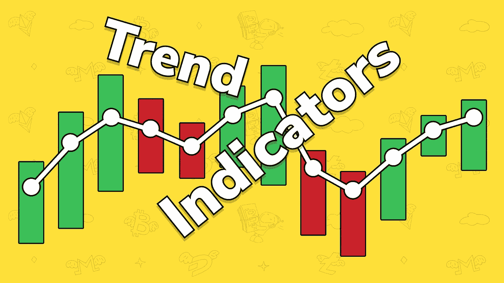
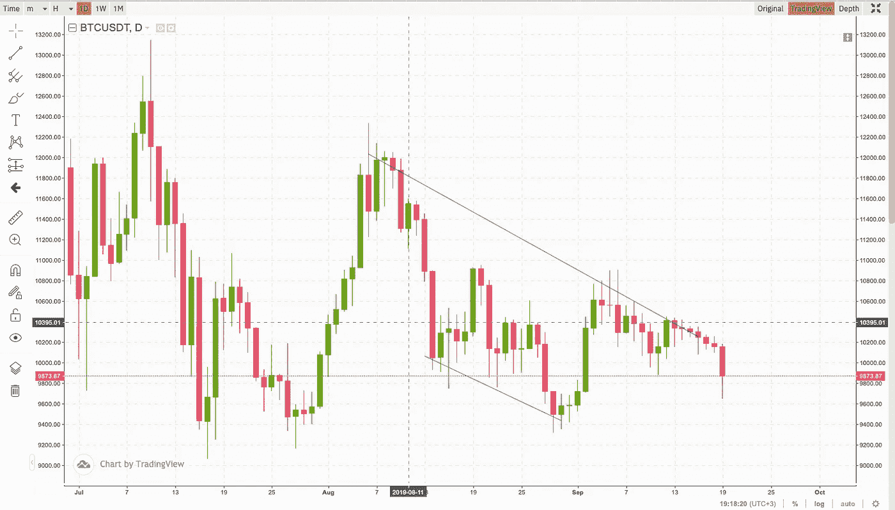
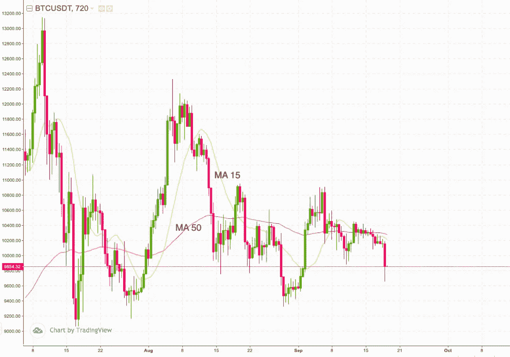
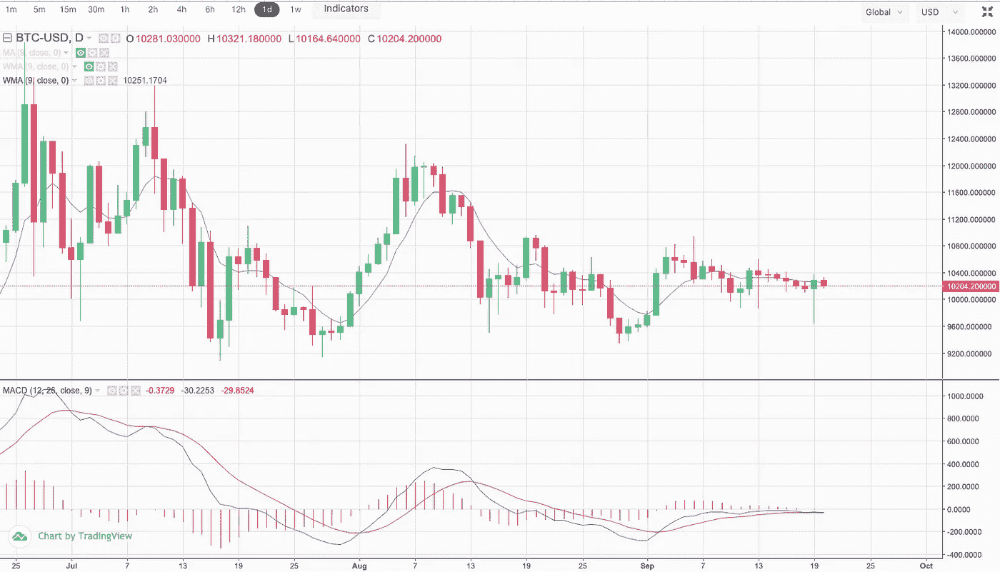
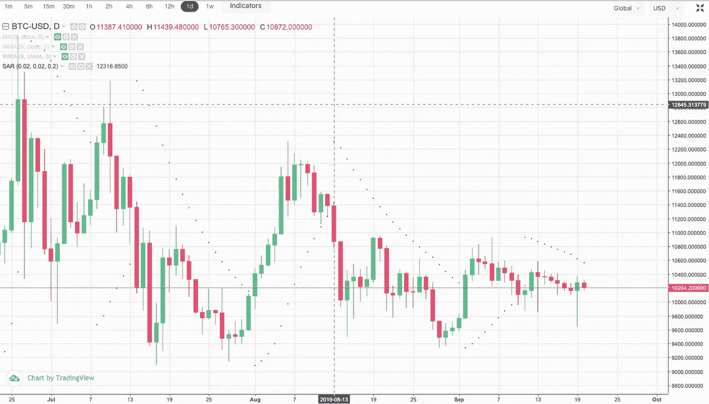
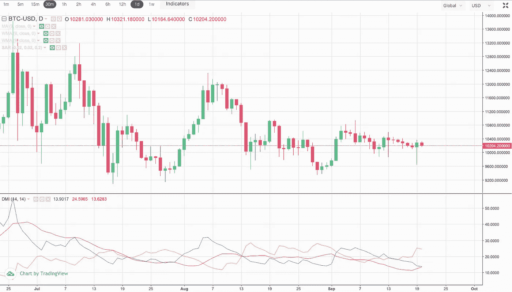

# 如何在交易中聪明对待趋势指标

> 原文：<https://medium.com/coinmonks/how-to-be-smart-about-trend-indicators-in-trading-22eff94d04d7?source=collection_archive---------2----------------------->

This pic is the property of TradeSanta.com

在投资一项资产之前，有经验的交易者会观察市场趋势。在交易中，它们也被称为趋势。为了了解一项资产的价格正朝着对你更有利的方向发展，跟踪主要趋势是必要的。

如果价格在向上移动，你正在处理一个看涨趋势或上升趋势。如果加密货币的价格正在下跌，则观察到看跌趋势或下跌趋势。

如果一个市场没有趋势，该怎么办？嗯，这也是趋势，叫横盘趋势。

一旦你知道如何使用指标，你就可以确定趋势；一旦你确定了趋势，你就知道什么时候进场和出场。所以，让我们聪明地看待趋势，了解指标是如何决定趋势的。

# 判断趋势的最快方法

看一下图表，将同一时期内一项资产的两个高点和两个低点连接起来，再看一遍图片。你能看到什么？

如果一个新的高点高于前一个高点，并且该线向上移动，这是一个上升趋势，上升趋势或看涨趋势。相反，如果一个资产的最新低点低于前一个低点，硬币或股票正在经历下跌趋势。

Two lows and two highs determine a downtrend in the BTC/USDT pair, Sep. 19, 2019

# 简单移动平均线

SMA 是最容易构建的均线。它只是特定时期的平均价格。

SMA 通常基于特定时期(比如 50 天)的加密货币收盘价格构建。

有趣的是，你应该比较几个均线，比如 15 天的短期均线和 50 天的长期均线，来决定进场点或出场点。

如果短期 SMA 穿过了上面的长期线，这是看涨趋势的信号，也是交易者进场的信号。相反，穿越下方较慢的 SMA 被认为是看跌信号，是下跌趋势的开始。

*The chart with two SMAs, where the red MA 50 line is the simple moving average that represents the period over 50 days and the yellow one stands for a 15-day period, cross at the beginning of August, which indicates an uptrend.* Sep. 19, 2019

# MACD(移动平均收敛/发散)

MACD 为你提供了额外的视觉效果，让你在正确的时间发现出口和[入口。](https://blog.tradesanta.com/how-to-spot-an-entry-point-when-trading-crypto/)

交叉原则用于绘制所谓的直方图，即两条平均线交叉时的条形序列。如果你在图表上看不到棒线，那就是进场点。

有两条线，MACD 和信号，分别代表较长和较短的时间。

一旦它们相交，你应该退出或进入市场，这取决于趋势。

At the beginning of August, the violet MACD line crosses the red Signal line above, which indicates a bullish trend. Time to enter the market! Sep. 20, 2019

# 抛物面 SAR

抛物线止损和反转(PSAR)被描绘成价格条上面或下面的一系列点。一些交易者喜欢这个趋势指标，因为它相对容易阅读。

Parabolic SAR demonstrates the bearish trend Sep. 13th to 20th, 2019

加密货币价格栏上方的圆点是看跌趋势的标志，意味着是时候做空了。价格条下面的点表示做多的时间。

仔细看看上面的图表，你会发现虚线并没有交叉，这表明了每个独立时期的趋势。

# DMI 指标(方向性运动指数)

看一下下面的图表，看看有三条不同颜色的线。

红色代表平均方向移动指数(ADX ),显示当前趋势是否足够强劲。

蓝色的显示了一个看涨的趋势，或者说是正向移动线(+DI)的样子。

最后，黄色的负向移动线(-DI)向我们显示了熊市趋势。

At the beginning of August, the blue line crosses the yellow line above, meaning the bullish trend is taking over the bearish one — it’s time to go long.

当蓝色的正向移动线(+DI)穿过负向移动线(-DI)时，交易者买入。

这基本上是你如何使用趋势指标进入或退出市场。但不要忘记，还有其他指标，如成交量和[动量指标](https://blog.tradesanta.com/momentum-indicators-and-how-to-use-them/)，这里的 [TradeSanta](https://tradesanta.com/en) 涵盖了这些指标。

> [在您的收件箱中直接获得最佳软件交易](https://coincodecap.com/?utm_source=coinmonks)

