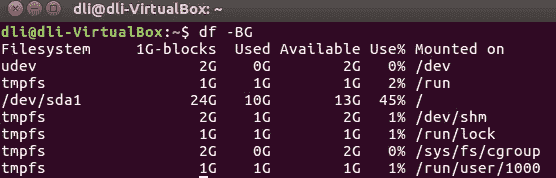

# 如何成为 Hyperledger Fabric 开发人员

> 原文：<https://medium.com/coinmonks/how-to-become-a-blockchain-developer-59c830e20f15?source=collection_archive---------1----------------------->

如果说 20 世纪 90 年代末和 21 世纪初是我们互联网时代的黎明，那么今天，随着区块链技术的到来，我们正处于一个新范式的尖端，甚至是几年甚至更短时间内的价值时代。作为软件开发人员，如果我们想拥抱这一新生技术，我们需要建立区块链技术的基础知识和技能，因此，对它有很好的理解，然后学习和熟悉一些主要的区块链平台，如 Hyperledger Fabric 将是有价值的。

这篇文章有点长，旨在帮助你开始并快速实现这样的目标。它包含两个部分，但你总共需要四个部分。

前两部分将为你奠定区块链技术的基础知识和技能。

第三部分是关于如何使用 Hyperledger Fabric 构建 PoC 区块链应用程序的**高级介绍，这部分已经在 Medium 上发布(更多内容见下文)，第四部分是真正的精华，它们由两套精心构建的、经过同行评审的**Hyperledger Fabric**培训材料组成。**

区块链开发商的未来会怎样？

# **第一部分——Unix/Linux/Ubuntu 基础知识**

对于我们中的许多人来说，我们已经习惯了主流操作系统，比如 Windows 和 MacOS，但是很少接触到 Unix/Linux/Ubuntu OS。然而，开源世界有大量可用于 Unix 操作系统的资源，区块链世界在很大程度上是开源驱动的，因此，对于我们软件开发人员来说，要在新兴的区块链技术领域取得成效，我们需要开始接受 Unix 操作系统，如 Ubuntu。现在，让学习游戏开始，愿原力与你同在！

在我们开始之前，让我们先弄清楚这个博客中的一些编码惯例。*斜体*和**粗体**或仅*斜体*中的所有内容都是*命令*。这个博客使用 LTS Ubuntu 16.04 作为基础。

首先，我们需要了解我们的 Ubuntu 机器

## **文件/目录结构和最基本的 Ubuntu 命令**

无论你如何进入你的 Ubuntu 命令提示符(通过终端或 ssh 或其他方式)，我们假设你现在在命令提示符下。可能是这样的:

现在，比方说，我们想找出我们的 Ubuntu 版本。

我们将发出以下命令:

***cat/etc/OS-release***

一切都好。

接下来，当你第一次打开一台 Ubuntu 主机的终端时，就像你第一次走进一所房子甚至一座大厦，你做的第一件事，通常是环顾四周看看那里有什么…

有了计算机，我们想找出什么是文件、软件程序(目录)等。就在外面。

对于 Ubuntu 或其他类型的 Unix 操作系统，我们只需输入以下命令:

***ls***

因此，现在我们有了一个如下所示的屏幕:

但是如果你想找到更多关于文件和目录的信息呢？那么，您可以发出以下命令:

**ls-l**

现在，让我们说，你是一个非常好奇的人，你看到了图片目录(文件夹)和你想看到的内容:)然后你做什么，简单，只需使用以下命令“改变目录”。

***cd***

因为您想将目录更改为图片，所以您可以发出以下命令:

***光盘图片***

让我们进一步假设图片目录确实有一个你一生都梦想看到的精彩图片！所以，您希望它在您的主目录中(~)。现在怎么办？您只需将它复制到您的主目录中。因此，您可以使用以下复制命令:

***cp***

假设，这个精彩的图像文件被命名为“女神. jpg ”,您可以发出下面的命令将它复制到您的主目录。

CP goddess.jpg../

或者

*CP goddess.jpg ~*

谁知道呢，你可能会有点害羞，所以，为什么不把那个很棒的“女神. jpg”图像名重新命名为“justforme.jpg”之类的，那么，怎么做呢？很简单，只需使用 mv 命令并键入以下内容:

***mv***

***mv goddess.jpg justforme.jpg***

同时，您还会发现您的主目录中有一些您绝对不需要的文件。比方说，它有一些像 ImaUselessfile.txt 这样的文件，那么，我们如何摆脱它呢？很简单，只需使用 rm 命令并键入以下内容:

**RM**

***RM imause lessfile . txt***

好了，现在你对 Ubuntu 有了更多的了解，你的老板决定给你一个项目去做。因此，您想要创建一个新的目录(文件夹),将该项目的所有相关文件放在一个地方，以便更好地管理。怎么做呢？简单来说，使用 mkdir 命令并键入以下内容:

***mkdir***

***mkdir yourNewProject***

在上面，我们谈到了删除文件，如果你有目录或文件夹，你不再需要。怎么做呢？很简单，使用 rmdir 命令并键入以下内容:

***rmdir***

***rmdir bigfatFolder***

现在，如果 bigfatFolder 不为空呢？然后，您将添加“r”(用于递归)和“f”(用于强制)开关，如下所示:

***RM-RF bigfatFolder***

然后，你在一个文本文件上工作一段时间，它相当大，在某一点上，你只需要在里面找到一些特定的信息？很简单，使用 grep 命令并尝试如下内容:

***grep***

**grep 关键字 my folder/my textfile**

grep 是这样工作的，从哪里开始。还有 btw，grep 代表*g/re/p*(***g****lobally search a****r****egular****e****xpression 和****p****rint*

如果您需要查找文件，请尝试如下查找命令:

***find-name my file***

这里是输出的截图:

## 如何**安装新软件**

我们经常会发现我们需要在我的 Ubuntu 操作系统上安装一些软件包。我们是这样做的，发出以下命令，添加 sudo 以确保我们被授予完全权限。

***sudo apt-get 安装包***

或者

***sudo 安装某个包***

## 如何**创建和编辑文件**

因为文件是我们软件开发者的生命血液，所以，我们需要能够在 Ubuntu 上创建和编辑文件。

在不同版本的 Ubuntu 上有几个文本编辑器。让我们试试下面这些容易使用的，你可以坚持使用你最喜欢的。

我们有 gedit、pico 和 nano。

***gedit myfile***

***pico myfile***

***纳米 myfile***

以下是 gedit myfile 的屏幕外观:

现在，如果您只想查看文本文件顶部或底部的文本，该怎么办呢？简单。

使用头部或尾部命令。见下文。它们显示 myfile 的顶部或底部 10 行文本。

***head-n 10 my file***

***tail-n 10 my file***

## 理解可执行文件或**外壳脚本**

Ubuntu 可执行文件也称为 shell 脚本。对于 bash shell 脚本(相对于 csh 等。)，结尾是。sh 扩展名，并且必须设置为 x 才能执行。

## 如何管理**文件权限**

Windows 操作系统没有文件属性的概念，如读取、写入和可执行文件。鉴于，

Unix/Linux/Ubuntu 在文件安全保护方面很有意思！

一个文件可以有三种类型的属性:Read ( **r** )、Write ( **w** )和 Executable ( **w** )。和用户角色，它可以是以下三种之一:

当前用户的 **u**

**g** 为组

**o** 为他人(全球)

和所有的**和**

但是当然，如果你制作一个像 imGoodLooking.jpg 这样的可执行图像文件将毫无意义。

比方说，您已经创建了一个简单的 shell 脚本来显示所有项目的关键信息(它对所有项目都是可读写的),脚本文件名为“myProj.sh ”,您希望每个人都能执行它。然后，您将运行以下命令:

***chmod a+x myproj . sh***

下面的屏幕截图将显示一个名为“bootstrap.sh”的 shell 脚本的文件属性，您可以看出它现在是可执行的，因为 u 有 x，g 有 x，o 也有 x:

## 了解**流程**

在 Unix/Linux/Ubuntu 环境下，软件程序也称为“进程”。要找出哪些程序或进程正在运行，您可以发出以下命令:

***ps***

要运行一个进程，比如说 myProj.sh，您可以发出以下命令:

***。/myProj.sh***

有趣的是，有了 Unix/Linux/Ubuntu，你还可以在后台运行任何程序，这样你就不必打开许多终端来运行各种进程。那么，怎么做呢？很简单，只要在末尾加上&就行了。因此，要在后台运行 myProj.sh，您可以发出以下命令:

***。/myproj . sh&T24***

如果你改变主意了呢？也就是说，您决定停止一个正在运行的进程。简单，杀了它。首先，使用 ps 命令找到它的 pid(进程 id)，假设 pid 是 1234，然后发出下面的命令来终止它:

***杀 1234***

## **重定向**或**管道**

您可能会发现 Unix/Linux/Ubuntu 中的以下两个重定向或管道工具非常有用。

首先，您可以将屏幕输出重定向到文本文件。例如，你想知道你的主目录中有哪些文件和目录，你想通过电子邮件把这些信息发送给你自己。然后，您只需键入以下命令:

***ls>my files directory structure . txt***

然后，您只需在电子邮件中附上 myFilesDirectoryStructure.txt 即可。

您可以使用>>将文本添加到现有文件中，如下所示:

**猫新内容> > myFile.txt**

现在，如果您有多个流程，并且希望将一个流程的输出映射为另一个流程的输入，该怎么办呢？这很简单，参见下面的命令:

***。/myProcess1.sh |。/my process 2 . sh***

注意上面两个命令之间的 **|** 符号。

## 基本**联网**

联网最重要的是 **/etc/network** 目录下的**接口**文件。

默认情况下，它可能如下所示:

*# interfaces(5)ifup(8)和 ifdown(8)使用的文件
auto lo
iface lo inet loopback*

**但是你需要加上下面这样的:**
*auto enp0s 8
iface enp0s 8 inet static
地址 192.168.56.110
网络掩码 255.255.255.0*

使用 ***ifconfig*** 命令查找 enp0s8 是否在列表中，如果是，则上述内容正常，否则，更换。

地址不必是 192.168.56.110，但可以是类似的地址。然后该地址将可用于服务。

## 如何管理**用户账户**

假设您被要求为您的 Ubuntu 创建另一个用户帐户，您可以简单地发出这个命令:

***sudo adduser new user***

## **杂项**

在我们安装新的软件包之前，我们可能希望找到我们当前的磁盘空间使用情况。为此，请键入以下命令:

***df -BG***

您的屏幕可能如下所示:

其他提示

Ubuntu 区分大小写，所有命令、文件名、目录等都区分大小写。

对于包含空格的文件和文件夹。即“程序文件”、“我的文档”、“我的图片”等。在命令行中使用双引号引用它们。

## 当你陷入困境时，我们该去哪里

不可避免地，我们会在使用 Ubuntu 时遇到问题，然后呢？

试一试[skUbuntu.com](https://askubuntu.com/)

试试[stackoverflow.com](http://stackoverflow.com/)

此外，我们的老朋友 google.com

哇，我们已经介绍了相当多的关于 Ubuntu 的信息，你不需要一口气了解所有的信息，但是很好地掌握它的本质绝对是一个好的开始。

尽情享受吧！快乐学习！

# 第二部分——码头工人必备

最近几年开始，信息技术行业喜欢容器化，因为这种技术使软件应用程序易于移植。Docker 是集装箱化领域的王者，区块链技术也拥抱集装箱化。因此，码头工人现在是个热门人物。这就是为什么我们作为区块链开发商需要掌握它。

在这篇短文中，我们将关注 Docker 的两个实际方面。

第一，我们需要知道哪些必要的 Docker 命令，第二，将 web 应用服务器作为 Docker 容器运行需要哪些 Docker 命令。如果您想知道为什么 Docker 这两个方面对区块链开发人员来说是最重要的，第三部分将会解释这一点。

## **基本对接命令**

在我们开始之前，假设了两件事。

(a)你在 Ubuntu 操作系统平台上，本机或虚拟机。要运行 Ubuntu 虚拟机，您可以下载并安装 Oracle VM Virtualbox。

(b) Docker 已经安装(第四部分包含一个脚本，它会自动为您安装 Docker)。

现在，让我们开始吧！

概念上，Docker 是这样工作的。您下载并安装一些软件包作为 docker 映像或多个 docker 映像，然后，您基于这些映像创建/构建 docker 容器，然后您可以运行这些容器来提供某些服务。

**下载并安装 Docker 镜像**

为此，您只需发出以下命令:

*码头工人拉一些码头垃圾*

当然，你需要在线。安装是自动的。

**Docker 图像验证**

下载完成后，您可以发出以下命令来验证其完成情况:

*docker 图片*

然后，您的屏幕可能如下所示:

**Docker 图像管理**

要找出哪些 docker 容器已经启动并正在运行，您可以发出以下命令:

*docker ps*

为了更进一步，即找出所有 docker 容器，您可以执行以下命令:

*docker ps -a*

比方说，有些东西不工作，所以，你想删除正在运行的容器。在这种情况下，您可以发出以下命令:

*docker rm $(docker ps -qa)*

更好的是，使用以下命令停止运行容器:

*docker stop $(docker PS-QA)*

**一些 Docker 故障排除技巧**

要清理 docker 网络，您可以发出以下命令:

*docker 网络剪枝*

当系统提示“您确定要继续吗？”键入“y”表示“是”。

要清理 docker 卷，您可以发出以下命令:

*码头工人卷修剪*

当系统提示“您确定要继续吗？”键入“y”表示“是”。

## **Docker 命令用于 Docker 镜像作为 Web 应用服务器**

作为一名创建与区块链集成的 web 应用程序的 web 应用程序开发人员，您会发现使用 docker 镜像作为 web 服务器非常方便。

首先，我们需要下载一个 web 应用服务器。比方说，你喜欢露西，那么我们开始吧:

*docker pull lucee/lucee4*

接下来，您想要为 Lucee 创建一些目录或文件夹。下面的命令就可以了。

mkdir lucee

*cd lucee*

*mkdir www*

所以，现在我们有了/lucee/www

接下来，我们需要 Lucee 的 Dockerfile。它可能像下面这样简单:

**来自 lucee/lucee4:最新**

**复制 www /var/www**

接下来，创建一些服务器端脚本，并将它们放在/lucee/www 目录中。

现在，我们准备构建一些 Lucee 容器。很简单。首先，进入 lucee 目录。

*cd luee*

然后，键入如下命令:

*docker build -t myapp*

别忘了经期。结尾的符号。要验证它是否已经构建，发出 *docker images* 命令。

接下来，我们可以这样运行它:

*docker run—-RM-p 8888:8888 myapp(*RM 前的两个破折号)

现在，您可以通过 web 浏览器在端口 8888 加载您的服务器端脚本。

而如果你想杀死它，只需按 Ctrl + c 一起。

如果您需要停止一个容器，首先使用“docker ps”来查找正在运行的容器的 id，然后发出以下命令:

*停靠站{containerid}*

就是这样！

以下专业人士对以上两部分进行了校对，因此，让我们在此一并感谢他们: [Biser Dimitrov](https://www.linkedin.com/in/biserdimitrov/) 、Jorden Seet 和 Reza Parizi 博士。

# 第三部分—使用 Hyperledger Fabric 构建区块链 PoC 应用程序

 [## 使用 Hyperledger Fabric 构建区块链 PoC 应用程序

### 这篇文章是关于我在区块链创建土地和产权记录的区块链 PoC 应用程序的经验…

medium.com](/coinmonks/build-a-blockchain-poc-application-using-hyperledger-fabric-6bbe633c2204) 

# 第四部分—两套 Hyperledger Fabric 培训材料，包括源代码。

可付费获得。详情请打电话到 gmail.com 丽春申 84 和我联系

总之，第一部分和第二部分就像配料，第三部分就像沙拉或开胃菜，但第四部分是主菜，“肉和土豆”！

让我引用麻省理工学院教授 A. Sanchez 关于区块链空间的未来工作的话来结束这篇长文，“*游戏仍处于早期，所以区块链的热门技术专家将会有市场，他们将构建系统，可以从一家公司跳到另一家公司，赚很多钱。但是，如果这一承诺能够实现，那么在这个领域将会有很多工作要做很多年，甚至十年或更长时间。这将在企业中根深蒂固。它将会赚钱。这将是基础设施的核心部分*。但我不得不说，这需要大量的学习和工作。是的，会有回报的！

