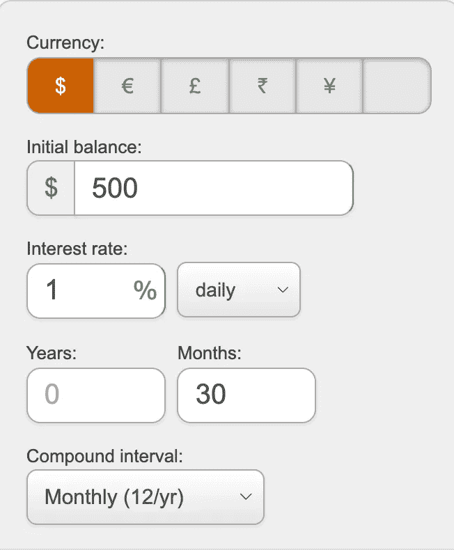
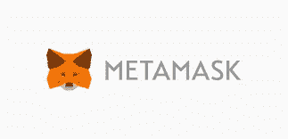

# 如何成为傻瓜的秘密百万富翁

> 原文：<https://medium.com/coinmonks/how-to-become-a-crypto-millionaire-for-dummies-52c408b57301?source=collection_archive---------7----------------------->

加密货币世界最近发生了令人难以置信的事情。许多人在买了一堆印有狗名字的硬币后，一夜之间就成了亿万富翁。

所以，这篇文章的目标是:让我们停止只是“听”故事，让我们成为他们中的一员，你觉得呢？

还因为那里到处都是可怕的项目，没有任何实际价值的“狗屎硬币”。如果你足够不幸，你还会遇到大量真正的骗局，这些骗局只是为了从潜在投资者那里偷钱。
所以，不用说，为了用加密赚些真钱，重要的是:

*   做大量的学习和研究。
*   早期投资于那些开发团队和技术稳固且有明确长期目标的项目。

但是，今天是你的幸运日，所以碰巧我为你做了大部分的研究。我阅读、比较各种项目，研究了多年的密码世界，发现了下一个“比特币”,它将创造这十年新的密码百万富翁。所以，我给你介绍一下……滴滴网络项目！

> 订阅 [**Coinmonks Youtube 频道**](https://www.youtube.com/c/coinmonks/videos) 获取每日加密新闻。

滴滴网络是一个投资智能合同，实现了一个同样智能和美丽的系统:每天从你存款的金额中获得 1%的回报，直到 365 天，或者直到你达到 100.000 滴滴的最高支付额。

用数字？存一笔滴滴 crypto，比方说 100 美金，接下来的 365 天每天会有 1 个滴滴返还。

怎么可能呢？这怎么可能不是骗局？还是庞氏骗局？正如奥尔多·雷恩所说:“如果好得不像真的，那它很可能不是真的”。

首先，一个简单但真实的事情:这是一个秘密空间，这被证明是一个一切皆有可能的空间，如果你足够早进入的话。

但是，由于这可能还不够，让我们看看更多的事实。

首先也是最重要的:这 1%的每日回报是完全资助的:每一笔滴滴交易都需要支付滴滴 10%的税款。这 10%进入钱包为这 1%提供资金。此外，对拥有超过总供应量 x%的人征收额外的“鲸鱼税”，这增加了资金来源。这个系统已经过深入测试，它已经证明有能力长期维持这个项目，如果这些税收不足以支付每个人每天 1%的费用，将会铸造更多的水滴，直到这再次成为可能。就这么简单。

> 宇宙中没有比复利更强大的力量了。
> 
> -阿尔伯特·爱因斯坦

但这里最酷的是什么？你也可以选择每天复利，因此重置 365 天的周期，使回报在全年呈指数增长。

这在数字上意味着什么？

让我们用复利计算器看得更详细些，从 500 美元投资开始，每天复利。你也可以自己试试，来自:[https://www . the calculator site . com/finance/calculators/compounterestcalculator . PHP](https://www.thecalculatorsite.com/finance/calculators/compoundinterestcalculator.php)

总而言之:

-第一笔存款:500 美元
-6 个月后:2460.19 美元
-12 个月后:12105.07 美元
-24 个月后:293065.24 美元
-29 个月后，你就是百万富翁:1105680.84 美元

这背后的数学是如此强大，以至于即使代币在 29 个月内损失了 90%的价值，你仍然会获得比最初投资大得多的回报。因此，想象一下，如果代币价格反而上涨。你基本上会在如此短的时间内成为一名秘密千万富翁，以至于…你会成为我们在开始时谈论的故事之一！

简而言之，这就是为什么滴滴网络是一个值得投资的好项目:

*   令人难以置信的回报，没有庞氏骗局或怪异的印钞伎俩。
*   坚实而知名的开发团队。
*   固体令牌组学及其白皮书(意图声明。链接:[https://DRIP . community/docs/DRIP _ light paper _ v 0.8 _ Lit _ version . pdf](https://drip.community/docs/DRIP_LIGHTPAPER_v0.8_Lit_Version.pdf)文档很好的说明了这 1%从何而来。
*   这是通货紧缩:每一个税收或存款代币都进入一个“烧掉”的钱包地址，这意味着随着时间的推移，代币越来越少，变得更加稀有和珍贵
*   强烈的社区驱动。

但现在来看看如何在实践中成为滴滴网络百万富翁。对于一个不太懂技术的人来说，这些步骤可能有点难，但是没有舒适区就没有收获，对吗？所以简而言之，你将需要:
-类似 Metamask 的加密钱包。
-一堆 BNB 代币用来买你的滴滴(不，你不能直接用欧元、美元或者其他法币买滴滴。这个过程简单得令人难以置信，tho)
——将你的滴滴代币存入滴滴官方网站(代币会被锁定)，你会看到你的回报以 1%可申领的滴滴代币的形式增长。

就是这样。但是让我们更详细地看看这个:

*   如果你还没有一个加密货币钱包，不要惊慌:在 Metamask 上下载并创建一个帐户，这是最安全和最受欢迎的钱包:[https://metamask.io/](https://metamask.io/)。这会给你一个正式的地址，在那里你所有的密码将被安全地存储。
*   如果你刚刚下载了 Metamask，你的钱包将默认设置为在以太坊上工作，这不是你需要的区块链。为了获得滴滴代币，你需要在币安智能链上工作如果你不知道这意味着什么，想象一下(通过极大地简化)从一个不支持电子邮件的互联网切换到另一个可以阅读电子邮件的互联网。是的，这可能是一个可怕的相似之处，但这不是重点。因此，为了设置您的元掩码钱包在另一个区块链上工作，请遵循以下步骤:[https://docs.binance.org/smart-chain/wallet/metamask.html](https://docs.binance.org/smart-chain/wallet/metamask.html)
*   在 https://www.binance.com[注册，用您的银行账户或信用卡购买您在 BNB 的初始投资(币安智能链令牌)。BNB 代币是滴滴工作的区块链的主要加密货币，它将是你购买滴滴的代币。](https://www.binance.com)
*   现在，把你的硬币从币安寄到你的 Metamask(或其他钱包)地址。
*   然后去滴滴网络项目网站: [https://drip.community](https://drip.community)
*   点击右上角的“连接钱包”按钮，连接您的元掩码或其他钱包。

*   前往:[https://DRIP . community/fountain](https://drip.community/fountain)“购买”版块，将你的 BNB 兑换成滴滴币。(但不要忘记在钱包里留一些 BNB 来支付一些费用，因为每笔交易都需要非常少量的 BNB)。
*   你就快成功了。现在去[https://drip . community/水龙头](https://drip.community/faucet?buddy=0xDb4856B28099bcaaF42F0c7B2179a72d6f6D3560)。向下滚动并考虑将其添加为好友地址:

**0x db 4856 b 28099 BC AAF 42 f 0 c 7 b 2179 a 72d 6 f 6d 3560**

Put your buddy address here and click on “Update”. Consider **0xDb4856B28099bcaaF42F0c7B2179a72d6f6D3560**

*   存放您的代币
*   享受你的 1%每日回报，你可以提取(索赔)或复合(水合物)每日！

最终免责声明:
*——请记住，您在滴滴上的存款(初始投资+复利金额)将被永久锁定，您将只能申请/提取每日 1%的存款。但是，如果你每天复利，很有可能你每天赚的钱很快就会超过你的存款。
-这不是财务建议
-永远要考虑你的风险，做好你的研究
-但最重要的是，只投资你能承受的损失。*

**万事如意**

高本雅志

> 加入 Coinmonks [电报频道](https://t.me/coincodecap)和 [Youtube 频道](https://www.youtube.com/c/coinmonks/videos)了解加密交易和投资

## 另外，阅读

*   [电网交易机器人](https://blog.coincodecap.com/grid-trading) | [Cryptohopper 审查](/coinmonks/cryptohopper-review-a388ff5bae88) | [Bexplus 审查](https://blog.coincodecap.com/bexplus-review)
*   [7 个最佳零费用加密交易平台](https://blog.coincodecap.com/zero-fee-crypto-exchanges)
*   [分散交易所](https://blog.coincodecap.com/what-are-decentralized-exchanges) | [比特 FIP](https://blog.coincodecap.com/bitbns-fip) | [Pionex 审查](https://blog.coincodecap.com/pionex-review-exchange-with-crypto-trading-bot)
*   [用信用卡购买密码的 10 个最佳地点](https://blog.coincodecap.com/buy-crypto-with-credit-card)
*   [3Commas 对 Pionex 对 Cryptohopper](https://blog.coincodecap.com/3commas-vs-pionex-vs-cryptohopper)
*   [加密复制交易平台](/coinmonks/top-10-crypto-copy-trading-platforms-for-beginners-d0c37c7d698c) | [如何在 WazirX 上购买比特币](/coinmonks/buy-bitcoin-on-wazirx-2d12b7989af1)
*   [CoinLoan 点评](https://blog.coincodecap.com/coinloan-review)|[Crypto.com 点评](/coinmonks/crypto-com-review-f143dca1f74c) | [火币保证金交易](/coinmonks/huobi-margin-trading-b3b06cdc1519)
*   [Bookmap 评论](https://blog.coincodecap.com/bookmap-review-2021-best-trading-software) | [美国 5 大最佳加密交易所](https://blog.coincodecap.com/crypto-exchange-usa)
*   最佳加密[硬件钱包](/coinmonks/hardware-wallets-dfa1211730c6) | [Bitbns 评论](/coinmonks/bitbns-review-38256a07e161)
*   [新加坡十大最佳加密交易所](https://blog.coincodecap.com/crypto-exchange-in-singapore) | [收购 AXS](https://blog.coincodecap.com/buy-axs-token)
*   [投资印度的最佳加密软件](https://blog.coincodecap.com/best-crypto-to-invest-in-india-in-2021) | [WazirX P2P](https://blog.coincodecap.com/wazirx-p2p)
*   [加拿大最佳加密交易机器人](https://blog.coincodecap.com/5-best-crypto-trading-bots-in-canada) | [库币评论](https://blog.coincodecap.com/kucoin-review)
*   [火币加密交易信号](https://blog.coincodecap.com/huobi-crypto-trading-signals) | [HitBTC 审核](/coinmonks/hitbtc-review-c5143c5d53c2)
*   [如何在 FTX 交易所交易期货](https://blog.coincodecap.com/ftx-futures-trading) | [OKEx vs 币安](https://blog.coincodecap.com/okex-vs-binance)
*   [OKEx vs KuCoin](https://blog.coincodecap.com/okex-kucoin) | [摄氏替代品](https://blog.coincodecap.com/celsius-alternatives) | [如何购买 VeChain](https://blog.coincodecap.com/buy-vechain)
*   [币安期货交易](https://blog.coincodecap.com/binance-futures-trading)|[3 commas vs Mudrex vs eToro](https://blog.coincodecap.com/mudrex-3commas-etoro)
*   [如何购买 Monero](https://blog.coincodecap.com/buy-monero) | [IDEX 评论](https://blog.coincodecap.com/idex-review) | [BitKan 交易机器人](https://blog.coincodecap.com/bitkan-trading-bot)
*   [尤霍德勒 vs 科恩洛 vs 霍德诺特](/coinmonks/youhodler-vs-coinloan-vs-hodlnaut-b1050acde55a) | [Cryptohopper vs 哈斯博特](https://blog.coincodecap.com/cryptohopper-vs-haasbot)
*   [顶级付费加密货币和区块链课程](https://blog.coincodecap.com/blockchain-courses) | [币安评论](/coinmonks/binance-review-ee10d3bf3b6e)
*   [MXC 交易所评论](/coinmonks/mxc-exchange-review-3af0ec1cba8c) | [Pionex vs 币安](https://blog.coincodecap.com/pionex-vs-binance) | [Pionex 套利机器人](https://blog.coincodecap.com/pionex-arbitrage-bot)
*   [如何在印度购买比特币？](/coinmonks/buy-bitcoin-in-india-feb50ddfef94) | [WazirX 审核](/coinmonks/wazirx-review-5c811b074f5b) | [BitMEX 审核](https://blog.coincodecap.com/bitmex-review)
*   [印度的加密交易所](/coinmonks/bitcoin-exchange-in-india-7f1fe79715c9) | [比特币储蓄账户](/coinmonks/bitcoin-savings-account-e65b13f92451)
*   [币安费用](/coinmonks/binance-fees-8588ec17965) | [僵尸加密审查](/coinmonks/botcrypto-review-2021-build-your-own-trading-bot-coincodecap-6b8332d736c7) | [热点审查](/coinmonks/hotbit-review-cd5bec41dafb)
*   [我的密码交易经验](/coinmonks/my-experience-with-crypto-copy-trading-d6feb2ce3ac5) | [AAX 交易所评论](/coinmonks/aax-exchange-review-2021-67c5ea09330c)
*   [逐位融资融券交易](/coinmonks/bybit-margin-trading-e5071676244e) | [币安融资融券交易](/coinmonks/binance-margin-trading-c9eb5e9d2116) | [超位审核](/coinmonks/overbit-review-9446ed4f2188)