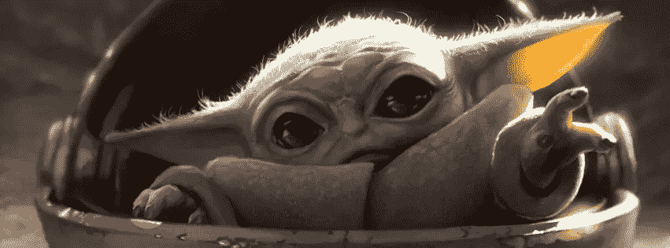
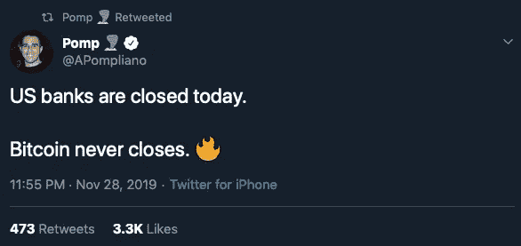
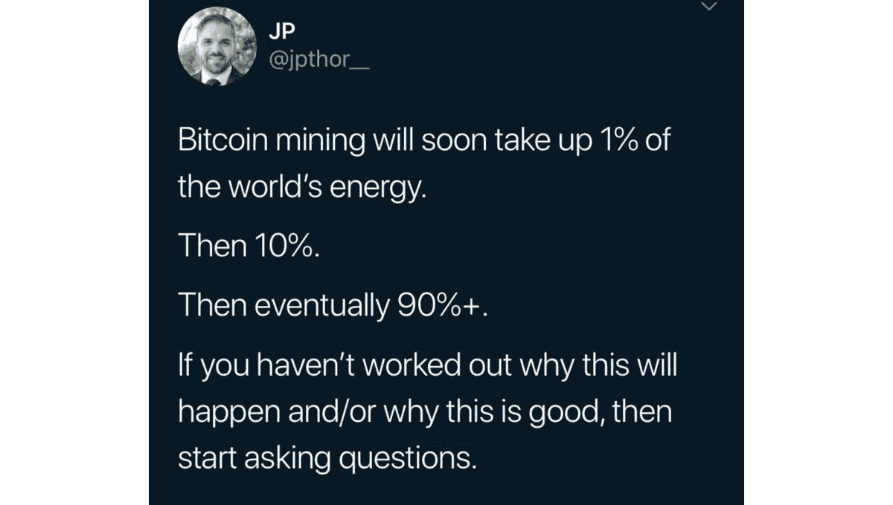
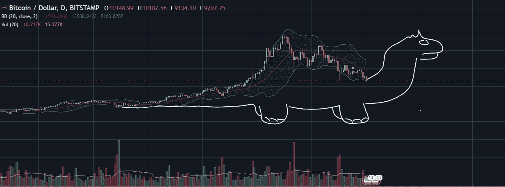
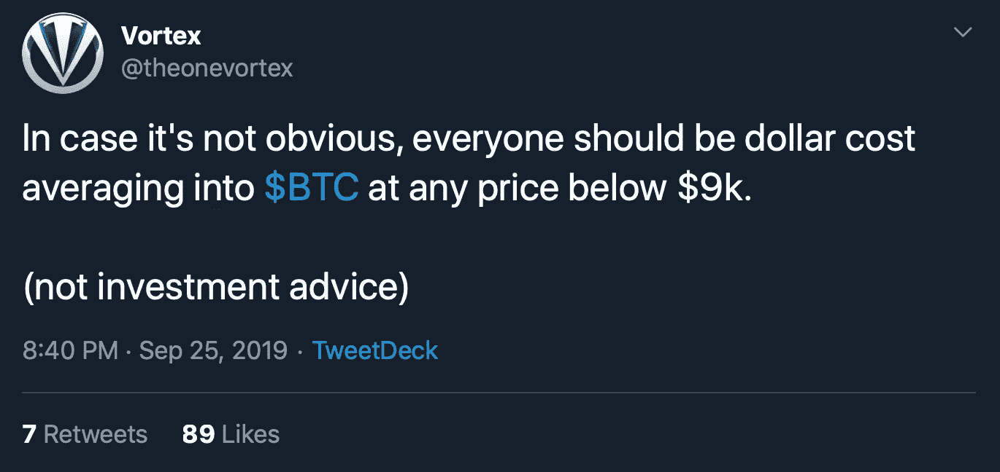
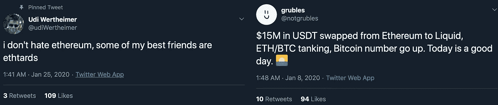
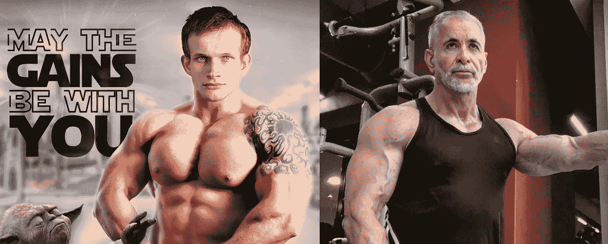

# 如何成为推特上的加密货币思想领袖

> 原文：<https://medium.com/coinmonks/how-to-become-a-cryptocurrency-thought-leader-on-twitter-f10ac1c26488?source=collection_archive---------1----------------------->

思想引导是一项复杂的职业。由于加密货币的出现，它也是过去十年增长最快的领域之一。这篇文章概述了一些简单的规则，让你开始踏上这条有益的职业道路。它不反映我的雇主的意见。

Thought leaders exhibit extraordinary abilities, such as levitating objects, tricking minds, and seeing things before they happen.

互联网最美妙的地方在于它为所有人提供了平等的机会:只要有 WiFi，即使是来自遥远星球的马童也能发挥思想引领的力量。另一方面，在数百万人的头脑中塑造加密货币的故事不是一个没有经过适当培训的[就能实现的。这是一次令人恼火的旅行。你会发现自己在前进的道路上打了很多仗——既要对抗敌人的思想领袖，也要对抗自己内心的恶魔。这里有一些基本的提示让你开始。](https://www.youtube.com/watch?v=rWF0f183tSA)

# 相信你自己

要知道你永远是对的，尤其是当你的观点与所谓的“专家”所说的相反的时候。想想看:现在你不需要博士学位就能掌握一个领域。如今顶尖的外科医生、生物工程师和股市分析师都是在 Reddit 和维基百科上造就的。不受主流教科书的束缚，他们创造出新鲜、原创的镜头，震撼了整个体制。

利用你个人的专业知识。你擅长垄断玩家？那么你就有资格就货币经济、世界政治和金融市场之间复杂、动态的全球相互作用发表意见。跳出框框思考，不要害怕探索新的领域。

Twitter thought leaders have a knack for exploring new territories. Mainstream “experts” can go f*** themselves.

# 少即是多

没有人通过张贴复杂的技术内容获得 100，000+的追随者。开门见山，加入一点点神奇的创新思维，让你的推文更有特色。最重要的是完全的、不妥协的积极性。

Exploit the inverse relationship between number of likes and complexity of the information conveyed.

“保持简单”原则也适用于幽默的推文。避免多层方法，这只会让 99%的观众感到困惑。例如，人们有时会以明显夸张的方式说一些事情，但实际上并不是这个意思——这被称为 [*讽刺*](https://dictionary.cambridge.org/dictionary/english/sarcasm) *。在荒谬的主张司空见惯的环境中，这是行不通的。避免在加密推特上讽刺，因为绝对没有办法判断你是否在讽刺。*

It’s impossible to tell if you’re being serious on Crypto Twitter.

为了达到思想领导力的缩影，考虑[制作一个推特风暴](https://twitter.com/danheld/status/1128706113279528961)并把它钉在你的个人资料上。一条推特由[组成，你一遍又一遍地用精心挑选的数字、图表、统计数据、引用和参考文献](https://twitter.com/tuurdemeester/status/1078682801954799617?lang=en)来回应自己，以支持你预制的观点。预计会有一些回应。请记住，只有少数人拥有你与生俱来的非凡智商和无情的客观性。

Nugget of wisdom 27d/66

# 做一名分析师

大多数秘密思想领袖也有预测价格变动的天赋。有各种各样的技术可用，但我将在这里提供一个基本的教程。加密资产的价格主要取决于三个因素:

*   **图表模式。**例如，当价格成功测试斐波那契支撑线时，5 日均线突破 90 日均线，RSI 大叫“超卖”，那么有 50%的可能性，它会在某个任意的时间框架内甚至更高。除了硬科学之外，还有一个心理方面:如果足够多的交易者预计蜡烛图上会出现恐龙，这就成了自我实现的预言。

By using patterns such as head-an-shoulders, Bart Simpson and a dinosaur you’ll be able to predict price movements with up to 50% accuracy.

*   **外部事件。以中国新年为例:数十亿中国人突然需要现金购买礼物和酒水。所有的现金从哪里来？没错，卖密码。反过来，当华尔街的奖金发放后，银行家们会怎么做？购买成吨的可卡因。如何匿名购买可卡因？没错，莫内罗。**
*   **不管你喜欢还是不喜欢硬币**。你不喜欢的硬币的价格上涨是鲸鱼操纵和市场参与者愚蠢的结果，只会在短期内持续。最终，市场会意识到自己的错误，并在实际的基本面中进行定价。到那时，将为超级富豪建造一个特殊的月球城堡，猜猜谁会登上第一艘太空火箭。

建议人们投资你选择的硬币，但也要提到这不是投资建议。

Not investment advice

# 掌握钓鱼的艺术

知道当你自豪地在推特上发布你投入多年努力的项目时，有人回应说你是应该被处死的下等人骗子，这有多刺痛吗？你很可能是钓鱼的受害者。

基本的钓鱼很简单:成为硬币 A 的[加密货币最大列表](https://hackernoon.com/the-definitive-guide-to-becoming-a-crypto-maximalist-82b64d02c707)，然后对硬币 B 做完全相反的事情(加密货币否定者)。前提如下:

与给人类的革命性礼物 A 相比，B 完全无关紧要——一团悲伤的小火焰，被付钱的骗子和不知情的傻瓜们勉强维持着光芒。尽管这几乎不值得你花时间，但你已经承担了不断发关于 b 的推特的艰巨任务。你的任务是通知毫无戒心的公众，或许还能拯救一两个被误导的灵魂(那些不相信你会很快吸取教训的人)。

## 对抗性思维

在后来的几年里，巨魔已经从粗鲁的侮辱演变成一种微妙的艺术。一些巨魔(又名敌对思想家)已经将这种艺术提升到如此的高度，以至于他们成为被巨魔的社区所钦佩的*。发挥到极致，这种“钓鱼”可以成为成功的思想引领职业的基础，充满了会议音乐会和播客的邀请。*

很难指出具体的因素来区分[普遍喜爱的敌对思想家](https://twitter.com/udiWertheimer)和[令人讨厌的混蛋](https://twitter.com/bitcoinerrorlog)。加入一点讽刺和自嘲，并在可怕的表面背后给善良的心灵留下微妙的暗示，会增加你成为著名的对抗性思想家的机会。

Trolling is a subtle art: The specimen shown on the left is universally beloved while the specimen on the right is universally disliked.

# 被劫持

没有什么比 30 英寸的二头肌更能成为“思想领袖”了。如果出于某种原因，你的思想领导事业未能起飞，注射一剂健康剂量的庚酸睾酮并开始提升。每周至少做 4 次像列队、硬拉和卧推这样的复合运动，每天摄入大约 500 千卡的热量。几个月后你应该开始看到结果。一旦你发展了足够的核心力量，集中在肩膀，陷阱和二头肌增加大小的外观。

Bro, do you even lead thought? (credit: [Haon](https://twitter.com/NoahPierau))

## TL；速度三角形定位法(dead reckoning)

作为一名思想领袖，你创造了新鲜的、原创的观点，动摇了主流科学的基础。不要害怕跳出框框思考，运用对抗性思维和健美来超越敌人的思想领袖。

# 更多指南和市场分析

*   [价值存储摊牌:比特币 vs. Cryptokitties](https://blog.goodaudience.com/showdown-of-stores-of-value-bitcoin-vs-cryptokitties-8df80f4045e7)
*   [成为加密货币最大化者的权威指南](/hackernoon/the-definitive-guide-to-becoming-a-crypto-maximalist-82b64d02c707)
*   [为什么区块链不会涅槃](https://blog.goodaudience.com/blockchain-bah-2afda19f7f1)

> [直接在您的收件箱中获得最佳软件交易](https://coincodecap.com/?utm_source=coinmonks)

