# 如何成为一名数据科学家？

> 原文：<https://medium.com/coinmonks/how-to-become-a-data-scientist-dd9962a12a77?source=collection_archive---------7----------------------->

在我们深入“如何”之前，让我们把注意力转向“为什么”。

## **为什么要成为数据科学家？**

我们生活在一个数据驱动的世界。让公司有价值的是它们通过多年服务积累的数据的数量、独特性和质量。从数据中获得的洞察力让公司能够对竞争对手施加影响。与此同时，世界历史上比以往任何时候都多的人现在可以奢侈地上网，成为大量在线服务的消费者。显然如此，数据量呈指数级增长，而且只会继续无限增长。

如今的公司不断需要更多合格的人员，他们能够正确处理这些大量收集的数据，帮助公司解决实际问题，并帮助他们继续改进产品和服务。

> “数据科学家多年来一直是最热门的工作之一，连续第三次在 Glassdoor 的美国 50 份最佳工作中排名第一就是证明。这是由于高需求(4，524 个空缺职位)、高工资(110，000 美元的基本工资中位数)和高工作满意度(4.2)。不仅科技公司争相招聘数据科学家，从医疗保健到非营利组织再到零售业，所有行业都在寻找这种人才。”
> 
> ——安德鲁·张伯伦，Glassdoor 首席经济学家

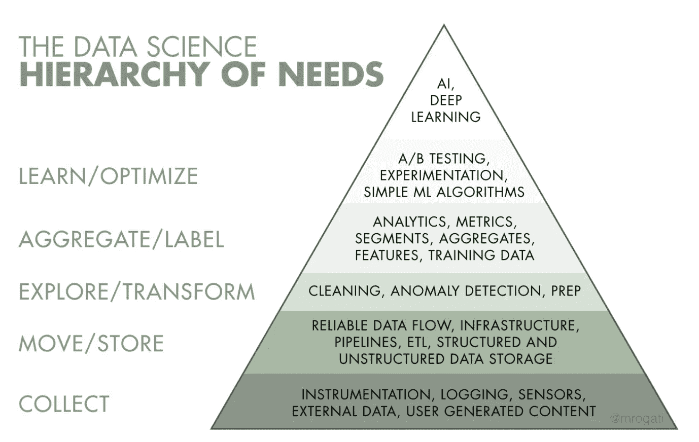

[Source](https://hackernoon.com/the-ai-hierarchy-of-needs-18f111fcc007): Monica Rogati’s fantastic Medium post “The AI Hierarchy of Needs”

根据 Glassdoor 报告，在撰写本文时，数据科学家的平均基本工资是惊人的 120，931 美元/年，平均基本工资是 110，000 美元/年。

在一天结束的时候，有很多方法可以让你赚钱。**更大的动机是什么？**

作为一名数据科学家，你将能够更好地理解这个世界，以及为什么人们会有这样的行为。你将能够帮助国家制定政策，非政府组织减轻威胁，帮助公司发财，也许在你的业余时间，预测未来！

## **1。学习 Python**

我想说的是学习任何编程语言。但是我知道时间是非常重要的，如果有一种编程语言你可以花时间去学习，那就是 Python。为什么？Python 因其简单性(可读性)和有用性而被认为是最流行的编程语言。它的简单语法更容易理解。一些编程语言过多地使用了圆括号、方括号、大括号、逗号和冒号，但是 Python 在这方面更简单，并且消除了冗余。它非常强大，但使用起来很直观。在之前的一篇文章中，我解释了如何设置你的计算机来编写和运行 Python 脚本。一旦你掌握了 Python 的基础知识，你将需要花时间去理解现有的库。您将需要理解可以用它们做什么，以及如何在代码中实现这些库提供的功能。

一些你应该熟悉的 Python 库的指南:
1。核心库: **Numpy** ， **Scipy** ，**熊猫**
2。可视化: **Matplotlib** ， **Seaborn**
3。机器学习&深度学习: **SciKit-Learn** ， **TensorFlow** ， **Theano** ， **Keras**
4 .自然语言处理- **NLTK** ， **TextBlob** ， **Aylien**
5 .抓取网页- **请求**、**漂亮的照片 4** 、**刺儿头**

## **2。懂统计学和数学**

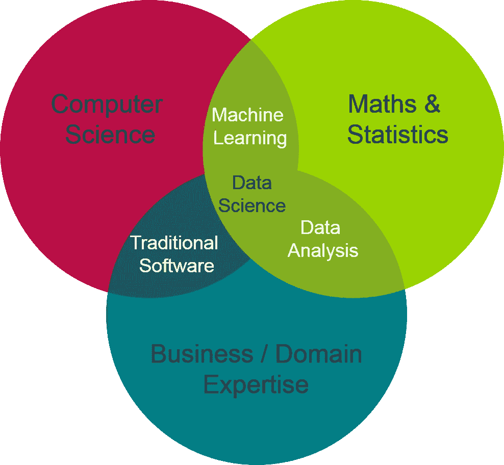

你需要利用统计学和数学的各种概念来理解现实世界中的观察结果。统计学通常被认为是数据科学的支柱之一。但由于这是一个如此广阔的研究领域，它可能会变得相当费力，甚至令人生畏，尤其是如果你不知道从哪里开始。幸运的是，Siraj Raval 为机器学习(也适用于数据科学)所需的各种数学概念创建了一个很棒的播放列表，名为[智能数学](https://www.youtube.com/playlist?list=PL2-dafEMk2A7mu0bSksCGMJEmeddU_H4D)。首先，你需要对[概率](https://towardsdatascience.com/probability-concepts-explained-introduction-a7c0316de465)、[统计推断](https://arxiv.org/pdf/1603.04929.pdf)(假设检验、p 值、置信区间)、[回归模型](https://www.analyticsvidhya.com/blog/2015/08/comprehensive-guide-regression/)有一个扎实的理解，并对相关性有一个基本的了解。

> “数据科学家比任何软件工程师都更擅长统计，比任何统计学家都更擅长软件工程。”

## **3。学习 SQL**

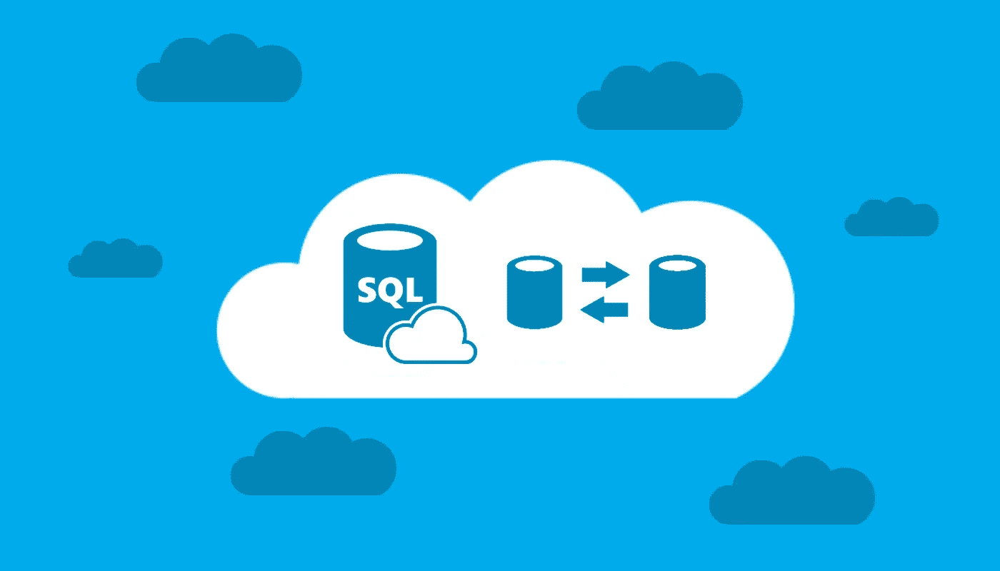

这个世界充满了数据。你听说过的所有公司都存储了来自他们提供的服务的某种数据。从脸书到纽约时报，所有这些公司都使用数据库，这是一个帮助存储数据的程序，并提供其他功能，如添加、修改或查询这些数据库中的数据。SQL(结构化查询语言)是一种完全为与这些数据库交互而设计的语言。你需要了解 SQL 来做很多事情，比如快速地从这些数据库中添加、修改或提取数据。学习 SQL 的最佳资源之一是 SQL 动物园。Khan Academy 还提供一门名为[SQL 简介:查询和管理数据](https://www.khanacademy.org/computing/computer-programming/sql)的免费课程，这是一个开始学习的好地方。您还可以从数百个免费的 SQL 备忘单中受益，因为您需要定期修改这些查询以确保记住它们。

## **4。理解算法**

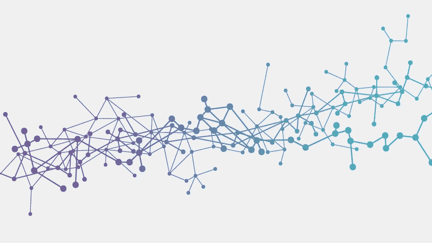

算法对于计算机程序来说，就像菜谱对于烹饪一样重要。算法会给你一套指令，如果你愿意的话，可以给你一个指南，来有效地实现你的代码。有很多算法在处理一种情况时都有自己独特的技术。你需要研究所有的算法，并了解何时使用哪种算法，这取决于你要解决的问题的具体情况。

这些算法可以分为三种基本类型:

**监督算法**，**非监督算法**，**强化算法**。

以下是每个数据科学家都应该知道的一些算法的指南:

**线性回归**，**逻辑回归**，**朴素贝叶斯**， **K 近邻**，**支持向量机**，**决策树**，**随机森林**。

一旦你理解了这些概念，亲自去实现它们以真正理解它们是如何工作的是非常重要的。有一个非常酷的 G [ithub 知识库](https://github.com/rushter/MLAlgorithms)关于机器学习算法实现的最小和干净的例子。可以分叉回购，在电脑上执行代码。

## **5。学习演讲技巧**

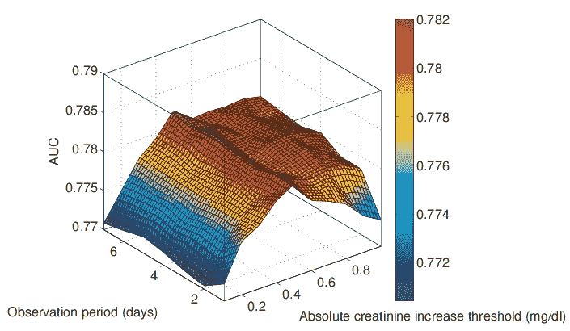

你需要建立沟通你的结果的能力。你需要知道如何很好地描述你的结果，你的结果有哪些可能的解释，以及呈现它们的最佳方式是什么。有时候，无论你的核心分析有多好，如果你未能与他人交流你的结果，或者以最全面的方式呈现你的见解，你的分析就会受到破坏。为了更好地表示您的结果，您需要知道如何在 Python 中使用不同的数据可视化库。此外，如果你知道如何使用像 [**Tableau**](https://www.tableau.com/) 这样的技术，你可能会发现自己处于优势。人们发现，与在海量数据中翻箱倒柜相比，使用视觉手段从数据中获得洞察力更容易、更方便。

## 6.加入社区

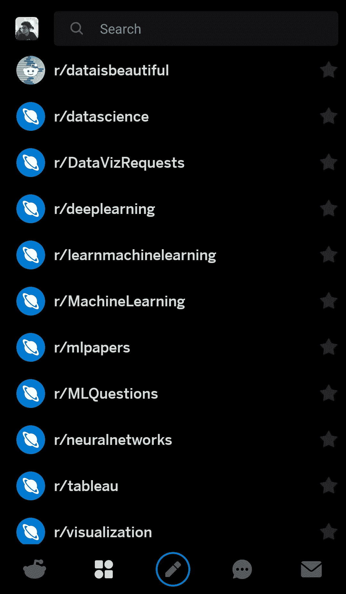

subreddits I follow on Reddit regularly

我再怎么强调成为社区的一部分是多么的必要。许多人觉得这是一次孤独的旅程，这与事实相去甚远。成为社区的一部分不仅能帮助你吸收世界各地人们的集体知识，还能让你的船驶向世界当前的方向。当你积极参与公共讨论和论坛时，你很难落后。你一定要定期加入和探索 GitHub，它有超过 3000 万个存储库和超过 1200 万个用户。几乎所有的公司，无论大小，都开源了大量的资源供你完全免费使用，并为这个项目做进一步的贡献。您可以看到世界各地的人们目前在做什么，以及所需代码的复杂程度。

以下是我在 Twitter 上关注的一些人和组织，他们会定期更新数据科学的整体情况。你可以在这里获得我的完整列表[。](https://twitter.com/sciencealldey/lists/data-science-community/members?lang=en)

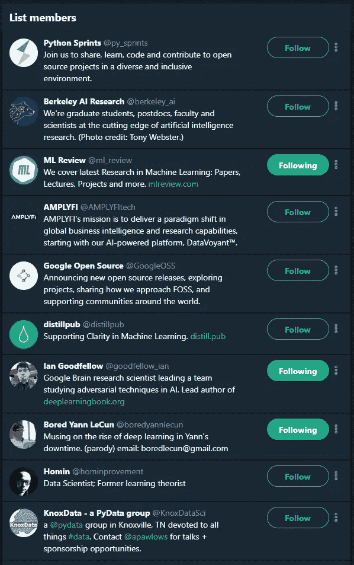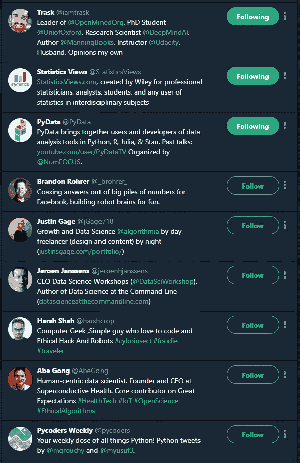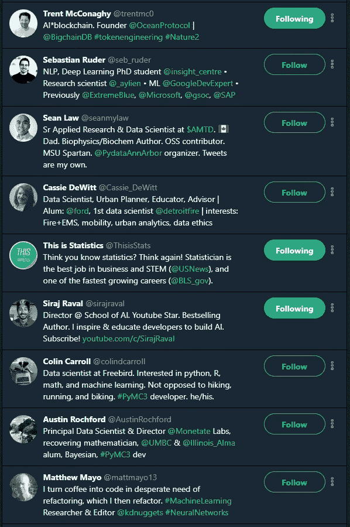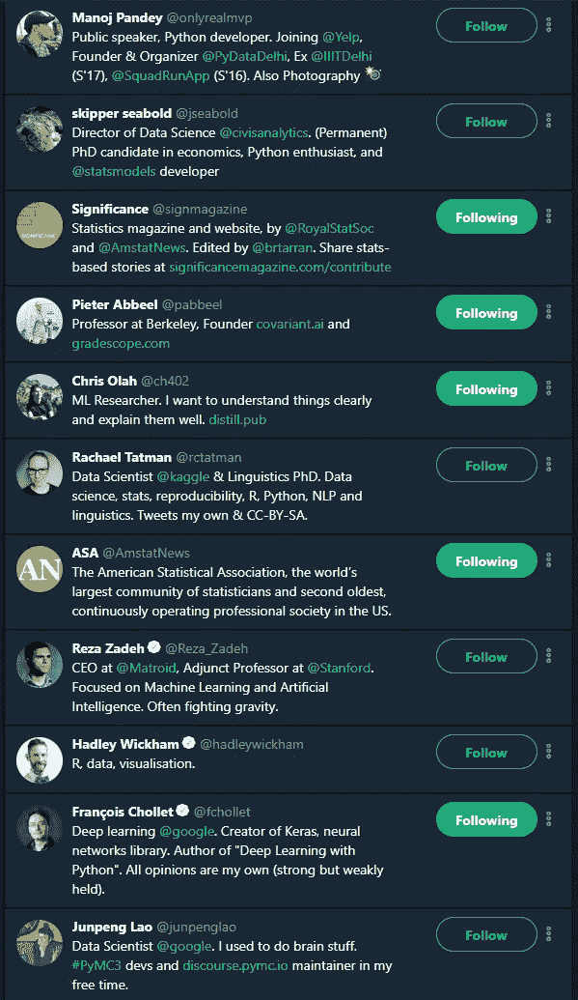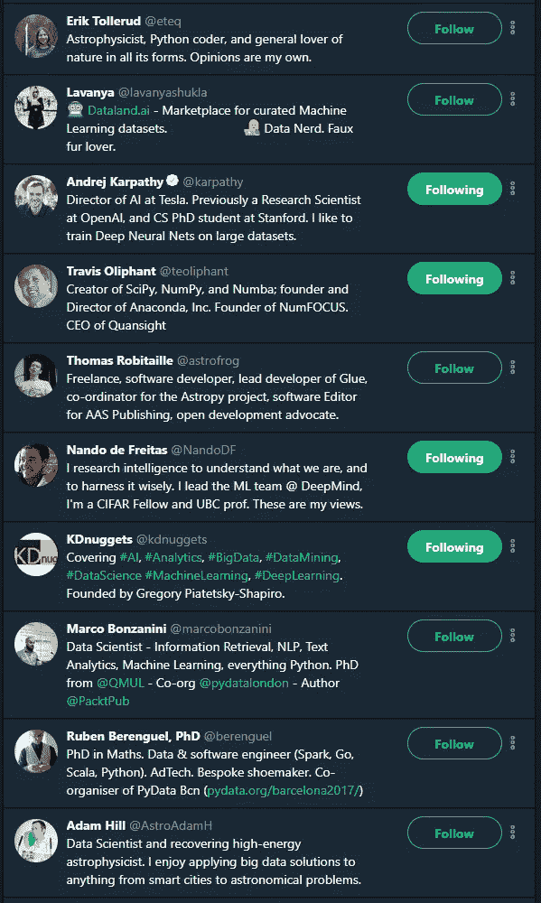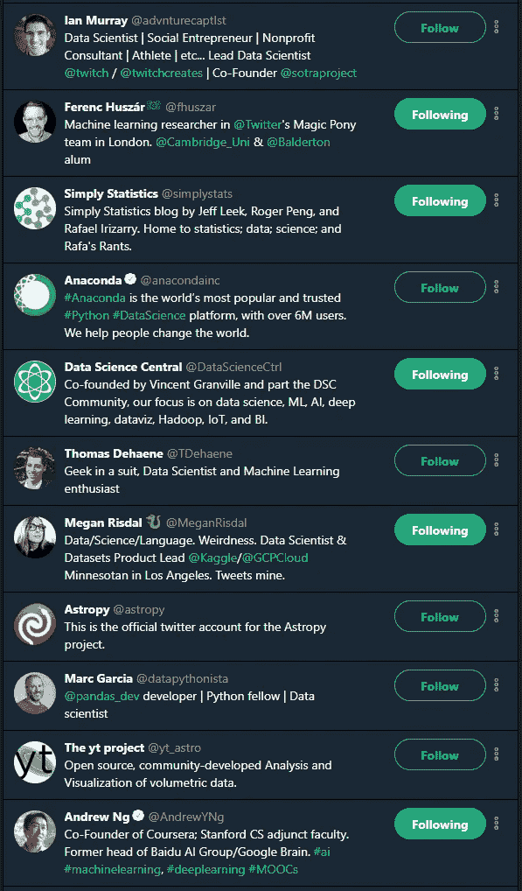

本文绝不是成为一名真正优秀的数据科学家所需的所有技能的完整列表。我甚至没有包括你应该读的书的名字，有很多地方我故意跳过了。本文的目的是让您大致了解如果一个人决定从事数据科学，他/她应该具备什么样的技能。世界变化很快，每天都有一些事情变得无关紧要。库被弃用，新的改进库被引入。对抗时间的考验是徒劳的，因为没有什么能，也没有什么会。

祝你好运！

> [在您的收件箱中直接获得最佳软件交易](https://coincodecap.com/?utm_source=coinmonks)

