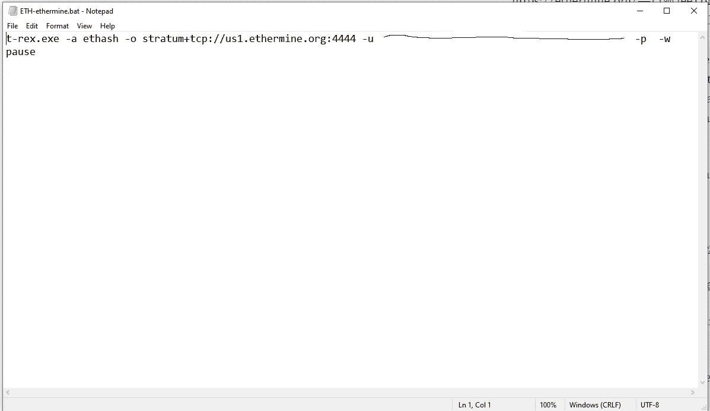
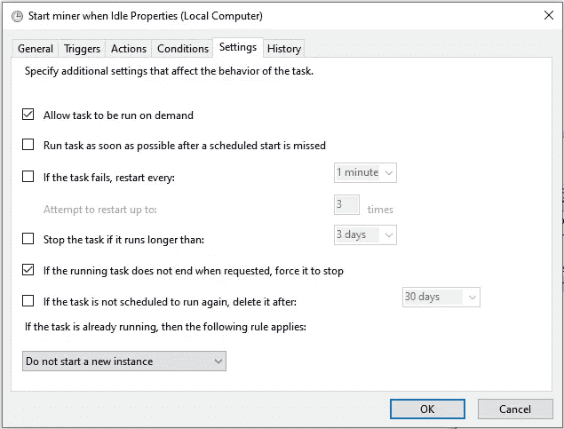

# 如何在 Windows 10 上开始挖掘以太并设置任务计划

> 原文：<https://medium.com/coinmonks/how-to-begin-mining-ether-and-set-up-a-schedule-on-windows-10-cf3c4f721405?source=collection_archive---------0----------------------->

开矿前你要做的第一件事就是设置一个钱包。(您不应该将我的地址转换为 exchange 存款地址。)钱包有一大堆选项
[【https://metamask.io/】](https://metamask.io/)

两个最简单的钱包就可以设置好并开始滚动。

请务必写下您的 12 个单词的种子短语和密码。没有这些安全存储，您将没有任何恢复选项。

现在你需要选择一个矿池。单独采矿就像玩乐透，加入一个池将允许更频繁的收入。

[https://ethermine.org/](https://ethermine.org/)——(1%费用)目前最大的资金池之一(超过 0.05 ETH 的未支付余额将每 7 天支付一次)[超过 0.01 ETH 的未支付余额将每 14 天支付一次)](https://www.f2pool.com/)[https://www.f2pool.com/](https://www.f2pool.com/)——(2.5%费用)PPS 或每股支付，通过将您的采矿能力除以全球网络的总采矿能力来计算。这将为该库提供您在该库完成的总工作量中所占的份额的估计值。然后，资金池通过简单的数学计算来估算你每天可以获得的回报，给你一个固定的收入。

接下来你需要下载采矿软件。

Windows 操作系统

英伟达—[https://bitcointalk.org/index.php?topic=4432704.0](https://bitcointalk.org/index.php?topic=4432704.0)

AMD—[https://github.com/todxx/teamredminer/releases](https://github.com/todxx/teamredminer/releases)

既然您已经下载了 miner 软件，请将其解压缩到一个文件夹中。《出埃及记》~/桌面/挖掘

打开该文件夹，找到所选池的一个示例批处理文件。《出埃及记》ETH-ethermine.bat

右键单击文件并选择编辑。将打开一个记事本文档，如下所示

你所需要做的就是从你的钱包里复制你的以太坊存款地址，然后粘贴到-u 之后

现在保存该文件，并使用该批处理文件测试您的 miner。如果一切正常，你会看到一个窗口出现。应该是这样的。

一分钟后，矿工将开始。如果没有错误，窗口应该是这样的。

在线查看你的 GPU 将会有什么样的预期散列。我的 RTX 2070 获得大约 36–37 MH/s(44–45 MH/s OC ' d)
然后，您可以在大约 10–15 分钟后检查您的池，以确认他们正在接收有效份额。

你应该做的最后一件事是自动化整个过程，这样你就不需要一直担心启动和停止矿工。为此，我将使用 Windows 任务计划程序。

进入**开始**搜索**任务调度器
右击**任务调度器库文件夹，选择**新建文件夹…** 随便给文件夹起个名字 **EX。** EtherMiner
**右键点击**你新建的文件夹，选择**创建任务** 给任务命名。

接下来选择**触发器**选项卡，点击**新建…**
选择**闲置**并点击**确定**

接下来选择**动作**选项卡
选择**新建…**

在**程序**框中选择你正在使用的 miner.exe。在本例中，我使用 t-rex.exe
在**添加参数**框
**中输入你批处理文件中的参数。**-a ethash-o stratum+TCP://us1 . ether mine . org:4444-u * * * * * * * * * * * * * * * * * * * * * * * * * * * * * *-p-w

点击**确定**并转到**条件**选项卡

在这里您可以设置任何条件，当计算机空闲时将宣布。如果计算机不再空闲，请确保将任务设置为结束。(要测试该任务，您可以将空闲时间设置为 1 分钟，并等待查看它是否正常工作。)

接下来转到**设置**选项卡

所有的设置应该和上面一样，点击 **OK** 现在你都设置好了！享受无忧采矿:)

(如果您有任何问题，很可能是您的防病毒软件阻止了该软件。您只需要为挖掘文件夹添加一个例外。)