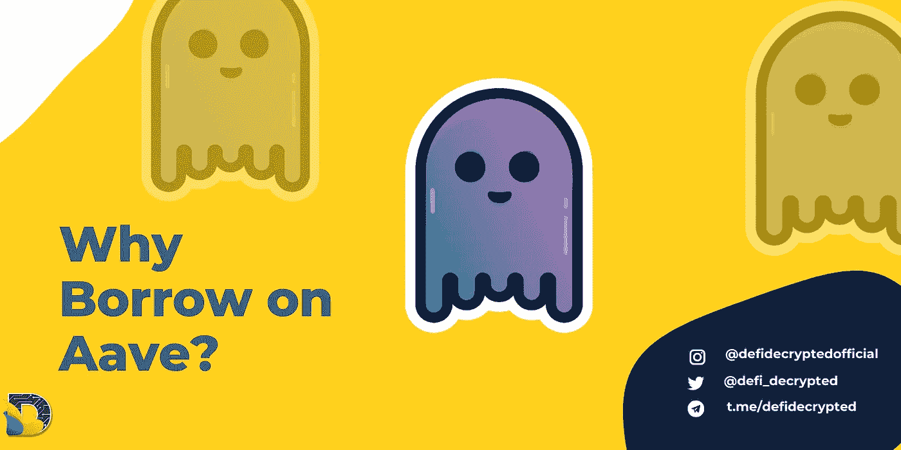
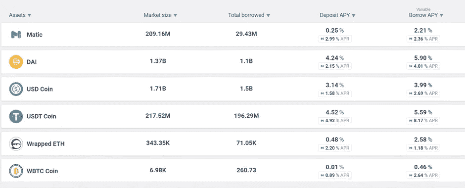
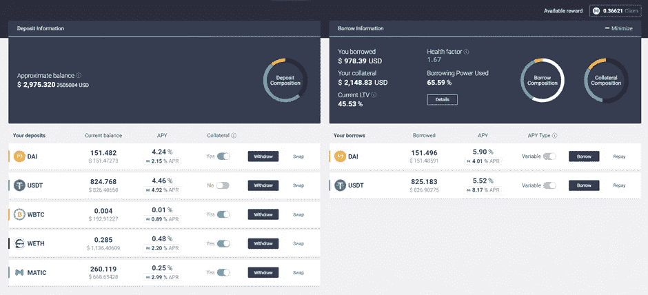
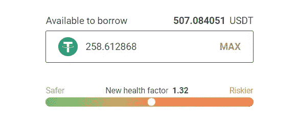

# 如何通过在自动增值网上借款来增加被动收入

> 原文：<https://medium.com/coinmonks/how-to-boost-passive-income-by-borrowing-on-aave-1f74d1c52f36?source=collection_archive---------2----------------------->

Aave 是 DeFi 中首屈一指的货币市场，目前 TVL 超过 140 亿美元，有无数的模仿者和模仿者。该平台提供的服务非常精简——基本上只是借贷，但对于 DeFi 爱好者来说，有无尽的复杂性和策略可以发挥。本文将给出一些关于该平台的简要背景信息，并讨论当你必须提供全额抵押品时，为什么你实际上想要贷款。我们还将讨论一些 DeFi 策略，你可以用它来扩大你的投资组合。

# **什么是 Aave？**

在芬兰语中的意思是“幽灵”，Aave 于 2017 年以 ETHLend 的名义开始生活，最初是一项点对点的分散式贷款服务。在 2018 年更名为 Aave 后，该平台于 2020 年 1 月转向借贷池，而不是使用旧的 P2P 模式。2021 年初增加了对多边形的支持，今年晚些时候又增加了对雪崩的支持。

该平台提供货币市场，你可以在那里借贷，利率由一种取决于供求的算法决定。

为了借款，你首先需要存放抵押品，你只能借大约 75%的抵押品价值。如果您的抵押品价值下跌太多，您可能会被清算(即失去抵押品)，因此该平台并非没有风险。

# **我为什么要贷款？**

考虑到清算风险，可能还不清楚为什么会有人想要贷款。如果你已经有了钱，为什么还要冒险去借更少的钱呢？

很简单，加密和 DeFi 的世界与菲亚特经济完全不同。将欧元作为借入美元的抵押品几乎没有意义，但在加密领域，将一种资产作为借入美元的抵押品和将另一种资产作为借入美元的抵押品通常是个好主意。

# **借款策略**

DeFi pros 使用 Aave 和其他货币市场的主要方式之一是释放他们作为投资长期持有的资产的流动性。这通常是比特币和以太币，但也可能是另一种硬币。

以比特币为例，许多人将其作为价值储存手段和长期投资。问题在于，在 DeFi 中很难获得比特币的收益率。这是因为这么多人持有它，而且有这么多的需求来赚取被动收入。与其他密码相比，它也相对稳定，更适合持有和投资。由于这些因素，涉及比特币的 LP 收益率往往较低，存款收益率更低。举个例子，在 Aave 上，目前比特币的存款收益率为 0.01%(不含奖励)。

然而，当你存入比特币并将其用作抵押品时，你可以用它来借入稳定的硬币，在 DeFi 中，很容易从稳定的硬币中获得丰厚的收益。例如，在多边形网络上，你可以将这些稳定币引入指数，并作为稳定币对的流动性提供者赚取大约 20%的年利率(如果你稍微搜寻一下的话)。或者你可以换成 UST，桥到特拉，并获得 19.5%的固定锚 APY。

换句话说，如果你玩得好，你可以有效地从比特币中获得两位数的收益率，如果没有货币市场的力量，这将是非常困难的。

The reward APR is listed below the base APY. On the borrow side, the rewards can be greater than the borrow cost!

当 Aave 为借贷提供奖励时，这种策略就变得容易多了。在写这篇文章的时候，在多边形版本的 Aave 上，仅仅是借用 USDT 就可以获得 8%的 APR 奖励，这比借用的成本还要大！通过这种方式，你可以仅仅从借款本身中获利，甚至在你考虑稳定债券的收益之前。当然，从长远来看，这种奖励是不可持续的，但是在它们持续的时候好好利用它们是很好的！

因此，你可以将你的资产(或任何资产组合)存入银行，并从中赚取收益。然后，你可以用这些作为抵押，借一种像 USDT 那样稳定的货币，并为这种行为本身赚取更多的收益。然后，你可以把这些稳定的债券拿到别处，分别获得稳定的两位数收益率。当你把所有这些加起来时，总收益率可能会相当可观，尤其是当基础抵押品是比特币这样一种有吸引力的资产时。

# **风险和不利因素**

主要的缺点是你必须注意你的健康因素，确保你不会被清算。健康因素越接近 1，清算的危险就越大。

什么健康因素被认为是“安全的”取决于你的抵押品是什么。如果你发行稳定债券并借入稳定债券，清算风险基本为零，但如果你的抵押品不稳定，容易在一夜之间下跌 30%，你可能要小心了。对于比特币来说，任何高于 1.60 的价格都是相当保守的，但一夜之间总有你无法应对的闪电崩盘的可能性。失去你的长期比特币或以太坊储备将是一场灾难，所以这让很多人不愿参与其中。

综上所述，Aave 是解锁你的比特币或以太坊流动性的好方法，但是不要存入超过你输不起的钱！

> 加入 Coinmonks [电报频道](https://t.me/coincodecap)和 [Youtube 频道](https://www.youtube.com/c/coinmonks/videos)了解加密交易和投资

## 也阅读

 [## 杠杆代币[多头代币]终极指南

### 杠杆化令牌是具有杠杆化风险敞口的 ERC20 令牌，不考虑保证金、要求、管理…

medium.com](/coinmonks/leveraged-token-3f5257808b22)  [## 最佳加密交易所| 2021 年十大加密货币交易所

### 加密货币交易所的加密交易需要了解市场，这可以帮助你获得利润。之前…

blog.coincodecap.com](https://blog.coincodecap.com/crypto-exchange)  [## 2021 年最佳加密交换平台| CoinCodeCap

### 编辑描述

blog.coincodecap.com](https://blog.coincodecap.com/best-swap-platforms)  [## 2021 年最佳加密借贷平台| 6 大比特币借贷平台

### 获得比特币和其他加密货币的最佳贷款利率

medium.com](/coinmonks/top-5-crypto-lending-platforms-in-2020-that-you-need-to-know-a1b675cec3fa)  [## 2021 年 6 大最佳硬件钱包|顶级加密硬件钱包[更新]

### 最好的加密货币硬件钱包是绝对必要的。我们将在 NGRAVE、Ledger Nano X 和…

medium.com](/coinmonks/the-best-cryptocurrency-hardware-wallets-of-2020-e28b1c124069)  [## 2021 年最佳免费加密交易机器人

### 2021 年币安、比特币基地、库币和其他密码交易所的最佳密码交易机器人。四进制，位间隙…

medium.com](/coinmonks/crypto-trading-bot-c2ffce8acb2a)  [## 最佳 4 个加密交易信号电报通道

### 这是乏味的找到正确的加密交易信号提供商。因此，在本文中，我们将讨论最好的…

medium.com](/coinmonks/best-crypto-signals-telegram-5785cdbc4b2b)  [## 获取信号、交易机器人和套利

### 编辑描述

blog.coincodecap.com](https://blog.coincodecap.com/bitsgap-review)